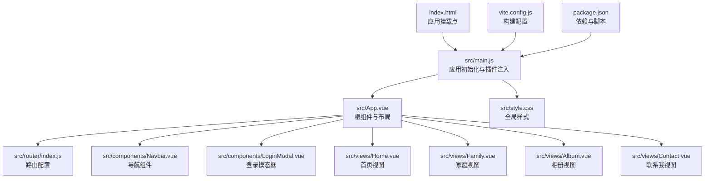
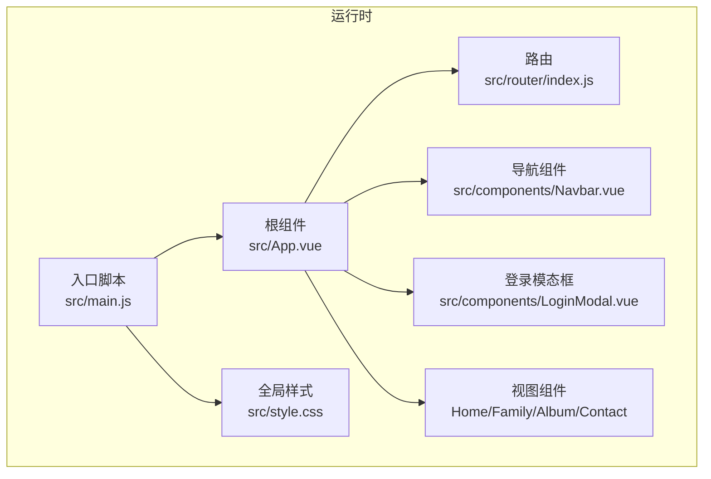
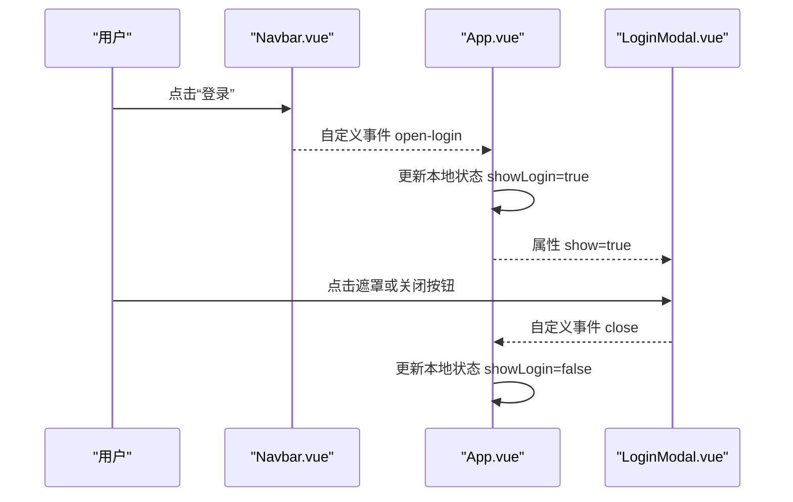
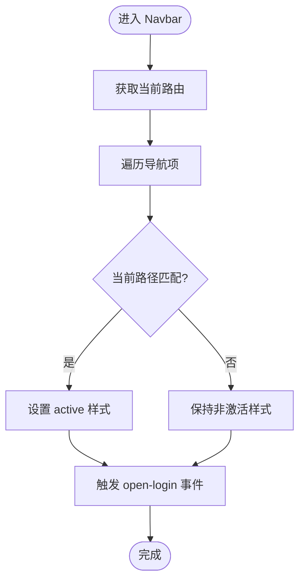
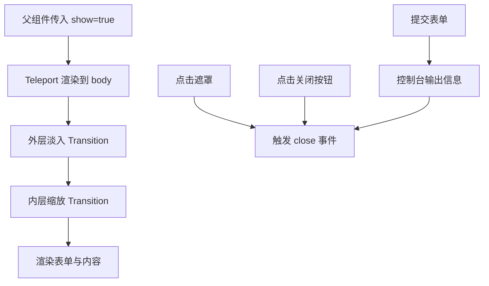
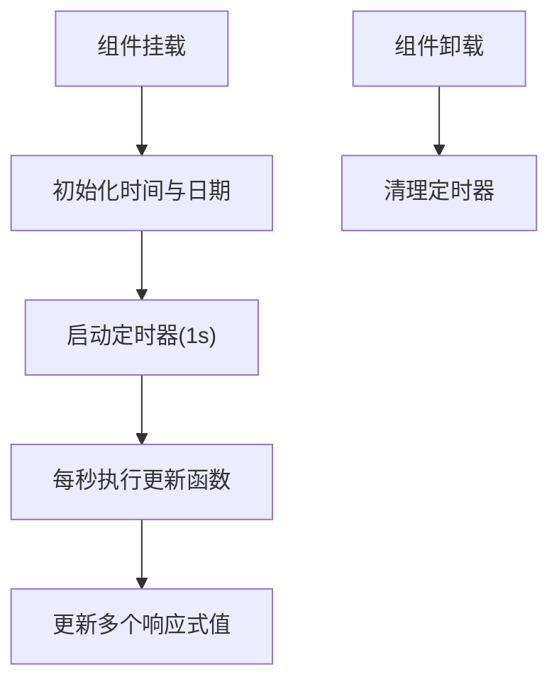
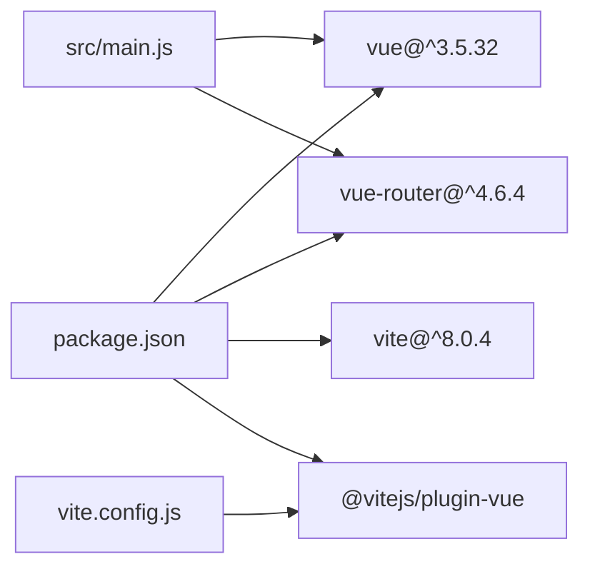

# 开发最佳实践

<cite>
**本文引用的文件**
- [src/main.js](file://src/main.js)
- [src/App.vue](file://src/App.vue)
- [src/router/index.js](file://src/router/index.js)
- [src/components/Navbar.vue](file://src/components/Navbar.vue)
- [src/components/LoginModal.vue](file://src/components/LoginModal.vue)
- [src/views/Home.vue](file://src/views/Home.vue)
- [src/views/Family.vue](file://src/views/Family.vue)
- [src/views/Album.vue](file://src/views/Album.vue)
- [src/views/Contact.vue](file://src/views/Contact.vue)
- [src/style.css](file://src/style.css)
- [index.html](file://index.html)
- [package.json](file://package.json)
- [vite.config.js](file://vite.config.js)
- [README.md](file://README.md)
</cite>

## 目录
1. [简介](#简介)
2. [项目结构](#项目结构)
3. [核心组件](#核心组件)
4. [架构总览](#架构总览)
5. [详细组件分析](#详细组件分析)
6. [依赖分析](#依赖分析)
7. [性能考虑](#性能考虑)
8. [故障排查指南](#故障排查指南)
9. [结论](#结论)
10. [附录](#附录)

## 简介
本指南面向使用 Vue 3 + Vite 的前端团队与个人开发者，基于仓库现有实现总结出一套可复用的开发最佳实践。内容涵盖 Composition API 的正确使用、组件设计原则、代码组织策略、性能优化、内存管理、错误处理与调试方法、开发工具与代码规范、质量保证、重构建议、测试策略与持续集成实践，以及项目维护与扩展的最佳方法。文中所有结论均以仓库源码为依据，避免凭空假设。

## 项目结构
该项目采用典型的 Vue 3 单页应用结构，按功能域划分目录，便于扩展与维护：
- 应用入口与全局样式：入口脚本、根组件、全局样式
- 路由与视图：集中定义页面级组件
- 组件层：通用 UI 组件（如导航栏、登录模态框）
- 构建与运行：Vite 配置与包管理脚本

图表来源
- [index.html:1-14](file://index.html#L1-L14)
- [src/main.js:1-9](file://src/main.js#L1-L9)
- [src/App.vue:1-30](file://src/App.vue#L1-L30)
- [src/router/index.js:1-28](file://src/router/index.js#L1-L28)
- [src/components/Navbar.vue:1-140](file://src/components/Navbar.vue#L1-L140)
- [src/components/LoginModal.vue:1-316](file://src/components/LoginModal.vue#L1-L316)
- [src/views/Home.vue:1-211](file://src/views/Home.vue#L1-L211)
- [src/views/Family.vue:1-309](file://src/views/Family.vue#L1-L309)
- [src/views/Album.vue:1-127](file://src/views/Album.vue#L1-L127)
- [src/views/Contact.vue:1-189](file://src/views/Contact.vue#L1-L189)
- [src/style.css:1-56](file://src/style.css#L1-L56)
- [vite.config.js:1-8](file://vite.config.js#L1-L8)
- [package.json:1-20](file://package.json#L1-L20)

章节来源
- [src/main.js:1-9](file://src/main.js#L1-L9)
- [src/App.vue:1-30](file://src/App.vue#L1-L30)
- [src/router/index.js:1-28](file://src/router/index.js#L1-L28)
- [src/style.css:1-56](file://src/style.css#L1-L56)
- [index.html:1-14](file://index.html#L1-L14)
- [vite.config.js:1-8](file://vite.config.js#L1-L8)
- [package.json:1-20](file://package.json#L1-L20)

## 核心组件
- 应用入口与初始化：在入口脚本中创建应用实例、注入路由、挂载根组件，确保单一职责与清晰的启动流程。
- 根组件与布局：通过根组件协调导航、路由视图与登录弹窗，保持顶层状态最小化与事件透传。
- 导航组件：使用路由钩子判断当前激活项，通过自定义事件向上抛出打开登录的动作，体现单向数据流与事件驱动。
- 登录模态框：通过 Teleport 将内容渲染至 body，结合过渡动画与点击遮罩关闭，提升交互体验与 DOM 结构清晰度。
- 视图组件：首页与家庭视图展示定时器与生命周期的正确使用；相册与联系视图展示列表渲染与响应式数据的组织方式。

章节来源
- [src/main.js:1-9](file://src/main.js#L1-L9)
- [src/App.vue:1-30](file://src/App.vue#L1-L30)
- [src/components/Navbar.vue:1-140](file://src/components/Navbar.vue#L1-L140)
- [src/components/LoginModal.vue:1-316](file://src/components/LoginModal.vue#L1-L316)
- [src/views/Home.vue:1-211](file://src/views/Home.vue#L1-L211)
- [src/views/Family.vue:1-309](file://src/views/Family.vue#L1-L309)
- [src/views/Album.vue:1-127](file://src/views/Album.vue#L1-L127)
- [src/views/Contact.vue:1-189](file://src/views/Contact.vue#L1-L189)

## 架构总览
该应用采用“入口脚本 → 根组件 → 路由视图”的标准 SPA 架构，组件间通过 props 与 emits 实现解耦，路由负责页面级切换，全局样式统一基础样式与滚动行为。

图表来源
- [src/main.js:1-9](file://src/main.js#L1-L9)
- [src/App.vue:1-30](file://src/App.vue#L1-L30)
- [src/router/index.js:1-28](file://src/router/index.js#L1-L28)
- [src/components/Navbar.vue:1-140](file://src/components/Navbar.vue#L1-L140)
- [src/components/LoginModal.vue:1-316](file://src/components/LoginModal.vue#L1-L316)
- [src/views/Home.vue:1-211](file://src/views/Home.vue#L1-L211)
- [src/views/Family.vue:1-309](file://src/views/Family.vue#L1-L309)
- [src/views/Album.vue:1-127](file://src/views/Album.vue#L1-L127)
- [src/views/Contact.vue:1-189](file://src/views/Contact.vue#L1-L189)
- [src/style.css:1-56](file://src/style.css#L1-L56)

## 详细组件分析

### 根组件与应用初始化
- 初始化流程：创建应用实例、安装路由、挂载到 DOM，职责单一，易于测试与替换。
- 状态与事件：根组件持有登录弹窗的显示状态，并通过事件与导航组件通信，符合单向数据流。
- 布局与渲染：根组件内组合导航、路由视图与登录模态框，形成页面骨架。

图表来源
- [src/App.vue:1-30](file://src/App.vue#L1-L30)
- [src/components/Navbar.vue:1-140](file://src/components/Navbar.vue#L1-L140)
- [src/components/LoginModal.vue:1-316](file://src/components/LoginModal.vue#L1-L316)

章节来源
- [src/main.js:1-9](file://src/main.js#L1-L9)
- [src/App.vue:1-30](file://src/App.vue#L1-L30)

### 导航组件（Navbar）
- 激活态判定：使用路由实例判断当前路径，动态设置导航项样式，避免硬编码。
- 事件透传：通过自定义事件向上抛出打开登录动作，保持组件内聚与职责分离。
- 可访问性：使用语义化链接与键盘可达的按钮，提升可用性。

图表来源
- [src/components/Navbar.vue:1-140](file://src/components/Navbar.vue#L1-L140)

章节来源
- [src/components/Navbar.vue:1-140](file://src/components/Navbar.vue#L1-L140)

### 登录模态框（LoginModal）
- 渲染策略：使用 Teleport 将模态框挂载到 body，避免定位与层级问题。
- 交互细节：支持点击遮罩关闭、表单切换模式、提交处理与关闭回调。
- 动画过渡：内外两层 Transition 组合，提供流畅的显隐体验。

图表来源
- [src/components/LoginModal.vue:1-316](file://src/components/LoginModal.vue#L1-L316)

章节来源
- [src/components/LoginModal.vue:1-316](file://src/components/LoginModal.vue#L1-L316)

### 首页视图（Home）
- 定时更新：在挂载后启动定时器，每秒更新时间与日期，卸载时清理定时器，防止内存泄漏。
- 数据组织：将多个显示值拆分为独立响应式引用，降低无关重渲染。

图表来源
- [src/views/Home.vue:1-211](file://src/views/Home.vue#L1-L211)

章节来源
- [src/views/Home.vue:1-211](file://src/views/Home.vue#L1-L211)

### 家庭视图（Family）
- 复杂计时器：计算纪念日与新年倒计时，演示多字段响应式更新与生命周期管理。
- 性能注意：计时器在挂载时启动，卸载时清理，避免重复定时器。

章节来源
- [src/views/Family.vue:1-309](file://src/views/Family.vue#L1-L309)

### 相册视图（Album）与联系视图（Contact）
- 列表渲染：通过 v-for 渲染相册卡片与联系信息，键值使用唯一标识，减少重排。
- 样式组织：scoped 样式隔离组件样式，避免全局污染。

章节来源
- [src/views/Album.vue:1-127](file://src/views/Album.vue#L1-L127)
- [src/views/Contact.vue:1-189](file://src/views/Contact.vue#L1-L189)

## 依赖分析
- 运行时依赖：Vue 与 Vue Router 提供响应式与路由能力。
- 开发依赖：Vite 与 @vitejs/plugin-vue 提供快速热更新与 Vue SFC 支持。
- 构建配置：Vite 默认配置已满足开发与生产需求，可按需扩展。

图表来源
- [package.json:1-20](file://package.json#L1-L20)
- [vite.config.js:1-8](file://vite.config.js#L1-L8)
- [src/main.js:1-9](file://src/main.js#L1-L9)

章节来源
- [package.json:1-20](file://package.json#L1-L20)
- [vite.config.js:1-8](file://vite.config.js#L1-L8)
- [src/main.js:1-9](file://src/main.js#L1-L9)

## 性能考虑
- 响应式粒度：将大对象拆分为细粒度响应式引用，减少不必要重渲染（参考首页与家庭视图的数据拆分）。
- 生命周期管理：在挂载时启动定时器/订阅，在卸载时清理，避免内存泄漏（参考首页与家庭视图）。
- 列表渲染：使用稳定 key，避免不必要的 DOM 重建（参考相册与联系视图）。
- 样式隔离：使用 scoped 样式，减少样式冲突与重绘范围（参考各视图与组件）。
- 渲染策略：对复杂动画与过渡，优先使用 CSS 过渡而非频繁 JS 计算（参考登录模态框的 Transition 组合）。
- 资源加载：图片懒加载与尺寸适配可进一步优化首屏与带宽占用（建议在后续迭代中引入）。

## 故障排查指南
- 控制台日志：登录表单提交会输出操作与输入信息，便于验证交互链路（参考登录模态框）。
- 路由跳转：检查路由配置与导航链接路径是否一致（参考路由与导航组件）。
- 定时器泄漏：确认组件卸载时是否清理定时器（参考首页与家庭视图）。
- 模态框关闭：验证遮罩点击与关闭按钮事件是否触发（参考登录模态框）。
- 样式冲突：若出现样式异常，检查 scoped 样式与选择器优先级（参考各组件样式）。

章节来源
- [src/components/LoginModal.vue:1-316](file://src/components/LoginModal.vue#L1-L316)
- [src/components/Navbar.vue:1-140](file://src/components/Navbar.vue#L1-L140)
- [src/views/Home.vue:1-211](file://src/views/Home.vue#L1-L211)
- [src/views/Family.vue:1-309](file://src/views/Family.vue#L1-L309)

## 结论
本项目以简洁清晰的结构展示了 Vue 3 的典型用法：Composition API 的合理拆分、组件间的事件与属性通信、路由与视图的解耦、以及生命周期与资源管理的最佳实践。遵循本文档的建议，可在保持代码可读性的同时，显著提升性能与可维护性。

## 附录

### 开发工具与代码规范
- IDE 支持：参考官方指南以获得更好的 Vue 开发体验（见 README 中的官方链接）。
- 代码风格：建议引入 ESLint 与 Prettier 并在 CI 中强制执行。
- 类型支持：如需 TypeScript，可在 Vite 中启用并逐步迁移。

章节来源
- [README.md:1-6](file://README.md#L1-L6)

### 质量保证与测试策略
- 单元测试：针对组合逻辑（如计时器更新、导航激活判定）编写单元测试。
- 集成测试：使用端到端测试框架验证路由与交互流程。
- 可访问性测试：确保链接与按钮具备键盘可达性与语义化标签。

### 持续集成实践
- 构建与预览：在 CI 中执行构建与预览命令，确保产物可用。
- 质量门禁：在合并前执行 Lint、类型检查与测试。

### 重构建议
- 将计时器逻辑抽象为可复用的组合函数，减少重复代码（参考首页与家庭视图）。
- 将导航数据从组件中抽离为配置文件，便于维护与国际化。
- 对复杂表单进行模块化拆分，提升可测试性与可维护性。

### 扩展与维护
- 新增页面：遵循现有路由与视图组织方式，保持一致性。
- 组件复用：将通用交互封装为可复用组件（如模态框、表单控件）。
- 性能监控：引入性能指标采集与告警机制，持续优化用户体验。