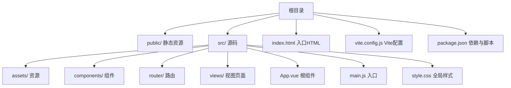
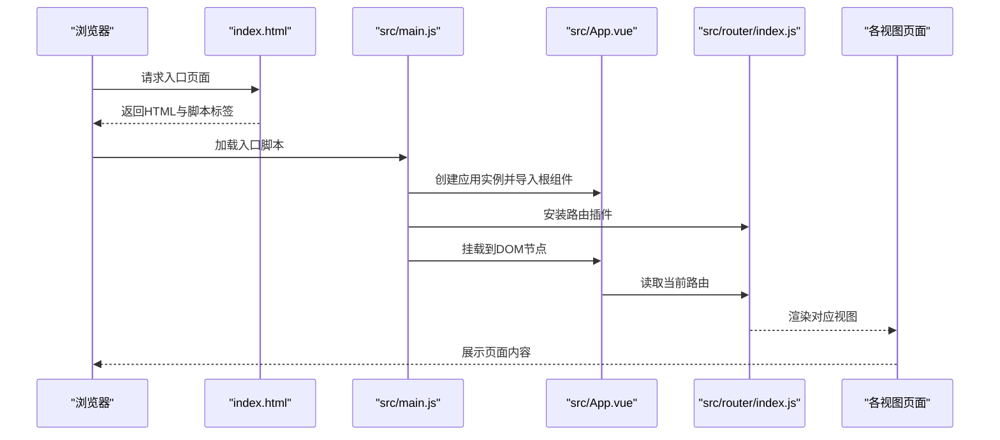
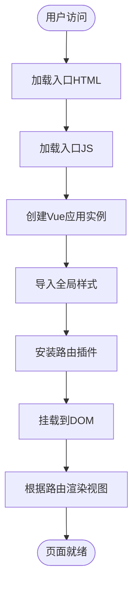
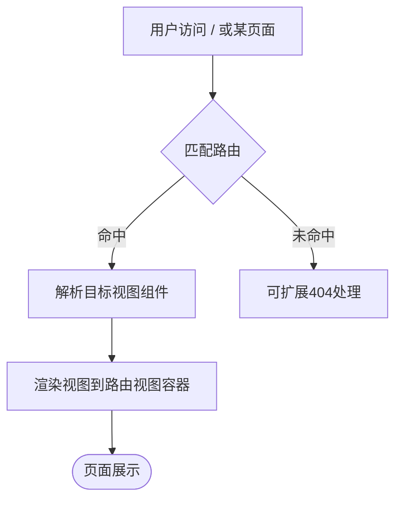
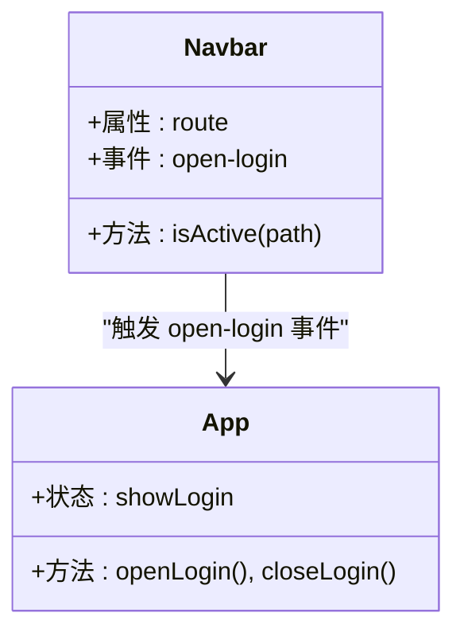
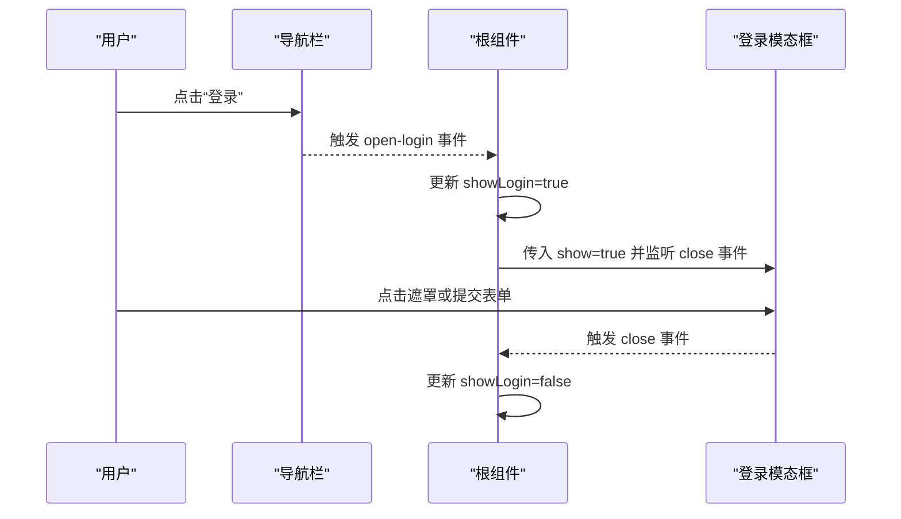
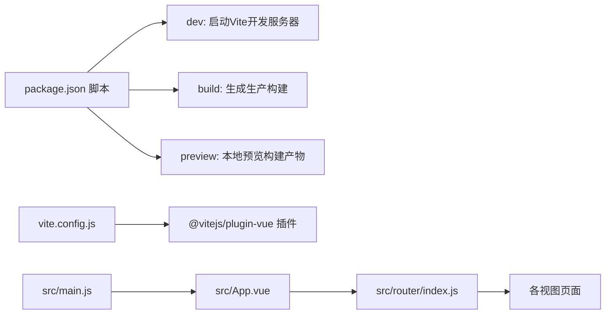

# 快速开始

<cite>
**本文引用的文件**
- [package.json](file://package.json)
- [README.md](file://README.md)
- [vite.config.js](file://vite.config.js)
- [index.html](file://index.html)
- [src/main.js](file://src/main.js)
- [src/App.vue](file://src/App.vue)
- [src/router/index.js](file://src/router/index.js)
- [src/views/Home.vue](file://src/views/Home.vue)
- [src/components/Navbar.vue](file://src/components/Navbar.vue)
- [src/components/LoginModal.vue](file://src/components/LoginModal.vue)
- [src/style.css](file://src/style.css)
</cite>

## 目录
1. [简介](#简介)
2. [项目结构](#项目结构)
3. [核心组件](#核心组件)
4. [架构总览](#架构总览)
5. [详细组件分析](#详细组件分析)
6. [依赖关系分析](#依赖关系分析)
7. [性能考虑](#性能考虑)
8. [故障排除指南](#故障排除指南)
9. [结论](#结论)
10. [附录](#附录)

## 简介
本指南面向首次接触 Vue 博客项目的开发者，帮助你在最短时间内完成环境准备、依赖安装、本地开发与生产构建，并理解项目的基本结构与启动流程。你将获得：
- 明确的环境要求（Node.js 版本、包管理器）
- 一键安装与启动命令
- 构建与预览流程
- 常见初始化问题与解决方案
- 从零到一的完整实践路径

## 项目结构
该 Vue 3 + Vite 博客项目采用标准的单页应用（SPA）目录组织方式，核心入口为 HTML 页面与 Vue 应用挂载点，路由与视图按功能模块划分，组件化设计清晰。

图表来源
- [index.html:1-14](file://index.html#L1-L14)
- [src/main.js:1-9](file://src/main.js#L1-L9)
- [src/App.vue:1-30](file://src/App.vue#L1-L30)
- [src/router/index.js:1-28](file://src/router/index.js#L1-L28)
- [vite.config.js:1-8](file://vite.config.js#L1-L8)
- [package.json:1-20](file://package.json#L1-L20)

章节来源
- [index.html:1-14](file://index.html#L1-L14)
- [src/main.js:1-9](file://src/main.js#L1-L9)
- [src/App.vue:1-30](file://src/App.vue#L1-L30)
- [src/router/index.js:1-28](file://src/router/index.js#L1-L28)
- [vite.config.js:1-8](file://vite.config.js#L1-L8)
- [package.json:1-20](file://package.json#L1-L20)

## 核心组件
- 应用入口与挂载：通过入口 HTML 加载入口 JS，创建 Vue 应用实例并挂载到 DOM。
- 根组件：负责全局布局、导航栏、登录模态框与路由视图容器。
- 路由系统：基于 History 模式，映射多个页面视图。
- 视图与组件：首页展示时间与快捷入口；导航栏提供站点内跳转；登录模态框支持切换登录/注册。

章节来源
- [src/main.js:1-9](file://src/main.js#L1-L9)
- [src/App.vue:1-30](file://src/App.vue#L1-L30)
- [src/router/index.js:1-28](file://src/router/index.js#L1-L28)
- [src/views/Home.vue:1-211](file://src/views/Home.vue#L1-L211)
- [src/components/Navbar.vue:1-140](file://src/components/Navbar.vue#L1-L140)
- [src/components/LoginModal.vue:1-316](file://src/components/LoginModal.vue#L1-L316)

## 架构总览
下图展示了从浏览器加载到应用渲染的关键路径，以及路由驱动的视图切换。

图表来源
- [index.html:1-14](file://index.html#L1-L14)
- [src/main.js:1-9](file://src/main.js#L1-L9)
- [src/App.vue:1-30](file://src/App.vue#L1-L30)
- [src/router/index.js:1-28](file://src/router/index.js#L1-L28)

## 详细组件分析

### 启动流程与入口
- 入口 HTML 中定义了应用挂载点与模块脚本加载位置。
- 入口 JS 创建应用实例、引入全局样式与路由，最后挂载到 DOM。
- 根组件负责承载导航栏、路由视图与登录模态框。

图表来源
- [index.html:1-14](file://index.html#L1-L14)
- [src/main.js:1-9](file://src/main.js#L1-L9)
- [src/App.vue:1-30](file://src/App.vue#L1-L30)

章节来源
- [index.html:1-14](file://index.html#L1-L14)
- [src/main.js:1-9](file://src/main.js#L1-L9)
- [src/App.vue:1-30](file://src/App.vue#L1-L30)

### 路由与视图
- 路由采用 History 模式，映射多页面视图，便于 SEO 与深度链接。
- 根组件通过路由视图容器渲染当前路径对应的视图。

图表来源
- [src/router/index.js:1-28](file://src/router/index.js#L1-L28)
- [src/App.vue:1-30](file://src/App.vue#L1-L30)

章节来源
- [src/router/index.js:1-28](file://src/router/index.js#L1-L28)
- [src/App.vue:1-30](file://src/App.vue#L1-L30)

### 导航栏与交互
- 导航栏组件使用路由链接实现页面跳转，并高亮当前激活项。
- 支持打开登录模态框事件，用于演示用户认证流程。

图表来源
- [src/components/Navbar.vue:1-140](file://src/components/Navbar.vue#L1-L140)
- [src/App.vue:1-30](file://src/App.vue#L1-L30)

章节来源
- [src/components/Navbar.vue:1-140](file://src/components/Navbar.vue#L1-L140)
- [src/App.vue:1-30](file://src/App.vue#L1-L30)

### 登录模态框
- 支持登录/注册模式切换，表单绑定用户名与密码，点击遮罩层可关闭。
- 使用 Teleport 将模态框渲染到 body，配合过渡动画提升体验。

图表来源
- [src/components/Navbar.vue:1-140](file://src/components/Navbar.vue#L1-L140)
- [src/App.vue:1-30](file://src/App.vue#L1-L30)
- [src/components/LoginModal.vue:1-316](file://src/components/LoginModal.vue#L1-L316)

章节来源
- [src/components/LoginModal.vue:1-316](file://src/components/LoginModal.vue#L1-L316)
- [src/App.vue:1-30](file://src/App.vue#L1-L30)

## 依赖关系分析
- 项目使用 Vite 作为构建工具与开发服务器，Vue 3 作为核心框架，vue-router 提供路由能力。
- 开发时通过 npm/yarn 执行脚本启动开发服务器、构建产物与本地预览。

图表来源
- [package.json:1-20](file://package.json#L1-L20)
- [vite.config.js:1-8](file://vite.config.js#L1-L8)
- [src/main.js:1-9](file://src/main.js#L1-L9)
- [src/App.vue:1-30](file://src/App.vue#L1-L30)
- [src/router/index.js:1-28](file://src/router/index.js#L1-L28)

章节来源
- [package.json:1-20](file://package.json#L1-L20)
- [vite.config.js:1-8](file://vite.config.js#L1-L8)
- [src/main.js:1-9](file://src/main.js#L1-L9)
- [src/App.vue:1-30](file://src/App.vue#L1-L30)
- [src/router/index.js:1-28](file://src/router/index.js#L1-L28)

## 性能考虑
- 开发阶段使用 Vite 的热更新与按需编译，启动快、刷新快。
- 生产构建默认启用压缩与打包优化，建议在部署前进行体积分析与缓存策略配置。
- 图片资源建议使用 CDN 或静态托管，减少首屏阻塞。
- 路由懒加载可进一步降低首屏 JS 体积（可在路由层面扩展）。

## 故障排除指南
- 无法启动开发服务器
  - 确认已安装 Node.js 与包管理器（推荐使用 npm 或 yarn），并确保网络可访问 npm registry。
  - 在项目根目录执行安装命令后重试。
  - 若端口被占用，可调整 Vite 配置中的端口或终止占用进程。
- 安装依赖失败
  - 清理缓存并重试安装（例如 npm 缓存清理或更换镜像源）。
  - 确保网络稳定，必要时使用代理或企业内网镜像。
- 构建产物空白或路由刷新 404
  - 生产环境需要配置正确的基础路径与服务端回退规则（将所有路由回退到 index.html）。
- 登录模态框不显示
  - 检查根组件中 showLogin 的状态传递与事件监听是否正确。
- 路由跳转无效
  - 确认路由配置与视图组件导入路径一致，且路由历史模式与服务端配置匹配。

章节来源
- [package.json:1-20](file://package.json#L1-L20)
- [vite.config.js:1-8](file://vite.config.js#L1-L8)
- [src/App.vue:1-30](file://src/App.vue#L1-L30)
- [src/router/index.js:1-28](file://src/router/index.js#L1-L28)

## 结论
通过本指南，你可以快速完成环境准备、依赖安装与本地开发，理解 SPA 的启动流程与路由机制，并具备排查常见问题的能力。建议在本地验证无误后再进行生产构建与部署。

## 附录

### 环境要求
- Node.js：建议使用 LTS 版本（如 18.x 或 20.x），以获得最佳兼容性与性能。
- 包管理器：支持 npm 或 yarn。若使用 yarn，请确保版本满足项目依赖。

章节来源
- [README.md:1-6](file://README.md#L1-L6)

### 依赖安装步骤
- 在项目根目录执行安装命令（任选其一）：
  - 使用 npm：npm install
  - 使用 yarn：yarn
- 安装完成后，项目会生成锁文件与 node_modules 目录。

章节来源
- [package.json:1-20](file://package.json#L1-L20)

### 开发服务器启动
- 启动开发服务器：
  - 使用 npm：npm run dev
  - 使用 yarn：yarn dev
- 预期输出（示例）：
  - 启动成功后，控制台会提示本地开发服务器地址（通常为 http://localhost:5173）。
  - 浏览器打开该地址即可看到首页内容。
- 关闭服务器：在终端按 Ctrl+C 停止。

章节来源
- [package.json:6-10](file://package.json#L6-L10)
- [vite.config.js:1-8](file://vite.config.js#L1-L8)

### 生产环境构建流程
- 生成生产构建：
  - 使用 npm：npm run build
  - 使用 yarn：yarn build
- 预览构建产物：
  - 使用 npm：npm run preview
  - 使用 yarn：yarn preview
- 预期输出（示例）：
  - 构建完成后会在 dist 目录生成静态资源文件。
  - 预览命令会启动一个轻量级服务器，展示构建后的页面。

章节来源
- [package.json:6-10](file://package.json#L6-L10)

### 项目基本结构说明
- 入口 HTML：定义应用挂载点与模块脚本加载。
- 入口 JS：创建应用实例、安装路由、挂载 DOM。
- 根组件：承载导航栏、路由视图与登录模态框。
- 路由：映射多页面视图，支持 History 模式。
- 视图与组件：按功能拆分，组件化复用。

章节来源
- [index.html:1-14](file://index.html#L1-L14)
- [src/main.js:1-9](file://src/main.js#L1-L9)
- [src/App.vue:1-30](file://src/App.vue#L1-L30)
- [src/router/index.js:1-28](file://src/router/index.js#L1-L28)
- [src/views/Home.vue:1-211](file://src/views/Home.vue#L1-L211)
- [src/components/Navbar.vue:1-140](file://src/components/Navbar.vue#L1-L140)
- [src/components/LoginModal.vue:1-316](file://src/components/LoginModal.vue#L1-L316)
- [src/style.css:1-56](file://src/style.css#L1-L56)