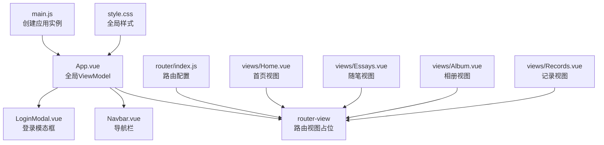
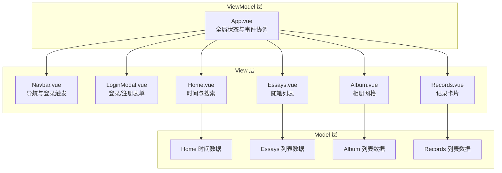
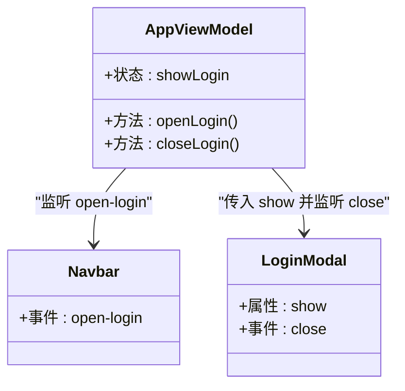
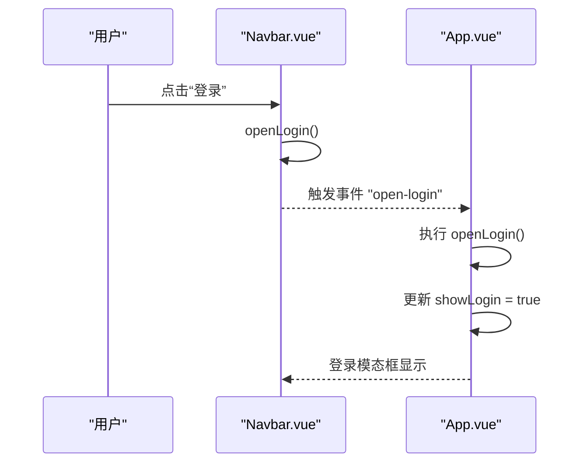
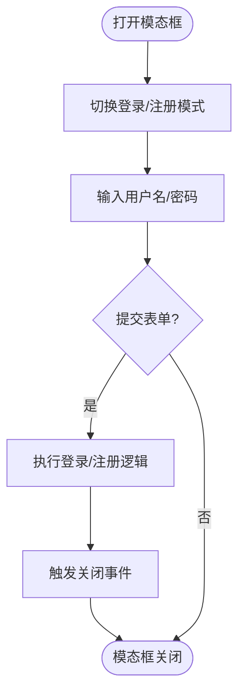
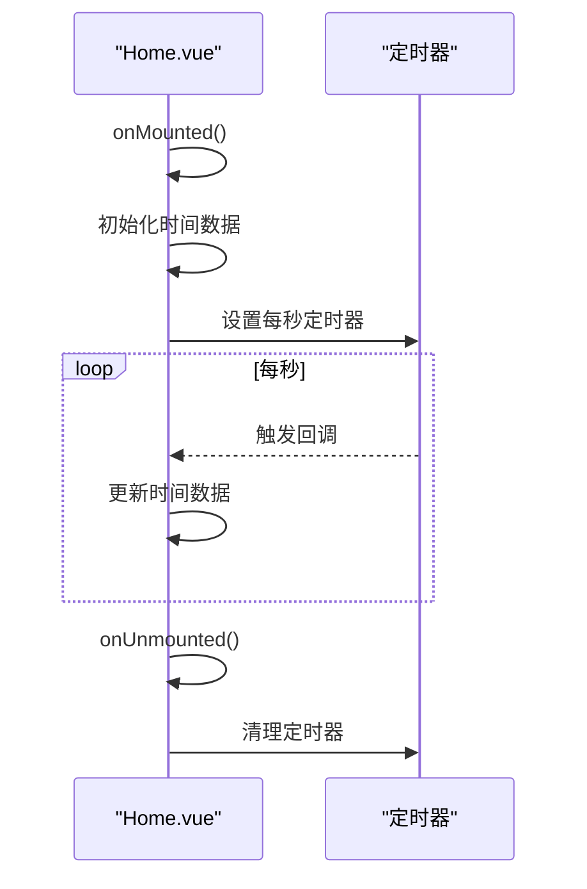
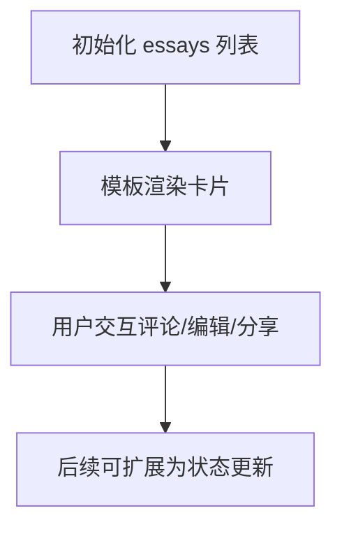
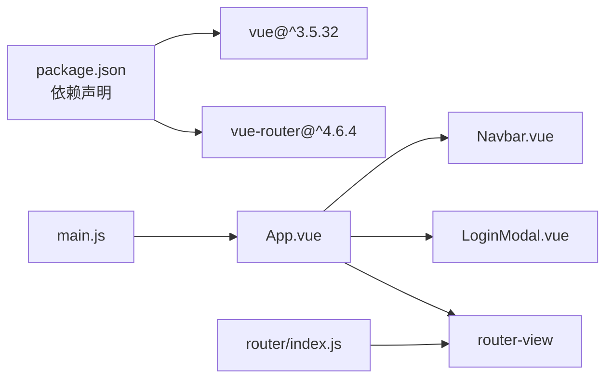

# MVVM架构模式

<cite>
**本文档引用的文件**
- [src/App.vue](file://src/App.vue)
- [src/main.js](file://src/main.js)
- [src/router/index.js](file://src/router/index.js)
- [src/components/Navbar.vue](file://src/components/Navbar.vue)
- [src/components/LoginModal.vue](file://src/components/LoginModal.vue)
- [src/views/Home.vue](file://src/views/Home.vue)
- [src/views/Essays.vue](file://src/views/Essays.vue)
- [src/views/Album.vue](file://src/views/Album.vue)
- [src/views/Records.vue](file://src/views/Records.vue)
- [src/style.css](file://src/style.css)
- [package.json](file://package.json)
- [vite.config.js](file://vite.config.js)
</cite>

## 目录
1. [引言](#引言)
2. [项目结构](#项目结构)
3. [核心组件](#核心组件)
4. [架构总览](#架构总览)
5. [详细组件分析](#详细组件分析)
6. [依赖关系分析](#依赖关系分析)
7. [性能考虑](#性能考虑)
8. [故障排除指南](#故障排除指南)
9. [结论](#结论)

## 引言
本文件围绕Vue 3博客项目，系统阐述MVVM（Model-View-ViewModel）架构模式在该单页应用中的实现方式。重点解释：
- Model层：数据模型与业务数据来源（如静态数据、定时器等）
- View层：模板与UI组件，负责渲染与用户交互
- ViewModel层：App.vue作为全局ViewModel，协调导航、登录模态框与路由视图的交互

同时，结合Composition API的响应式能力（ref、reactive等），说明数据绑定机制、响应式系统与组件生命周期在MVVM中的作用，并提供数据流与状态更新的可视化流程图，最后给出性能优化策略与最佳实践建议。

## 项目结构
该项目采用基于文件组织的特性模块化结构，遵循“按功能分层”的组织方式：
- 根入口：main.js 创建应用实例并挂载根组件App.vue
- 路由配置：router/index.js 定义页面路由与导航
- 视图层：views 下的各页面组件（Home、Essays、Album、Records等）
- 可复用组件：components 下的通用组件（Navbar、LoginModal）
- 全局样式：style.css 提供基础样式与滚动条美化
- 构建工具：Vite + Vue插件，package.json声明依赖与脚本

图表来源
- [src/main.js:1-9](file://src/main.js#L1-L9)
- [src/App.vue:1-30](file://src/App.vue#L1-L30)
- [src/router/index.js:1-28](file://src/router/index.js#L1-L28)
- [src/views/Home.vue:1-211](file://src/views/Home.vue#L1-L211)
- [src/views/Essays.vue:1-195](file://src/views/Essays.vue#L1-L195)
- [src/views/Album.vue:1-127](file://src/views/Album.vue#L1-L127)
- [src/views/Records.vue:1-100](file://src/views/Records.vue#L1-L100)
- [src/style.css:1-56](file://src/style.css#L1-L56)

章节来源
- [src/main.js:1-9](file://src/main.js#L1-L9)
- [src/router/index.js:1-28](file://src/router/index.js#L1-L28)
- [src/style.css:1-56](file://src/style.css#L1-L56)

## 核心组件
本节聚焦MVVM模式中的关键角色与职责划分：
- App.vue：作为全局ViewModel，持有全局状态（如登录模态框开关），协调子组件与路由视图，处理跨组件事件传递
- Navbar.vue：作为View层组件，负责导航菜单渲染与登录按钮交互；通过事件向上抛出打开登录的动作
- LoginModal.vue：作为View层组件，内部维护表单输入与切换登录/注册模式的状态；通过属性接收显示控制，通过事件向父级传递关闭动作
- 各视图组件（Home、Essays、Album、Records）：作为View层组件，渲染具体页面内容；部分组件包含本地状态（如Home的时间刷新）

章节来源
- [src/App.vue:1-30](file://src/App.vue#L1-L30)
- [src/components/Navbar.vue:1-140](file://src/components/Navbar.vue#L1-L140)
- [src/components/LoginModal.vue:1-316](file://src/components/LoginModal.vue#L1-L316)
- [src/views/Home.vue:1-211](file://src/views/Home.vue#L1-L211)
- [src/views/Essays.vue:1-195](file://src/views/Essays.vue#L1-L195)
- [src/views/Album.vue:1-127](file://src/views/Album.vue#L1-L127)
- [src/views/Records.vue:1-100](file://src/views/Records.vue#L1-L100)

## 架构总览
MVVM在本项目中的落地体现：
- ViewModel（App.vue）：集中管理全局状态（如登录模态框显示与否），并通过事件与props在组件间传递数据
- View（各组件）：通过模板语法与响应式数据绑定进行渲染，响应用户交互
- Model（数据源）：视图组件内定义的本地数据（如Home的时间、视图列表数据），或未来可扩展为外部API调用

图表来源
- [src/App.vue:1-30](file://src/App.vue#L1-L30)
- [src/components/Navbar.vue:1-140](file://src/components/Navbar.vue#L1-L140)
- [src/components/LoginModal.vue:1-316](file://src/components/LoginModal.vue#L1-L316)
- [src/views/Home.vue:1-211](file://src/views/Home.vue#L1-L211)
- [src/views/Essays.vue:1-195](file://src/views/Essays.vue#L1-L195)
- [src/views/Album.vue:1-127](file://src/views/Album.vue#L1-L127)
- [src/views/Records.vue:1-100](file://src/views/Records.vue#L1-L100)

## 详细组件分析

### App.vue：全局ViewModel
职责与实现要点：
- 状态管理：使用ref声明全局显示状态，用于控制登录模态框的显示/隐藏
- 事件处理：定义打开/关闭登录的方法，供子组件调用
- 组件组合：引入Navbar与LoginModal，通过事件与属性建立双向通信；通过router-view承载路由视图

图表来源
- [src/App.vue:1-30](file://src/App.vue#L1-L30)
- [src/components/Navbar.vue:1-140](file://src/components/Navbar.vue#L1-L140)
- [src/components/LoginModal.vue:1-316](file://src/components/LoginModal.vue#L1-L316)

章节来源
- [src/App.vue:1-30](file://src/App.vue#L1-L30)

### Navbar.vue：导航与登录触发
职责与实现要点：
- 导航渲染：定义导航项数组，结合路由状态判断当前激活项
- 用户交互：登录按钮触发自定义事件，向上通知App.vue打开登录模态框

图表来源
- [src/components/Navbar.vue:1-140](file://src/components/Navbar.vue#L1-L140)
- [src/App.vue:1-30](file://src/App.vue#L1-L30)

章节来源
- [src/components/Navbar.vue:1-140](file://src/components/Navbar.vue#L1-L140)

### LoginModal.vue：登录/注册表单
职责与实现要点：
- 表单状态：使用ref维护用户名、密码与登录/注册模式切换
- 事件处理：提交时根据模式输出不同行为，随后关闭模态框
- 交互设计：点击遮罩层自动关闭，支持动画过渡

图表来源
- [src/components/LoginModal.vue:1-316](file://src/components/LoginModal.vue#L1-L316)

章节来源
- [src/components/LoginModal.vue:1-316](file://src/components/LoginModal.vue#L1-L316)

### Home.vue：时间与搜索
职责与实现要点：
- 响应式数据：使用ref维护时间、日期、农历与星期等信息
- 生命周期：在挂载后初始化一次数据，并每秒更新一次
- 性能注意：清理定时器避免内存泄漏

图表来源
- [src/views/Home.vue:1-211](file://src/views/Home.vue#L1-L211)

章节来源
- [src/views/Home.vue:1-211](file://src/views/Home.vue#L1-L211)

### Essays.vue：随笔列表
职责与实现要点：
- 数据绑定：使用ref定义随笔列表，模板中通过v-for渲染卡片
- 图片与文本：头像、作者等级、内容与评论数均来自数据源

图表来源
- [src/views/Essays.vue:1-195](file://src/views/Essays.vue#L1-L195)

章节来源
- [src/views/Essays.vue:1-195](file://src/views/Essays.vue#L1-L195)

### Album.vue 与 Records.vue：网格布局
职责与实现要点：
- 数据驱动：通过ref定义相册/记录列表，模板中使用网格布局渲染
- 交互增强：悬停效果与覆盖层提升视觉反馈

章节来源
- [src/views/Album.vue:1-127](file://src/views/Album.vue#L1-L127)
- [src/views/Records.vue:1-100](file://src/views/Records.vue#L1-L100)

## 依赖关系分析
- 应用入口与依赖：main.js 引入App.vue与router，使用createApp创建实例并挂载
- 路由集成：router/index.js 配置多页面路由，App.vue通过router-view承载视图
- 组件依赖：App.vue依赖Navbar与LoginModal；各视图组件独立渲染自身内容
- 构建工具：Vite + @vitejs/plugin-vue，Vue 3与vue-router版本声明于package.json

图表来源
- [package.json:1-20](file://package.json#L1-L20)
- [src/main.js:1-9](file://src/main.js#L1-L9)
- [src/router/index.js:1-28](file://src/router/index.js#L1-L28)

章节来源
- [package.json:1-20](file://package.json#L1-L20)
- [src/main.js:1-9](file://src/main.js#L1-L9)
- [src/router/index.js:1-28](file://src/router/index.js#L1-L28)

## 性能考虑
- 响应式开销控制
  - 使用ref管理简单标量状态（如登录模态框开关），避免不必要的对象包装
  - 在Home.vue中，仅在需要时更新时间相关状态，减少不必要渲染
- 渲染优化
  - 列表渲染使用唯一key（如id），提升diff效率
  - 使用scoped样式减少全局样式影响
- 生命周期管理
  - 在Home.vue中，onMounted设置定时器，onUnmounted清理定时器，防止内存泄漏
- 组件拆分
  - 将导航与登录分离为独立组件，降低耦合度，便于测试与维护
- 构建与运行
  - 使用Vite构建工具，利用其快速热更新与按需编译特性

## 故障排除指南
- 登录模态框无法关闭
  - 检查App.vue是否正确接收并处理close事件，以及LoginModal的事件触发逻辑
- 导航高亮不生效
  - 确认Navbar.vue中路由状态与isActive判断逻辑一致
- Home时间不更新
  - 检查onMounted与onUnmounted生命周期钩子是否正确设置与清理定时器
- 路由视图不显示
  - 确认router/index.js路由配置与App.vue中的router-view位置一致

章节来源
- [src/App.vue:1-30](file://src/App.vue#L1-L30)
- [src/components/Navbar.vue:1-140](file://src/components/Navbar.vue#L1-L140)
- [src/views/Home.vue:1-211](file://src/views/Home.vue#L1-L211)
- [src/router/index.js:1-28](file://src/router/index.js#L1-L28)

## 结论
本博客项目通过清晰的MVVM分层实现了Vue 3的现代化开发模式：
- App.vue承担全局ViewModel职责，集中管理跨组件状态与事件
- 各组件作为View层，通过响应式数据与生命周期实现高效渲染
- Model层以本地数据为主，具备扩展为外部API的能力
- Composition API的ref等响应式API确保了数据绑定与状态更新的简洁性与可维护性
- 结合路由与构建工具，项目具备良好的扩展性与开发体验