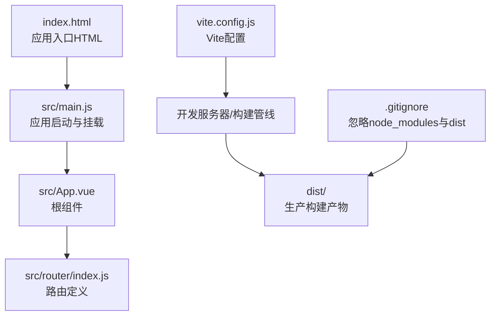
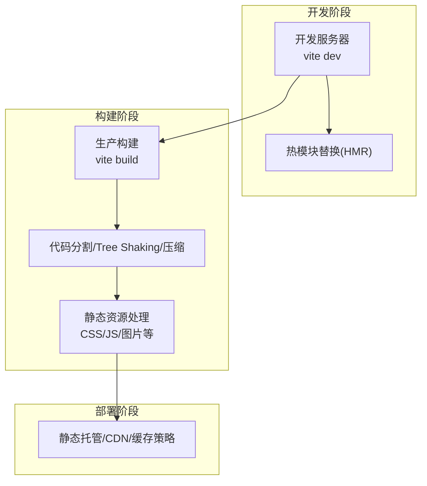
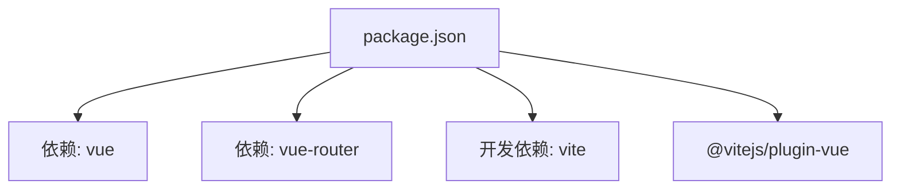

# 构建与部署架构

<cite>
**本文引用的文件**
- [package.json](file://package.json)
- [vite.config.js](file://vite.config.js)
- [index.html](file://index.html)
- [src/main.js](file://src/main.js)
- [src/App.vue](file://src/App.vue)
- [src/router/index.js](file://src/router/index.js)
- [.gitignore](file://.gitignore)
- [README.md](file://README.md)
</cite>

## 目录
1. [简介](#简介)
2. [项目结构](#项目结构)
3. [核心组件](#核心组件)
4. [架构总览](#架构总览)
5. [详细组件分析](#详细组件分析)
6. [依赖分析](#依赖分析)
7. [性能考虑](#性能考虑)
8. [故障排查指南](#故障排查指南)
9. [结论](#结论)
10. [附录](#附录)

## 简介
本文件面向Vue博客项目，系统性阐述基于Vite的构建与部署架构，覆盖开发服务器配置、生产构建优化、静态资源处理、代码分割与Tree Shaking、压缩优化、不同部署环境（静态托管、CDN集成、缓存策略）、性能监控与产物分析，以及CI/CD集成与自动化部署的最佳实践。文档同时结合项目现有配置进行说明，并给出可落地的优化建议。

## 项目结构
项目采用标准的Vite + Vue 3单页应用布局，核心入口为HTML模板与JavaScript应用入口，路由按页面模块组织，公共资源位于public目录，构建产物输出至默认的dist目录。

图示来源
- [index.html:1-14](file://index.html#L1-L14)
- [src/main.js:1-9](file://src/main.js#L1-L9)
- [src/App.vue:1-30](file://src/App.vue#L1-L30)
- [src/router/index.js:1-28](file://src/router/index.js#L1-L28)
- [vite.config.js:1-8](file://vite.config.js#L1-L8)
- [.gitignore:1-24](file://.gitignore#L1-L24)

章节来源
- [index.html:1-14](file://index.html#L1-L14)
- [src/main.js:1-9](file://src/main.js#L1-L9)
- [src/App.vue:1-30](file://src/App.vue#L1-L30)
- [src/router/index.js:1-28](file://src/router/index.js#L1-L28)
- [vite.config.js:1-8](file://vite.config.js#L1-L8)
- [.gitignore:1-24](file://.gitignore#L1-L24)

## 核心组件
- 包管理与脚本：通过package.json定义开发、构建与预览脚本，使用Vite与Vue插件。
- 构建配置：vite.config.js启用Vue插件，作为后续扩展优化的基线。
- 应用入口：index.html与src/main.js负责挂载Vue应用与路由。
- 路由体系：src/router/index.js集中声明页面路由，支持SPA导航。
- 忽略规则：.gitignore排除node_modules与dist等构建产物，避免提交到版本库。

章节来源
- [package.json:1-20](file://package.json#L1-L20)
- [vite.config.js:1-8](file://vite.config.js#L1-L8)
- [index.html:1-14](file://index.html#L1-L14)
- [src/main.js:1-9](file://src/main.js#L1-L9)
- [src/router/index.js:1-28](file://src/router/index.js#L1-L28)
- [.gitignore:1-24](file://.gitignore#L1-L24)

## 架构总览
下图展示从开发到生产的整体流程：开发时Vite启动本地服务，热更新驱动前端体验；生产时Vite打包生成静态资源，配合部署策略实现分发与缓存。

图示来源
- [package.json:6-10](file://package.json#L6-L10)
- [vite.config.js:5-7](file://vite.config.js#L5-L7)

章节来源
- [package.json:6-10](file://package.json#L6-L10)
- [vite.config.js:5-7](file://vite.config.js#L5-L7)

## 详细组件分析

### 开发服务器配置与优化
- 启动命令：通过脚本启动Vite开发服务器，提供快速迭代与热更新能力。
- 插件启用：当前配置已启用Vue插件，确保SFC编译与单文件组件热更新。
- 扩展建议：可增加代理、HTTPS、端口自定义、主机绑定等开发服务器选项以适配团队协作与跨设备调试需求。

章节来源
- [package.json:7](file://package.json#L7)
- [vite.config.js:5-7](file://vite.config.js#L5-L7)

### 生产构建优化与产物结构
- 构建命令：通过脚本触发Vite生产构建，输出至默认dist目录。
- 产物忽略：.gitignore已排除dist目录，避免将构建产物纳入版本控制。
- 优化策略（建议）：
  - 代码分割：利用路由级懒加载与动态导入，减少首屏体积。
  - Tree Shaking：保持ES模块导入导出风格，确保未使用代码被移除。
  - 压缩与混淆：启用JS/CSS压缩与HTML最小化，降低传输体积。
  - 静态资源：自动内联小资源，大资源生成独立文件并添加哈希后缀。

章节来源
- [package.json:8](file://package.json#L8)
- [.gitignore:10-12](file://.gitignore#L10-L12)

### 静态资源处理与缓存策略
- 公共资源：public目录用于放置无需打包的静态资源（如favicon），在构建后原样复制到dist根目录。
- 资源命名：建议为CSS/JS/媒体资源添加内容哈希后缀，结合长期缓存策略提升复用率。
- CDN集成：将dist目录部署至CDN，设置合理的缓存头与回源策略，确保资源就近分发与失效控制。

章节来源
- [index.html:5](file://index.html#L5)
- [.gitignore:10-12](file://.gitignore#L10-L12)

### 代码分割、Tree Shaking与压缩优化
- 代码分割：在路由层采用异步组件与动态导入，实现按需加载页面模块，缩短首屏加载时间。
- Tree Shaking：确保第三方库采用ES模块版本，避免直接引入打包后的UMD/全局变量形式。
- 压缩优化：启用JS与CSS压缩器，结合HTML最小化与资源内联策略，进一步减小体积。

章节来源
- [src/router/index.js:1-28](file://src/router/index.js#L1-L28)

### CI/CD集成与自动化部署最佳实践
- 触发条件：在分支保护策略下，主分支推送触发构建与部署流水线。
- 步骤建议：
  - 安装依赖与缓存
  - 运行测试（可选）
  - 执行生产构建
  - 上传构建产物至目标存储或CDN
  - 刷新CDN缓存或执行灰度发布
- 安全与回滚：保留多版本产物，支持一键回滚；对敏感信息使用密钥管理服务。

[本节为通用实践说明，不直接分析具体文件，故无“章节来源”]

### 性能监控与构建产物分析
- 产物分析：使用Vite内置分析器或第三方Bundle Analyzer可视化包体构成，定位大体积依赖与重复模块。
- 指标采集：记录首次内容绘制（FCP）、最大内容绘制（LCP）、无害交互（CLS）等核心指标，结合构建日志评估优化效果。
- 持续优化：定期审查依赖树、拆分公共代码、启用更激进的压缩与资源内联策略。

[本节为通用实践说明，不直接分析具体文件，故无“章节来源”]

## 依赖分析
项目依赖围绕Vue 3与Vite生态展开，核心运行时依赖为Vue与vue-router，开发时依赖为Vite与@vitejs/plugin-vue。该组合提供了现代化的开发体验与高效的生产构建能力。

图示来源
- [package.json:11-17](file://package.json#L11-L17)

章节来源
- [package.json:11-17](file://package.json#L11-L17)

## 性能考虑
- 资源体积：优先使用按需导入与懒加载，减少初始包体；对第三方库进行体积分析与替代选择。
- 缓存策略：静态资源采用强缓存，HTML与清单文件采用协商缓存；CDN层面设置边缘缓存与回源策略。
- 网络优化：启用HTTP/2或多路复用，开启Gzip/Brotli压缩；合理划分资源域，避免不必要的Cookie携带。
- 渲染性能：减少重排重绘，使用虚拟滚动与防抖；在路由切换时提供骨架屏或占位符提升感知速度。

[本节为通用性能指导，不直接分析具体文件，故无“章节来源”]

## 故障排查指南
- 构建失败：检查依赖安装状态与Node版本兼容性；确认vite.config.js中插件配置正确。
- 预览异常：使用预览命令验证构建产物是否完整；核对public目录资源路径与引用。
- 部署问题：确认dist目录未被.gitignore忽略；检查CDN缓存刷新与回源配置。
- 性能退化：使用分析工具定位大体积模块与重复依赖，调整代码分割与Tree Shaking策略。

章节来源
- [package.json:6-10](file://package.json#L6-L10)
- [.gitignore:10-12](file://.gitignore#L10-L12)

## 结论
本项目以Vite为核心构建工具，结合Vue 3与路由体系，具备清晰的开发与构建边界。通过合理的代码分割、Tree Shaking与压缩策略，以及静态托管与CDN集成的部署方案，可在保证开发效率的同时获得优秀的用户体验。建议持续引入性能监控与构建分析工具，形成闭环优化机制，并在CI/CD中固化自动化流程，确保交付质量与稳定性。

## 附录
- 快速参考
  - 开发：运行开发服务器
  - 构建：生成生产构建产物
  - 预览：本地预览构建结果
- 建议的后续增强
  - 在vite.config.js中加入分析器与资源处理配置
  - 引入路由懒加载与公共依赖提取
  - 设计CI/CD流水线与缓存策略

章节来源
- [package.json:6-10](file://package.json#L6-L10)
- [vite.config.js:5-7](file://vite.config.js#L5-L7)