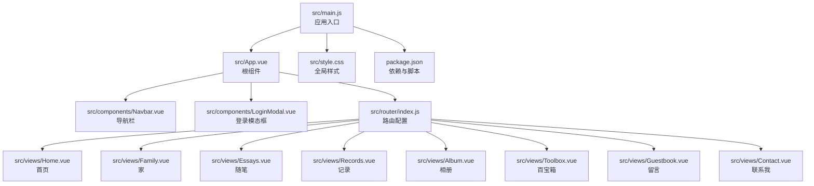
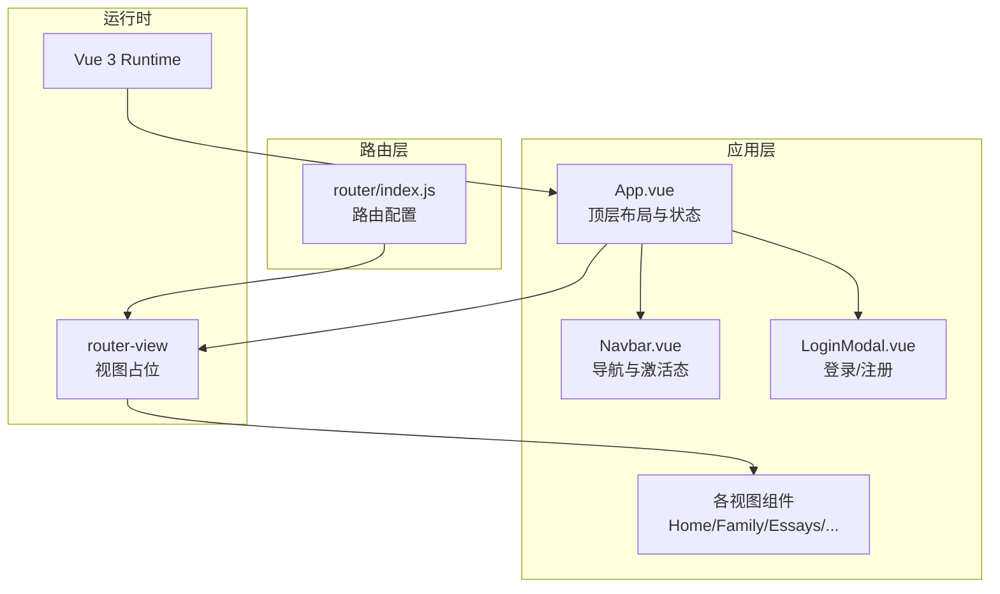
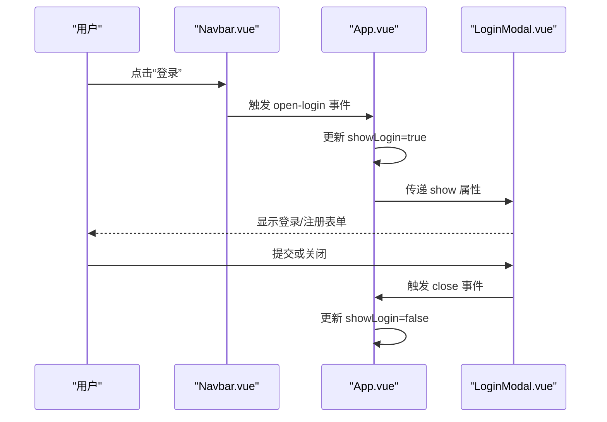
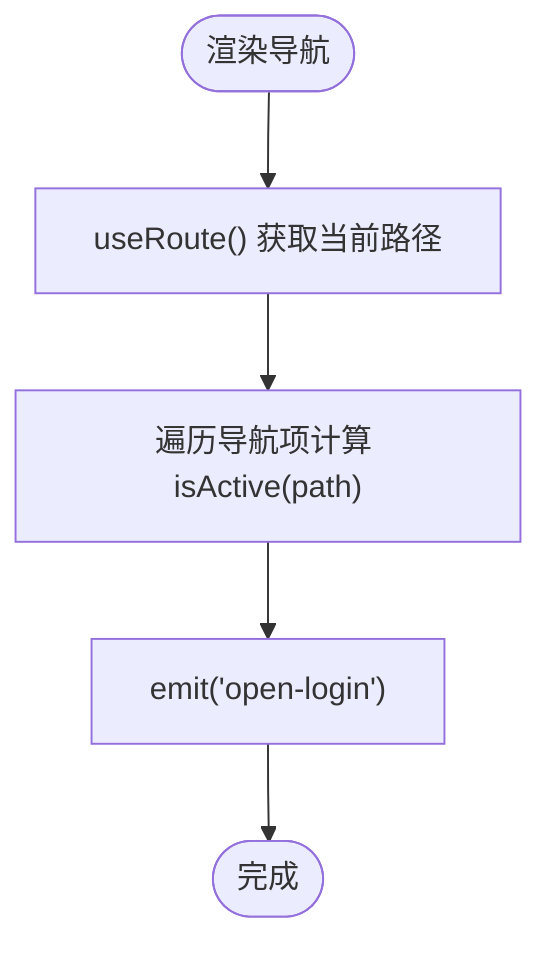
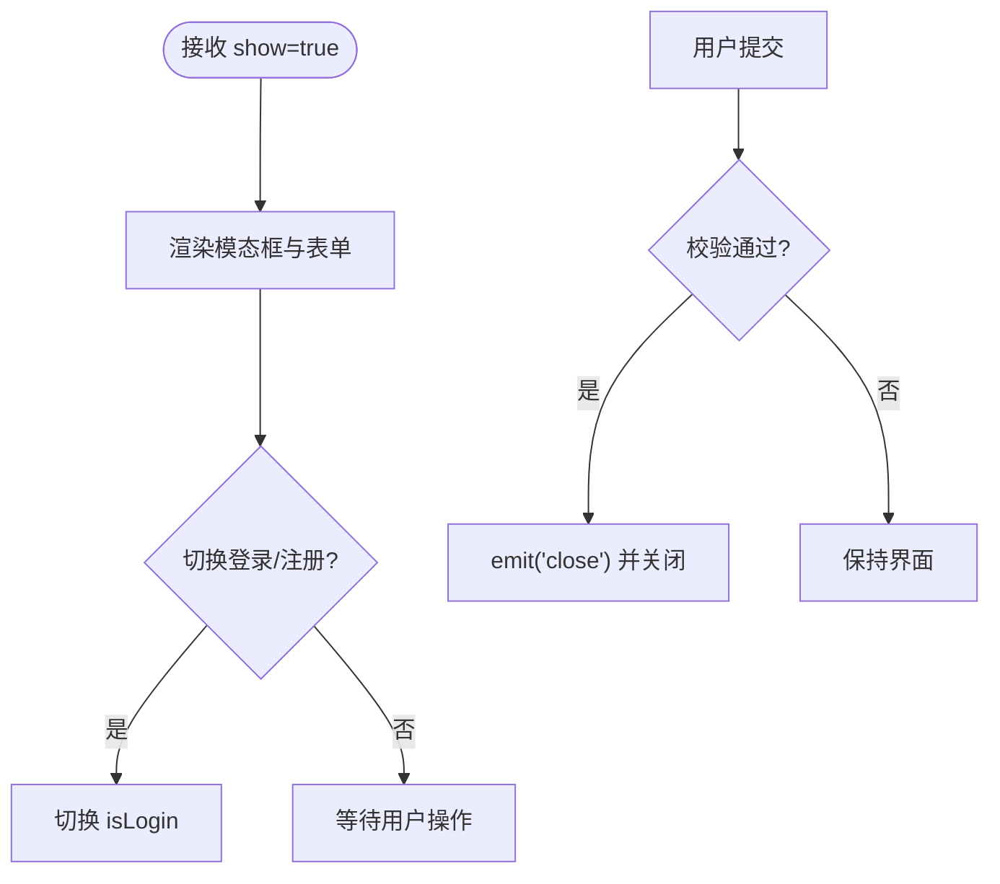
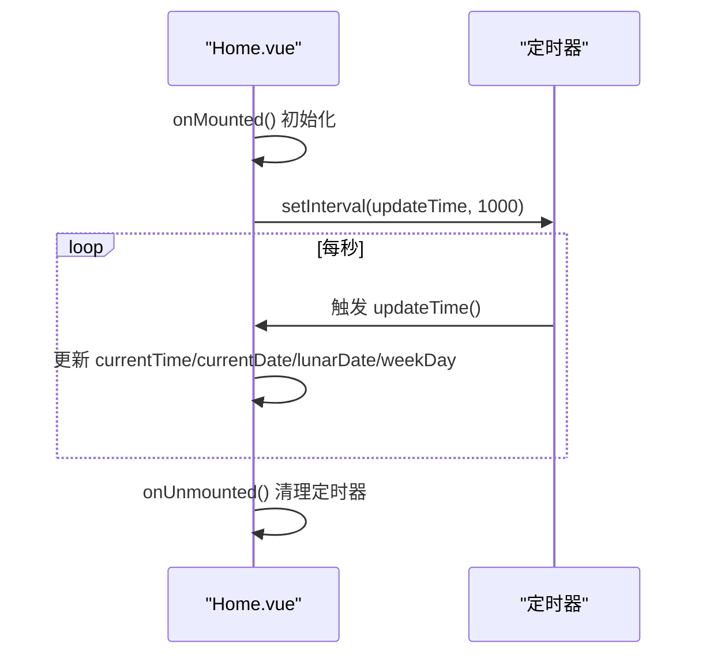
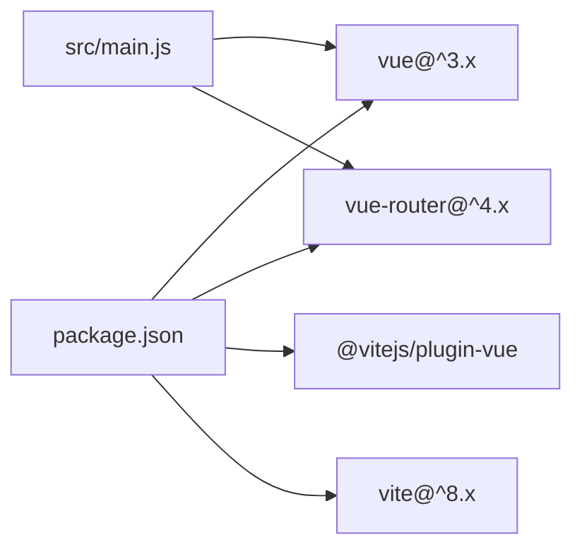

# 架构设计

<cite>
**本文引用的文件**
- [src/main.js](file://src/main.js)
- [src/App.vue](file://src/App.vue)
- [src/router/index.js](file://src/router/index.js)
- [src/components/Navbar.vue](file://src/components/Navbar.vue)
- [src/components/LoginModal.vue](file://src/components/LoginModal.vue)
- [src/views/Home.vue](file://src/views/Home.vue)
- [src/views/Family.vue](file://src/views/Family.vue)
- [src/views/Essays.vue](file://src/views/Essays.vue)
- [src/views/Records.vue](file://src/views/Records.vue)
- [src/views/Album.vue](file://src/views/Album.vue)
- [src/views/Toolbox.vue](file://src/views/Toolbox.vue)
- [src/views/Guestbook.vue](file://src/views/Guestbook.vue)
- [src/views/Contact.vue](file://src/views/Contact.vue)
- [src/style.css](file://src/style.css)
- [package.json](file://package.json)
- [README.md](file://README.md)
</cite>

## 目录
1. [引言](#引言)
2. [项目结构](#项目结构)
3. [核心组件](#核心组件)
4. [架构总览](#架构总览)
5. [详细组件分析](#详细组件分析)
6. [依赖分析](#依赖分析)
7. [性能考虑](#性能考虑)
8. [故障排查指南](#故障排查指南)
9. [结论](#结论)
10. [附录](#附录)

## 引言
本项目是一个基于 Vue 3 + Vite 的单页应用（SPA），采用组件化设计与 MVVM 模式，结合 Composition API 实现响应式数据与生命周期管理。应用通过 vue-router 提供前端路由，实现页面切换与导航。整体架构强调清晰的组件边界、简洁的数据流与可扩展的视图层。

## 项目结构
项目采用“按功能域”组织的前端目录结构，核心入口在 main.js，根组件 App.vue 负责顶层布局与全局状态协调；路由配置集中于 router/index.js；视图组件位于 views 目录，通用 UI 组件位于 components 目录；公共样式位于 style.css；构建与依赖定义在 package.json 中。

图表来源
- [src/main.js:1-9](file://src/main.js#L1-L9)
- [src/App.vue:1-30](file://src/App.vue#L1-L30)
- [src/router/index.js:1-28](file://src/router/index.js#L1-L28)
- [src/style.css:1-56](file://src/style.css#L1-L56)
- [package.json:1-20](file://package.json#L1-L20)

章节来源
- [src/main.js:1-9](file://src/main.js#L1-L9)
- [src/App.vue:1-30](file://src/App.vue#L1-L30)
- [src/router/index.js:1-28](file://src/router/index.js#L1-L28)
- [src/style.css:1-56](file://src/style.css#L1-L56)
- [package.json:1-20](file://package.json#L1-L20)

## 核心组件
- 应用入口与挂载
  - main.js 创建应用实例，安装路由插件，并将 App.vue 挂载至 DOM。
- 根组件与布局
  - App.vue 作为顶层容器，负责渲染导航栏、路由视图与登录模态框，同时维护登录弹窗的显示状态。
- 导航与路由
  - Navbar.vue 展示固定导航，使用 vue-router 的 useRoute 判断当前激活项，并向父组件派发打开登录事件。
  - router/index.js 定义多页面路由表，使用 HTML5 History 模式，支持 SPA 页面切换。
- 视图层
  - 各视图组件（Home、Family、Essays、Records、Album、Toolbox、Guestbook、Contact）均采用 Composition API 编写，负责各自页面的数据与交互逻辑。
- 全局样式
  - style.css 提供基础排版、滚动条与全局过渡效果，确保跨页面一致的视觉体验。

章节来源
- [src/main.js:1-9](file://src/main.js#L1-L9)
- [src/App.vue:1-30](file://src/App.vue#L1-L30)
- [src/components/Navbar.vue:1-140](file://src/components/Navbar.vue#L1-L140)
- [src/router/index.js:1-28](file://src/router/index.js#L1-L28)
- [src/views/Home.vue:1-211](file://src/views/Home.vue#L1-L211)
- [src/views/Family.vue:1-309](file://src/views/Family.vue#L1-L309)
- [src/views/Essays.vue:1-195](file://src/views/Essays.vue#L1-L195)
- [src/views/Records.vue:1-100](file://src/views/Records.vue#L1-L100)
- [src/views/Album.vue:1-127](file://src/views/Album.vue#L1-L127)
- [src/views/Toolbox.vue:1-102](file://src/views/Toolbox.vue#L1-L102)
- [src/views/Guestbook.vue:1-202](file://src/views/Guestbook.vue#L1-L202)
- [src/views/Contact.vue:1-189](file://src/views/Contact.vue#L1-L189)
- [src/style.css:1-56](file://src/style.css#L1-L56)

## 架构总览
本项目遵循 MVVM 与组件化设计原则：
- Model：各视图组件内部通过 ref/computed/watch（Composition API）管理本地状态，如计时器、列表数据等。
- View：SFC 单文件组件负责模板渲染与用户交互。
- ViewModel：通过 Vue 3 响应式系统与生命周期钩子（onMounted/onUnmounted）协调数据与视图更新，避免直接操作 DOM。
- 组件通信：父子通过 props/emit，兄弟通过共享状态或事件总线（本项目通过根组件集中状态与事件传递）。
- 路由与导航：vue-router 提供前端路由，实现无刷新页面切换与历史记录管理。

图表来源
- [src/App.vue:1-30](file://src/App.vue#L1-L30)
- [src/components/Navbar.vue:1-140](file://src/components/Navbar.vue#L1-L140)
- [src/components/LoginModal.vue:1-316](file://src/components/LoginModal.vue#L1-L316)
- [src/router/index.js:1-28](file://src/router/index.js#L1-L28)
- [src/views/Home.vue:1-211](file://src/views/Home.vue#L1-L211)

## 详细组件分析

### 根组件与顶层布局（App.vue）
- 职责
  - 维护登录模态框的显示状态，通过事件向上抛出打开登录请求，向下传递给 LoginModal。
  - 渲染全局导航与路由视图，形成统一的页面骨架。
- 关键交互
  - 通过事件发射器触发 open-login，Navbar 接收后执行打开逻辑。
  - 使用 router-view 占位，由路由系统动态替换为对应视图组件。
- 数据流
  - showLogin 为本地响应式状态，控制模态框显隐；事件驱动的父子通信避免跨层级耦合。

图表来源
- [src/App.vue:1-30](file://src/App.vue#L1-L30)
- [src/components/Navbar.vue:1-140](file://src/components/Navbar.vue#L1-L140)
- [src/components/LoginModal.vue:1-316](file://src/components/LoginModal.vue#L1-L316)

章节来源
- [src/App.vue:1-30](file://src/App.vue#L1-L30)

### 导航组件（Navbar.vue）
- 职责
  - 定义导航项数组，使用 vue-router 的 useRoute 获取当前路径，计算激活态。
  - 将“打开登录”事件向上冒泡至父组件。
- 设计要点
  - 固定定位与模糊背景，适配移动端隐藏菜单。
  - 使用 Teleport 将模态框挂载到 body，避免定位与层级问题。

图表来源
- [src/components/Navbar.vue:1-140](file://src/components/Navbar.vue#L1-L140)

章节来源
- [src/components/Navbar.vue:1-140](file://src/components/Navbar.vue#L1-L140)

### 登录模态框（LoginModal.vue）
- 职责
  - 提供登录/注册切换、表单输入绑定与提交处理。
  - 支持点击遮罩关闭、过渡动画与 Teleport 挂载。
- 数据与交互
  - 通过 props 接收 show 控制显示；通过 emit 返回关闭事件。
  - 使用 v-model 双向绑定用户名与密码字段。

图表来源
- [src/components/LoginModal.vue:1-316](file://src/components/LoginModal.vue#L1-L316)

章节来源
- [src/components/LoginModal.vue:1-316](file://src/components/LoginModal.vue#L1-L316)

### 首页视图（Home.vue）
- 职责
  - 实时显示时间、日期、星期与农历提示，使用定时器每秒更新。
- 技术细节
  - onMounted 初始化并启动定时器，onUnmounted 清理定时器，避免内存泄漏。
  - 使用响应式 ref 存储时间信息，模板直接绑定渲染。

图表来源
- [src/views/Home.vue:1-211](file://src/views/Home.vue#L1-L211)

章节来源
- [src/views/Home.vue:1-211](file://src/views/Home.vue#L1-L211)

### 家（Family.vue）
- 职责
  - 展示纪念日倒计时与新年倒计时，实时更新时间单位。
- 技术细节
  - 使用 onMounted 初始化，定时器每秒更新；计算逻辑包含年、月、日、时、分、秒拆分与新年倒计时。

章节来源
- [src/views/Family.vue:1-309](file://src/views/Family.vue#L1-L309)

### 随笔（Essays.vue）
- 职责
  - 展示随笔卡片列表，包含作者头像、等级徽章、内容与评论数。
- 技术细节
  - 使用响应式数组存储随笔数据，模板循环渲染卡片。

章节来源
- [src/views/Essays.vue:1-195](file://src/views/Essays.vue#L1-L195)

### 记录（Records.vue）
- 职责
  - 展示分类记录卡片网格，包含图标、标题、描述与数量统计。
- 技术细节
  - 响应式数组驱动网格布局，使用 CSS Grid 自适应列数。

章节来源
- [src/views/Records.vue:1-100](file://src/views/Records.vue#L1-L100)

### 相册（Album.vue）
- 职责
  - 展示相册封面网格，悬停显示照片数量覆盖层。
- 技术细节
  - 响应式数组驱动网格，hover 效果通过 CSS 过渡实现。

章节来源
- [src/views/Album.vue:1-127](file://src/views/Album.vue#L1-L127)

### 百宝箱（Toolbox.vue）
- 职责
  - 展示工具卡片网格，悬停时边框高亮。
- 技术细节
  - 使用 CSS 变量为每个卡片设置主题色，hover 动画增强交互。

章节来源
- [src/views/Toolbox.vue:1-102](file://src/views/Toolbox.vue#L1-L102)

### 留言板（Guestbook.vue）
- 职责
  - 提供留言表单与消息列表，支持新增留言并插入到顶部。
- 技术细节
  - 表单双向绑定用户名与留言内容；提交时校验非空并生成新消息对象。

章节来源
- [src/views/Guestbook.vue:1-202](file://src/views/Guestbook.vue#L1-L202)

### 联系我（Contact.vue）
- 职责
  - 展示联系方式与社交链接，响应式两列布局。
- 技术细节
  - 使用 CSS Grid 实现两列自适应；hover 效果提升交互反馈。

章节来源
- [src/views/Contact.vue:1-189](file://src/views/Contact.vue#L1-L189)

## 依赖分析
- 运行时依赖
  - vue：提供响应式系统与组件模型。
  - vue-router：提供前端路由与导航能力。
- 开发依赖
  - @vitejs/plugin-vue：Vite 插件，支持 Vue SFC。
  - vite：构建工具与开发服务器。
- 入口与挂载
  - main.js 仅负责创建应用、引入样式与安装路由，保持最小入口职责。

图表来源
- [package.json:1-20](file://package.json#L1-L20)
- [src/main.js:1-9](file://src/main.js#L1-L9)

章节来源
- [package.json:1-20](file://package.json#L1-L20)
- [src/main.js:1-9](file://src/main.js#L1-L9)

## 性能考虑
- 组件粒度与懒加载
  - 当前路由已配置各视图组件，建议在大型项目中启用路由级懒加载以减少首屏体积。
- 定时器管理
  - 所有使用定时器的组件均在卸载时清理，避免内存泄漏与后台任务占用。
- 图片与资源
  - 视图中使用外部图片资源，建议在生产环境开启 CDN 与压缩，减少首屏加载时间。
- 样式与动画
  - 使用 CSS 过渡与 Transform 动画，尽量避免重排重绘；移动端适配通过媒体查询优化。

## 故障排查指南
- 路由不生效或白屏
  - 检查路由配置是否正确导入各视图组件，确认 createWebHistory 使用与服务器部署路径匹配。
- 登录模态框无法关闭
  - 确认父组件正确传递 show 属性并监听 close 事件；检查 Teleport 是否正确挂载到 body。
- 时间不更新
  - 确认 Home 与 Family 组件的定时器在 onMounted 中初始化且在 onUnmounted 中清理。
- 样式异常
  - 检查 style.css 是否被正确引入；确认 scoped 样式未误用选择器导致覆盖。

章节来源
- [src/router/index.js:1-28](file://src/router/index.js#L1-L28)
- [src/components/LoginModal.vue:1-316](file://src/components/LoginModal.vue#L1-L316)
- [src/views/Home.vue:1-211](file://src/views/Home.vue#L1-L211)
- [src/views/Family.vue:1-309](file://src/views/Family.vue#L1-L309)
- [src/style.css:1-56](file://src/style.css#L1-L56)

## 结论
本项目以 Vue 3 Composition API 为核心，结合 vue-router 实现 SPA，采用组件化设计与 MVVM 模式，具备清晰的层次与良好的可扩展性。通过合理的状态管理策略（本地响应式状态 + 事件通信）、路由与视图分离以及全局样式统一，满足中小型博客站点的功能需求。后续可在路由懒加载、状态管理模块化、服务端集成等方面进一步演进。

## 附录
- 技术栈与版本
  - Vue 3、Vue Router 4、Vite、ES Modules
- 基础设施与部署
  - 建议使用静态托管（如 GitHub Pages、Vercel、Netlify）部署构建产物；若需要 SSR 或服务端渲染，可考虑引入 Nuxt 3 或同构方案。
- 安全与监控（横切关注点）
  - 安全：前端暂无鉴权逻辑，建议在后端接口接入时增加 HTTPS、CSP、XSS 防护；表单提交需进行输入校验与防刷。
  - 监控：可集成前端埋点与错误上报（如 Sentry），收集页面性能指标（如 FCP/LCP）与用户行为数据。