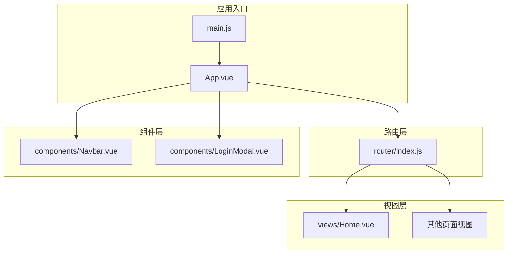
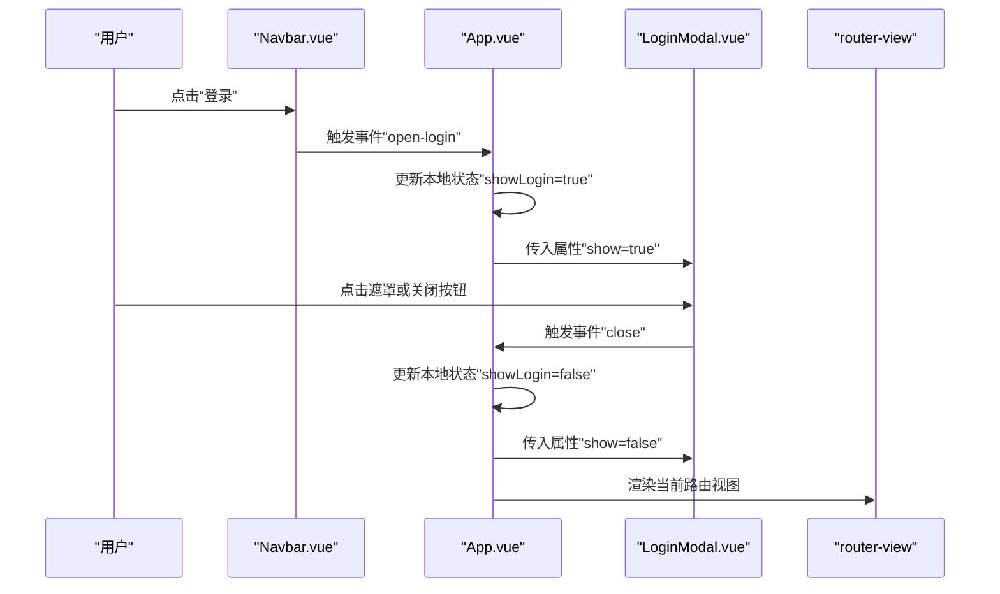
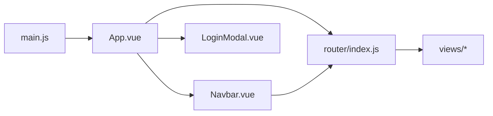

# 核心组件设计

<cite>
**本文引用的文件**
- [src/App.vue](file://src/App.vue)
- [src/components/Navbar.vue](file://src/components/Navbar.vue)
- [src/components/LoginModal.vue](file://src/components/LoginModal.vue)
- [src/main.js](file://src/main.js)
- [src/router/index.js](file://src/router/index.js)
- [src/views/Home.vue](file://src/views/Home.vue)
- [src/style.css](file://src/style.css)
- [package.json](file://package.json)
</cite>

## 目录
1. [简介](#简介)
2. [项目结构](#项目结构)
3. [核心组件](#核心组件)
4. [架构总览](#架构总览)
5. [详细组件分析](#详细组件分析)
6. [依赖关系分析](#依赖关系分析)
7. [性能考量](#性能考量)
8. [故障排查指南](#故障排查指南)
9. [结论](#结论)
10. [附录](#附录)

## 简介
本文件聚焦于Vue博客项目的核心组件设计，系统梳理根组件App.vue的组件树与状态管理、导航组件Navbar的响应式设计与导航状态管理、模态框组件LoginModal的动画过渡与交互处理，并从职责分离、接口设计、错误处理、可测试性与可维护性等维度进行深入分析。文档旨在帮助开发者快速理解组件协作方式与最佳实践。

## 项目结构
项目采用基于功能模块的组织方式：根组件负责顶层布局与状态协调；导航组件与模态框作为通用UI组件被根组件复用；路由配置集中管理页面路径与视图组件映射；样式统一在全局样式文件中定义，确保一致的视觉与交互体验。

图表来源
- [src/main.js:1-9](file://src/main.js#L1-L9)
- [src/App.vue:1-30](file://src/App.vue#L1-L30)
- [src/router/index.js:1-28](file://src/router/index.js#L1-L28)

章节来源
- [src/main.js:1-9](file://src/main.js#L1-L9)
- [src/router/index.js:1-28](file://src/router/index.js#L1-L28)
- [src/style.css:1-56](file://src/style.css#L1-L56)

## 核心组件
本节聚焦根组件App.vue的设计理念与实现要点：
- 组件树结构：根组件引入导航组件与模态框组件，通过router-view承载当前路由视图，形成“头部导航 + 页面内容 + 登录模态”的布局骨架。
- 状态管理：使用响应式引用控制模态框的显示/隐藏，通过事件向上抛出打开动作，向下传递关闭回调，实现自上而下的状态驱动。
- 全局布局：根容器设置最小高度以适配全屏滚动，配合全局样式保证页面基础排版与滚动行为。

章节来源
- [src/App.vue:1-30](file://src/App.vue#L1-L30)
- [src/style.css:23-26](file://src/style.css#L23-L26)

## 架构总览
下图展示根组件、导航组件、模态框组件与路由之间的交互流程，体现事件冒泡与属性传递的单向数据流。

图表来源
- [src/App.vue:17-23](file://src/App.vue#L17-L23)
- [src/components/Navbar.vue:23-25](file://src/components/Navbar.vue#L23-L25)
- [src/components/LoginModal.vue:14-16](file://src/components/LoginModal.vue#L14-L16)

## 详细组件分析

### 根组件 App.vue
- 设计理念
  - 单一职责：负责顶层布局与全局状态协调，不直接处理业务逻辑。
  - 接口设计：通过事件暴露“打开登录”能力，通过属性控制“是否显示”模态框，遵循单向数据流。
  - 错误处理：当前未见显式的错误捕获逻辑，建议在事件回调中增加容错与日志输出。
- 数据与状态
  - 使用响应式引用管理模态框显示状态，避免在子组件内直接操作DOM。
- 布局与样式
  - 容器类名用于约束最小高度，确保页面内容完整覆盖视窗。
- 可测试性与可维护性
  - 事件与属性接口清晰，便于单元测试与集成测试。
  - 建议将状态提升至更高层级或引入轻量状态管理库，以增强跨组件共享能力。

章节来源
- [src/App.vue:1-30](file://src/App.vue#L1-L30)

### 导航组件 Navbar.vue
- 设计理念
  - 单一职责：渲染导航菜单、高亮当前路由项、触发登录事件。
  - 响应式设计：在窄屏设备隐藏导航菜单，保持顶部固定栏简洁。
  - 导航状态管理：通过路由钩子判断当前激活项，无需额外状态。
- 数据与状态
  - 静态导航项列表，动态计算激活状态。
  - 通过事件向上通知父组件打开登录。
- 交互与样式
  - 悬停与激活态的视觉反馈，按钮渐变色与阴影增强触感。
  - 媒体查询在小屏时隐藏菜单，优化移动端体验。
- 可测试性与可维护性
  - 事件与计算方法分离，利于测试。
  - 建议将导航项配置抽离到外部配置文件，便于扩展与国际化。

章节来源
- [src/components/Navbar.vue:1-140](file://src/components/Navbar.vue#L1-L140)

### 模态框组件 LoginModal.vue
- 设计理念
  - 单一职责：承载登录/注册表单，处理切换模式与提交逻辑。
  - 动画过渡：使用两层过渡（淡入淡出与缩放），提升用户体验。
  - 用户交互：支持点击遮罩关闭、输入校验、表单提交与切换模式。
- 数据与状态
  - 表单字段：用户名、密码、登录/注册模式。
  - 关闭逻辑：通过事件向父组件传递关闭信号。
- 动画与过渡
  - 外层淡入淡出过渡，内层缩放过渡，配合Teleport挂载到body，避免定位与层级问题。
- 可测试性与可维护性
  - 表单逻辑集中在处理函数中，便于断言与模拟。
  - 建议将表单验证与提交逻辑抽取为独立服务，便于复用与测试。

章节来源
- [src/components/LoginModal.vue:1-316](file://src/components/LoginModal.vue#L1-L316)

### 路由与视图组件
- 路由配置
  - 集中式声明各页面路径与对应视图组件，支持历史模式。
- 视图组件示例
  - 首页视图包含时间显示与搜索区域，演示了生命周期与定时器的使用。

章节来源
- [src/router/index.js:1-28](file://src/router/index.js#L1-L28)
- [src/views/Home.vue:1-211](file://src/views/Home.vue#L1-L211)

## 依赖关系分析
- 应用入口依赖根组件与路由插件，根组件依赖导航与模态框组件。
- 导航组件依赖路由钩子以判断当前路由，模态框组件依赖Vue响应式系统与过渡动画。
- 全局样式统一页面基础样式与滚动行为。

图表来源
- [src/main.js:1-9](file://src/main.js#L1-L9)
- [src/App.vue:1-30](file://src/App.vue#L1-L30)
- [src/router/index.js:1-28](file://src/router/index.js#L1-L28)

章节来源
- [src/main.js:1-9](file://src/main.js#L1-L9)
- [src/App.vue:1-30](file://src/App.vue#L1-L30)
- [src/router/index.js:1-28](file://src/router/index.js#L1-L28)

## 性能考量
- 组件渲染
  - 导航组件使用v-for渲染菜单项，建议为列表项提供稳定key，避免不必要的重渲染。
  - 模态框使用Teleport挂载到body，减少层级嵌套对定位的影响。
- 动画性能
  - 过渡动画使用CSS过渡，建议在低端设备上适当降低动画时长或禁用非关键动画。
- 资源加载
  - 视图组件中的背景图片为外链资源，建议在生产环境配置CDN与懒加载策略。
- 内存管理
  - 视图组件在卸载时清理定时器，避免内存泄漏。

[本节为通用性能建议，不直接分析具体文件]

## 故障排查指南
- 模态框无法关闭
  - 检查父组件是否正确接收并处理"close"事件，以及show属性是否同步更新。
  - 确认遮罩点击事件的委托逻辑是否生效。
- 导航高亮异常
  - 检查路由路径与导航项路径是否完全匹配，避免末尾斜杠差异导致的不激活。
- 动画不生效
  - 确认Transition名称与CSS类名一致，且Teleport目标存在。
- 路由跳转无效
  - 检查路由配置与router-view位置，确保路由历史模式可用。

章节来源
- [src/components/LoginModal.vue:28-32](file://src/components/LoginModal.vue#L28-L32)
- [src/components/Navbar.vue:19-21](file://src/components/Navbar.vue#L19-L21)

## 结论
本项目通过根组件App.vue实现顶层布局与状态协调，导航组件Navbar提供响应式导航与登录触发，模态框组件LoginModal承载登录/注册交互并结合过渡动画提升体验。整体遵循单一职责与单向数据流原则，具备良好的可测试性与可维护性。建议后续在状态管理、表单服务与国际化方面进一步增强，以支撑更复杂的业务场景。

[本节为总结性内容，不直接分析具体文件]

## 附录
- 开发与构建
  - 使用Vite进行开发与打包，依赖Vue与Vue Router。
- 样式规范
  - 全局样式统一字体、滚动条与选择样式，确保跨平台一致性。

章节来源
- [package.json:1-20](file://package.json#L1-L20)
- [src/style.css:1-56](file://src/style.css#L1-L56)