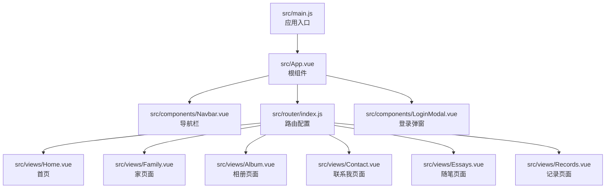
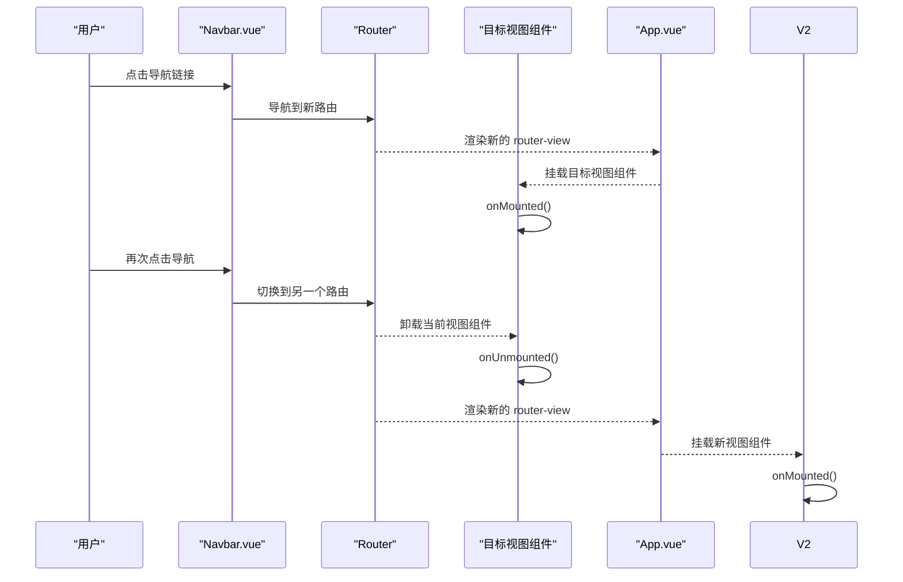
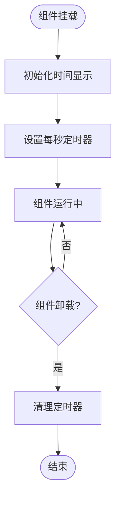
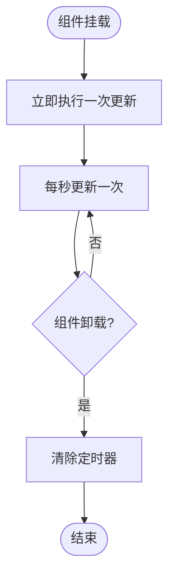
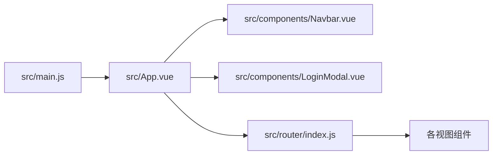

# 组件生命周期管理

<cite>
**本文引用的文件**
- [src/main.js](file://src/main.js)
- [src/App.vue](file://src/App.vue)
- [src/router/index.js](file://src/router/index.js)
- [src/components/Navbar.vue](file://src/components/Navbar.vue)
- [src/components/LoginModal.vue](file://src/components/LoginModal.vue)
- [src/views/Home.vue](file://src/views/Home.vue)
- [src/views/Family.vue](file://src/views/Family.vue)
- [src/views/Album.vue](file://src/views/Album.vue)
- [src/views/Contact.vue](file://src/views/Contact.vue)
- [src/views/Essays.vue](file://src/views/Essays.vue)
- [src/views/Records.vue](file://src/views/Records.vue)
</cite>

## 目录
1. [简介](#简介)
2. [项目结构](#项目结构)
3. [核心组件](#核心组件)
4. [架构总览](#架构总览)
5. [详细组件分析](#详细组件分析)
6. [依赖关系分析](#依赖关系分析)
7. [性能考量](#性能考量)
8. [故障排查指南](#故障排查指南)
9. [结论](#结论)
10. [附录](#附录)

## 简介
本文件围绕 Vue 3 Composition API 的组件生命周期管理进行系统性梳理，重点覆盖以下主题：
- 生命周期钩子 onMounted、onUnmounted、onUpdated 的使用场景与最佳实践
- 路由切换时组件的生命周期行为与 keep-alive 缓存策略
- 组件卸载时的清理工作（定时器、事件监听器、内存释放）
- 性能监控与调试技巧
- 常见陷阱与规避方法

## 项目结构
该博客项目采用单页应用（SPA）架构，基于 Vue 3 + Vue Router + Vite 构建。应用通过路由驱动视图切换，页面顶部导航组件负责路由跳转，全局登录弹窗通过事件在父组件中控制显示。

图表来源
- [src/main.js:1-8](file://src/main.js#L1-L8)
- [src/App.vue:1-30](file://src/App.vue#L1-L30)
- [src/router/index.js:1-28](file://src/router/index.js#L1-L28)

章节来源
- [src/main.js:1-8](file://src/main.js#L1-L8)
- [src/App.vue:1-30](file://src/App.vue#L1-L30)
- [src/router/index.js:1-28](file://src/router/index.js#L1-L28)

## 核心组件
- 根组件 App.vue：承载导航、路由视图与登录弹窗，负责打开/关闭登录弹窗的状态传递。
- 导航组件 Navbar.vue：基于路由状态高亮当前激活项，并触发登录事件。
- 登录弹窗 LoginModal.vue：使用 Teleport 将模态框挂载至 body，支持点击遮罩关闭。
- 视图组件 Home.vue、Family.vue：均在 onMounted 中启动定时器，在 onUnmounted 中清理定时器，体现生命周期清理的典型实践。
- 其他视图组件（Album.vue、Contact.vue、Essays.vue、Records.vue）：以静态数据渲染为主，未显式使用生命周期钩子。

章节来源
- [src/App.vue:1-30](file://src/App.vue#L1-L30)
- [src/components/Navbar.vue:1-140](file://src/components/Navbar.vue#L1-L140)
- [src/components/LoginModal.vue:1-316](file://src/components/LoginModal.vue#L1-L316)
- [src/views/Home.vue:1-211](file://src/views/Home.vue#L1-L211)
- [src/views/Family.vue:1-309](file://src/views/Family.vue#L1-L309)
- [src/views/Album.vue:1-127](file://src/views/Album.vue#L1-L127)
- [src/views/Contact.vue:1-189](file://src/views/Contact.vue#L1-L189)
- [src/views/Essays.vue:1-195](file://src/views/Essays.vue#L1-L195)
- [src/views/Records.vue:1-100](file://src/views/Records.vue#L1-L100)

## 架构总览
下图展示从用户交互到组件生命周期执行的关键路径，以及路由切换对组件生命周期的影响。

图表来源
- [src/components/Navbar.vue:1-140](file://src/components/Navbar.vue#L1-L140)
- [src/router/index.js:1-28](file://src/router/index.js#L1-L28)
- [src/App.vue:1-30](file://src/App.vue#L1-L30)
- [src/views/Home.vue:1-211](file://src/views/Home.vue#L1-L211)
- [src/views/Family.vue:1-309](file://src/views/Family.vue#L1-L309)

## 详细组件分析

### 导航组件 Navbar.vue 的生命周期行为
- 使用路由状态判断当前激活项，避免在每次渲染时重复计算。
- 通过事件向上抛出打开登录按钮，不直接操作 DOM，符合组合式 API 的无副作用原则。
- 该组件未使用生命周期钩子，保持轻量与稳定。

章节来源
- [src/components/Navbar.vue:1-140](file://src/components/Navbar.vue#L1-L140)

### 登录弹窗 LoginModal.vue 的生命周期行为
- 使用 Teleport 将模态框挂载到 body，避免定位上下文受限。
- 通过属性 show 控制显示/隐藏，点击遮罩层关闭。
- 该组件未使用生命周期钩子，主要依赖属性与事件驱动。

章节来源
- [src/components/LoginModal.vue:1-316](file://src/components/LoginModal.vue#L1-L316)

### 首页视图 Home.vue 的生命周期管理
- 在 onMounted 中初始化时间显示并启动每秒更新的定时器。
- 在 onUnmounted 中清理定时器，防止内存泄漏与重复计时。
- 该模式是“定时器类副作用”的标准生命周期清理范式。

图表来源
- [src/views/Home.vue:1-211](file://src/views/Home.vue#L1-L211)

章节来源
- [src/views/Home.vue:1-211](file://src/views/Home.vue#L1-L211)

### 家页面 Family.vue 的生命周期管理
- 同样在 onMounted 中启动定时器，周期性更新纪念日与新年倒计时。
- 在 onUnmounted 中清理定时器，确保组件销毁后不再产生副作用。
- 该组件展示了复杂业务逻辑下的定时器管理，需严格遵循“谁创建谁清理”。

图表来源
- [src/views/Family.vue:1-309](file://src/views/Family.vue#L1-L309)

章节来源
- [src/views/Family.vue:1-309](file://src/views/Family.vue#L1-L309)

### 其他视图组件的生命周期现状
- Album.vue、Contact.vue、Essays.vue、Records.vue 以静态数据渲染为主，未使用生命周期钩子。
- 若后续引入外部资源（如图片懒加载、窗口尺寸监听、WebSocket 等），应在 onMounted 中注册并在 onUnmounted 中清理。

章节来源
- [src/views/Album.vue:1-127](file://src/views/Album.vue#L1-L127)
- [src/views/Contact.vue:1-189](file://src/views/Contact.vue#L1-L189)
- [src/views/Essays.vue:1-195](file://src/views/Essays.vue#L1-L195)
- [src/views/Records.vue:1-100](file://src/views/Records.vue#L1-L100)

## 依赖关系分析
- 应用入口 main.js 创建应用实例并安装路由插件，随后挂载根组件。
- 根组件 App.vue 作为容器，包含导航、路由视图与登录弹窗。
- 路由模块 router/index.js 定义各视图组件，驱动视图切换。
- 导航组件 Navbar.vue 与路由状态联动；登录弹窗 LoginModal.vue 通过事件与 App.vue 状态协同。

图表来源
- [src/main.js:1-8](file://src/main.js#L1-L8)
- [src/App.vue:1-30](file://src/App.vue#L1-L30)
- [src/router/index.js:1-28](file://src/router/index.js#L1-L28)

章节来源
- [src/main.js:1-8](file://src/main.js#L1-L8)
- [src/App.vue:1-30](file://src/App.vue#L1-L30)
- [src/router/index.js:1-28](file://src/router/index.js#L1-L28)

## 性能考量
- 定时器管理
  - 在 onMounted 中创建定时器，在 onUnmounted 中清理，避免重复计时与内存泄漏。
  - 对于高频更新（如每秒），应尽量减少不必要的重渲染，优先使用响应式数据的细粒度更新。
- 路由切换与 keep-alive
  - 当前项目未使用 keep-alive 缓存，因此每次路由切换都会重新挂载目标视图组件，触发 onMounted 并卸载旧组件触发 onUnmounted。
  - 若未来引入 keep-alive，可将频繁切换的视图包裹缓存，以减少重复挂载/卸载带来的开销。
- 事件监听器
  - 如需在组件内绑定 window 或 document 事件，务必在 onUnmounted 中解绑，避免悬挂监听器导致内存泄漏。
- 渲染优化
  - 对于大量列表渲染的视图，建议使用虚拟滚动或分页策略，降低单次渲染压力。
- 资源释放
  - 图片、Canvas、WebGL 等资源应在卸载时主动释放，避免浏览器无法及时回收。

## 故障排查指南
- 症状：页面切换后定时器仍在运行，出现重复更新或内存占用持续上升
  - 排查：确认是否在 onUnmounted 中清理定时器；检查是否存在多个定时器未被统一管理。
  - 参考实现位置
    - [src/views/Home.vue:1-211](file://src/views/Home.vue#L1-L211)
    - [src/views/Family.vue:1-309](file://src/views/Family.vue#L1-L309)
- 症状：切换路由后组件未正确卸载，出现视觉残留或交互异常
  - 排查：确认路由视图是否被正确替换；若使用了 keep-alive，请检查 include/exclude 配置。
  - 参考实现位置
    - [src/router/index.js:1-28](file://src/router/index.js#L1-L28)
    - [src/App.vue:1-30](file://src/App.vue#L1-L30)
- 症状：登录弹窗无法关闭或遮罩点击无效
  - 排查：检查 LoginModal 的点击遮罩逻辑与 Teleport 的挂载目标；确认事件冒泡与条件渲染。
  - 参考实现位置
    - [src/components/LoginModal.vue:1-316](file://src/components/LoginModal.vue#L1-L316)
- 症状：导航高亮状态不准确
  - 排查：确认 Navbar 是否使用路由状态判断激活项；避免在模板中重复计算。
  - 参考实现位置
    - [src/components/Navbar.vue:1-140](file://src/components/Navbar.vue#L1-L140)

## 结论
- 本项目在需要定时器的视图组件中正确使用了生命周期钩子进行资源管理，体现了良好的工程实践。
- 路由切换时组件按预期挂载/卸载，未发现明显的生命周期泄漏问题。
- 建议后续在可能引入 keep-alive 的场景中，明确缓存策略与清理边界；对所有外部副作用（事件监听、定时器、订阅）统一在 onUnmounted 中清理。
- 对于后续扩展（如图片懒加载、窗口尺寸监听、WebSocket 等），请遵循“谁创建谁清理”的原则，确保组件生命周期内的资源可控与可回收。

## 附录
- 生命周期钩子最佳实践清单
  - 在 onMounted 中创建外部副作用（定时器、事件监听、订阅）
  - 在 onUnmounted 中清理对应副作用，确保幂等
  - 对于 keep-alive 场景，必要时使用 activated/deactivated 辅助缓存感知
  - 避免在模板中执行副作用逻辑，保持模板纯函数式
  - 对高频更新的数据进行节流/防抖，减少渲染压力
- 调试技巧
  - 使用浏览器开发者工具的 Performance 面板观察定时器与渲染开销
  - 使用 Memory 面板检测内存泄漏迹象
  - 在关键生命周期钩子中添加日志，追踪组件挂载/卸载时机