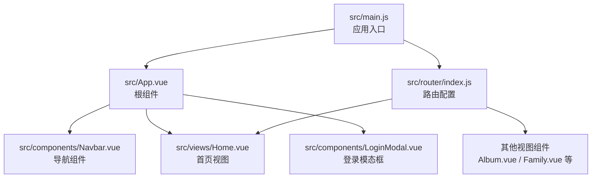
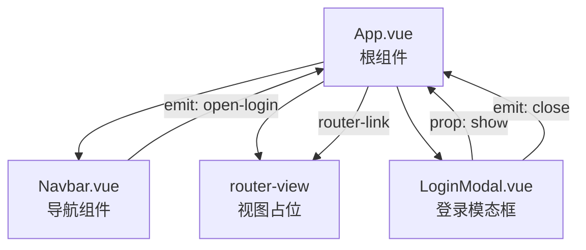
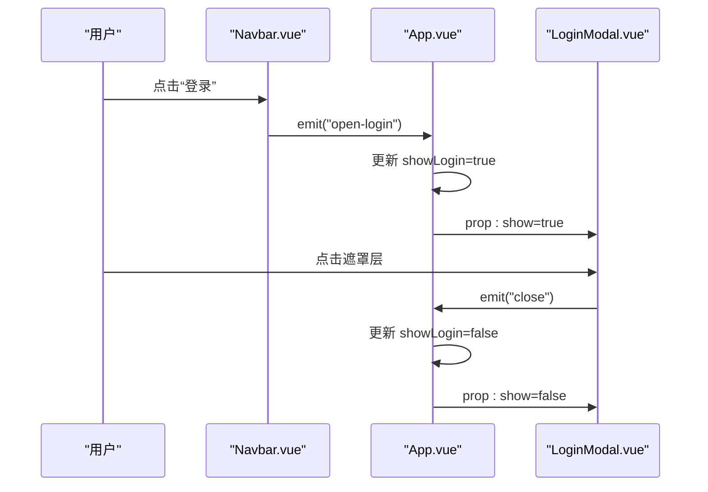
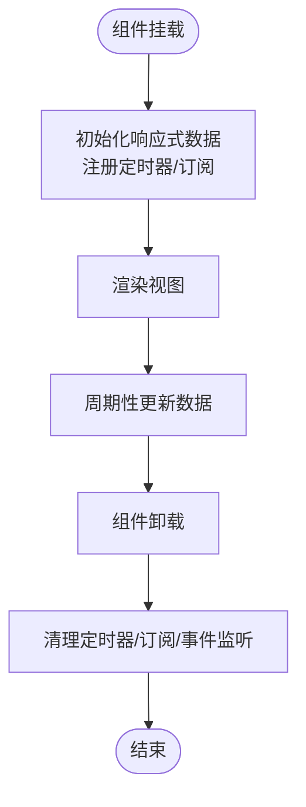
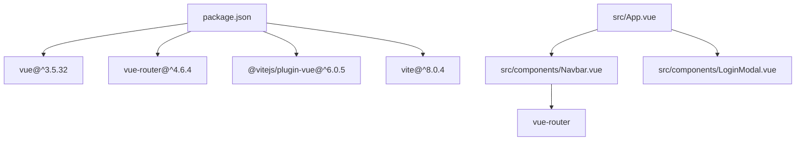

# 组件系统架构

<cite>
**本文档引用的文件**
- [src/App.vue](file://src/App.vue)
- [src/main.js](file://src/main.js)
- [src/components/Navbar.vue](file://src/components/Navbar.vue)
- [src/components/LoginModal.vue](file://src/components/LoginModal.vue)
- [src/components/HelloWorld.vue](file://src/components/HelloWorld.vue)
- [src/router/index.js](file://src/router/index.js)
- [src/views/Home.vue](file://src/views/Home.vue)
- [src/views/Album.vue](file://src/views/Album.vue)
- [src/views/Family.vue](file://src/views/Family.vue)
- [src/style.css](file://src/style.css)
- [package.json](file://package.json)
- [README.md](file://README.md)
</cite>

## 目录
1. [简介](#简介)
2. [项目结构](#项目结构)
3. [核心组件](#核心组件)
4. [架构总览](#架构总览)
5. [详细组件分析](#详细组件分析)
6. [依赖关系分析](#依赖关系分析)
7. [性能考虑](#性能考虑)
8. [故障排查指南](#故障排查指南)
9. [结论](#结论)
10. [附录](#附录)

## 简介
本项目采用 Vue 3 + Vite 技术栈构建，遵循组件化设计理念，通过清晰的职责分离与可复用性设计，实现导航栏、登录模态框等通用组件与页面视图的解耦组合。组件系统以 App 根组件为核心，通过路由驱动的视图切换与事件驱动的父子通信机制，形成稳定的组件树结构。同时，项目充分利用 Vue 3 的 Composition API、单文件组件（SFC）与样式作用域（scoped），确保组件接口简洁、样式隔离有效，并提供良好的开发体验与扩展空间。

## 项目结构
项目采用按功能模块划分的目录组织方式：
- src/components：通用业务组件（如导航栏、登录模态框）
- src/views：页面级视图组件（路由对应页面）
- src/router：路由配置与导航
- src/assets：静态资源（图片、图标等）
- src/style.css：全局基础样式
- src/main.js：应用入口，挂载根组件并注册路由
- src/App.vue：根组件，负责顶层布局与跨组件通信

图表来源
- [src/main.js:1-9](file://src/main.js#L1-L9)
- [src/App.vue:1-30](file://src/App.vue#L1-L30)
- [src/router/index.js:1-28](file://src/router/index.js#L1-L28)

章节来源
- [src/main.js:1-9](file://src/main.js#L1-L9)
- [src/App.vue:1-30](file://src/App.vue#L1-L30)
- [src/router/index.js:1-28](file://src/router/index.js#L1-L28)

## 核心组件
本节聚焦于项目中的关键组件及其职责边界与交互方式。

- 根组件 App
  - 职责：统一布局容器，协调导航与登录模态框的显示状态；通过事件与 props 实现父子通信。
  - 关键点：维护 showLogin 状态，向上抛出 open-login 事件，向下传递 show 属性给模态框，监听模态框关闭事件更新状态。
  
- 导航组件 Navbar
  - 职责：展示站点品牌、主导航菜单与登录按钮；根据当前路由高亮选中项；向外发出 open-login 事件。
  - 关键点：使用 vue-router 的 useRoute 获取当前路径；通过 defineEmits 声明事件；模板中使用 v-for 渲染导航项。
  
- 登录模态框 LoginModal
  - 职责：提供登录/注册表单，支持点击遮罩层关闭；通过 Teleport 将内容渲染至 body，避免层级问题。
  - 关键点：defineProps 接收 show 布尔值；定义 close 事件；使用 Transition 实现淡入淡出与缩放动画；handleOverlayClick 支持外部点击关闭。
  
- 首页视图 Home
  - 职责：展示时间、日期与快捷入口；演示生命周期钩子 onMounted/onUnmounted 的使用与定时器清理。
  - 关键点：ref 响应式数据管理时间显示；定时器每秒更新；在卸载阶段清理定时器，防止内存泄漏。
  
- 相册视图 Album 与 家庭视图 Family
  - 职责：相册视图展示相册卡片网格；家庭视图展示纪念日计时与动态效果。
  - 关键点：Album 使用 v-for 渲染相册列表；Family 使用 onMounted/onUnmounted 管理计时器，计算并展示时间差。

章节来源
- [src/App.vue:1-30](file://src/App.vue#L1-L30)
- [src/components/Navbar.vue:1-140](file://src/components/Navbar.vue#L1-L140)
- [src/components/LoginModal.vue:1-316](file://src/components/LoginModal.vue#L1-L316)
- [src/views/Home.vue:1-211](file://src/views/Home.vue#L1-L211)
- [src/views/Album.vue:1-127](file://src/views/Album.vue#L1-L127)
- [src/views/Family.vue:1-309](file://src/views/Family.vue#L1-L309)

## 架构总览
下图展示了组件树结构与数据/事件流：

图表来源
- [src/App.vue:17-23](file://src/App.vue#L17-L23)
- [src/components/Navbar.vue:6-25](file://src/components/Navbar.vue#L6-L25)
- [src/components/LoginModal.vue:4-16](file://src/components/LoginModal.vue#L4-L16)

## 详细组件分析

### 组件树与职责分离
- 组件树自上而下：App 作为容器，包含 Navbar、router-view、LoginModal；Navbar 与 LoginModal 互不直接依赖，通过 App 协调。
- 职责分离：
  - Navbar 仅负责导航与登录触发，不关心登录逻辑与状态。
  - LoginModal 仅负责 UI 与交互，不关心路由或父组件状态。
  - App 负责状态管理与事件编排，体现“自上而下数据流、自下而上事件流”的设计原则。

章节来源
- [src/App.vue:1-30](file://src/App.vue#L1-L30)
- [src/components/Navbar.vue:1-140](file://src/components/Navbar.vue#L1-L140)
- [src/components/LoginModal.vue:1-316](file://src/components/LoginModal.vue#L1-L316)

### 父子组件通信机制
- Props 传递
  - App 向 LoginModal 传递布尔值 show 控制显示/隐藏。
  - Navbar 不接收外部 props，但内部使用路由信息进行高亮判断。
- Events 触发
  - Navbar 通过 emit('open-login') 向父组件请求打开登录。
  - LoginModal 通过 emit('close') 通知父组件关闭自身。
- provide/inject
  - 当前代码未使用 provide/inject，建议在深层嵌套或跨层级共享配置时引入，以减少多级 props 传递。

图表来源
- [src/components/Navbar.vue:23-25](file://src/components/Navbar.vue#L23-L25)
- [src/App.vue:8-14](file://src/App.vue#L8-L14)
- [src/components/LoginModal.vue:14-16](file://src/components/LoginModal.vue#L14-L16)

章节来源
- [src/components/Navbar.vue:1-140](file://src/components/Navbar.vue#L1-L140)
- [src/App.vue:1-30](file://src/App.vue#L1-L30)
- [src/components/LoginModal.vue:1-316](file://src/components/LoginModal.vue#L1-L316)

### 生命周期钩子使用场景与最佳实践
- onMounted
  - 在 Home.vue 中初始化时间显示并启动定时器。
  - 在 Family.vue 中初始化纪念日计时并启动定时器。
- onUnmounted
  - 清理定时器，避免内存泄漏与重复计时。
- 最佳实践
  - 所有副作用（定时器、订阅、DOM 事件监听）均应在 onMounted 中注册，在 onUnmounted 中清理。
  - 对于需要在组件卸载后仍保持运行的任务，应使用更合适的调度策略或服务层。

图表来源
- [src/views/Home.vue:29-36](file://src/views/Home.vue#L29-L36)
- [src/views/Family.vue:48-55](file://src/views/Family.vue#L48-L55)

章节来源
- [src/views/Home.vue:1-211](file://src/views/Home.vue#L1-L211)
- [src/views/Family.vue:1-309](file://src/views/Family.vue#L1-L309)

### 组件封装原则、接口设计与样式隔离
- 封装原则
  - 单一职责：Navbar 专注导航与登录触发；LoginModal 专注登录/注册 UI 与交互。
  - 可复用性：LoginModal 通过 props 控制显示，适合在不同页面复用；Navbar 通过路由高亮自动适配当前页面。
- 接口设计
  - LoginModal 暴露 show 属性与 close 事件，接口简洁明确。
  - Navbar 通过 open-login 事件向上传递行为意图，不暴露内部状态。
- 样式隔离
  - 所有组件使用 scoped 样式，避免样式污染。
  - App.vue 使用全局样式控制最小高度与滚动行为，保证页面整体一致性。

章节来源
- [src/components/LoginModal.vue:1-316](file://src/components/LoginModal.vue#L1-L316)
- [src/components/Navbar.vue:1-140](file://src/components/Navbar.vue#L1-L140)
- [src/App.vue:25-29](file://src/App.vue#L25-L29)
- [src/style.css:1-56](file://src/style.css#L1-L56)

### 设计模式与复用策略
- 模态框模式
  - LoginModal 使用 Teleport 将内容渲染到 body，避免定位与层级问题；结合 Transition 实现平滑动画。
- 列表渲染模式
  - Album.vue 使用 v-for 渲染相册卡片，统一卡片结构与悬停效果，便于扩展更多字段。
- 计时器模式
  - Home.vue 与 Family.vue 在 onMounted 注册定时器，在 onUnmounted 清理，确保生命周期内资源正确释放。
- 复用策略
  - Navbar 通过路由高亮自动适配新页面；LoginModal 通过 props 控制显示，可在多个页面复用。
  - HelloWorld.vue 作为示例组件，展示资源引用与简单交互，可作为新组件开发的参考模板。

章节来源
- [src/components/LoginModal.vue:36-102](file://src/components/LoginModal.vue#L36-L102)
- [src/views/Album.vue:21-32](file://src/views/Album.vue#L21-L32)
- [src/views/Home.vue:29-36](file://src/views/Home.vue#L29-L36)
- [src/views/Family.vue:48-55](file://src/views/Family.vue#L48-L55)
- [src/components/HelloWorld.vue:1-94](file://src/components/HelloWorld.vue#L1-L94)

## 依赖关系分析
- 运行时依赖
  - Vue 3 与 vue-router 提供响应式与路由能力。
- 开发时依赖
  - @vitejs/plugin-vue 与 Vite 提供快速开发与热更新。
- 组件间依赖
  - App 依赖 Navbar 与 LoginModal；Navbar 依赖 vue-router；LoginModal 依赖 Vue 内置特性（Teleport、Transition）。

图表来源
- [package.json:11-18](file://package.json#L11-L18)
- [src/App.vue:3-4](file://src/App.vue#L3-L4)
- [src/components/Navbar.vue:3](file://src/components/Navbar.vue#L3)

章节来源
- [package.json:1-20](file://package.json#L1-L20)
- [src/App.vue:1-30](file://src/App.vue#L1-L30)
- [src/components/Navbar.vue:1-140](file://src/components/Navbar.vue#L1-L140)
- [src/components/LoginModal.vue:1-316](file://src/components/LoginModal.vue#L1-L316)

## 性能考虑
- 渲染优化
  - 使用 v-for 时提供稳定 key，避免不必要的重渲染（如 Navbar 与 Album 的 key 均基于唯一标识）。
  - 列表项使用 scoped 样式，避免全局样式影响渲染性能。
- 动画与过渡
  - LoginModal 使用 Transition 与 Teleport，减少 DOM 层级复杂度；注意过渡类名与样式需与组件一致。
- 生命周期与资源管理
  - 在 onUnmounted 中清理定时器与订阅，避免内存泄漏与重复计时。
- 资源加载
  - 图片使用懒加载与合适的尺寸参数，减少首屏压力（可结合 IntersectionObserver 或 v-lazy 指令）。
- 调试技巧
  - 使用 Vue DevTools 观察组件树、响应式数据与事件流。
  - 在组件中添加必要的日志输出（如 LoginModal 的表单提交日志），便于定位问题。

章节来源
- [src/components/Navbar.vue:35-44](file://src/components/Navbar.vue#L35-L44)
- [src/views/Album.vue:21-32](file://src/views/Album.vue#L21-L32)
- [src/views/Home.vue:29-36](file://src/views/Home.vue#L29-L36)
- [src/views/Family.vue:48-55](file://src/views/Family.vue#L48-L55)
- [src/components/LoginModal.vue:22-26](file://src/components/LoginModal.vue#L22-L26)

## 故障排查指南
- 登录模态框无法关闭
  - 检查 handleOverlayClick 是否正确识别外部点击；确认 emit('close') 是否被父组件监听。
  - 确认 Teleport 是否成功挂载到 body，避免事件绑定异常。
- 导航高亮不生效
  - 检查 useRoute 返回的路径是否与导航项 path 匹配；确认 isActive 判断逻辑。
- 计时器未清理导致内存泄漏
  - 确保在 onUnmounted 中执行清理；检查定时器 ID 是否正确保存与清除。
- 样式冲突
  - 确认组件使用 scoped 样式；避免全局样式覆盖组件内部样式。
- 路由跳转无效
  - 检查 router-link 的 to 属性与路由配置是否一致；确认路由已正确注册。

章节来源
- [src/components/LoginModal.vue:28-32](file://src/components/LoginModal.vue#L28-L32)
- [src/components/Navbar.vue:19-21](file://src/components/Navbar.vue#L19-L21)
- [src/views/Home.vue:34-36](file://src/views/Home.vue#L34-L36)
- [src/views/Family.vue:53-55](file://src/views/Family.vue#L53-L55)
- [src/router/index.js:11-20](file://src/router/index.js#L11-L20)

## 结论
本项目通过清晰的组件职责划分与事件驱动的父子通信，实现了高内聚、低耦合的组件系统。配合生命周期钩子的最佳实践与样式作用域，确保了组件的可维护性与可扩展性。未来可在以下方面进一步增强：
- 引入 provide/inject 以简化深层组件通信；
- 将通用逻辑抽象为 Composables，提升复用性；
- 增加单元测试与端到端测试，保障组件稳定性；
- 优化图片与资源加载策略，提升首屏性能。

## 附录
- 快速开始
  - 安装依赖：npm install
  - 开发模式：npm run dev
  - 构建产物：npm run build
- 技术栈
  - Vue 3 + Vite + vue-router
  - 单文件组件（SFC）与 Composition API
  - scoped 样式与全局基础样式

章节来源
- [README.md:1-6](file://README.md#L1-L6)
- [package.json:6-10](file://package.json#L6-L10)