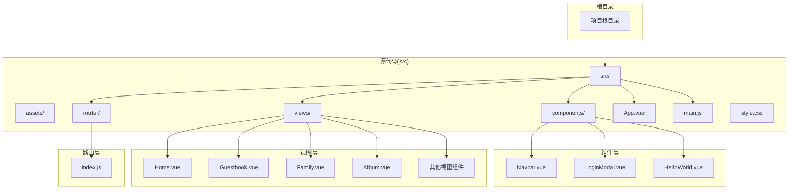
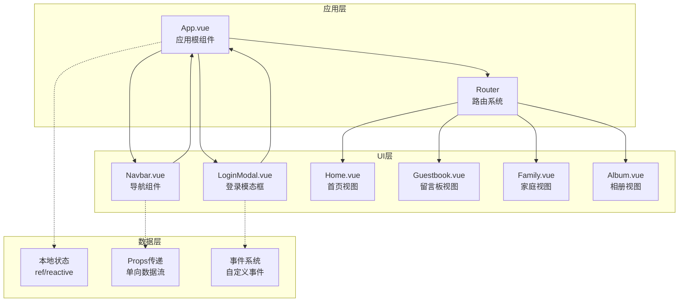
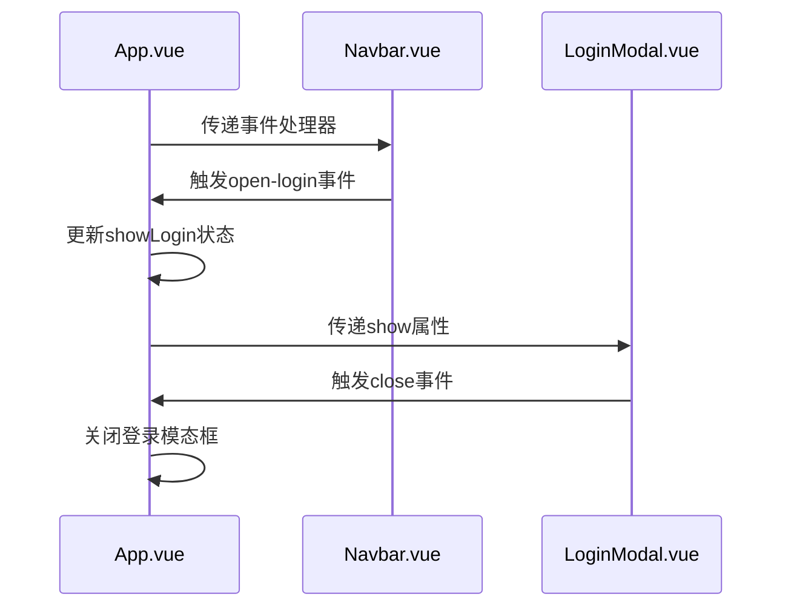
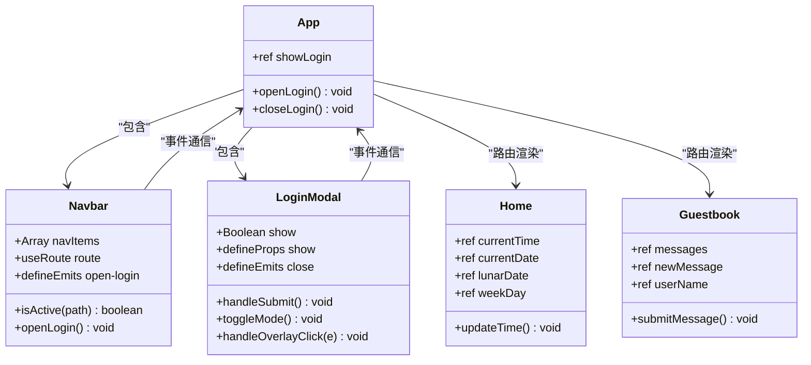
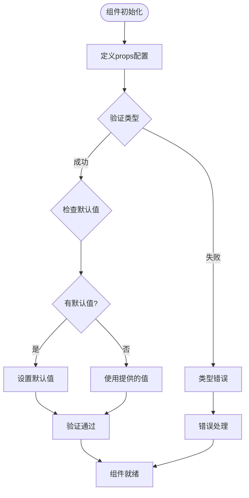
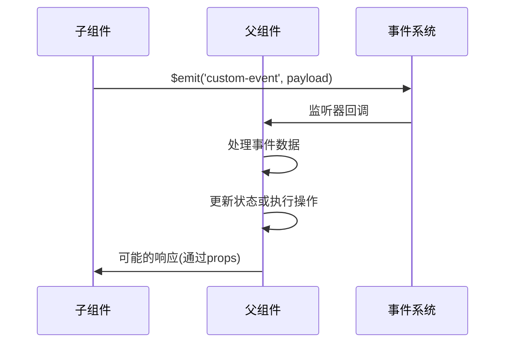
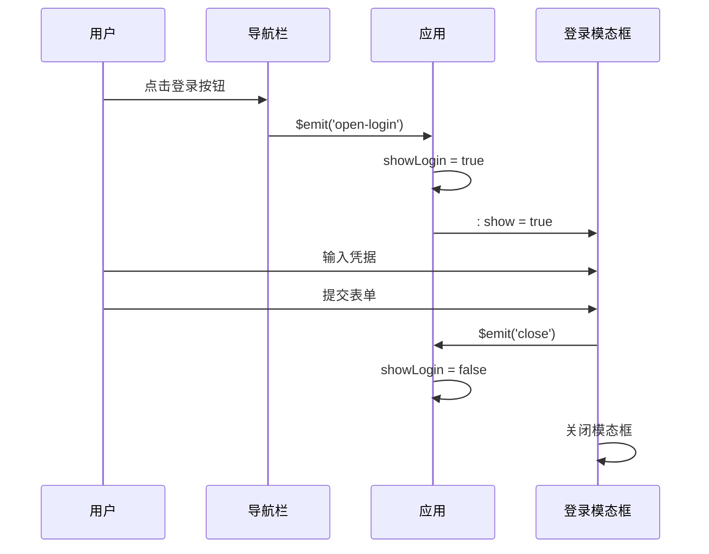
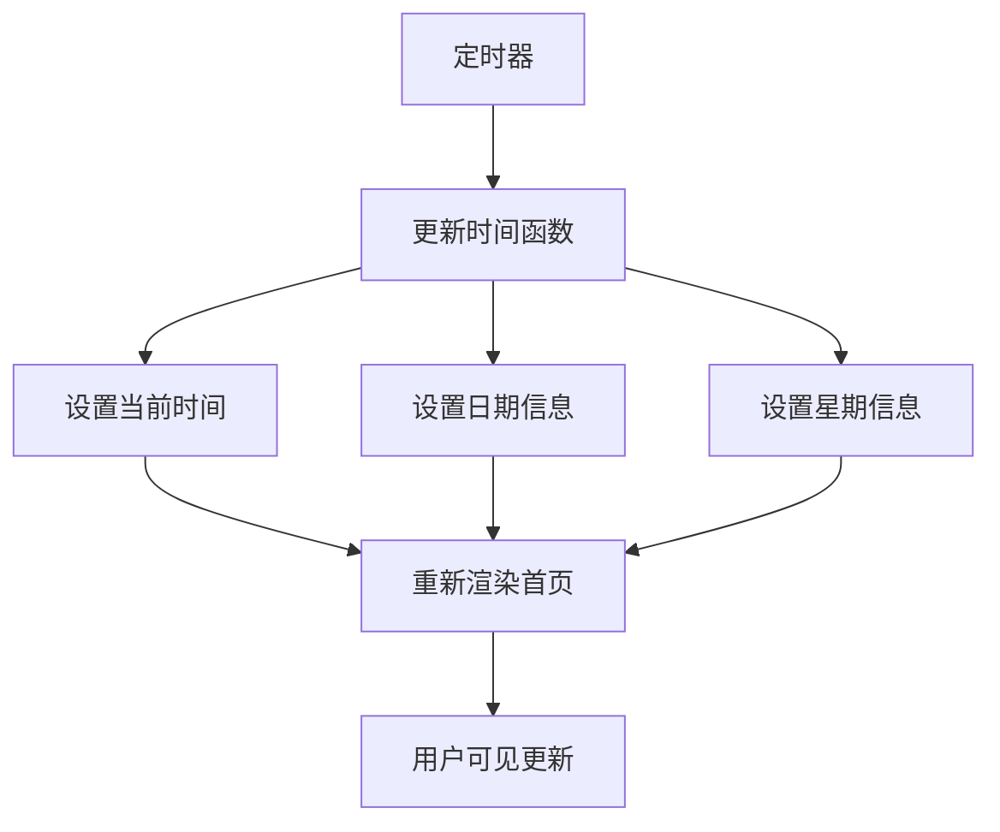

# 组件通信机制

<cite>
**本文档引用的文件**
- [src/App.vue](file://src/App.vue)
- [src/components/Navbar.vue](file://src/components/Navbar.vue)
- [src/components/LoginModal.vue](file://src/components/LoginModal.vue)
- [src/router/index.js](file://src/router/index.js)
- [src/main.js](file://src/main.js)
- [src/views/Home.vue](file://src/views/Home.vue)
- [src/views/Guestbook.vue](file://src/views/Guestbook.vue)
- [src/views/Family.vue](file://src/views/Family.vue)
- [src/views/Album.vue](file://src/views/Album.vue)
- [package.json](file://package.json)
</cite>

## 目录
1. [简介](#简介)
2. [项目结构](#项目结构)
3. [核心组件](#核心组件)
4. [架构概览](#架构概览)
5. [详细组件分析](#详细组件分析)
6. [依赖关系分析](#依赖关系分析)
7. [性能考虑](#性能考虑)
8. [故障排除指南](#故障排除指南)
9. [结论](#结论)

## 简介

本项目是一个基于Vue 3的博客应用，展示了现代前端应用中的多种组件通信模式。通过分析项目结构，我们可以看到该应用采用了清晰的组件层次结构，实现了从简单的props传递到复杂的事件系统，再到状态管理的完整通信体系。

该项目主要包含以下通信场景：
- 父子组件间的props数据传递
- 子组件向父组件的事件发射
- 路由驱动的页面导航
- 基于ref的本地状态管理

## 项目结构

项目采用标准的Vue 3单页应用结构，主要目录组织如下：



**图表来源**
- [src/App.vue:1-30](file://src/App.vue#L1-L30)
- [src/main.js:1-9](file://src/main.js#L1-L9)
- [src/router/index.js:1-28](file://src/router/index.js#L1-L28)

**章节来源**
- [src/App.vue:1-30](file://src/App.vue#L1-L30)
- [src/main.js:1-9](file://src/main.js#L1-L9)
- [src/router/index.js:1-28](file://src/router/index.js#L1-L28)

## 核心组件

项目的核心组件包括导航栏、登录模态框以及多个功能视图组件。这些组件构成了应用的主要通信节点。

### 主要组件职责

| 组件名称 | 主要职责 | 通信特点 |
|---------|----------|----------|
| App.vue | 应用根组件，状态管理中心 | 管理登录状态，协调子组件 |
| Navbar.vue | 导航栏组件 | 接收事件，触发登录请求 |
| LoginModal.vue | 登录模态框 | 接收props，发射关闭事件 |
| Home.vue | 首页视图 | 展示时间信息，独立状态管理 |
| Guestbook.vue | 留言板视图 | 表单数据双向绑定 |

**章节来源**
- [src/App.vue:1-30](file://src/App.vue#L1-L30)
- [src/components/Navbar.vue:1-140](file://src/components/Navbar.vue#L1-L140)
- [src/components/LoginModal.vue:1-316](file://src/components/LoginModal.vue#L1-L316)
- [src/views/Home.vue:1-211](file://src/views/Home.vue#L1-L211)
- [src/views/Guestbook.vue:1-202](file://src/views/Guestbook.vue#L1-L202)

## 架构概览

应用的整体架构采用组件化设计，通过props和事件实现父子组件通信，通过路由实现页面级导航。



**图表来源**
- [src/App.vue:17-22](file://src/App.vue#L17-L22)
- [src/components/Navbar.vue:6-25](file://src/components/Navbar.vue#L6-L25)
- [src/components/LoginModal.vue:4-16](file://src/components/LoginModal.vue#L4-L16)

## 详细组件分析

### 父子组件通信模式

#### Props传递机制

项目中最典型的父子组件通信是App.vue与Navbar.vue、LoginModal.vue之间的数据传递。



**图表来源**
- [src/App.vue:18-21](file://src/App.vue#L18-L21)
- [src/components/Navbar.vue:6-25](file://src/components/Navbar.vue#L6-L25)
- [src/components/LoginModal.vue:4-16](file://src/components/LoginModal.vue#L4-L16)

#### 事件系统实现

组件间的事件通信通过Vue的事件系统实现，采用自定义事件的方式进行解耦。

**章节来源**
- [src/App.vue:8-14](file://src/App.vue#L8-L14)
- [src/components/Navbar.vue:23-25](file://src/components/Navbar.vue#L23-L25)
- [src/components/LoginModal.vue:14-16](file://src/components/LoginModal.vue#L14-L16)

### 组件类关系图



**图表来源**
- [src/App.vue:1-30](file://src/App.vue#L1-L30)
- [src/components/Navbar.vue:1-140](file://src/components/Navbar.vue#L1-L140)
- [src/components/LoginModal.vue:1-316](file://src/components/LoginModal.vue#L1-L316)
- [src/views/Home.vue:1-211](file://src/views/Home.vue#L1-L211)
- [src/views/Guestbook.vue:1-202](file://src/views/Guestbook.vue#L1-L202)

### Props类型验证和默认值处理

虽然当前项目中的props定义相对简单，但可以展示完整的props处理流程：



**图表来源**
- [src/components/LoginModal.vue:4-6](file://src/components/LoginModal.vue#L4-L6)
- [src/components/Navbar.vue:6](file://src/components/Navbar.vue#L6)

**章节来源**
- [src/components/LoginModal.vue:4-6](file://src/components/LoginModal.vue#L4-L6)

### 事件参数传递机制

组件间的事件传递支持自定义参数，实现复杂的数据交互：



**图表来源**
- [src/components/Navbar.vue:23-25](file://src/components/Navbar.vue#L23-L25)
- [src/components/LoginModal.vue:14-16](file://src/components/LoginModal.vue#L14-L16)

**章节来源**
- [src/components/Navbar.vue:23-25](file://src/components/Navbar.vue#L23-L25)
- [src/components/LoginModal.vue:14-16](file://src/components/LoginModal.vue#L14-L16)

### 状态共享策略

#### 本地状态管理

应用采用Vue 3的响应式系统进行本地状态管理，主要体现在App.vue中的登录状态控制：

**章节来源**
- [src/App.vue:6](file://src/App.vue#L6)

#### 路由驱动的状态共享

通过Vue Router实现页面级的状态共享和导航控制：

**章节来源**
- [src/router/index.js:11-20](file://src/router/index.js#L11-L20)

### 组件间通信场景示例

#### 场景一：登录状态控制



**图表来源**
- [src/components/Navbar.vue:47-49](file://src/components/Navbar.vue#L47-L49)
- [src/App.vue:18-21](file://src/App.vue#L18-L21)
- [src/components/LoginModal.vue:36-102](file://src/components/LoginModal.vue#L36-L102)

#### 场景二：动态内容更新



**图表来源**
- [src/views/Home.vue:9-36](file://src/views/Home.vue#L9-L36)

**章节来源**
- [src/views/Home.vue:9-36](file://src/views/Home.vue#L9-L36)

## 依赖关系分析

项目的技术栈和依赖关系如下：

```mermaid
graph TB
subgraph "运行时依赖"
Vue[Vue 3.5.32<br/>核心框架]
Router[Vue Router 4.6.4<br/>路由系统]
end
subgraph "开发工具"
Vite[Vite 8.0.4<br/>构建工具]
PluginVue[@vitejs/plugin-vue<br/>Vue插件]
end
subgraph "项目结构"
App[App.vue<br/>根组件]
Main[main.js<br/>入口文件]
RouterIndex[index.js<br/>路由配置]
end
Vue --> App
Router --> RouterIndex
Vite --> PluginVue
Main --> App
Main --> Router
```

**图表来源**
- [package.json:11-18](file://package.json#L11-L18)
- [src/main.js:1-9](file://src/main.js#L1-9)
- [src/router/index.js:1-28](file://src/router/index.js#L1-L28)

**章节来源**
- [package.json:11-18](file://package.json#L11-L18)
- [src/main.js:1-9](file://src/main.js#L1-L9)

## 性能考虑

### 通信性能优化

1. **事件防抖处理**：对于频繁触发的事件，可以考虑添加防抖机制
2. **组件懒加载**：对于大型组件，可以采用异步组件的方式延迟加载
3. **状态缓存**：对于计算密集型数据，可以考虑缓存计算结果
4. **虚拟滚动**：对于大量列表数据，可以采用虚拟滚动优化渲染性能

### 内存泄漏防护

1. **生命周期清理**：确保在组件卸载时清理定时器和事件监听器
2. **循环引用避免**：避免组件间的循环引用导致的内存泄漏
3. **事件监听器移除**：在适当的生命周期钩子中移除事件监听器

**章节来源**
- [src/views/Home.vue:29-36](file://src/views/Home.vue#L29-L36)
- [src/views/Family.vue:48-55](file://src/views/Family.vue#L48-L55)

## 故障排除指南

### 常见问题及解决方案

#### 事件未正确触发

**问题症状**：子组件无法向父组件发送事件
**可能原因**：
- 未正确定义事件发射器
- 事件名不匹配
- 事件监听器未正确绑定

**解决方案**：
1. 检查组件是否正确调用了事件发射器
2. 确认事件名的一致性
3. 验证模板中的事件绑定语法

#### Props类型不匹配

**问题症状**：props接收的数据类型不符合预期
**可能原因**：
- 传递的数据类型不正确
- 缺少必要的类型验证
- 默认值设置不当

**解决方案**：
1. 在组件中添加适当的类型验证
2. 设置合理的默认值
3. 使用Vue的类型检查工具

#### 状态更新不生效

**问题症状**：组件状态更新后界面未反映变化
**可能原因**：
- 使用了不可响应的数据类型
- 作用域不正确
- 响应式系统未正确初始化

**解决方案**：
1. 确保使用Vue的响应式API
2. 检查数据的作用域
3. 验证响应式系统的初始化

**章节来源**
- [src/components/Navbar.vue:6](file://src/components/Navbar.vue#L6)
- [src/components/LoginModal.vue:8](file://src/components/LoginModal.vue#L8)

## 结论

本Vue博客项目展示了现代前端应用中组件通信的最佳实践。通过合理的组件层次设计和清晰的通信协议，实现了高效、可维护的组件交互。

### 主要成就

1. **清晰的通信层次**：父子组件间的通信路径明确，职责分离良好
2. **事件驱动架构**：通过自定义事件实现松耦合的组件交互
3. **响应式状态管理**：利用Vue 3的响应式系统实现高效的状态更新
4. **路由集成**：通过Vue Router实现页面级的状态共享和导航控制

### 改进建议

1. **状态管理扩展**：对于更复杂的应用场景，可以考虑引入Pinia等专门的状态管理库
2. **类型安全**：可以考虑使用TypeScript增强类型安全性
3. **性能监控**：添加性能监控工具，持续优化组件通信效率
4. **测试覆盖**：增加组件通信相关的单元测试和集成测试

这个项目为理解Vue 3的组件通信机制提供了很好的实践案例，展示了从基础的props传递到复杂的事件系统的完整通信体系。