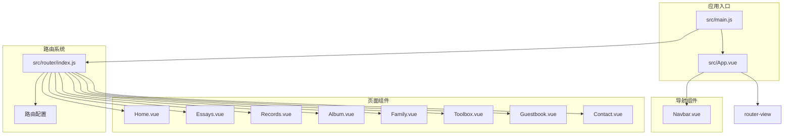
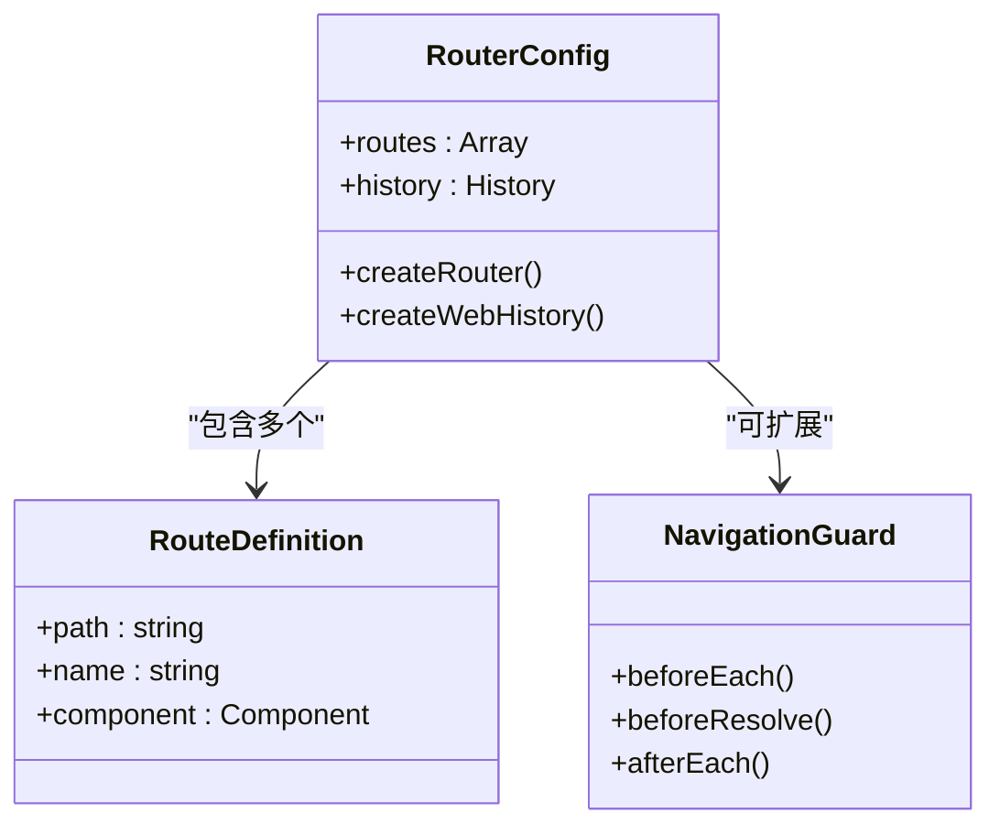
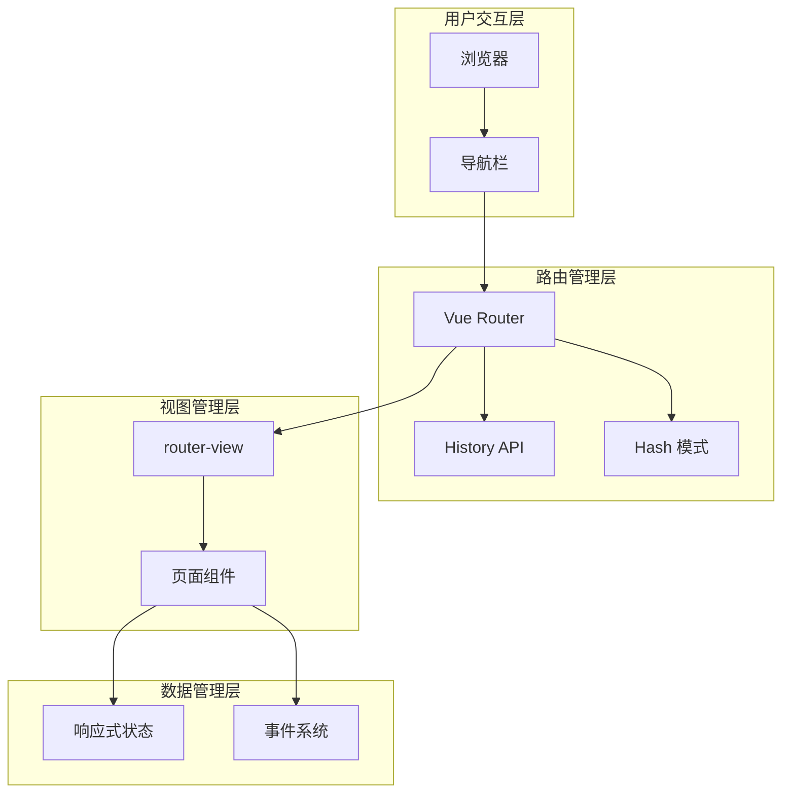
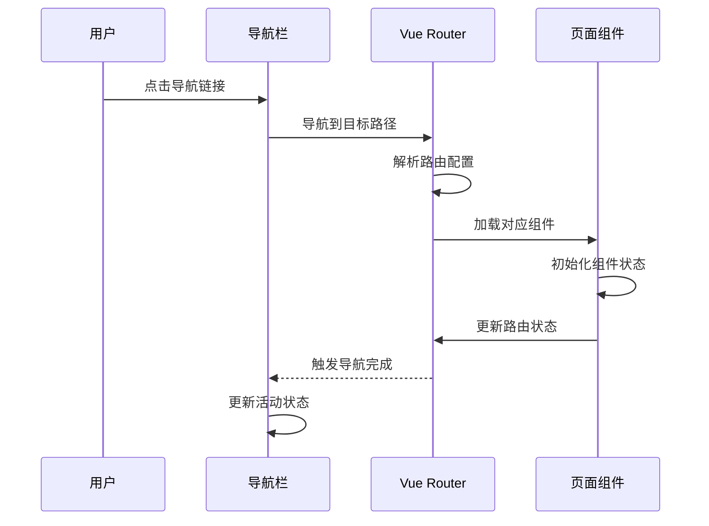
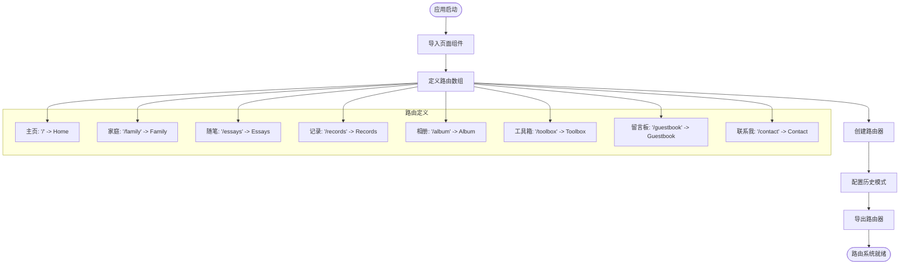

# 路由系统设计

<cite>
**本文档引用的文件**
- [src/router/index.js](file://src/router/index.js)
- [src/main.js](file://src/main.js)
- [src/App.vue](file://src/App.vue)
- [src/components/Navbar.vue](file://src/components/Navbar.vue)
- [src/views/Home.vue](file://src/views/Home.vue)
- [src/views/Essays.vue](file://src/views/Essays.vue)
- [src/views/Records.vue](file://src/views/Records.vue)
- [src/views/Album.vue](file://src/views/Album.vue)
- [package.json](file://package.json)
- [vite.config.js](file://vite.config.js)
</cite>

## 目录
1. [简介](#简介)
2. [项目结构](#项目结构)
3. [核心组件](#核心组件)
4. [架构概览](#架构概览)
5. [详细组件分析](#详细组件分析)
6. [依赖关系分析](#依赖关系分析)
7. [性能考虑](#性能考虑)
8. [故障排除指南](#故障排除指南)
9. [结论](#结论)

## 简介

本项目是一个基于Vue 3和Vue Router 4的单页应用(SPA)博客系统。该路由系统采用现代前端开发最佳实践，实现了完整的SPA导航机制，包括静态路由配置、程序化导航、路由守卫基础框架以及SEO优化支持。

项目使用Vite作为构建工具，通过Vue Router 4实现客户端路由管理，支持历史模式(History Mode)和哈希模式两种部署方式。路由系统为博客的各种功能模块提供了清晰的URL结构，包括主页、家庭、随笔、记录、相册、工具箱、留言板和联系方式等页面。

## 项目结构

该项目采用标准的Vue 3单页应用目录结构，路由系统主要集中在`src/router`目录下，配合`src/views`中的页面组件和`src/components`中的可复用组件。



**图表来源**
- [src/main.js:1-9](file://src/main.js#L1-L9)
- [src/router/index.js:1-28](file://src/router/index.js#L1-L28)
- [src/App.vue:17-23](file://src/App.vue#L17-L23)

**章节来源**
- [src/main.js:1-9](file://src/main.js#L1-L9)
- [src/router/index.js:1-28](file://src/router/index.js#L1-L28)
- [src/App.vue:1-30](file://src/App.vue#L1-L30)

## 核心组件

### 路由器配置

项目的核心路由配置位于`src/router/index.js`文件中，采用Vue Router 4的标准配置方式。路由器使用`createRouter`函数创建，并配置了历史模式(History Mode)用于生产环境部署。



**图表来源**
- [src/router/index.js:11-25](file://src/router/index.js#L11-L25)

### 应用主组件

`src/App.vue`作为应用的根组件，集成了导航栏和路由视图容器。该组件使用`router-view`指令来渲染当前激活的路由组件，并通过事件系统管理登录模态框的显示状态。

**章节来源**
- [src/App.vue:1-30](file://src/App.vue#L1-L30)
- [src/main.js:1-9](file://src/main.js#L1-L9)

## 架构概览

该路由系统采用经典的MVC架构模式，其中路由层负责URL解析和组件选择，视图层负责UI渲染，控制器层通过Vue组件的方法实现业务逻辑。



**图表来源**
- [src/router/index.js:22-25](file://src/router/index.js#L22-L25)
- [src/App.vue:20](file://src/App.vue#L20)

## 详细组件分析

### 导航栏组件分析

导航栏组件`src/components/Navbar.vue`是路由系统的重要组成部分，它展示了如何在Vue 3中使用`useRoute`组合式API来实现导航高亮效果。



**图表来源**
- [src/components/Navbar.vue:19-25](file://src/components/Navbar.vue#L19-L25)
- [src/components/Navbar.vue:35-44](file://src/components/Navbar.vue#L35-L44)

导航栏组件的关键特性包括：
- 使用`useRoute`获取当前路由信息
- 通过`isActive`方法实现导航高亮
- 集成`router-link`组件进行声明式导航
- 支持响应式布局适配

**章节来源**
- [src/components/Navbar.vue:1-140](file://src/components/Navbar.vue#L1-L140)

### 页面组件分析

项目包含多个页面组件，每个都展示了不同的路由使用场景：

#### 主页组件
主页组件`src/views/Home.vue`展示了如何在路由组件中使用生命周期钩子和响应式数据。

#### 随笔组件  
随笔组件`src/views/Essays.vue`演示了列表数据的展示和样式设计。

#### 记录组件
记录组件`src/views/Records.vue`展示了网格布局和卡片设计模式。

#### 相册组件
相册组件`src/views/Album.vue`实现了图片网格展示和悬停效果。

**章节来源**
- [src/views/Home.vue:1-211](file://src/views/Home.vue#L1-L211)
- [src/views/Essays.vue:1-195](file://src/views/Essays.vue#L1-L195)
- [src/views/Records.vue:1-100](file://src/views/Records.vue#L1-L100)
- [src/views/Album.vue:1-127](file://src/views/Album.vue#L1-L127)

### 路由配置分析

路由配置文件`src/router/index.js`定义了所有可用的路由路径和对应的组件映射。



**图表来源**
- [src/router/index.js:11-25](file://src/router/index.js#L11-L25)

**章节来源**
- [src/router/index.js:1-28](file://src/router/index.js#L1-L28)

## 依赖关系分析

项目对Vue Router 4的依赖关系清晰明确，版本要求为^4.6.4，确保了与Vue 3.5.32的兼容性。

```mermaid
graph LR
subgraph "运行时依赖"
Vue[Vue 3.5.32]
VueRouter[Vue Router 4.6.4]
end
subgraph "开发时依赖"
Vite[Vite 8.0.4]
VuePlugin[@vitejs/plugin-vue]
end
subgraph "应用代码"
MainJS[src/main.js]
RouterIndex[src/router/index.js]
AppVue[src/App.vue]
end
MainJS --> Vue
MainJS --> VueRouter
MainJS --> AppVue
MainJS --> RouterIndex
RouterIndex --> VueRouter
AppVue --> Vue
```

**图表来源**
- [package.json:11-18](file://package.json#L11-L18)
- [src/main.js:1-9](file://src/main.js#L1-L9)

**章节来源**
- [package.json:1-20](file://package.json#L1-L20)
- [src/main.js:1-9](file://src/main.js#L1-L9)

## 性能考虑

### 代码分割策略

虽然当前项目使用的是静态导入方式，但Vue Router 4天然支持代码分割。建议在生产环境中采用动态导入来实现懒加载：

```javascript
// 推荐的懒加载实现
const routes = [
  {
    path: '/',
    name: 'Home',
    component: () => import('../views/Home.vue')
  }
  // 其他路由...
]
```

### 路由缓存机制

对于频繁访问的页面，可以考虑实现路由级别的缓存策略，避免重复渲染导致的性能问题。

### SEO优化

项目已配置历史模式，适合生产环境部署。对于SEO优化，建议添加以下配置：

```javascript
const router = createRouter({
  history: createWebHistory(),
  routes,
  scrollBehavior(to, from, savedPosition) {
    // 恢复滚动位置
    if (savedPosition) {
      return savedPosition
    }
    // 新页面滚动到顶部
    return { top: 0 }
  }
})
```

## 故障排除指南

### 常见路由问题

1. **路由不生效**：检查路由是否正确注册到应用实例中
2. **导航高亮失效**：确认`useRoute`的使用和路径匹配规则
3. **页面刷新后404**：需要服务器配置支持HTML5 History模式

### 调试技巧

- 使用浏览器开发者工具的Vue DevTools监控路由状态
- 在路由配置中添加console.log输出调试信息
- 检查网络面板确认组件资源加载情况

**章节来源**
- [src/router/index.js:22-25](file://src/router/index.js#L22-L25)
- [src/components/Navbar.vue:19-21](file://src/components/Navbar.vue#L19-L21)

## 结论

该Vue博客项目的路由系统设计体现了现代前端开发的最佳实践。通过清晰的路由配置、合理的组件分离和完善的导航机制，为用户提供了流畅的单页应用体验。

系统的主要优势包括：
- 简洁明了的路由配置结构
- 完整的导航高亮功能
- 良好的响应式设计支持
- 可扩展的路由守卫框架
- 为未来功能扩展预留的空间

建议后续改进方向：
- 实现动态路由参数支持
- 添加路由守卫进行权限控制
- 优化代码分割策略提升性能
- 增强SEO优化配置
- 实现路由懒加载机制