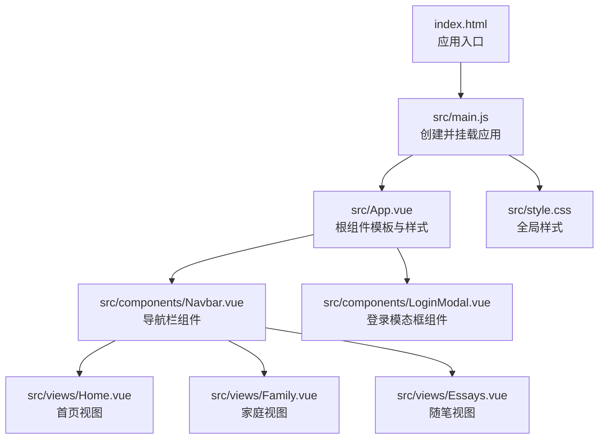
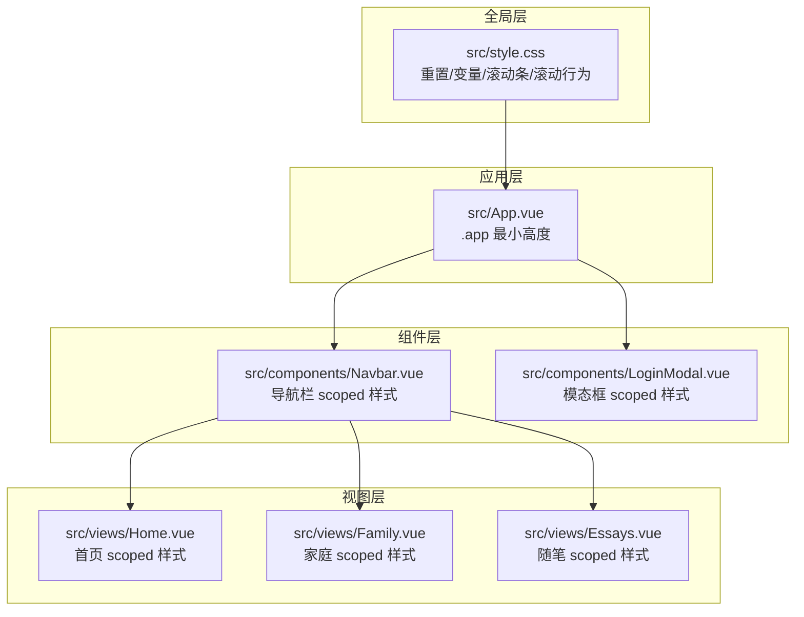
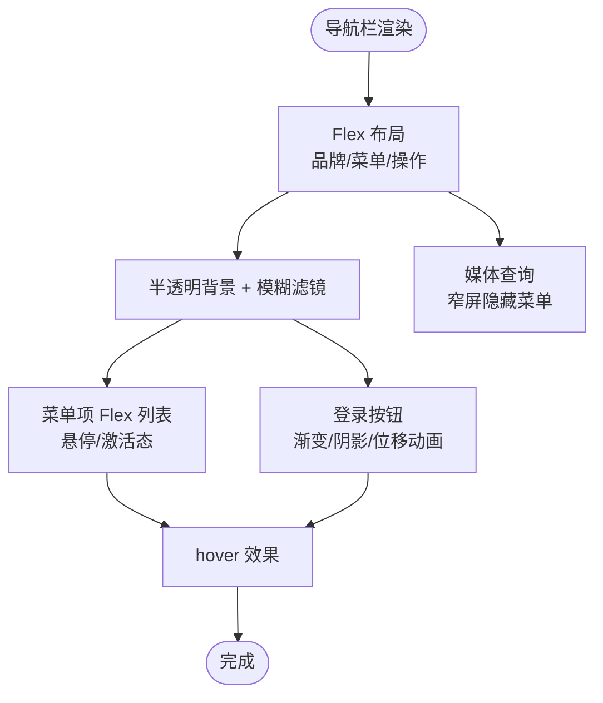
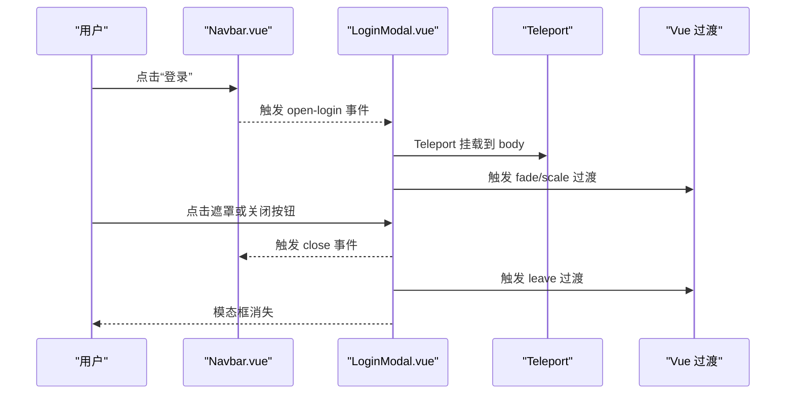
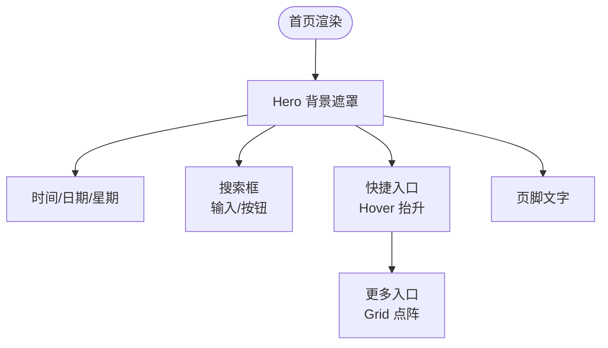
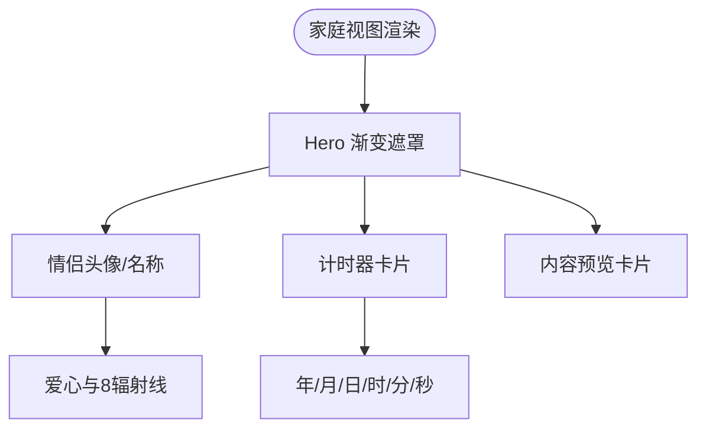
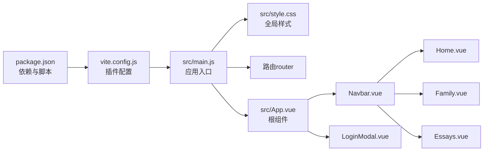

# 样式系统

<cite>
**本文引用的文件**
- [src/style.css](file://src/style.css)
- [src/main.js](file://src/main.js)
- [src/App.vue](file://src/App.vue)
- [src/components/Navbar.vue](file://src/components/Navbar.vue)
- [src/components/LoginModal.vue](file://src/components/LoginModal.vue)
- [src/views/Home.vue](file://src/views/Home.vue)
- [src/views/Family.vue](file://src/views/Family.vue)
- [src/views/Essays.vue](file://src/views/Essays.vue)
- [package.json](file://package.json)
- [vite.config.js](file://vite.config.js)
- [index.html](file://index.html)
</cite>

## 目录
1. [简介](#简介)
2. [项目结构](#项目结构)
3. [核心组件](#核心组件)
4. [架构总览](#架构总览)
5. [详细组件分析](#详细组件分析)
6. [依赖关系分析](#依赖关系分析)
7. [性能考量](#性能考量)
8. [故障排查指南](#故障排查指南)
9. [结论](#结论)
10. [附录](#附录)

## 简介
本项目采用 Vue 3 + Vite 的前端技术栈，样式系统以“全局基础样式 + 组件级样式隔离”为核心策略，结合 Flexbox、Grid、渐变与模糊背景等现代 CSS 技术，构建响应式与交互友好的界面。全局样式统一字体、滚动条与滚动行为；各页面与组件通过 scoped 样式实现样式隔离，避免冲突。同时，项目广泛使用过渡与变换实现动画与交互反馈。

## 项目结构
- 入口脚本负责挂载应用并引入全局样式。
- 全局样式集中于单一 CSS 文件，定义基础排版、滚动条与滚动行为。
- 页面与组件均采用单文件组件（SFC）形式，内部通过 scoped 样式实现样式隔离。
- 构建工具为 Vite，默认启用 Vue 插件，支持热更新与按需编译。

**图表来源**
- [index.html:1-14](file://index.html#L1-L14)
- [src/main.js:1-9](file://src/main.js#L1-L9)
- [src/App.vue:1-30](file://src/App.vue#L1-L30)
- [src/style.css:1-56](file://src/style.css#L1-L56)
- [src/components/Navbar.vue:1-140](file://src/components/Navbar.vue#L1-L140)
- [src/components/LoginModal.vue:1-316](file://src/components/LoginModal.vue#L1-L316)
- [src/views/Home.vue:1-211](file://src/views/Home.vue#L1-L211)
- [src/views/Family.vue:1-309](file://src/views/Family.vue#L1-L309)
- [src/views/Essays.vue:1-195](file://src/views/Essays.vue#L1-L195)

**章节来源**
- [index.html:1-14](file://index.html#L1-L14)
- [src/main.js:1-9](file://src/main.js#L1-L9)
- [src/style.css:1-56](file://src/style.css#L1-L56)

## 核心组件
- 全局样式层：重置默认内外边距、设置盒模型、根字体与滚动行为、自定义滚动条与选区颜色。
- 应用根组件：最小高度占满视口，作为页面容器的基础样式。
- 导航栏组件：固定定位、模糊背景、Flex 布局、悬停与激活态过渡。
- 登录模态框：Teleport 挂载至 body、双层过渡（淡入淡出与缩放）、Flex 分栏布局、输入框焦点态高亮。
- 首页视图：Hero 背景图与遮罩、居中布局、搜索框与快捷入口、Grid 快捷图标网格。
- 家庭视图：渐变遮罩、头像与爱心装饰、倒计时展示卡片。
- 随笔视图：卡片列表、作者信息与操作按钮、间距与阴影。

**章节来源**
- [src/style.css:1-56](file://src/style.css#L1-L56)
- [src/App.vue:25-29](file://src/App.vue#L25-L29)
- [src/components/Navbar.vue:53-139](file://src/components/Navbar.vue#L53-L139)
- [src/components/LoginModal.vue:105-315](file://src/components/LoginModal.vue#L105-L315)
- [src/views/Home.vue:79-210](file://src/views/Home.vue#L79-L210)
- [src/views/Family.vue:132-309](file://src/views/Family.vue#L132-L309)
- [src/views/Essays.vue:82-194](file://src/views/Essays.vue#L82-L194)

## 架构总览
样式系统遵循“全局基础 + 组件隔离”的分层设计：
- 全局层：统一字体、滚动条、滚动行为与基础尺寸约束。
- 组件层：每个组件独立管理自身样式，避免跨组件污染。
- 视图层：页面容器负责整体布局与背景，子元素通过 Flex/Grid 实现响应式排列。
- 动画层：基于过渡与变换实现弹窗、按钮、链接等交互反馈。

**图表来源**
- [src/style.css:1-56](file://src/style.css#L1-L56)
- [src/App.vue:25-29](file://src/App.vue#L25-L29)
- [src/components/Navbar.vue:53-139](file://src/components/Navbar.vue#L53-L139)
- [src/components/LoginModal.vue:105-315](file://src/components/LoginModal.vue#L105-L315)
- [src/views/Home.vue:79-210](file://src/views/Home.vue#L79-L210)
- [src/views/Family.vue:132-309](file://src/views/Family.vue#L132-L309)
- [src/views/Essays.vue:82-194](file://src/views/Essays.vue#L82-L194)

## 详细组件分析

### 全局样式与基础架构
- 选择器重置：统一 margin/padding，盒模型为 border-box，确保宽度计算一致。
- 根元素：设置系统字体链、行高、字重与文本渲染优化。
- 文档与容器：body 最小宽高约束，#app 占满视口，保证页面不塌陷。
- 自定义滚动条：Webkit 内核滚动条宽度、轨道与滑块样式，悬停加深色。
- 选区高亮：统一选区背景色提升可读性。
- 平滑滚动：html 层开启平滑滚动，改善用户体验。

**章节来源**
- [src/style.css:1-56](file://src/style.css#L1-L56)

### 根组件样式
- 根容器最小高度占满视口，确保页面内容从顶部开始渲染，避免空白区域。

**章节来源**
- [src/App.vue:25-29](file://src/App.vue#L25-L29)

### 导航栏组件（Navbar）
- 布局：固定定位 + Flex 布局，品牌区、菜单区、操作区三段式。
- 背景与模糊：半透明背景 + 模糊滤镜，适配不同背景图片。
- 菜单项：Flex 排列，悬停与激活态切换，圆角与过渡。
- 登录按钮：线性渐变背景、悬停位移与阴影，增强点击反馈。
- 响应式：在窄屏下隐藏菜单项，保留品牌与登录按钮。

**图表来源**
- [src/components/Navbar.vue:53-139](file://src/components/Navbar.vue#L53-L139)

**章节来源**
- [src/components/Navbar.vue:53-139](file://src/components/Navbar.vue#L53-L139)

### 登录模态框（LoginModal）
- 结构：Teleport 将模态框挂载至 body，双层 Transition 实现遮罩与容器的淡入淡出与缩放。
- 布局：左右两栏，左半部分背景图遮罩，右半部分表单区域，Flex 纵向堆叠。
- 表单：输入框底部边框过渡、聚焦高亮；选项链接与提交按钮渐变与阴影。
- 关闭：遮罩点击关闭，按钮悬浮反馈。
- 响应式：窄屏隐藏左侧背景，调整内边距。

**图表来源**
- [src/components/Navbar.vue:23-25](file://src/components/Navbar.vue#L23-L25)
- [src/components/LoginModal.vue:36-102](file://src/components/LoginModal.vue#L36-L102)
- [src/components/LoginModal.vue:284-314](file://src/components/LoginModal.vue#L284-L314)

**章节来源**
- [src/components/LoginModal.vue:105-315](file://src/components/LoginModal.vue#L105-L315)

### 首页视图（Home）
- 背景：全屏 Hero 区域，背景图覆盖 + 双重遮罩，文字反差突出。
- 时间与日期：大字号时间、小字号日期与星期，阴影增强可读性。
- 搜索框：半透明背景 + 模糊滤镜，输入框白色文字与占位符浅灰。
- 快捷入口：Flex 间距排列，Hover 抬升；更多入口使用 Grid 生成点阵图标。

**图表来源**
- [src/views/Home.vue:79-210](file://src/views/Home.vue#L79-L210)

**章节来源**
- [src/views/Home.vue:79-210](file://src/views/Home.vue#L79-L210)

### 家庭视图（Family）
- 背景：Hero 渐变遮罩 + 背景图，底部线性渐变过渡。
- 主体：三段式布局，头像、爱心与名称组合，爱心使用伪元素与多辐射线。
- 计数器：时间单位卡片，数字与标签分列，支持换行。
- 内容预览：卡片容器，图片裁剪与标题对齐。

**图表来源**
- [src/views/Family.vue:132-309](file://src/views/Family.vue#L132-L309)

**章节来源**
- [src/views/Family.vue:132-309](file://src/views/Family.vue#L132-L309)

### 随笔视图（Essays）
- 背景：页面级背景图 + 遮罩，卡片容器居中。
- 头部：用户头像与昵称，卡片背景半透明白。
- 卡片：作者头像、等级徽章、正文、底部操作区，悬停动作色变化。

**章节来源**
- [src/views/Essays.vue:82-194](file://src/views/Essays.vue#L82-L194)

## 依赖关系分析
- 构建与运行：Vite 提供开发服务器与打包能力，Vue 插件负责 SFC 编译与热更新。
- 运行时：应用通过 main.js 创建并挂载，引入全局样式与路由。
- 样式加载：全局样式在入口处引入，组件样式由各自 SFC 内部管理。

**图表来源**
- [package.json:1-20](file://package.json#L1-L20)
- [vite.config.js:1-8](file://vite.config.js#L1-L8)
- [src/main.js:1-9](file://src/main.js#L1-L9)
- [src/style.css:1-56](file://src/style.css#L1-L56)
- [src/App.vue:1-30](file://src/App.vue#L1-L30)
- [src/components/Navbar.vue:1-140](file://src/components/Navbar.vue#L1-L140)
- [src/components/LoginModal.vue:1-316](file://src/components/LoginModal.vue#L1-L316)
- [src/views/Home.vue:1-211](file://src/views/Home.vue#L1-L211)
- [src/views/Family.vue:1-309](file://src/views/Family.vue#L1-L309)
- [src/views/Essays.vue:1-195](file://src/views/Essays.vue#L1-L195)

**章节来源**
- [package.json:1-20](file://package.json#L1-L20)
- [vite.config.js:1-8](file://vite.config.js#L1-L8)
- [src/main.js:1-9](file://src/main.js#L1-L9)

## 性能考量
- 图片资源：使用 CDN 图片，注意懒加载与尺寸控制，避免阻塞主线程。
- 背景与模糊：Hero 背景与模糊滤镜在低端设备可能带来性能压力，建议在移动端适度降级。
- 过渡与动画：过渡时长与缓动函数应保持简洁，避免过多层级嵌套导致重绘开销。
- 字体与渲染：系统字体链与抗锯齿已优化，尽量减少自定义字体加载。
- 打包与缓存：利用 Vite 的代码分割与持久化缓存，减少重复下载。

## 故障排查指南
- 样式未生效
  - 检查组件是否使用 scoped 样式且类名匹配。
  - 确认全局样式已在入口正确引入。
- 滚动条样式无效
  - 确认浏览器支持 Webkit 滚动条伪元素。
- 模态框无法关闭
  - 检查 Teleport 是否正确挂载至 body，事件绑定是否触发。
- 响应式异常
  - 确认媒体查询断点与布局容器是否正确设置。

**章节来源**
- [src/style.css:28-55](file://src/style.css#L28-L55)
- [src/components/LoginModal.vue:36-102](file://src/components/LoginModal.vue#L36-L102)

## 结论
该样式系统以全局基础样式为骨架，以组件 scoped 样式为血肉，配合 Flexbox、Grid、渐变与过渡，实现了清晰的层次结构与良好的交互体验。通过合理的响应式策略与动画反馈，提升了视觉表现与可用性。建议在后续迭代中进一步沉淀通用组件样式规范，并关注性能与兼容性细节。

## 附录

### CSS 使用场景与实现要点
- Flexbox
  - 场景：居中布局、三段式导航、卡片纵向堆叠、快捷入口排列。
  - 要点：合理使用 gap 控制间距，align-items/justify-content 精准定位。
- CSS Grid
  - 场景：更多入口中的点阵图标网格。
  - 要点：grid-template-columns 与 gap 简化规则布局。
- 动画与过渡
  - 场景：模态框淡入淡出、缩放进入、按钮 hover 抬升与阴影。
  - 要点：过渡时长与缓动函数保持一致，避免过度动画影响性能。
- 主题与定制
  - 方案：在 :root 中集中管理色彩变量，组件内使用变量进行主题切换。
  - 注意：scoped 样式优先级高于全局，变量命名需避免冲突。

### 浏览器兼容性建议
- Webkit 滚动条：仅 Webkit 内核有效，非 Webkit 浏览器需降级处理。
- Backdrop-filter：部分旧版 Safari 存在兼容问题，建议提供降级方案。
- 渐变与模糊：现代浏览器支持良好，注意在低端设备上的性能评估。