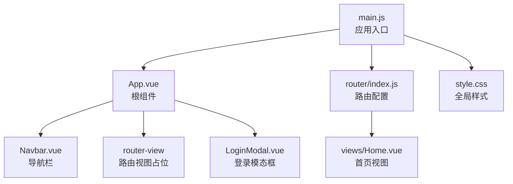
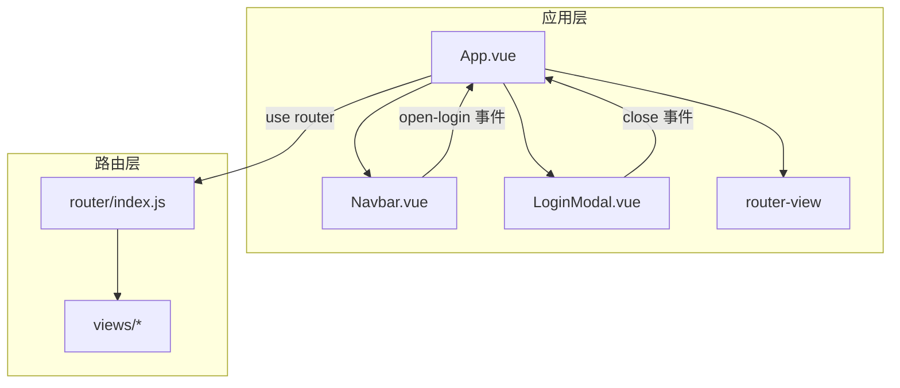
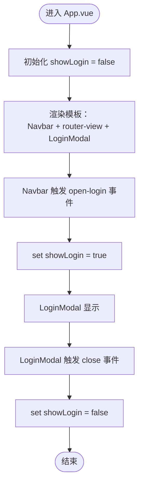
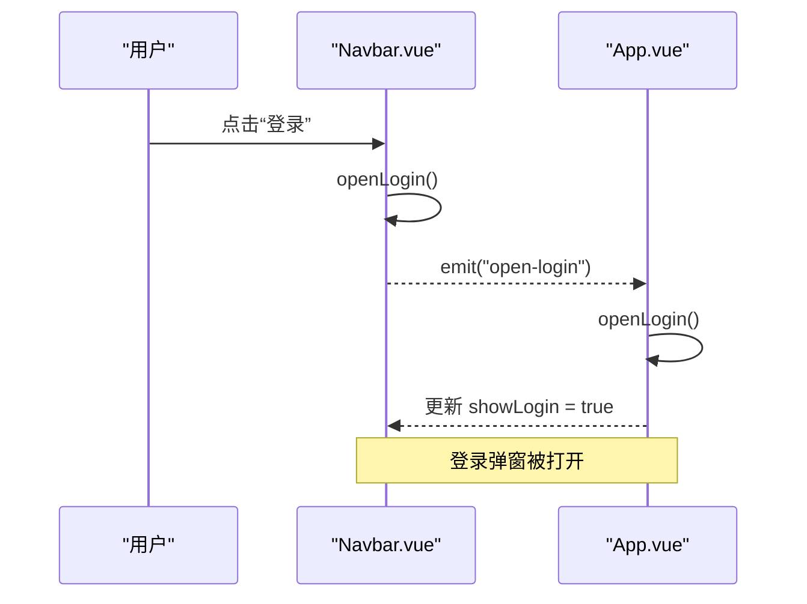
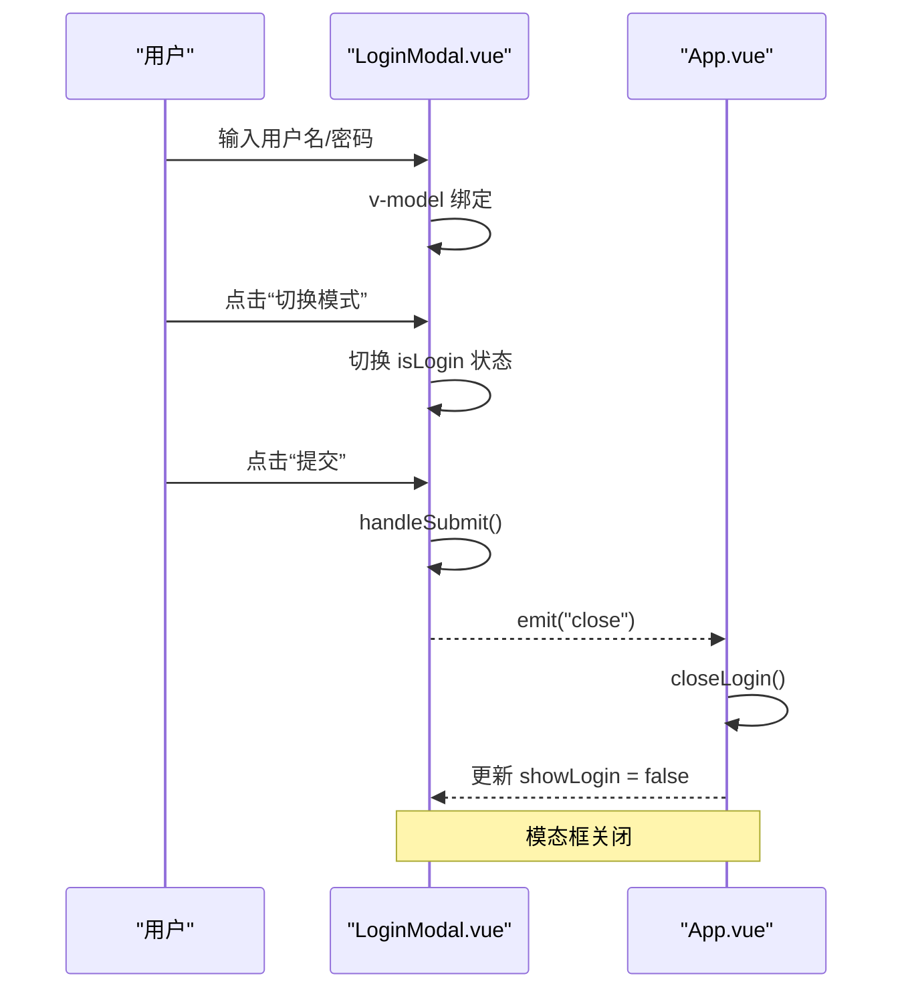
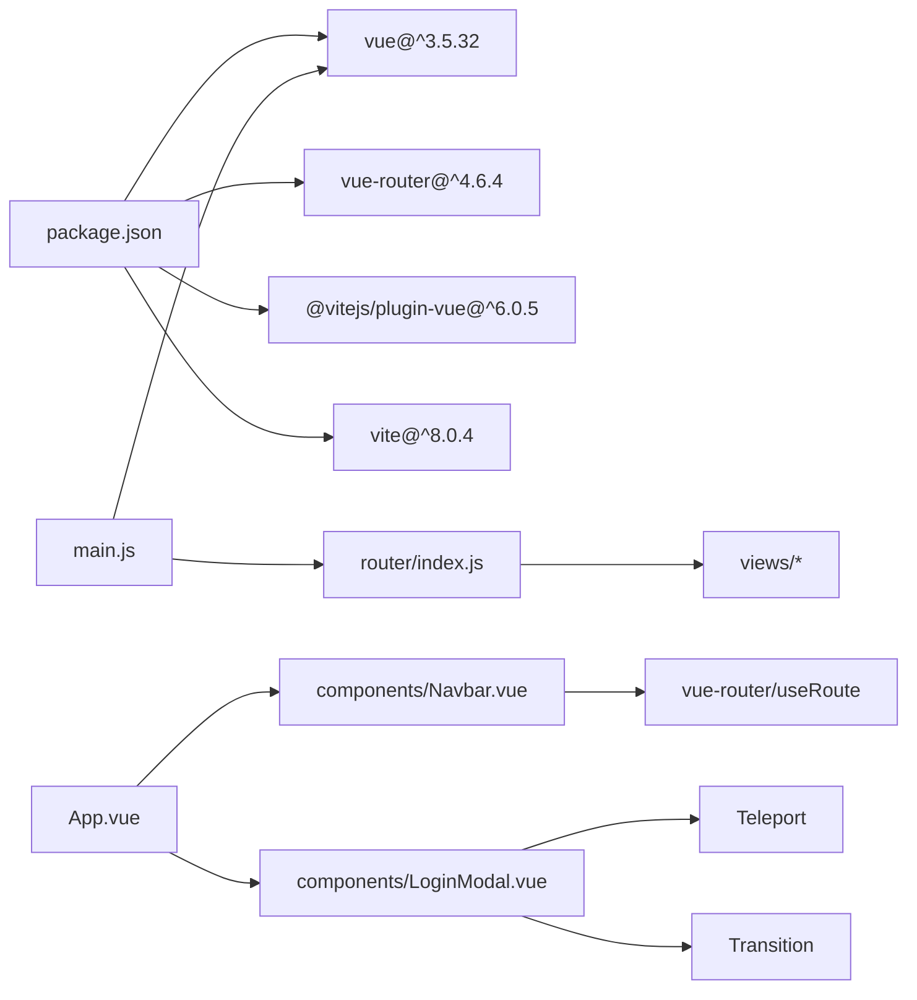

# 核心组件

<cite>
**本文引用的文件**
- [App.vue](file://src/App.vue)
- [Navbar.vue](file://src/components/Navbar.vue)
- [LoginModal.vue](file://src/components/LoginModal.vue)
- [main.js](file://src/main.js)
- [router/index.js](file://src/router/index.js)
- [Home.vue](file://src/views/Home.vue)
- [style.css](file://src/style.css)
- [package.json](file://package.json)
</cite>

## 目录
1. [简介](#简介)
2. [项目结构](#项目结构)
3. [核心组件](#核心组件)
4. [架构总览](#架构总览)
5. [详细组件分析](#详细组件分析)
6. [依赖分析](#依赖分析)
7. [性能考虑](#性能考虑)
8. [故障排查指南](#故障排查指南)
9. [结论](#结论)
10. [附录](#附录)

## 简介
本项目是一个基于 Vue 3 + Vite 的博客前端应用，采用单页应用（SPA）架构，通过 vue-router 实现页面路由切换。本文档聚焦于三个核心组件：根组件 App.vue、导航栏组件 Navbar.vue 和登录模态框组件 LoginModal.vue，系统性地解析其设计架构、状态管理模式与全局配置，并阐述组件间父子关系、事件传递与状态同步机制。

## 项目结构
项目采用典型的 Vue 3 单文件组件（SFC）组织方式：
- 根组件位于 src/App.vue，负责顶层布局与全局状态管理（如登录弹窗开关）
- 导航栏组件 src/components/Navbar.vue 提供站点导航与登录入口
- 登录模态框组件 src/components/LoginModal.vue 负责登录/注册交互
- 路由配置位于 src/router/index.js，定义各页面视图组件
- 视图组件位于 src/views/ 下，例如 Home.vue 展示首页内容
- 全局样式位于 src/style.css，统一字体、滚动条与基础排版
- 应用入口在 src/main.js，挂载根组件并注入路由

图表来源
- [main.js:1-9](file://src/main.js#L1-L9)
- [App.vue:1-30](file://src/App.vue#L1-L30)
- [Navbar.vue:1-140](file://src/components/Navbar.vue#L1-L140)
- [LoginModal.vue:1-316](file://src/components/LoginModal.vue#L1-L316)
- [router/index.js:1-28](file://src/router/index.js#L1-L28)
- [Home.vue:1-211](file://src/views/Home.vue#L1-L211)
- [style.css:1-56](file://src/style.css#L1-L56)

章节来源
- [main.js:1-9](file://src/main.js#L1-L9)
- [router/index.js:1-28](file://src/router/index.js#L1-L28)
- [style.css:1-56](file://src/style.css#L1-L56)

## 核心组件
本节从架构视角概述三个核心组件的职责与协作关系：
- App.vue：作为根组件，承担全局布局与状态协调，维护登录弹窗的显示/隐藏状态，并向子组件分发事件或属性
- Navbar.vue：负责站点导航菜单渲染、当前路由高亮、登录按钮交互，并向上级组件发出“打开登录”事件
- LoginModal.vue：负责登录/注册表单的切换、输入绑定、提交处理与关闭事件，同时通过 Teleport 将模态框挂载到 body，配合过渡动画实现开合效果

章节来源
- [App.vue:1-30](file://src/App.vue#L1-L30)
- [Navbar.vue:1-140](file://src/components/Navbar.vue#L1-L140)
- [LoginModal.vue:1-316](file://src/components/LoginModal.vue#L1-L316)

## 架构总览
下图展示了组件层次、数据流与事件流的整体架构：

图表来源
- [App.vue:17-23](file://src/App.vue#L17-L23)
- [Navbar.vue:6-25](file://src/components/Navbar.vue#L6-L25)
- [LoginModal.vue:8-16](file://src/components/LoginModal.vue#L8-L16)
- [router/index.js:11-27](file://src/router/index.js#L11-L27)

## 详细组件分析

### App.vue 根组件
- 设计架构
  - 使用组合式 API（<script setup>）声明式地引入子组件与响应式状态
  - 通过布尔型响应式变量控制登录模态框的显示/隐藏
  - 模板中通过事件绑定与属性绑定实现父子通信：向 Navbar 分发 open-login 事件；向 LoginModal 传递 show 属性并监听 close 事件
- 状态管理
  - 在根组件集中管理登录弹窗状态，避免跨组件共享复杂状态，符合单一职责原则
  - 通过方法 openLogin/closeLogin 控制状态，保持状态更新路径清晰
- 全局配置
  - 根容器设置最小高度，确保内容区域完整覆盖视口
  - 与路由视图结合，实现导航栏固定顶部、内容区随路由切换

图表来源
- [App.vue:6-23](file://src/App.vue#L6-L23)
- [Navbar.vue:19-25](file://src/components/Navbar.vue#L19-L25)
- [LoginModal.vue:14-16](file://src/components/LoginModal.vue#L14-L16)

章节来源
- [App.vue:1-30](file://src/App.vue#L1-L30)

### Navbar.vue 导航栏组件
- 响应式设计
  - 在较窄屏幕（小于 900px）时隐藏导航菜单，仅保留品牌与登录按钮，保证移动端体验
- 路由集成
  - 使用 vue-router 的 useRoute 获取当前路由，通过 isActive 判断当前项是否为激活状态
  - 使用 router-link 渲染导航项，自动高亮当前路由
- 用户交互处理
  - 登录按钮点击触发 open-login 事件，向上级组件请求打开登录弹窗
  - 导航项 hover 与 active 样式增强视觉反馈
- 组件结构
  - 导航栏采用三段式布局：品牌区、菜单区、操作区
  - 使用渐变色与模糊背景提升视觉层次

图表来源
- [Navbar.vue:23-25](file://src/components/Navbar.vue#L23-L25)
- [App.vue:8-14](file://src/App.vue#L8-L14)

章节来源
- [Navbar.vue:1-140](file://src/components/Navbar.vue#L1-L140)

### LoginModal.vue 登录模态框
- 表单验证与交互
  - 使用 v-model 双向绑定用户名与密码字段
  - 支持登录/注册模式切换，切换时动态渲染确认密码等字段
  - 提交时输出当前模式与输入值（用于演示），随后关闭模态框
- 动画效果
  - 使用 Transition 包裹整体遮罩层，实现淡入淡出
  - 使用 Transition 包裹内容容器，实现缩放进入/退出
  - 通过 Teleport 将模态框挂载到 body，避免层级与定位问题
- 事件通信机制
  - 接收父组件传入的 show 属性控制显示
  - 关闭时通过 close 事件通知父组件重置状态
  - 点击遮罩层或关闭按钮均可关闭模态框
- 响应式布局
  - 在较小屏幕（小于 700px）时隐藏左侧品牌区，优化移动端阅读体验

图表来源
- [LoginModal.vue:10-26](file://src/components/LoginModal.vue#L10-L26)
- [LoginModal.vue:28-32](file://src/components/LoginModal.vue#L28-L32)
- [App.vue:12-14](file://src/App.vue#L12-L14)

章节来源
- [LoginModal.vue:1-316](file://src/components/LoginModal.vue#L1-L316)

## 依赖分析
- 外部依赖
  - Vue 3 与 vue-router：提供组件框架与路由能力
  - Vite：开发与构建工具链
- 内部依赖
  - main.js 注入路由并挂载根组件
  - App.vue 依赖 Navbar 与 LoginModal
  - Navbar 依赖 vue-router 的 useRoute 与 router-link
  - LoginModal 依赖 Teleport 与 Transition

图表来源
- [package.json:11-18](file://package.json#L11-L18)
- [main.js:1-9](file://src/main.js#L1-L9)
- [router/index.js:1-28](file://src/router/index.js#L1-L28)
- [App.vue:3-4](file://src/App.vue#L3-L4)
- [Navbar.vue:3](file://src/components/Navbar.vue#L3)
- [LoginModal.vue:36-102](file://src/components/LoginModal.vue#L36-L102)

章节来源
- [package.json:1-20](file://package.json#L1-L20)
- [main.js:1-9](file://src/main.js#L1-L9)
- [router/index.js:1-28](file://src/router/index.js#L1-L28)

## 性能考虑
- 组件懒加载与路由按需加载：当前路由配置直接导入视图组件，建议在大型项目中启用路由级别的异步导入以减少首屏体积
- 动画与过渡：LoginModal 的过渡动画简洁高效，注意避免在低端设备上过度使用复杂滤镜
- 响应式布局：Navbar 与 LoginModal 的媒体查询在小屏设备上隐藏非必要元素，有助于降低渲染压力
- 全局样式：统一的基础样式与滚动行为有利于减少重复计算，提升整体性能

## 故障排查指南
- 登录弹窗无法关闭
  - 检查父组件是否正确监听 close 事件并重置 show 状态
  - 确认 LoginModal 的关闭逻辑是否触发 emit('close')
- 导航高亮不生效
  - 确认 useRoute 返回的当前路径与导航项 path 是否一致
  - 检查 isActive 判断逻辑与模板中的类名绑定
- 路由跳转无效
  - 确认 router/index.js 中 routes 配置与实际路径一致
  - 检查 main.js 是否正确安装并使用路由
- 模态框遮罩点击无效
  - 确认 handleOverlayClick 的事件委托逻辑是否正确判断 e.target === e.currentTarget
- 样式异常
  - 检查 style.css 的全局样式是否影响了组件作用域样式
  - 确认 scoped 样式与全局样式的优先级关系

章节来源
- [App.vue:12-14](file://src/App.vue#L12-L14)
- [LoginModal.vue:14-16](file://src/components/LoginModal.vue#L14-L16)
- [LoginModal.vue:28-32](file://src/components/LoginModal.vue#L28-L32)
- [Navbar.vue:19-21](file://src/components/Navbar.vue#L19-L21)
- [router/index.js:11-20](file://src/router/index.js#L11-L20)
- [main.js:6-8](file://src/main.js#L6-L8)
- [style.css:1-56](file://src/style.css#L1-L56)

## 结论
本项目通过精简而清晰的组件划分实现了良好的可维护性与扩展性。App.vue 作为根组件承担状态协调与布局职责，Navbar.vue 专注于导航与交互，LoginModal.vue 提供完整的登录/注册体验。配合 vue-router 的路由体系与全局样式，形成了一个结构合理、交互流畅的前端应用骨架。后续可在路由懒加载、状态管理与动画优化方面进一步完善。

## 附录
- 最佳实践清单
  - 父子通信使用明确的事件命名与参数约定，避免隐式依赖
  - 在根组件集中管理轻量级全局状态，避免过度分散
  - 使用 Teleport 解决模态框层级与定位问题，配合 Transition 提升交互体验
  - 在移动端优先策略下，优先保障核心功能可用性
  - 为路由视图组件预留占位与骨架屏，改善切换体验