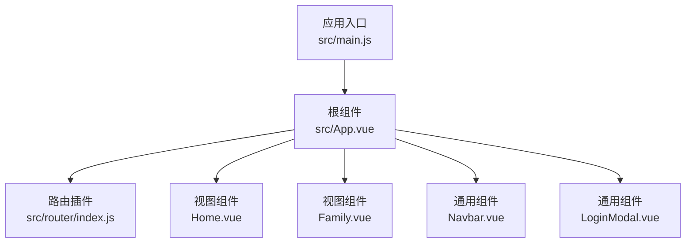
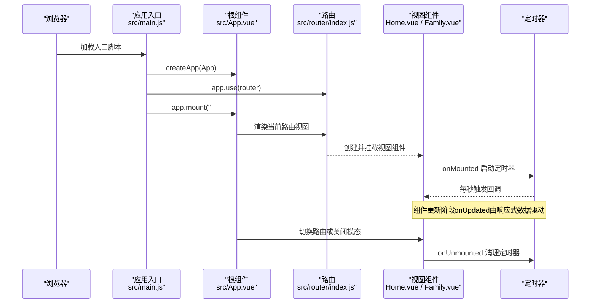
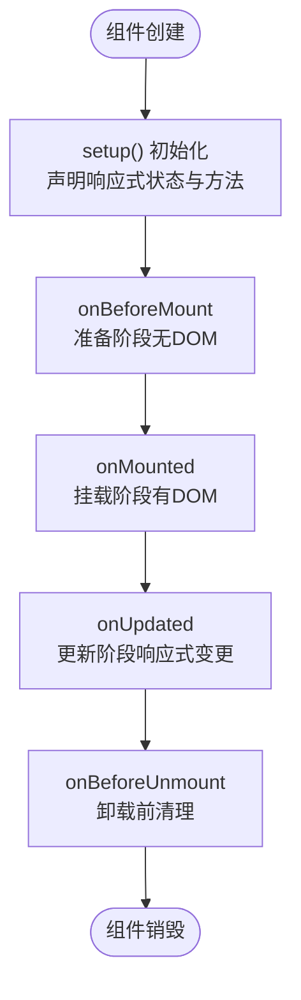
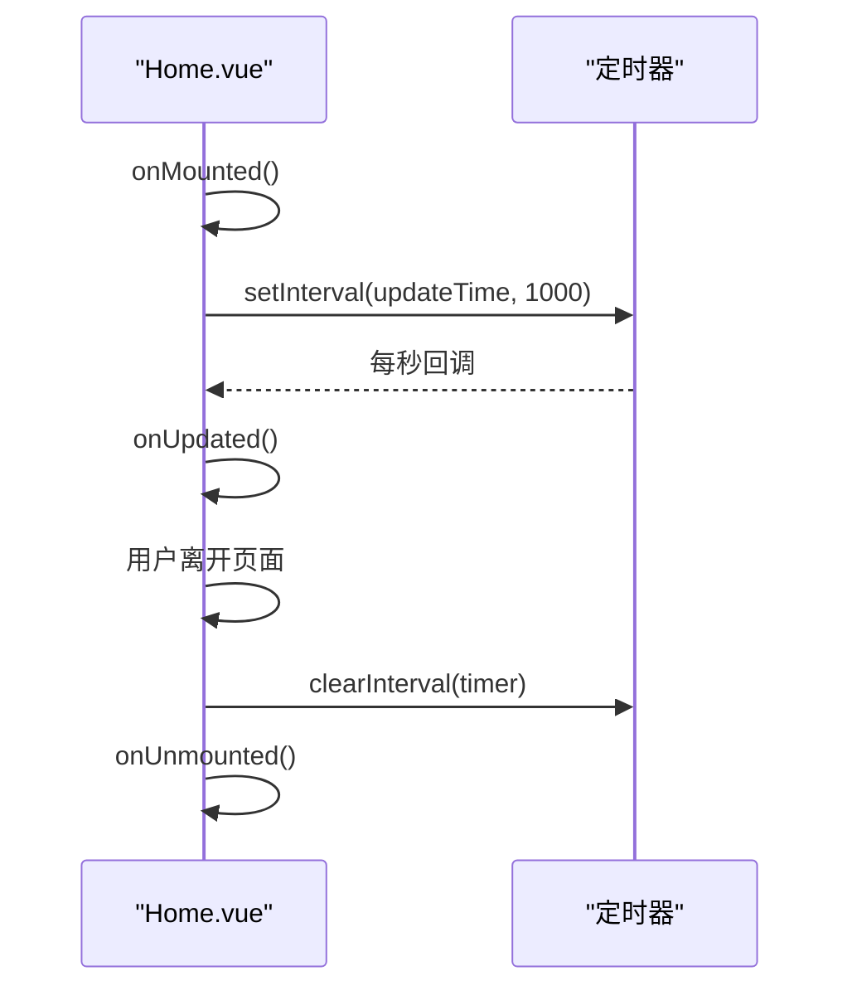
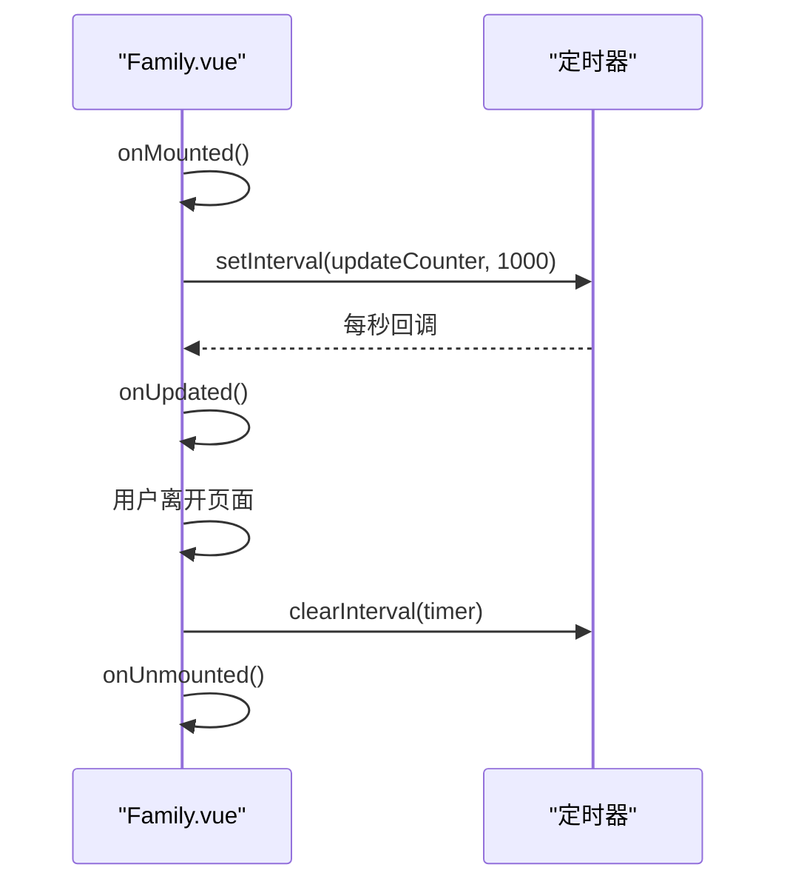
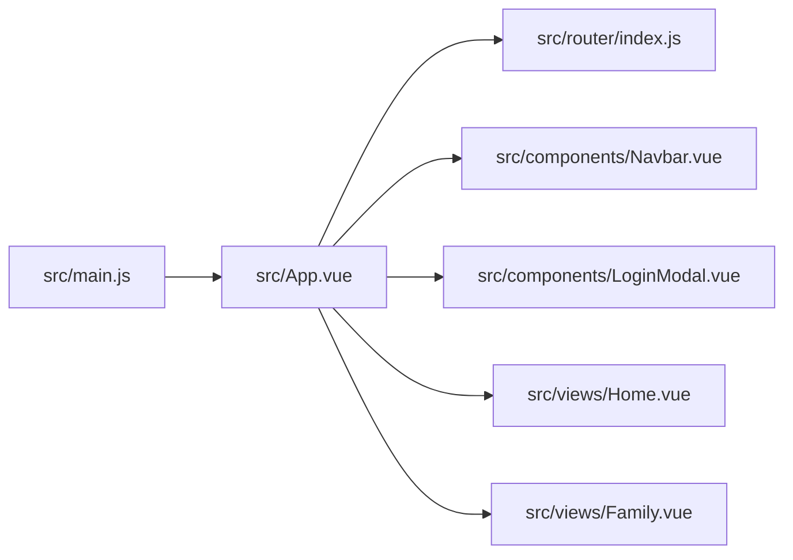

# 组件生命周期

<cite>
**本文引用的文件**
- [src/main.js](file://src/main.js)
- [src/App.vue](file://src/App.vue)
- [src/router/index.js](file://src/router/index.js)
- [src/views/Home.vue](file://src/views/Home.vue)
- [src/views/Family.vue](file://src/views/Family.vue)
- [src/components/Navbar.vue](file://src/components/Navbar.vue)
- [src/components/LoginModal.vue](file://src/components/LoginModal.vue)
- [README.md](file://README.md)
</cite>

## 目录
1. [简介](#简介)
2. [项目结构](#项目结构)
3. [核心组件](#核心组件)
4. [架构总览](#架构总览)
5. [详细组件分析](#详细组件分析)
6. [依赖关系分析](#依赖关系分析)
7. [性能考量](#性能考量)
8. [故障排查指南](#故障排查指南)
9. [结论](#结论)
10. [附录](#附录)

## 简介
本文件围绕 Vue 3 Composition API 的组件生命周期进行系统性梳理，重点覆盖以下主题：
- 生命周期钩子：onMounted、onUpdated、onBeforeUnmount（以及 onBeforeMount、onServerPrefetch）在项目中的使用与最佳实践
- setup() 执行顺序与作用域边界
- 组件创建、挂载、更新、卸载过程中的执行时机与注意事项
- 基于项目现有代码的示例路径与调试技巧
- 性能优化与内存泄漏预防策略

本项目采用 Vue 3 + Vite + 脚本组合式 API（<script setup>）的单页应用结构，通过路由切换不同视图组件，多个视图组件在挂载阶段启动定时器，在卸载阶段清理定时器，体现了生命周期钩子在真实场景中的典型用法。

**章节来源**
- [README.md:1-6](file://README.md#L1-L6)

## 项目结构
项目采用按功能模块划分的目录组织方式：
- 应用入口与根组件：src/main.js、src/App.vue
- 路由定义：src/router/index.js
- 视图组件：src/views 下的各页面组件
- 可复用组件：src/components 下的通用组件（如导航栏、登录模态框）

**图表来源**
- [src/main.js:1-9](file://src/main.js#L1-L9)
- [src/App.vue:1-30](file://src/App.vue#L1-L30)
- [src/router/index.js:1-28](file://src/router/index.js#L1-L28)

**章节来源**
- [src/main.js:1-9](file://src/main.js#L1-L9)
- [src/App.vue:1-30](file://src/App.vue#L1-L30)
- [src/router/index.js:1-28](file://src/router/index.js#L1-L28)

## 核心组件
本节聚焦与生命周期直接相关的组件与钩子使用点：
- Home.vue：在 onMounted 中初始化时间显示并在每秒更新；在 onUnmounted 中清理定时器
- Family.vue：在 onMounted 中初始化计数器并在每秒更新；在 onUnmounted 中清理定时器
- Navbar.vue：演示事件发射与路由集成
- LoginModal.vue：演示 Teleport、过渡动画与 props/emit 的交互
- App.vue：作为根组件协调导航栏与登录模态框的显示控制

这些组件共同展示了生命周期钩子在真实业务场景中的职责边界与调用时机。

**章节来源**
- [src/views/Home.vue:1-37](file://src/views/Home.vue#L1-L37)
- [src/views/Family.vue:1-55](file://src/views/Family.vue#L1-L55)
- [src/components/Navbar.vue:1-26](file://src/components/Navbar.vue#L1-L26)
- [src/components/LoginModal.vue:1-33](file://src/components/LoginModal.vue#L1-L33)
- [src/App.vue:1-23](file://src/App.vue#L1-L23)

## 架构总览
下图展示了应用启动、路由切换与组件生命周期的关系：

**图表来源**
- [src/main.js:1-9](file://src/main.js#L1-L9)
- [src/App.vue:1-23](file://src/App.vue#L1-L23)
- [src/router/index.js:1-28](file://src/router/index.js#L1-L28)
- [src/views/Home.vue:29-36](file://src/views/Home.vue#L29-L36)
- [src/views/Family.vue:48-55](file://src/views/Family.vue#L48-L55)

## 详细组件分析

### 组件生命周期钩子与执行顺序
- setup() 阶段
  - 在 <script setup> 中声明的 ref、reactive、computed、watch 等响应式状态与方法在组件实例创建前完成初始化
  - onMounted、onUpdated、onBeforeUnmount 等生命周期钩子在 setup() 完成后按渲染流程被调用
- onBeforeMount
  - 组件即将挂载，DOM 尚未生成，适合进行轻量初始化
- onMounted
  - DOM 已挂载，可安全访问 DOM 或启动外部资源（如定时器、WebSocket、第三方库）
  - 本项目中 Home.vue 与 Family.vue 在此阶段启动定时器
- onBeforeUnmount
  - 组件即将卸载，用于清理副作用（定时器、事件监听、订阅等）
  - 本项目中 Home.vue 与 Family.vue 在此阶段清理定时器
- onUpdated
  - 组件因响应式数据变化而重新渲染后触发
  - 本项目未显式使用，但其存在决定了组件更新阶段的行为边界

**图表来源**
- [src/views/Home.vue:29-36](file://src/views/Home.vue#L29-L36)
- [src/views/Family.vue:48-55](file://src/views/Family.vue#L48-L55)

**章节来源**
- [src/views/Home.vue:1-37](file://src/views/Home.vue#L1-L37)
- [src/views/Family.vue:1-55](file://src/views/Family.vue#L1-L55)

### Home.vue：定时器与生命周期
- 作用
  - 展示实时时间与日期信息，每秒自动更新
- 生命周期使用
  - onMounted：初始化一次显示并启动定时器
  - onUnmounted：清理定时器，防止内存泄漏
- 调试建议
  - 在 onMounted 中输出当前时间，确认首次渲染
  - 在 onUnmounted 中输出清理信息，验证定时器是否被正确清除
  - 使用浏览器开发者工具的性能面板观察定时器对帧率的影响

**图表来源**
- [src/views/Home.vue:29-36](file://src/views/Home.vue#L29-L36)

**章节来源**
- [src/views/Home.vue:1-37](file://src/views/Home.vue#L1-L37)

### Family.vue：倒计时与生命周期
- 作用
  - 展示纪念日以来的累计时间与到下个元旦的倒计时
- 生命周期使用
  - onMounted：初始化并启动定时器
  - onUnmounted：清理定时器
- 调试建议
  - 在 onMounted 中输出初始时间差，确认计算逻辑
  - 在 onUnmounted 中输出清理信息，确保定时器释放

**图表来源**
- [src/views/Family.vue:48-55](file://src/views/Family.vue#L48-L55)

**章节来源**
- [src/views/Family.vue:1-55](file://src/views/Family.vue#L1-L55)

### Navbar.vue：事件与路由集成
- 作用
  - 提供导航菜单与登录按钮，向父组件发出 open-login 事件
- 生命周期使用
  - 本组件未显式使用生命周期钩子，但其依赖路由守卫与父组件状态管理
- 调试建议
  - 在父组件中监听 open-login 事件，确认事件冒泡与状态同步

**章节来源**
- [src/components/Navbar.vue:1-26](file://src/components/Navbar.vue#L1-L26)

### LoginModal.vue：Teleport 与过渡动画
- 作用
  - 通过 Teleport 将模态框挂载到 body，配合 Transition 实现淡入淡出与缩放效果
- 生命周期使用
  - 本组件未显式使用生命周期钩子，但其显示/隐藏受父组件控制
- 调试建议
  - 在 show 变化时观察 DOM 移动与过渡动画
  - 点击遮罩层关闭时，确认事件冒泡与关闭逻辑

**章节来源**
- [src/components/LoginModal.vue:1-33](file://src/components/LoginModal.vue#L1-L33)

### App.vue：根组件与状态协调
- 作用
  - 协调导航栏与登录模态框的显示控制，通过响应式布尔值控制模态框
- 生命周期使用
  - 本组件未显式使用生命周期钩子，但其状态变化会触发子组件的更新
- 调试建议
  - 在 openLogin/closeLogin 中输出状态变化，确认父子通信链路

**章节来源**
- [src/App.vue:1-23](file://src/App.vue#L1-L23)

## 依赖关系分析
- 应用入口依赖根组件与路由插件
- 根组件依赖导航栏与登录模态框，并通过路由渲染视图组件
- 视图组件依赖生命周期钩子进行定时器管理
- 通用组件依赖 Teleport 与过渡动画提升用户体验

**图表来源**
- [src/main.js:1-9](file://src/main.js#L1-L9)
- [src/App.vue:1-23](file://src/App.vue#L1-L23)
- [src/router/index.js:1-28](file://src/router/index.js#L1-L28)

**章节来源**
- [src/main.js:1-9](file://src/main.js#L1-L9)
- [src/App.vue:1-23](file://src/App.vue#L1-L23)
- [src/router/index.js:1-28](file://src/router/index.js#L1-L28)

## 性能考量
- 定时器管理
  - 在 onMounted 中启动定时器，在 onUnmounted 中清理，避免重复启动与内存泄漏
  - 对高频定时器（如 1ms）应谨慎使用，必要时考虑 requestAnimationFrame 或节流
- DOM 访问
  - 仅在 onMounted 后访问 DOM，避免在 setup() 中读取节点属性
- 响应式更新
  - onUpdated 由响应式变更触发，避免在其中进行昂贵操作
- 资源释放
  - 清理定时器、取消订阅、移除事件监听、释放第三方库实例
- SSR/水合
  - onServerPrefetch 用于服务端预取数据，客户端水合后 onMounted 再次运行，需注意幂等性

[本节为通用指导，不直接分析具体文件]

## 故障排查指南
- 症状：页面切换后定时器仍在运行
  - 排查：确认 onUnmounted 是否被调用，定时器句柄是否保存在组件作用域内
  - 参考：Home.vue、Family.vue 的定时器清理逻辑
- 症状：组件卸载后仍出现内存占用
  - 排查：检查是否存在未清理的事件监听、定时器、订阅或第三方实例
  - 参考：onUnmounted 的清理清单
- 症状：首次进入页面无数据
  - 排查：确认 onMounted 中的初始化逻辑是否在 DOM 挂载后执行
  - 参考：Home.vue 的首次更新与定时器启动顺序
- 症状：路由切换导致重复定时器
  - 排查：确认组件复用策略与路由键，避免同一组件实例重复挂载
  - 参考：路由配置与组件复用

**章节来源**
- [src/views/Home.vue:29-36](file://src/views/Home.vue#L29-L36)
- [src/views/Family.vue:48-55](file://src/views/Family.vue#L48-L55)

## 结论
本项目通过 Home.vue 与 Family.vue 的 onMounted/onUnmounted 使用，直观展示了生命周期钩子在定时器管理中的职责边界与调用时机。结合 App.vue 的状态协调与 Navbar/LoginModal 的交互，体现了 Composition API 在组件生命周期管理上的简洁与可控。遵循“谁启动谁清理”的原则，配合 onBeforeUnmount 的清理清单，可有效避免内存泄漏与性能问题。

[本节为总结性内容，不直接分析具体文件]

## 附录
- 示例路径参考
  - Home.vue 定时器启动与清理：[src/views/Home.vue:29-36](file://src/views/Home.vue#L29-L36)
  - Family.vue 定时器启动与清理：[src/views/Family.vue:48-55](file://src/views/Family.vue#L48-L55)
  - 应用入口与挂载：[src/main.js:1-9](file://src/main.js#L1-L9)
  - 根组件与路由：[src/App.vue:1-23](file://src/App.vue#L1-L23)，[src/router/index.js:1-28](file://src/router/index.js#L1-L28)
  - 通用组件交互：[src/components/Navbar.vue:1-26](file://src/components/Navbar.vue#L1-L26)，[src/components/LoginModal.vue:1-33](file://src/components/LoginModal.vue#L1-L33)

[本节为索引性内容，不直接分析具体文件]