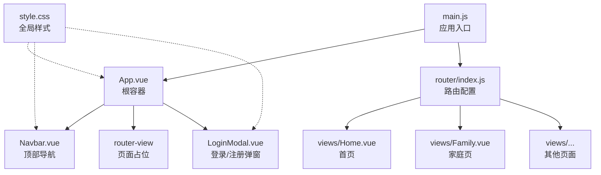
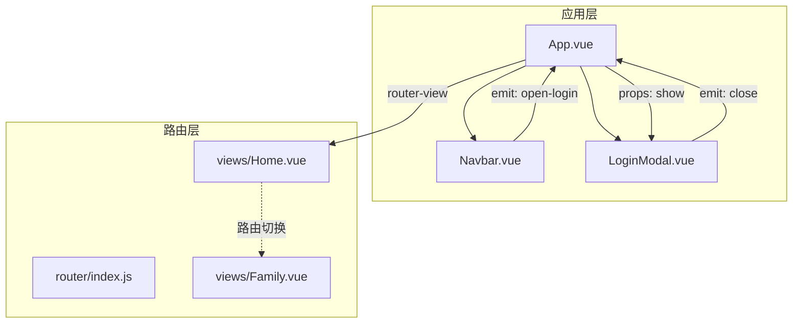
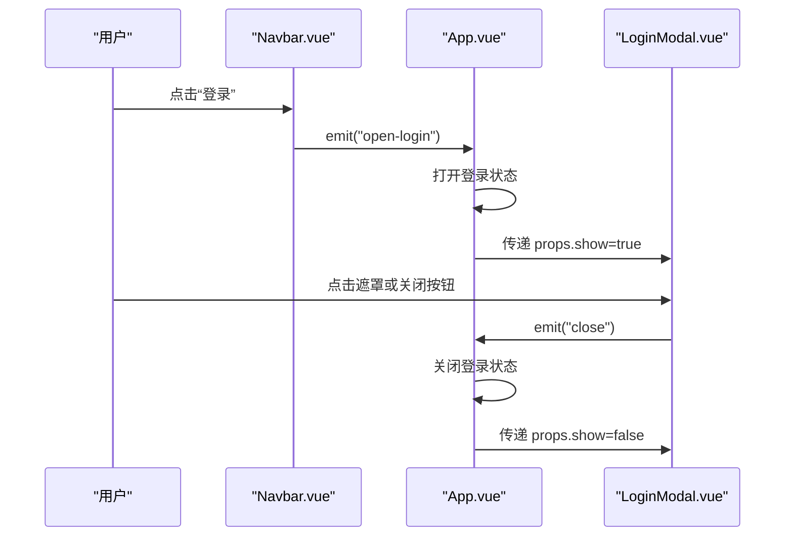
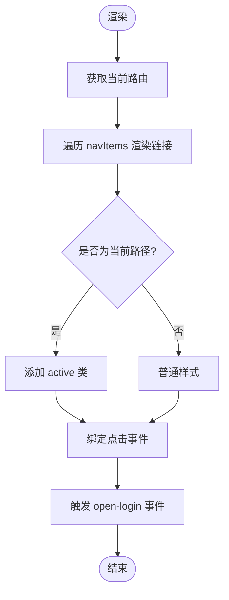
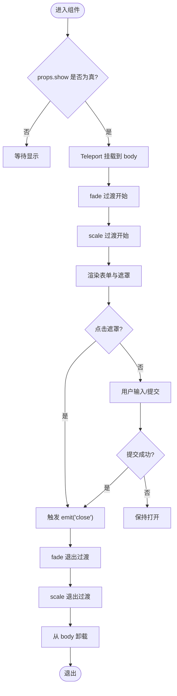
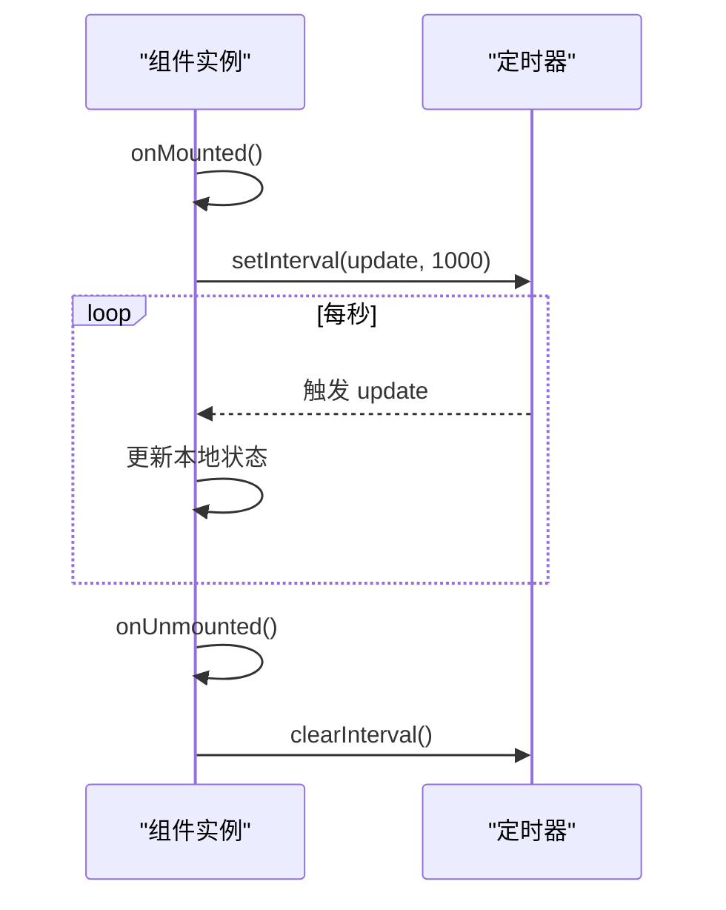
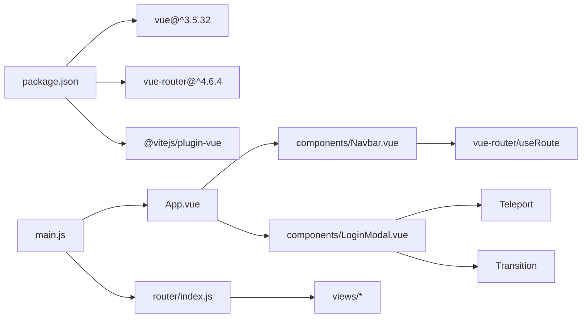

# 组件系统

<cite>
**本文引用的文件**
- [App.vue](file://src/App.vue)
- [Navbar.vue](file://src/components/Navbar.vue)
- [LoginModal.vue](file://src/components/LoginModal.vue)
- [main.js](file://src/main.js)
- [package.json](file://package.json)
- [router/index.js](file://src/router/index.js)
- [Home.vue](file://src/views/Home.vue)
- [Family.vue](file://src/views/Family.vue)
- [HelloWorld.vue](file://src/components/HelloWorld.vue)
- [style.css](file://src/style.css)
</cite>

## 目录
1. [简介](#简介)
2. [项目结构](#项目结构)
3. [核心组件](#核心组件)
4. [架构总览](#架构总览)
5. [详细组件分析](#详细组件分析)
6. [依赖关系分析](#依赖关系分析)
7. [性能考虑](#性能考虑)
8. [故障排查指南](#故障排查指南)
9. [结论](#结论)
10. [附录](#附录)

## 简介
本项目采用 Vue 3 + Vite 的现代前端技术栈，围绕组件化设计模式构建了一个简洁而功能完备的个人博客站点。系统通过顶层容器组件协调导航栏与登录模态框，配合路由系统实现页面级内容切换。本文档将深入解析组件化设计、组件通信机制、生命周期管理与状态管理模式，并重点阐述 App.vue、Navbar.vue、LoginModal.vue 的设计理念与实现细节，同时给出接口规范、复用策略、性能优化技巧与最佳实践。

## 项目结构
项目采用按功能域划分的目录组织方式：
- 根入口：main.js 创建应用实例并挂载根组件 App.vue
- 路由层：router/index.js 定义页面路由映射
- 视图层：views 下的各页面组件负责展示内容与生命周期管理
- 组件层：components 下的通用组件（如 Navbar、LoginModal）供全局复用
- 样式层：style.css 提供全局基础样式与滚动条美化

图表来源
- [main.js:1-9](file://src/main.js#L1-L9)
- [App.vue:1-30](file://src/App.vue#L1-L30)
- [router/index.js:1-28](file://src/router/index.js#L1-L28)

章节来源
- [main.js:1-9](file://src/main.js#L1-L9)
- [router/index.js:1-28](file://src/router/index.js#L1-L28)
- [style.css:1-56](file://src/style.css#L1-L56)

## 核心组件
本节聚焦于三个关键组件：App.vue（根容器）、Navbar.vue（导航栏）、LoginModal.vue（登录模态框）。它们共同构成了应用的交互骨架与状态边界。

- App.vue
  - 职责：作为根容器，持有登录状态开关，向下传递给 LoginModal；向上接收 Navbar 的登录事件，实现跨组件通信。
  - 关键点：使用响应式引用控制模态框显示；通过事件回调在父子组件间建立松耦合通信。
- Navbar.vue
  - 职责：渲染导航菜单项、高亮当前路由、触发登录事件。
  - 关键点：基于 vue-router 的 useRoute 获取当前路径；通过 defineEmits 发出 open-login 事件。
- LoginModal.vue
  - 职责：提供登录/注册表单、切换模式、遮罩点击关闭等交互。
  - 关键点：通过 Teleport 将 DOM 挂载至 body，避免层级限制；使用 Transition 实现淡入淡出与缩放动画；通过 defineProps 接收外部控制参数。

章节来源
- [App.vue:1-30](file://src/App.vue#L1-L30)
- [Navbar.vue:1-140](file://src/components/Navbar.vue#L1-L140)
- [LoginModal.vue:1-316](file://src/components/LoginModal.vue#L1-L316)

## 架构总览
下图展示了组件间的依赖关系与数据流方向。App.vue 作为协调者，通过 props 与事件与子组件交互；Navbar.vue 通过事件向上游传递；LoginModal.vue 通过 props 控制显示状态。

图表来源
- [App.vue:17-23](file://src/App.vue#L17-L23)
- [Navbar.vue:6-25](file://src/components/Navbar.vue#L6-L25)
- [LoginModal.vue:4-6](file://src/components/LoginModal.vue#L4-L6)
- [LoginModal.vue:14-16](file://src/components/LoginModal.vue#L14-L16)
- [router/index.js:11-20](file://src/router/index.js#L11-L20)

## 详细组件分析

### App.vue 分析
- 设计理念
  - 以最小状态持有原则：仅维护 showLogin 响应式引用，避免在根组件中承载过多业务状态。
  - 事件驱动通信：通过 openLogin/closeLogin 回调与 Navbar/LoginModal 解耦。
- 生命周期与状态管理
  - 无显式生命周期钩子，依赖模板中的事件绑定完成交互。
  - 状态更新通过方法直接修改响应式值，保持简单直观。
- 接口规范
  - 子组件接口
    - Navbar
      - 事件：open-login（无参数）
    - LoginModal
      - 属性：show（布尔）
      - 事件：close（无参数）

图表来源
- [App.vue:8-14](file://src/App.vue#L8-L14)
- [App.vue:19](file://src/App.vue#L19)
- [App.vue:21](file://src/App.vue#L21)
- [Navbar.vue:23-25](file://src/components/Navbar.vue#L23-L25)
- [LoginModal.vue:14-16](file://src/components/LoginModal.vue#L14-L16)

章节来源
- [App.vue:1-30](file://src/App.vue#L1-L30)

### Navbar.vue 分析
- 设计理念
  - 导航菜单与路由状态解耦：通过 useRoute 判断当前激活项，避免硬编码路径。
  - 可扩展性：navItems 数组集中定义导航项，便于增删改。
- 生命周期与状态管理
  - 使用组合式 API 在模板中直接访问路由状态，无需额外状态。
- 接口规范
  - 事件：open-login（无参数）
  - 无属性输入要求

图表来源
- [Navbar.vue:8-25](file://src/components/Navbar.vue#L8-L25)
- [Navbar.vue:35-44](file://src/components/Navbar.vue#L35-L44)
- [Navbar.vue:19-21](file://src/components/Navbar.vue#L19-L21)

章节来源
- [Navbar.vue:1-140](file://src/components/Navbar.vue#L1-L140)

### LoginModal.vue 分析
- 设计理念
  - 通过 Teleport 将模态框挂载到 body，确保层级与定位不受父容器影响。
  - 使用双层 Transition 实现遮罩与内容的渐进式动画。
  - 表单模式切换：isLogin 控制登录/注册两种形态。
- 生命周期与状态管理
  - 内部状态：username、password、isLogin、show（props）。
  - 通过 props.show 控制显示/隐藏；通过 emit.close 通知父组件关闭。
- 接口规范
  - 属性：show（布尔）
  - 事件：close（无参数）
  - 插槽：未定义具名插槽，但可通过结构复用

图表来源
- [LoginModal.vue:36-102](file://src/components/LoginModal.vue#L36-L102)
- [LoginModal.vue:28-32](file://src/components/LoginModal.vue#L28-L32)
- [LoginModal.vue:22-26](file://src/components/LoginModal.vue#L22-L26)

章节来源
- [LoginModal.vue:1-316](file://src/components/LoginModal.vue#L1-L316)

### 视图组件与生命周期
- Home.vue
  - 生命周期：onMounted 启动定时器，每秒更新时间信息；onUnmounted 清理定时器，防止内存泄漏。
  - 状态：currentTime、currentDate、lunarDate、weekDay。
- Family.vue
  - 生命周期：同上，计算纪念日与新年倒计时。
  - 状态：years、months、days、hours、minutes、seconds 以及新年的倒计时状态。

图表来源
- [Home.vue:29-36](file://src/views/Home.vue#L29-L36)
- [Family.vue:48-55](file://src/views/Family.vue#L48-L55)

章节来源
- [Home.vue:1-211](file://src/views/Home.vue#L1-L211)
- [Family.vue:1-309](file://src/views/Family.vue#L1-L309)

## 依赖关系分析
- 外部依赖
  - Vue 3：提供响应式系统与组合式 API
  - vue-router：提供路由与页面切换能力
  - Vite：开发与构建工具链
- 内部依赖
  - main.js 依赖 App.vue 与 router/index.js
  - App.vue 依赖 Navbar.vue 与 LoginModal.vue
  - router/index.js 依赖各视图组件
  - Navbar.vue 依赖 vue-router 的 useRoute
  - LoginModal.vue 依赖 Teleport 与 Transition

图表来源
- [package.json:11-18](file://package.json#L11-L18)
- [main.js:1-9](file://src/main.js#L1-L9)
- [router/index.js:1-28](file://src/router/index.js#L1-L28)
- [Navbar.vue:3](file://src/components/Navbar.vue#L3)
- [LoginModal.vue:36](file://src/components/LoginModal.vue#L36)

章节来源
- [package.json:1-20](file://package.json#L1-L20)
- [main.js:1-9](file://src/main.js#L1-L9)
- [router/index.js:1-28](file://src/router/index.js#L1-L28)

## 性能考虑
- 组件通信与状态提升
  - 将登录状态提升至 App.vue，避免在多处重复维护同一状态，降低耦合并提高一致性。
- 动画与渲染
  - LoginModal 使用两层 Transition，建议在高频切换场景下评估动画开销，必要时可按需禁用或延迟初始化。
  - Navbar 使用 v-for 渲染导航项，建议为列表项提供稳定 key，减少重排。
- 生命周期清理
  - Home.vue 与 Family.vue 在 onUnmounted 中清理定时器，防止内存泄漏与重复订阅。
- Teleport 使用
  - LoginModal 通过 Teleport 将 DOM 移至 body，避免层级与定位问题，但需注意可能带来的事件捕获差异。
- 资源加载
  - 视图组件内联背景图与图片资源，建议在生产环境启用资源压缩与懒加载策略。

[本节为通用性能指导，不直接分析具体文件，故无章节来源]

## 故障排查指南
- 登录模态框无法关闭
  - 检查 App.vue 是否正确传递 props.show 并在收到 close 事件后更新状态。
  - 确认 LoginModal 的遮罩点击逻辑与关闭按钮事件绑定。
- 导航高亮不生效
  - 检查 Navbar.vue 中 useRoute 返回的路径与 navItems 的 path 是否一致。
  - 确保 isActive 判定逻辑与路由前缀匹配。
- 页面切换后定时器异常
  - 确认 Home.vue 与 Family.vue 的 onMounted/onUnmounted 配对使用，避免重复设置定时器。
- 样式冲突
  - 检查 style.css 的全局样式是否覆盖了组件 scoped 样式，必要时调整选择器优先级或移除冲突规则。

章节来源
- [App.vue:8-14](file://src/App.vue#L8-L14)
- [LoginModal.vue:28-32](file://src/components/LoginModal.vue#L28-L32)
- [Navbar.vue:19-21](file://src/components/Navbar.vue#L19-L21)
- [Home.vue:29-36](file://src/views/Home.vue#L29-L36)
- [Family.vue:48-55](file://src/views/Family.vue#L48-L55)
- [style.css:1-56](file://src/style.css#L1-L56)

## 结论
该组件系统以 App.vue 为核心协调器，结合 Navbar.vue 与 LoginModal.vue 实现清晰的职责分离与松耦合通信。通过 props 与事件的约定式接口，配合 Teleport 与 Transition 等 Vue 特性，既保证了良好的用户体验，也维持了代码的可维护性。建议在后续迭代中引入更完善的表单校验、国际化与主题系统，并对动画与资源进行进一步优化。

[本节为总结性内容，不直接分析具体文件，故无章节来源]

## 附录

### 组件接口规范速查
- App.vue
  - 子组件
    - Navbar
      - 事件：open-login（无参数）
    - LoginModal
      - 属性：show（布尔）
      - 事件：close（无参数）
- Navbar.vue
  - 事件：open-login（无参数）
- LoginModal.vue
  - 属性：show（布尔）
  - 事件：close（无参数）

章节来源
- [App.vue:19](file://src/App.vue#L19)
- [App.vue:21](file://src/App.vue#L21)
- [Navbar.vue:6](file://src/components/Navbar.vue#L6)
- [LoginModal.vue:4-6](file://src/components/LoginModal.vue#L4-L6)
- [LoginModal.vue:8](file://src/components/LoginModal.vue#L8)

### 组件复用策略
- Navbar.vue
  - 通过 navItems 数组集中管理导航项，便于统一扩展与维护。
  - 与路由解耦，适用于不同布局场景。
- LoginModal.vue
  - 通过 props.show 控制显示，适合在多个页面中复用。
  - Teleport 使模态框脱离父容器层级，增强复用灵活性。
- HelloWorld.vue
  - 作为演示组件，展示了静态资源引入与基础交互，可用于快速原型验证。

章节来源
- [Navbar.vue:8-17](file://src/components/Navbar.vue#L8-L17)
- [LoginModal.vue:36](file://src/components/LoginModal.vue#L36)
- [HelloWorld.vue:1-94](file://src/components/HelloWorld.vue#L1-L94)

### 最佳实践清单
- 状态提升：将共享状态提升至最近公共祖先，避免跨组件重复维护。
- 事件命名：使用语义化事件名（如 open-login、close），并在文档中明确事件含义。
- 生命周期：在 onMounted 中启动副作用，在 onUnmounted 中清理，防止内存泄漏。
- 动画与性能：合理使用 Transition，避免在高频场景下叠加复杂动画。
- 样式隔离：优先使用 scoped 样式，必要时通过深度选择器或 CSS 变量进行主题定制。

[本节为通用最佳实践，不直接分析具体文件，故无章节来源]