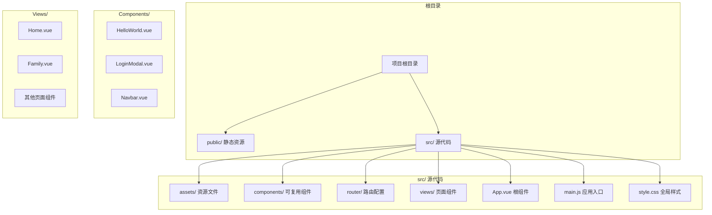
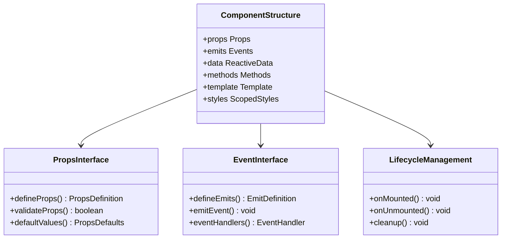
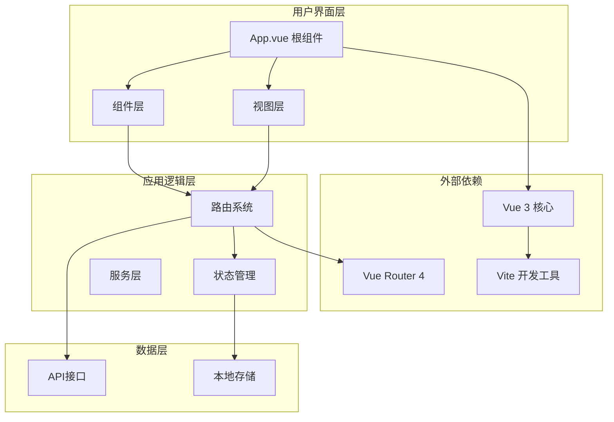
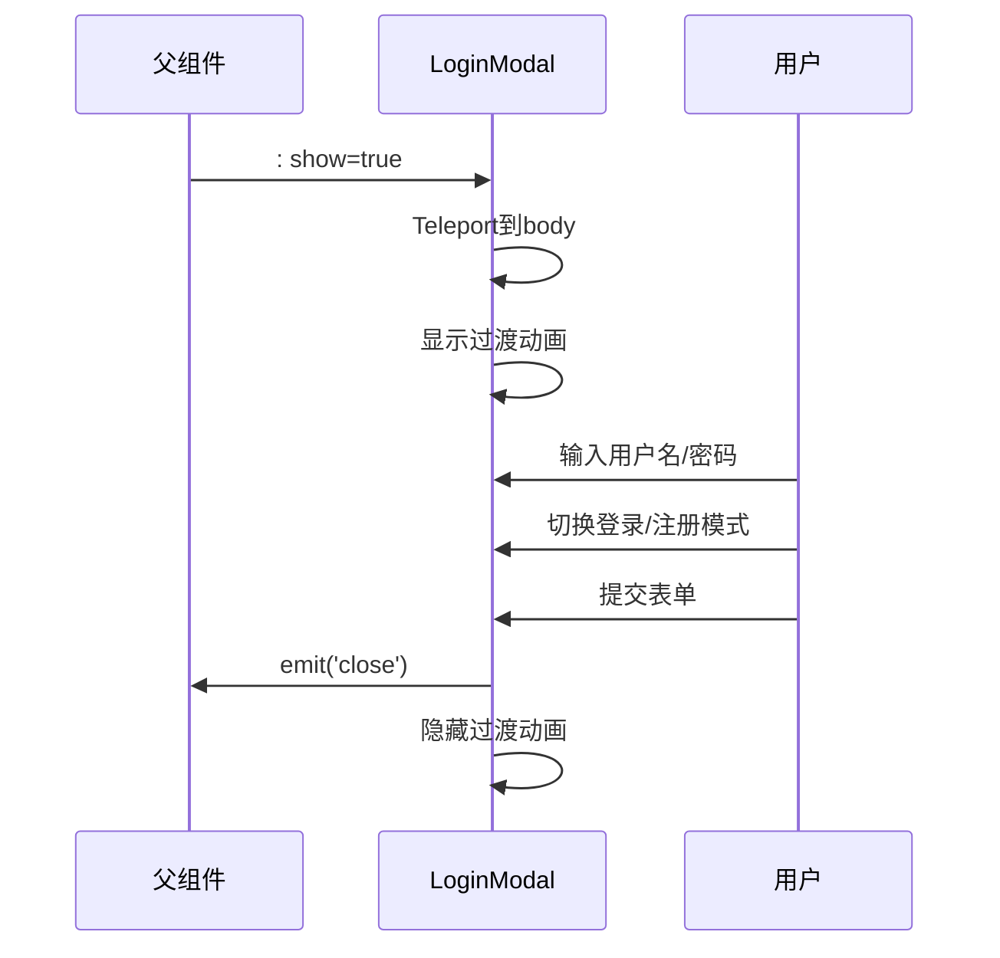
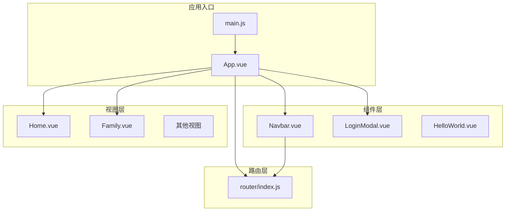

# 组件设计最佳实践

<cite>
**本文档引用的文件**
- [App.vue](file://src/App.vue)
- [main.js](file://src/main.js)
- [HelloWorld.vue](file://src/components/HelloWorld.vue)
- [LoginModal.vue](file://src/components/LoginModal.vue)
- [Navbar.vue](file://src/components/Navbar.vue)
- [Home.vue](file://src/views/Home.vue)
- [Family.vue](file://src/views/Family.vue)
- [router/index.js](file://src/router/index.js)
- [style.css](file://src/style.css)
- [package.json](file://package.json)
- [README.md](file://README.md)
</cite>

## 目录
1. [引言](#引言)
2. [项目结构](#项目结构)
3. [核心组件](#核心组件)
4. [架构概览](#架构概览)
5. [详细组件分析](#详细组件分析)
6. [依赖关系分析](#依赖关系分析)
7. [性能考虑](#性能考虑)
8. [故障排除指南](#故障排除指南)
9. [结论](#结论)
10. [附录](#附录)

## 引言

本指南基于Vue 3 + Vite的实际项目代码，总结了组件设计的最佳实践。该项目展示了现代前端应用的典型架构模式，包括组件化设计、状态管理、路由集成和样式组织等方面。通过深入分析现有组件的实现，我们将提炼出可复用的组件设计模式、接口规范和性能优化策略。

## 项目结构

该项目采用标准的Vue 3单文件组件(SFC)架构，主要目录结构如下：



**图表来源**
- [main.js:1-9](file://src/main.js#L1-L9)
- [router/index.js:1-28](file://src/router/index.js#L1-L28)

**章节来源**
- [main.js:1-9](file://src/main.js#L1-L9)
- [router/index.js:1-28](file://src/router/index.js#L1-L28)
- [package.json:1-20](file://package.json#L1-L20)

## 核心组件

### 组件命名规范

基于项目分析，推荐以下命名约定：

1. **组件文件命名**: 使用PascalCase格式，如 `LoginModal.vue`
2. **组件导出名称**: 与文件名保持一致
3. **组件内部名称**: 使用语义化名称，避免缩写
4. **样式文件**: 与组件同名，如 `LoginModal.vue` 对应 `LoginModal.vue` 中的样式

### 结构设计原则

组件应遵循"单一职责"原则，每个组件专注于特定功能：



**图表来源**
- [LoginModal.vue:1-33](file://src/components/LoginModal.vue#L1-L33)
- [Navbar.vue:1-26](file://src/components/Navbar.vue#L1-L26)

**章节来源**
- [HelloWorld.vue:1-94](file://src/components/HelloWorld.vue#L1-L94)
- [LoginModal.vue:1-33](file://src/components/LoginModal.vue#L1-L33)
- [Navbar.vue:1-26](file://src/components/Navbar.vue#L1-L26)

## 架构概览

项目采用典型的MVC架构模式，结合Vue 3的响应式系统：



**图表来源**
- [App.vue:1-30](file://src/App.vue#L1-L30)
- [main.js:1-9](file://src/main.js#L1-L9)
- [router/index.js:1-28](file://src/router/index.js#L1-L28)

**章节来源**
- [App.vue:1-30](file://src/App.vue#L1-L30)
- [main.js:1-9](file://src/main.js#L1-L9)
- [router/index.js:1-28](file://src/router/index.js#L1-L28)

## 详细组件分析

### 导航栏组件 (Navbar)

Navbar组件展示了导航组件的最佳实践：

#### 设计模式
- **事件驱动模式**: 通过自定义事件向上级组件传递交互
- **条件渲染模式**: 基于路由状态动态高亮当前导航项
- **响应式设计模式**: 移动端适配的断点处理

#### Props接口设计
```javascript
// 推荐的Props定义
const props = defineProps({
  items: {
    type: Array,
    required: true,
    validator: (value) => Array.isArray(value) && value.every(item => 
      typeof item === 'object' && 'path' in item && 'name' in item
    )
  },
  activeItem: {
    type: String,
    default: ''
  }
})
```

#### 事件规范
- `open-login`: 用户点击登录按钮时触发
- 事件命名采用camelCase格式
- 事件参数应简洁明确

**章节来源**
- [Navbar.vue:1-51](file://src/components/Navbar.vue#L1-L51)

### 登录模态框组件 (LoginModal)

LoginModal组件是复杂交互组件的典型代表：

#### 组件结构


**图表来源**
- [LoginModal.vue:36-102](file://src/components/LoginModal.vue#L36-L102)

#### 状态管理模式
- 使用ref管理本地状态
- 支持受控和非受控两种模式
- 合理的状态初始化和清理

#### 性能优化策略
- 条件渲染避免不必要的DOM节点
- Teleport确保模态框在body层级正确插入
- 过渡动画使用CSS而非JavaScript

**章节来源**
- [LoginModal.vue:1-103](file://src/components/LoginModal.vue#L1-L103)

### 首页组件 (Home)

Home组件展示了时间相关的组件设计：

#### 生命周期管理
```javascript
// 推荐的时间组件生命周期模式
onMounted(() => {
  updateTime()
  timer = setInterval(updateTime, 1000)
})

onUnmounted(() => {
  clearInterval(timer)
  timer = null
})
```

#### 数据绑定模式
- 使用ref管理响应式数据
- 合理的数据格式化和显示
- 性能敏感的数据更新策略

**章节来源**
- [Home.vue:1-77](file://src/views/Home.vue#L1-L77)

### 家庭页面组件 (Family)

Family组件展示了复杂计算和动画效果的实现：

#### 计算逻辑优化
```javascript
// 推荐的定时器管理模式
let timer = null

onMounted(() => {
  updateCounter()
  timer = setInterval(updateCounter, 1000)
})

onUnmounted(() => {
  if (timer) {
    clearInterval(timer)
    timer = null
  }
})
```

#### 动画效果实现
- CSS动画优于JavaScript动画
- 合理的动画性能优化
- 响应式动画适配

**章节来源**
- [Family.vue:1-56](file://src/views/Family.vue#L1-L56)

## 依赖关系分析

### 外部依赖管理

项目依赖关系清晰明确：

```mermaid
graph LR
subgraph "运行时依赖"
Vue[Vue 3.5.32]
Router4[Vue Router 4.6.4]
end
subgraph "开发依赖"
Vite[Vite 8.0.4]
PluginVue[@vitejs/plugin-vue]
end
subgraph "项目组件"
App[App.vue]
Components[组件集合]
Views[页面集合]
end
App --> Vue
App --> Router4
Components --> Vue
Views --> Vue
Vite --> PluginVue
```

**图表来源**
- [package.json:11-18](file://package.json#L11-L18)

### 内部模块依赖



**图表来源**
- [main.js:1-9](file://src/main.js#L1-L9)
- [App.vue:1-30](file://src/App.vue#L1-L30)
- [router/index.js:1-28](file://src/router/index.js#L1-L28)

**章节来源**
- [package.json:1-20](file://package.json#L1-L20)
- [main.js:1-9](file://src/main.js#L1-L9)

## 性能考虑

### 渲染优化策略

1. **条件渲染**: 使用 `v-if` 控制昂贵组件的渲染
2. **列表渲染优化**: 使用 `v-for` 的 `key` 属性
3. **组件懒加载**: 对不常用的组件使用动态导入

### 内存管理

```javascript
// 推荐的内存泄漏防护模式
onMounted(() => {
  // 注册事件监听器
  window.addEventListener('resize', handleResize)
  
  // 启动定时器
  timer = setInterval(updateData, 1000)
})

onUnmounted(() => {
  // 清理事件监听器
  window.removeEventListener('resize', handleResize)
  
  // 清理定时器
  if (timer) {
    clearInterval(timer)
    timer = null
  }
})
```

### 样式性能优化

- 使用CSS变量减少重绘
- 避免深层嵌套选择器
- 合理使用backdrop-filter等高性能属性

**章节来源**
- [style.css:1-56](file://src/style.css#L1-L56)
- [Home.vue:27-36](file://src/views/Home.vue#L27-L36)
- [Family.vue:46-55](file://src/views/Family.vue#L46-L55)

## 故障排除指南

### 常见问题及解决方案

#### 组件通信问题
- **问题**: 子组件无法向父组件传递数据
- **解决方案**: 确保正确使用 `defineEmits` 和 `emit` 方法

#### 样式作用域问题
- **问题**: 组件样式影响全局
- **解决方案**: 使用 `scoped` 属性或CSS Modules

#### 性能问题
- **问题**: 页面渲染缓慢
- **解决方案**: 实施虚拟滚动、懒加载和防抖优化

#### 路由跳转问题
- **问题**: 导航链接无法正常跳转
- **解决方案**: 检查路由配置和 `router-link` 的 `to` 属性

**章节来源**
- [Navbar.vue:6-25](file://src/components/Navbar.vue#L6-L25)
- [LoginModal.vue:8-32](file://src/components/LoginModal.vue#L8-L32)

## 结论

通过分析这个Vue 3 + Vite项目，我们可以总结出以下组件设计最佳实践：

1. **清晰的架构层次**: 组件、视图、路由分离，职责明确
2. **标准化的组件接口**: 统一的Props和Events规范
3. **高效的性能优化**: 合理的渲染策略和内存管理
4. **良好的可维护性**: 清晰的代码结构和命名约定
5. **完善的错误处理**: 完整的生命周期管理和资源清理

这些实践为构建高质量的Vue应用提供了坚实的基础，可以作为团队开发的标准参考。

## 附录

### 组件设计检查清单

- [ ] 是否遵循单一职责原则
- [ ] Props接口是否完整且有默认值
- [ ] Events命名是否规范
- [ ] 是否正确处理生命周期
- [ ] 是否有适当的错误处理
- [ ] 性能优化措施是否到位
- [ ] 样式是否合理组织
- [ ] 文档注释是否完整

### 版本管理建议

- 使用语义化版本控制
- 重要变更添加CHANGELOG
- 代码审查流程规范化
- 自动化测试覆盖率达到要求