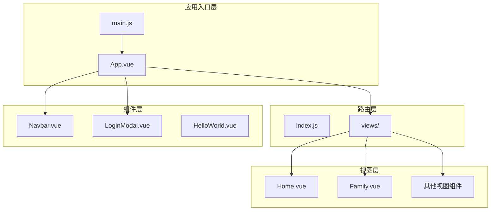
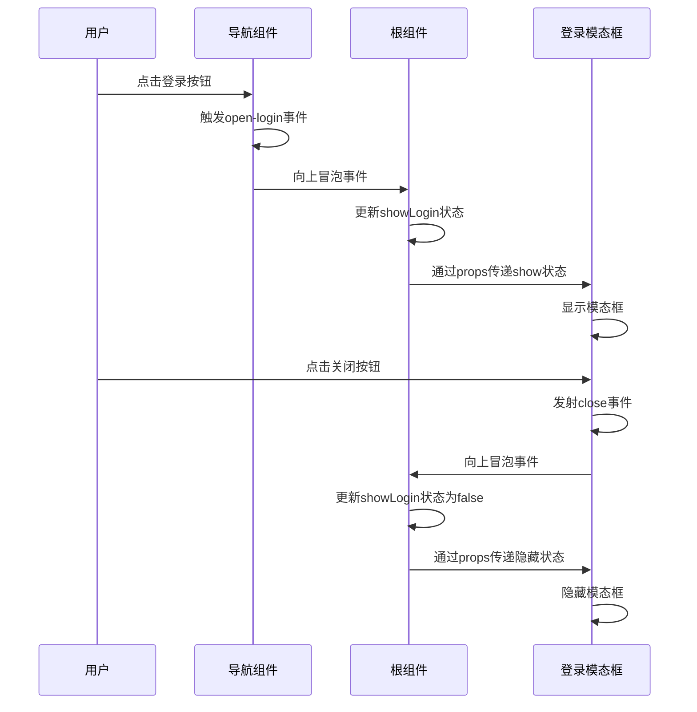
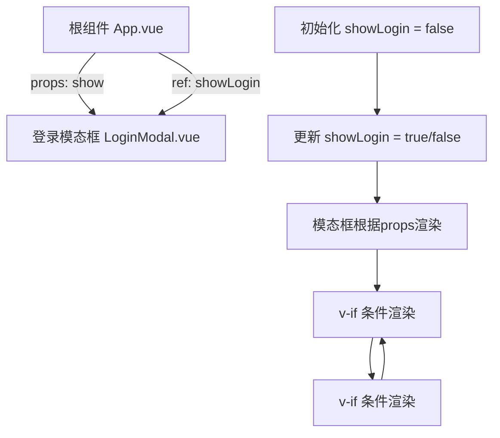
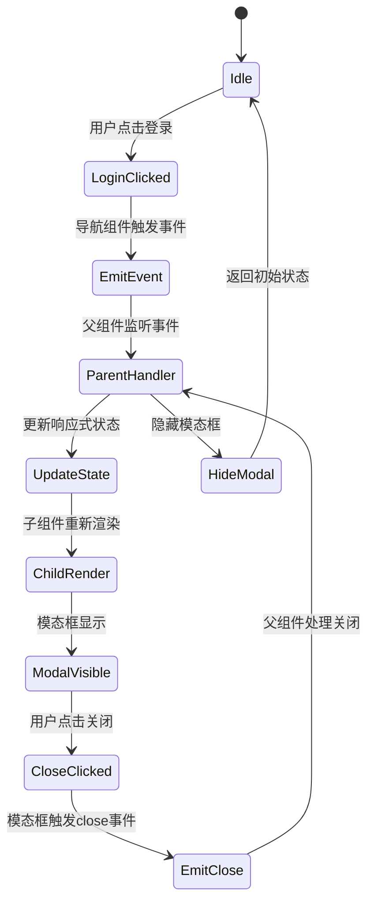
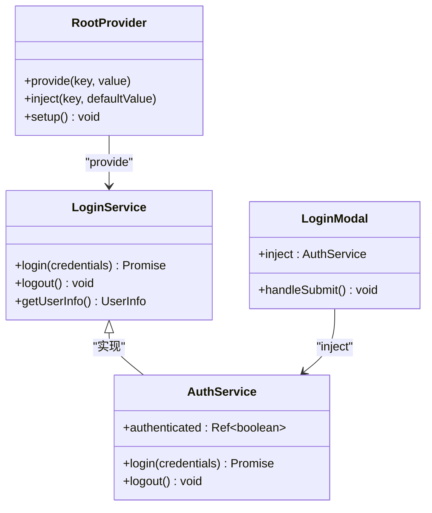
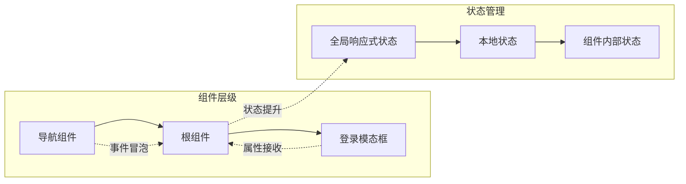
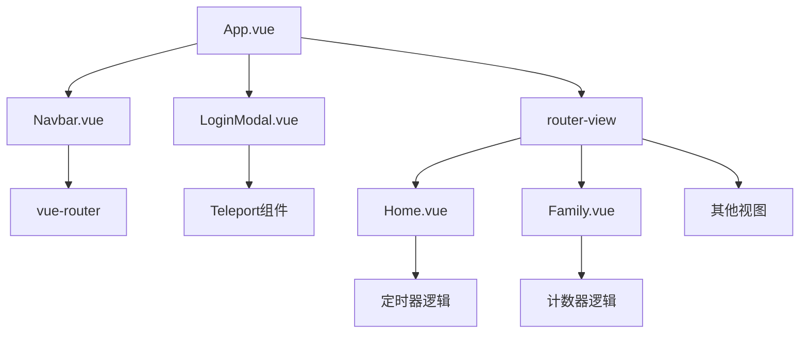

# 组件通信机制

<cite>
**本文档引用的文件**
- [src/App.vue](file://src/App.vue)
- [src/main.js](file://src/main.js)
- [src/components/Navbar.vue](file://src/components/Navbar.vue)
- [src/components/LoginModal.vue](file://src/components/LoginModal.vue)
- [src/components/HelloWorld.vue](file://src/components/HelloWorld.vue)
- [src/router/index.js](file://src/router/index.js)
- [src/views/Home.vue](file://src/views/Home.vue)
- [src/views/Family.vue](file://src/views/Family.vue)
- [package.json](file://package.json)
- [vite.config.js](file://vite.config.js)
</cite>

## 目录
1. [简介](#简介)
2. [项目结构](#项目结构)
3. [核心组件](#核心组件)
4. [架构概览](#架构概览)
5. [详细组件分析](#详细组件分析)
6. [依赖关系分析](#依赖关系分析)
7. [性能考虑](#性能考虑)
8. [故障排除指南](#故障排除指南)
9. [最佳实践](#最佳实践)
10. [结论](#结论)

## 简介

本文件深入解析Vue 3 Composition API中的组件通信机制，重点涵盖props传递、emits事件发射和provide/inject依赖注入模式。通过分析实际项目代码，展示父子组件间的单向数据流和事件冒泡机制，文档化组件间的跨层级通信方案和状态提升策略，并提供具体的代码示例路径和组件解耦与通信优化的最佳实践指导。

## 项目结构

该项目采用标准的Vue 3单页应用架构，主要包含以下层次：



**图表来源**
- [src/main.js:1-9](file://src/main.js#L1-L9)
- [src/App.vue:1-30](file://src/App.vue#L1-L30)
- [src/router/index.js:1-28](file://src/router/index.js#L1-L28)

**章节来源**
- [src/main.js:1-9](file://src/main.js#L1-L9)
- [src/App.vue:1-30](file://src/App.vue#L1-L30)
- [src/router/index.js:1-28](file://src/router/index.js#L1-L28)

## 核心组件

### 应用根组件

应用的根组件负责管理全局状态和组件协调：

- **状态管理**: 使用响应式ref管理登录模态框的显示状态
- **事件处理**: 提供openLogin和closeLogin方法处理登录状态切换
- **模板结构**: 包含导航栏、路由视图和登录模态框

### 导航组件

导航组件负责用户界面导航和登录触发：

- **路由集成**: 集成vue-router，提供导航链接
- **事件发射**: 通过自定义事件触发登录流程
- **状态显示**: 基于当前路由动态高亮活动菜单项

### 登录模态框组件

登录模态框实现完整的用户认证功能：

- **属性接收**: 接收show布尔值控制显示状态
- **事件发射**: 发射close事件通知父组件关闭
- **表单处理**: 实现登录/注册表单逻辑
- **模态框特性**: 使用Teleport组件实现跨DOM节点渲染

**章节来源**
- [src/App.vue:1-30](file://src/App.vue#L1-L30)
- [src/components/Navbar.vue:1-140](file://src/components/Navbar.vue#L1-L140)
- [src/components/LoginModal.vue:1-316](file://src/components/LoginModal.vue#L1-L316)

## 架构概览

该应用采用典型的单向数据流架构，通过props向下传递数据，通过emits向上冒泡事件：



**图表来源**
- [src/components/Navbar.vue:23-25](file://src/components/Navbar.vue#L23-L25)
- [src/App.vue:8-14](file://src/App.vue#L8-L14)
- [src/components/LoginModal.vue:14-16](file://src/components/LoginModal.vue#L14-L16)

**章节来源**
- [src/components/Navbar.vue:1-140](file://src/components/Navbar.vue#L1-L140)
- [src/App.vue:1-30](file://src/App.vue#L1-L30)
- [src/components/LoginModal.vue:1-316](file://src/components/LoginModal.vue#L1-L316)

## 详细组件分析

### Props传递机制分析

#### 父子组件间的数据流向

在当前项目中，props传递主要体现在根组件向登录模态框传递显示状态：



**图表来源**
- [src/App.vue:6](file://src/App.vue#L6)
- [src/App.vue:21](file://src/App.vue#L21)
- [src/components/LoginModal.vue:4-6](file://src/components/LoginModal.vue#L4-L6)

#### Props定义和验证

登录模态框的props定义展示了Vue 3 Composition API的标准用法：

- **类型定义**: `show: Boolean` 定义了props的类型
- **默认值**: 可以通过defineProps的第二个参数设置默认值
- **验证规则**: 支持复杂的类型验证和必填字段检查

**章节来源**
- [src/App.vue:1-30](file://src/App.vue#L1-L30)
- [src/components/LoginModal.vue:1-316](file://src/components/LoginModal.vue#L1-L316)

### Emits事件发射机制分析

#### 事件冒泡和处理流程

事件发射机制在导航组件和根组件之间建立了清晰的通信通道：



**图表来源**
- [src/components/Navbar.vue:23-25](file://src/components/Navbar.vue#L23-L25)
- [src/App.vue:8-14](file://src/App.vue#L8-L14)
- [src/components/LoginModal.vue:14-16](file://src/components/LoginModal.vue#L14-L16)

#### 事件定义和参数传递

事件发射支持参数传递，增强了组件间的通信能力：

- **简单事件**: 不带参数的事件如`close`
- **带参数事件**: 可以传递复杂数据结构
- **事件命名**: 使用kebab-case命名约定

**章节来源**
- [src/components/Navbar.vue:1-140](file://src/components/Navbar.vue#L1-L140)
- [src/components/LoginModal.vue:1-316](file://src/components/LoginModal.vue#L1-L316)

### Provide/Inject依赖注入模式分析

虽然当前项目中没有直接使用provide/inject模式，但可以轻松扩展实现：

#### 依赖注入的实现方案



**图表来源**
- [src/App.vue:1-15](file://src/App.vue#L1-L15)

#### 依赖注入的优势

- **跨层级通信**: 解决多层嵌套组件间的通信问题
- **解耦设计**: 减少props drilling和事件链
- **可测试性**: 便于模拟和替换依赖服务

**章节来源**
- [src/App.vue:1-30](file://src/App.vue#L1-L30)

### 跨层级通信方案

#### 状态提升策略

当前项目采用的状态提升策略非常典型：



**图表来源**
- [src/App.vue:6](file://src/App.vue#L6)
- [src/components/Navbar.vue:23-25](file://src/components/Navbar.vue#L23-L25)
- [src/components/LoginModal.vue:4-6](file://src/components/LoginModal.vue#L4-L6)

#### 单向数据流原则

项目严格遵循Vue的单向数据流原则：

- **数据流向**: 从父组件到子组件的props传递
- **事件流向**: 从子组件到父组件的emits事件
- **状态集中**: 全局状态集中在根组件管理

**章节来源**
- [src/App.vue:1-30](file://src/App.vue#L1-L30)
- [src/components/Navbar.vue:1-140](file://src/components/Navbar.vue#L1-L140)
- [src/components/LoginModal.vue:1-316](file://src/components/LoginModal.vue#L1-L316)

## 依赖关系分析

### 外部依赖

项目依赖关系清晰明确：

```mermaid
graph TB
subgraph "运行时依赖"
Vue[vue ^3.5.32]
Router[vue-router ^4.6.4]
end
subgraph "开发时依赖"
Vite[vite ^8.0.4]
VuePlugin[@vitejs/plugin-vue ^6.0.5]
end
subgraph "应用代码"
Main[main.js]
App[App.vue]
Components[组件库]
Views[视图组件]
end
Main --> Vue
Main --> Router
Main --> App
App --> Components
App --> Views
Components --> Vue
Views --> Vue
```

**图表来源**
- [package.json:11-18](file://package.json#L11-L18)
- [src/main.js:1-8](file://src/main.js#L1-L8)

### 内部模块依赖

组件间的依赖关系体现了清晰的层次结构：



**图表来源**
- [src/App.vue:1-4](file://src/App.vue#L1-L4)
- [src/components/Navbar.vue:1-6](file://src/components/Navbar.vue#L1-L6)
- [src/router/index.js:1-28](file://src/router/index.js#L1-L28)

**章节来源**
- [package.json:1-20](file://package.json#L1-L20)
- [src/main.js:1-9](file://src/main.js#L1-L9)
- [src/App.vue:1-30](file://src/App.vue#L1-L30)

## 性能考虑

### 渲染优化

项目中已经采用了多项性能优化措施：

- **条件渲染**: 使用v-if实现按需渲染，减少不必要的DOM节点
- **响应式更新**: 仅在状态变化时触发重新渲染
- **事件处理**: 合理的事件绑定避免重复渲染

### 内存管理

- **定时器清理**: 在组件卸载时清理定时器，防止内存泄漏
- **生命周期管理**: 正确使用onMounted和onUnmounted钩子

### 代码分割

- **路由懒加载**: 可以通过路由配置实现组件的懒加载
- **按需导入**: 组件按需导入减少初始包体积

## 故障排除指南

### 常见问题诊断

#### 事件未正确触发

**症状**: 子组件无法向父组件发送事件

**排查步骤**:
1. 检查defineEmits的事件名称是否正确
2. 确认事件发射调用位置
3. 验证父组件的事件监听器

#### Props未正确传递

**症状**: 子组件无法接收到预期的props值

**排查步骤**:
1. 检查父组件的属性绑定语法
2. 验证props类型定义
3. 确认响应式引用的使用

#### 状态不一致

**症状**: 组件状态与预期不符

**排查步骤**:
1. 检查响应式状态的更新时机
2. 验证事件冒泡的完整链路
3. 确认状态提升的实现

**章节来源**
- [src/components/Navbar.vue:23-25](file://src/components/Navbar.vue#L23-L25)
- [src/components/LoginModal.vue:14-16](file://src/components/LoginModal.vue#L14-L16)
- [src/App.vue:8-14](file://src/App.vue#L8-L14)

## 最佳实践

### 组件设计原则

#### 单一职责原则

每个组件应该专注于单一功能：
- 导航组件只负责导航和登录触发
- 登录模态框只负责用户认证交互
- 视图组件只负责内容展示

#### 开闭原则

组件设计应该对扩展开放，对修改封闭：
- 通过props和emits扩展功能
- 避免硬编码的依赖关系
- 使用组合式API的灵活性

### 通信模式选择

#### 何时使用props

- 父组件向子组件传递配置信息
- 控制子组件的显示状态
- 传递只读数据给子组件

#### 何时使用emits

- 子组件向父组件报告用户操作
- 子组件请求父组件执行某些操作
- 子组件需要通知父组件状态变化

#### 何时使用provide/inject

- 多层级组件共享服务或配置
- 避免props drilling
- 实现跨组件的服务注入

### 代码组织规范

#### 文件命名

- 组件文件使用PascalCase命名
- 属性定义使用camelCase
- 事件名称使用kebab-case

#### 代码结构

- 统一的Composition API使用模式
- 明确的导入顺序
- 清晰的注释和文档

### 性能优化建议

#### 渲染优化

- 使用v-memo优化昂贵的计算
- 合理使用key属性
- 避免不必要的响应式依赖

#### 状态管理

- 避免过度的状态提升
- 使用局部状态处理组件内部逻辑
- 考虑使用pinia等状态管理库

#### 资源管理

- 及时清理定时器和订阅
- 合理使用Teleport组件
- 优化图片和资源加载

## 结论

本项目成功展示了Vue 3 Composition API中组件通信的核心机制。通过props传递、emits事件发射和provide/inject依赖注入模式的合理运用，实现了清晰的单向数据流和高效的组件通信。

项目的主要优势包括：
- **清晰的架构层次**: 从根组件到子组件的明确职责分工
- **简洁的通信协议**: 基于props和emits的简单易懂的通信模式
- **良好的性能表现**: 通过条件渲染和响应式更新优化性能
- **易于维护的代码**: 符合Vue 3最佳实践的代码组织

对于更复杂的场景，可以考虑引入pinia状态管理库或自定义provide/inject服务，以进一步提升组件通信的灵活性和可维护性。同时，建议在大型项目中建立统一的组件通信规范，确保团队协作的一致性和效率。