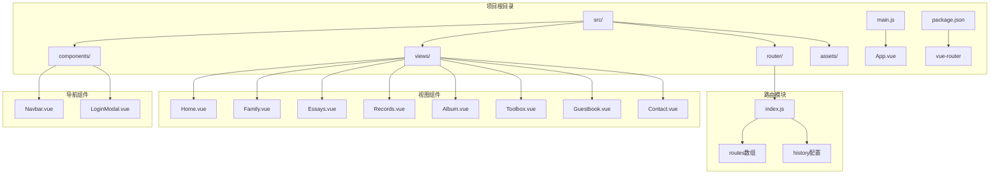
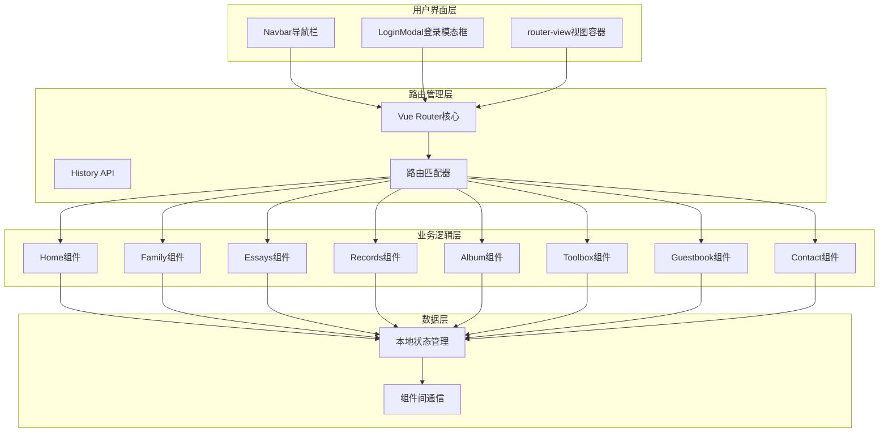
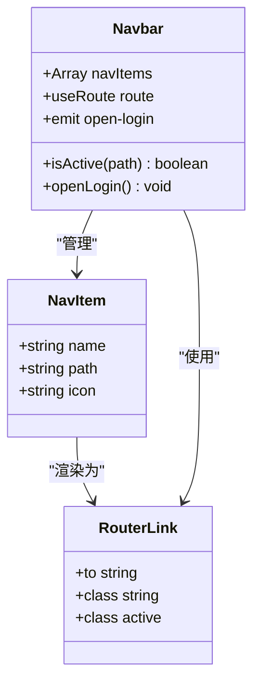
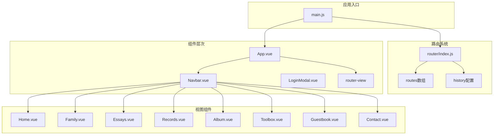
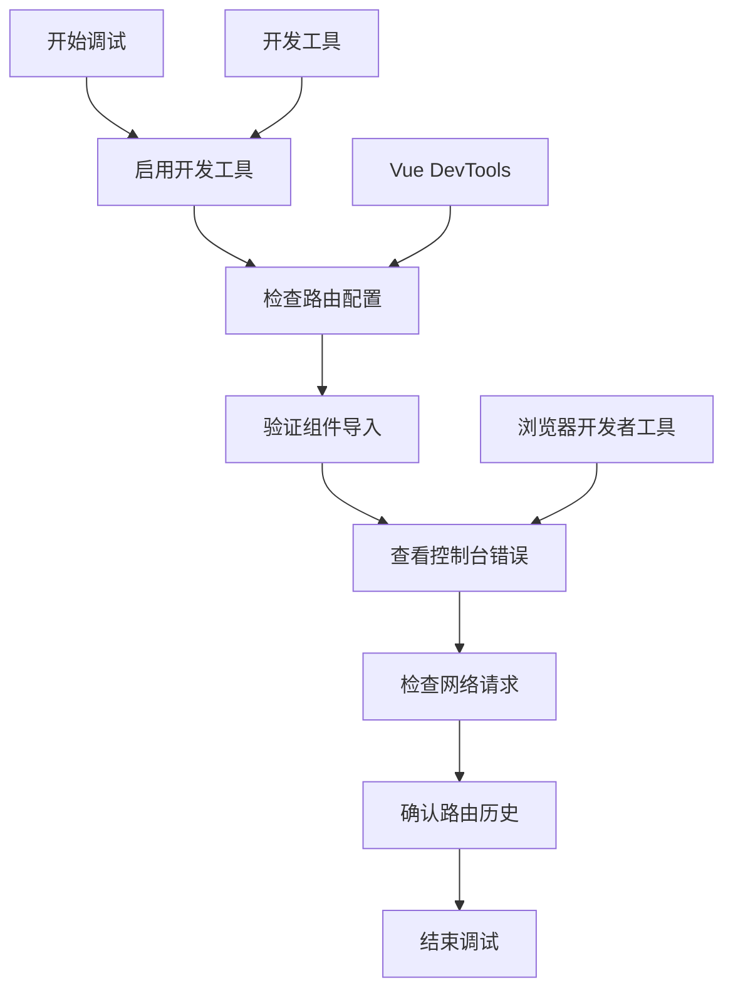

# 路由系统

<cite>
**本文档引用的文件**
- [src/router/index.js](file://src/router/index.js)
- [src/main.js](file://src/main.js)
- [src/App.vue](file://src/App.vue)
- [src/components/Navbar.vue](file://src/components/Navbar.vue)
- [src/views/Home.vue](file://src/views/Home.vue)
- [src/views/Family.vue](file://src/views/Family.vue)
- [src/views/Essays.vue](file://src/views/Essays.vue)
- [src/views/Records.vue](file://src/views/Records.vue)
- [src/views/Album.vue](file://src/views/Album.vue)
- [src/views/Toolbox.vue](file://src/views/Toolbox.vue)
- [src/views/Guestbook.vue](file://src/views/Guestbook.vue)
- [src/views/Contact.vue](file://src/views/Contact.vue)
- [package.json](file://package.json)
</cite>

## 目录
1. [简介](#简介)
2. [项目结构](#项目结构)
3. [核心组件](#核心组件)
4. [架构概览](#架构概览)
5. [详细组件分析](#详细组件分析)
6. [依赖关系分析](#依赖关系分析)
7. [性能考虑](#性能考虑)
8. [故障排除指南](#故障排除指南)
9. [结论](#结论)

## 简介

这是一个基于Vue 3和Vue Router 4构建的单页应用路由系统。该系统采用现代前端开发最佳实践，使用Vite作为构建工具，实现了完整的SPA（单页应用）路由功能。系统包含8个主要页面，通过路由进行导航，并提供了基础的导航守卫和权限控制框架。

## 项目结构

该项目采用标准的Vue 3项目结构，路由系统位于`src/router/`目录下，所有路由定义都集中在一个文件中管理。



**图表来源**
- [src/router/index.js:1-28](file://src/router/index.js#L1-L28)
- [src/main.js:1-9](file://src/main.js#L1-L9)
- [src/App.vue:1-30](file://src/App.vue#L1-L30)

**章节来源**
- [src/router/index.js:1-28](file://src/router/index.js#L1-L28)
- [src/main.js:1-9](file://src/main.js#L1-L9)
- [src/App.vue:1-30](file://src/App.vue#L1-L30)

## 核心组件

### 路由配置核心

路由系统的核心配置位于`src/router/index.js`文件中，采用Vue Router 4的标准配置方式：

- **路由历史模式**：使用`createWebHistory`实现HTML5 History API模式
- **路由定义**：8个主要页面的静态路由配置
- **组件导入**：按需导入各个视图组件

### 应用入口集成

在`src/main.js`中，应用通过`app.use(router)`的方式集成路由系统，确保全局可用性。

### 视图容器

`src/App.vue`中的`<router-view />`标签是所有视图组件的渲染容器，负责根据当前路由动态渲染对应的组件。

**章节来源**
- [src/router/index.js:11-25](file://src/router/index.js#L11-L25)
- [src/main.js:6-8](file://src/main.js#L6-L8)
- [src/App.vue:20](file://src/App.vue#L20)

## 架构概览

该路由系统采用经典的MVC架构模式，路由层负责URL解析和页面切换，视图层负责数据展示，控制器层通过组件逻辑处理用户交互。



**图表来源**
- [src/App.vue:17-23](file://src/App.vue#L17-L23)
- [src/components/Navbar.vue:28-50](file://src/components/Navbar.vue#L28-L50)
- [src/router/index.js:11-20](file://src/router/index.js#L11-L20)

## 详细组件分析

### 路由配置分析

#### 静态路由定义

系统定义了8个静态路由，每个路由都包含路径、名称和对应的组件：

| 路由名称 | 路径 | 组件 |
|---------|------|------|
| Home | `/` | Home.vue |
| Family | `/family` | Family.vue |
| Essays | `/essays` | Essays.vue |
| Records | `/records` | Records.vue |
| Album | `/album` | Album.vue |
| Toolbox | `/toolbox` | Toolbox.vue |
| Guestbook | `/guestbook` | Guestbook.vue |
| Contact | `/contact` | Contact.vue |

#### 路由历史配置

使用`createWebHistory()`创建基于浏览器History API的路由历史，支持浏览器前进后退功能。

**章节来源**
- [src/router/index.js:11-25](file://src/router/index.js#L11-L25)

### 导航栏组件分析

`src/components/Navbar.vue`是路由系统的核心导航组件，实现了以下功能：

#### 导航项配置



**图表来源**
- [src/components/Navbar.vue:1-26](file://src/components/Navbar.vue#L1-L26)
- [src/components/Navbar.vue:8-17](file://src/components/Navbar.vue#L8-L17)
- [src/components/Navbar.vue:35-44](file://src/components/Navbar.vue#L35-L44)

#### 活跃状态检测

通过`useRoute()`钩子获取当前路由信息，使用`isActive()`方法比较当前路径与导航项路径，实现活跃状态的动态切换。

**章节来源**
- [src/components/Navbar.vue:19-25](file://src/components/Navbar.vue#L19-L25)

### 视图组件分析

#### 主页组件 (Home.vue)

主页组件展示了时间显示功能，体现了Vue 3 Composition API的使用：

- **响应式状态**：使用`ref()`管理时间、日期等状态
- **生命周期钩子**：`onMounted()`和`onUnmounted()`处理定时器
- **实时更新**：每秒更新一次显示内容

#### 家庭组件 (Family.vue)

家庭组件实现了纪念日计时器功能：

- **时间计算**：计算从指定日期到现在的时间差
- **倒计时功能**：计算到下一个新年的剩余时间
- **动画效果**：使用CSS动画实现爱心跳动效果

#### 随笔组件 (Essays.vue)

随笔组件展示了数据列表渲染：

- **静态数据**：预定义的随笔内容数组
- **卡片布局**：使用Flexbox实现响应式布局
- **用户信息**：展示作者头像、等级等信息

#### 记录组件 (Records.vue)

记录组件实现了网格布局：

- **响应式网格**：使用CSS Grid实现自适应布局
- **卡片设计**：悬停效果和阴影增强用户体验
- **图标系统**：使用emoji作为图标

#### 相册组件 (Album.vue)

相册组件展示了图片网格：

- **图片覆盖**：使用CSS `aspect-ratio`保持图片比例
- **悬停效果**：图片缩放和遮罩层显示
- **统计信息**：显示每张相册中的图片数量

#### 百宝箱组件 (Toolbox.vue)

百宝箱组件实现了工具卡片：

- **颜色主题**：使用CSS变量实现动态颜色
- **网格布局**：响应式工具卡片网格
- **交互效果**：悬停时的颜色变化

#### 留言板组件 (Guestbook.vue)

留言板组件实现了消息提交功能：

- **表单验证**：检查输入是否为空
- **消息列表**：使用`unshift()`添加新消息
- **日期处理**：格式化当前日期

#### 联系方式组件 (Contact.vue)

联系组件展示了联系信息：

- **双列布局**：使用CSS Grid实现两列布局
- **社交链接**：悬停效果和渐变背景
- **响应式设计**：移动端单列布局

**章节来源**
- [src/views/Home.vue:1-37](file://src/views/Home.vue#L1-L37)
- [src/views/Family.vue:19-55](file://src/views/Family.vue#L19-L55)
- [src/views/Essays.vue:4-41](file://src/views/Essays.vue#L4-L41)
- [src/views/Records.vue:4-9](file://src/views/Records.vue#L4-L9)
- [src/views/Album.vue:4-11](file://src/views/Album.vue#L4-L11)
- [src/views/Toolbox.vue:4-11](file://src/views/Toolbox.vue#L4-L11)
- [src/views/Guestbook.vue:13-25](file://src/views/Guestbook.vue#L13-L25)
- [src/views/Contact.vue:4-16](file://src/views/Contact.vue#L4-L16)

## 依赖关系分析

### 外部依赖

项目使用以下关键依赖：

```mermaid
graph LR
A[Vue 3.5.32] --> B[Composition API]
C[Vue Router 4.6.4] --> D[路由管理]
E[Vite 8.0.4] --> F[构建工具]
G[@vitejs/plugin-vue] --> H[Vue插件]
I[项目] --> A
I --> C
I --> E
I --> G
```

**图表来源**
- [package.json:11-18](file://package.json#L11-L18)

### 内部依赖关系



**图表来源**
- [src/main.js:1-9](file://src/main.js#L1-L9)
- [src/router/index.js:1-28](file://src/router/index.js#L1-L28)
- [src/App.vue:17-23](file://src/App.vue#L17-L23)

**章节来源**
- [package.json:11-18](file://package.json#L11-L18)
- [src/main.js:1-9](file://src/main.js#L1-L9)
- [src/router/index.js:1-28](file://src/router/index.js#L1-L28)

## 性能考虑

### 路由性能优化

1. **懒加载策略**：当前采用静态导入，可考虑实现路由级别的懒加载以减少初始包大小
2. **组件缓存**：可利用Vue Router的`<keep-alive>`实现组件缓存
3. **预加载机制**：可实现路由预加载提升用户体验

### 渲染性能

1. **虚拟滚动**：对于大量数据的列表（如随笔、记录），可考虑虚拟滚动优化
2. **图片优化**：使用适当的图片尺寸和格式，实现懒加载
3. **CSS优化**：避免过度的DOM操作，使用CSS动画替代JavaScript动画

### 内存管理

1. **定时器清理**：确保在组件卸载时清理定时器
2. **事件监听器**：及时移除事件监听器
3. **大对象释放**：避免在组件中持有不必要的大对象引用

## 故障排除指南

### 常见问题及解决方案

#### 路由无法正常跳转

**问题症状**：
- 点击导航链接无反应
- 页面不刷新但URL改变

**可能原因**：
1. 缺少`<router-link>`或`router-link`属性错误
2. 路由配置中缺少对应路由
3. 组件未正确导入

**解决步骤**：
1. 检查导航组件中的路由配置
2. 确认路由文件中存在对应路由定义
3. 验证组件导入路径正确性

#### 活跃状态不显示

**问题症状**：
- 当前页面导航项不显示为活跃状态

**可能原因**：
1. `useRoute()`钩子使用错误
2. 路径比较逻辑问题
3. CSS类名冲突

**解决步骤**：
1. 检查`useRoute()`的正确使用
2. 验证路径比较逻辑
3. 确认CSS类名未被覆盖

#### 组件不渲染

**问题症状**：
- 点击导航后页面空白

**可能原因**：
1. `<router-view>`缺失
2. 组件导出问题
3. 路由历史配置错误

**解决步骤**：
1. 确认`App.vue`中存在`<router-view>`
2. 检查组件默认导出
3. 验证路由历史配置

### 调试技巧

#### 路由调试



**图表来源**
- [src/router/index.js:11-25](file://src/router/index.js#L11-L25)
- [src/App.vue:20](file://src/App.vue#L20)

#### 性能监控

1. **Vue DevTools**：监控组件渲染和状态变化
2. **浏览器性能面板**：分析路由切换性能
3. **网络面板**：检查资源加载情况

**章节来源**
- [src/components/Navbar.vue:19-21](file://src/components/Navbar.vue#L19-L21)
- [src/router/index.js:22-25](file://src/router/index.js#L22-L25)

## 结论

该Vue Router路由系统展现了现代前端应用的完整实现，具有以下特点：

### 优势

1. **简洁明了**：路由配置简单直观，易于理解和维护
2. **组件化设计**：采用Vue 3 Composition API，代码结构清晰
3. **响应式布局**：各组件都实现了良好的响应式设计
4. **功能完整**：涵盖了导航、数据展示、用户交互等多个方面

### 改进建议

1. **路由守卫**：可添加全局前置/后置守卫实现权限控制
2. **懒加载**：实现路由级别的代码分割优化性能
3. **错误处理**：添加路由级错误边界处理异常情况
4. **类型安全**：引入TypeScript提升代码质量

### 扩展方向

1. **嵌套路由**：支持更复杂的页面层级结构
2. **动态路由**：实现基于参数的动态页面生成
3. **权限系统**：集成用户认证和权限管理
4. **国际化**：支持多语言路由和页面内容

该路由系统为Vue 3 SPA应用提供了坚实的基础，通过合理的架构设计和组件化实现，为后续的功能扩展和性能优化奠定了良好基础。