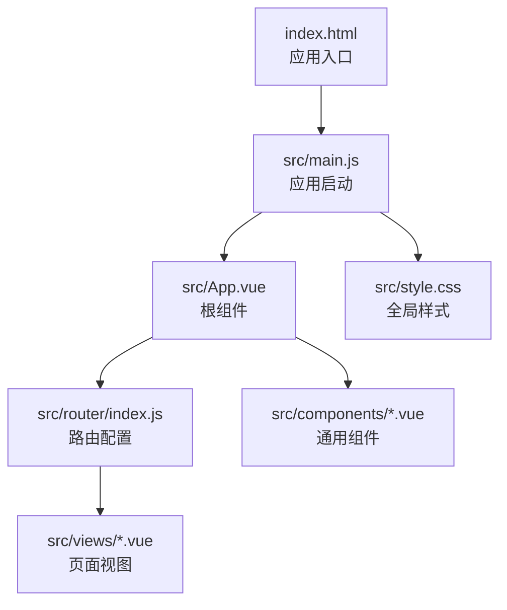
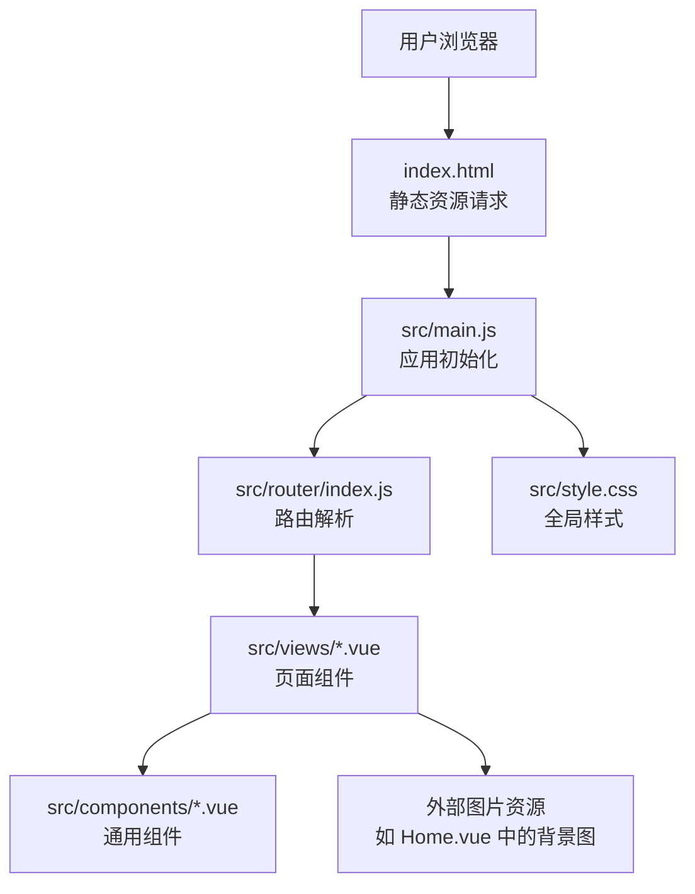
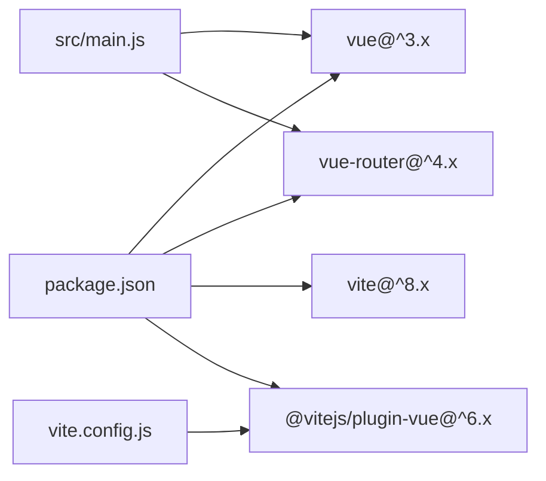
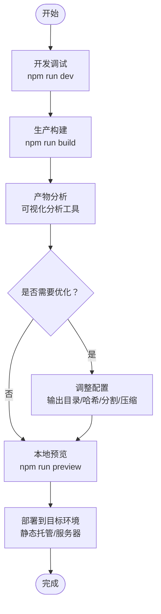
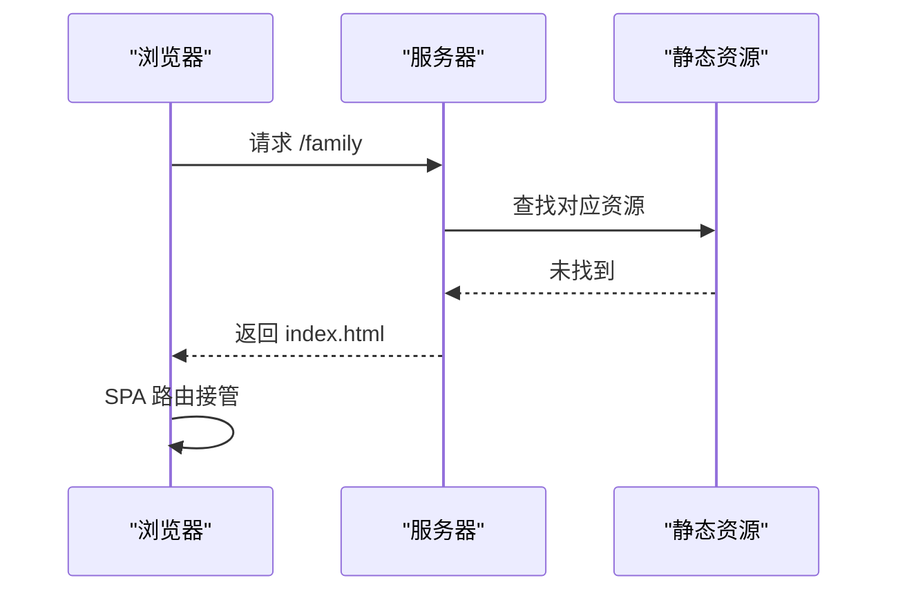
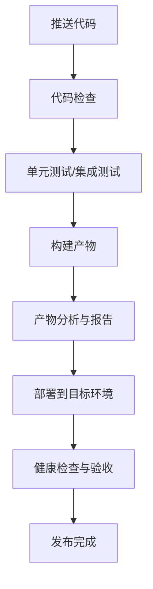

# 部署与构建

<cite>
**本文引用的文件**
- [vite.config.js](file://vite.config.js)
- [package.json](file://package.json)
- [index.html](file://index.html)
- [src/main.js](file://src/main.js)
- [src/App.vue](file://src/App.vue)
- [src/router/index.js](file://src/router/index.js)
- [src/views/Home.vue](file://src/views/Home.vue)
- [src/components/Navbar.vue](file://src/components/Navbar.vue)
- [src/style.css](file://src/style.css)
- [README.md](file://README.md)
</cite>

## 目录
1. [简介](#简介)
2. [项目结构](#项目结构)
3. [核心组件](#核心组件)
4. [架构总览](#架构总览)
5. [详细组件分析](#详细组件分析)
6. [依赖分析](#依赖分析)
7. [性能考虑](#性能考虑)
8. [故障排查指南](#故障排查指南)
9. [结论](#结论)
10. [附录](#附录)

## 简介
本指南面向部署与构建场景，围绕当前仓库中的 Vite + Vue 3 单页应用，系统讲解从本地开发到生产构建、打包策略、性能优化、多环境部署、CDN 与缓存策略、以及 CI/CD 自动化与产物分析的方法论。文档以仓库现有配置为依据，结合最佳实践给出可操作的建议与图示。

## 项目结构
该仓库采用标准的 Vite + Vue 3 结构：入口 HTML 指向前端应用入口模块；应用通过路由组织页面视图；样式集中管理；构建脚本通过 Vite 执行。

图表来源
- [index.html:1-14](file://index.html#L1-L14)
- [src/main.js:1-9](file://src/main.js#L1-L9)
- [src/App.vue:1-30](file://src/App.vue#L1-L30)
- [src/router/index.js:1-28](file://src/router/index.js#L1-L28)

章节来源
- [index.html:1-14](file://index.html#L1-L14)
- [src/main.js:1-9](file://src/main.js#L1-L9)
- [src/App.vue:1-30](file://src/App.vue#L1-L30)
- [src/router/index.js:1-28](file://src/router/index.js#L1-L28)
- [src/style.css:1-56](file://src/style.css#L1-L56)

## 核心组件
- 构建配置：默认启用 Vue 插件，未配置额外优化项，适合快速上线与迭代。
- 包管理脚本：提供 dev/build/preview 三类常用命令，满足开发调试、生产构建与本地预览。
- 应用入口：挂载根组件并注入路由；HTML 中通过模块脚本加载入口。
- 路由体系：基于 History 模式定义多页面路由，适配静态站点部署。
- 视图与组件：页面组件内含外部图片资源引用，需在构建时正确处理静态资源。

章节来源
- [vite.config.js:1-8](file://vite.config.js#L1-L8)
- [package.json:6-10](file://package.json#L6-L10)
- [index.html:9-12](file://index.html#L9-L12)
- [src/main.js:1-9](file://src/main.js#L1-L9)
- [src/router/index.js:22-25](file://src/router/index.js#L22-L25)
- [src/views/Home.vue:82-83](file://src/views/Home.vue#L82-L83)

## 架构总览
下图展示从浏览器访问到页面渲染的关键路径，以及构建产物在生产环境的加载方式。

图表来源
- [index.html:1-14](file://index.html#L1-L14)
- [src/main.js:1-9](file://src/main.js#L1-L9)
- [src/router/index.js:1-28](file://src/router/index.js#L1-L28)
- [src/views/Home.vue:82-83](file://src/views/Home.vue#L82-L83)

## 详细组件分析

### 构建配置与打包策略
- 当前配置启用 Vue 插件，未设置产物输出目录、资源路径或压缩策略，适合基础部署。
- 建议在生产构建时明确以下方向：
  - 输出目录与公共路径：确保静态资源与 HTML 的相对关系清晰。
  - 资源命名与哈希：开启文件名哈希以便浏览器缓存与失效控制。
  - 代码分割：按路由拆分包体，减少首屏体积。
  - 压缩与 Tree-Shaking：启用最小化与无用代码剔除。
  - 预加载/预取：对关键路由或资源进行预加载，提升交互速度。
- 产物分析：使用可视化分析工具查看包体构成，识别大体积依赖与重复模块，针对性优化。

章节来源
- [vite.config.js:5-7](file://vite.config.js#L5-L7)
- [package.json:8](file://package.json#L8)

### 生产环境优化与静态资源处理
- 外部资源引用：页面组件中存在外部图片资源引用，构建时应确保资源被正确复制或内联策略合理。
- 图片与媒体：建议对图片进行压缩与格式优化（如 WebP），并按需懒加载。
- 字体与图标：若使用在线字体或图标库，建议结合 CDN 与缓存头策略。
- CSS 与 JS：启用 CSS 提取与 JS 最小化；对第三方库采用按需引入与独立分包。

章节来源
- [src/views/Home.vue:82-83](file://src/views/Home.vue#L82-L83)

### 路由与单页应用部署
- 路由模式：使用 History 模式，需要服务器端配置“回退到 index.html”，以保证刷新与直链访问正常。
- 多页面路由：各页面组件独立，利于按需加载与缓存控制。
- 路由守卫与权限：可在路由层增加鉴权逻辑，避免未授权访问敏感页面。

章节来源
- [src/router/index.js:22-25](file://src/router/index.js#L22-L25)

### 应用入口与运行时行为
- 入口脚本：创建应用实例、挂载路由、挂载根组件。
- 样式注入：全局样式在入口处统一引入，便于主题与布局一致性。
- 组件通信：根组件通过事件与子组件交互，保持组件职责单一。

章节来源
- [src/main.js:1-9](file://src/main.js#L1-L9)
- [src/style.css:1-56](file://src/style.css#L1-L56)
- [src/App.vue:17-23](file://src/App.vue#L17-L23)

### 组件与页面结构
- 导航栏组件：响应式设计，移动端隐藏菜单，点击登录按钮触发事件。
- 首页视图：包含时间显示、搜索框与快捷链接等区域，样式采用渐变背景与模糊效果。
- 页面间切换：通过路由链接实现 SPA 导航，避免整页刷新。

章节来源
- [src/components/Navbar.vue:19-25](file://src/components/Navbar.vue#L19-L25)
- [src/views/Home.vue:39-77](file://src/views/Home.vue#L39-L77)

### 构建流程与产物
- 开发流程：执行开发服务器，热更新提升调试效率。
- 生产构建：生成静态资源与 HTML 文件，准备部署。
- 本地预览：构建后在本地验证产物可用性。

章节来源
- [package.json:7-9](file://package.json#L7-L9)

## 依赖分析
- 运行时依赖：Vue 3 与 Vue Router，提供响应式与路由能力。
- 开发依赖：Vite 与 @vitejs/plugin-vue，提供构建与开发体验。
- 依赖关系：应用通过入口脚本引入依赖，路由与组件按需加载。

图表来源
- [package.json:11-18](file://package.json#L11-L18)
- [src/main.js:1-4](file://src/main.js#L1-L4)
- [vite.config.js:2](file://vite.config.js#L2)

章节来源
- [package.json:11-18](file://package.json#L11-L18)
- [src/main.js:1-4](file://src/main.js#L1-L4)
- [vite.config.js:2](file://vite.config.js#L2)

## 性能考虑
- 体积优化
  - 分析包体：定位大体积依赖与重复模块，优先移除或替换。
  - 代码分割：按路由或组件拆分包体，配合预加载提升关键路径性能。
  - Tree-Shaking：确保 ES 模块导入导出规范，减少无效代码。
- 资源优化
  - 图片：压缩与格式优化；对首屏外图片采用懒加载。
  - 字体与图标：使用 CDN 并设置长缓存；关注跨域与安全头。
  - CSS：提取关键样式，非关键样式延迟加载。
- 缓存策略
  - 静态资源：文件名带哈希，浏览器长期缓存；HTML 不缓存或短缓存。
  - 服务端：设置合理的 Cache-Control 与 ETag，支持条件请求。
- 网络与传输
  - 启用 Gzip/Brotli 压缩；使用 CDN 加速边缘节点。
  - 关键资源：预加载与 DNS 预解析，缩短关键路径时间。

## 故障排查指南
- 刷新或直链 404
  - 症状：History 模式下刷新或直接访问路由地址返回 404。
  - 排查：确认服务器已将所有未知路径回退到 index.html。
  - 参考：路由历史模式配置与服务器回退规则。
- 资源 404 或白屏
  - 症状：图片、字体或样式无法加载。
  - 排查：检查构建输出目录与公共路径；确认资源是否被正确复制或内联。
  - 参考：外部图片引用与构建资源处理。
- 预览与本地不一致
  - 症状：本地开发正常，构建后异常。
  - 排查：对比 dev 与 build 的环境变量、插件差异与输出目录。
  - 参考：构建脚本与配置文件。
- 首屏慢
  - 症状：页面加载缓慢。
  - 排查：分析包体构成，优化大依赖与拆分代码；启用压缩与缓存。
  - 参考：构建优化与缓存策略。

章节来源
- [src/router/index.js:22-25](file://src/router/index.js#L22-L25)
- [src/views/Home.vue:82-83](file://src/views/Home.vue#L82-L83)
- [package.json:7-9](file://package.json#L7-L9)

## 结论
本项目具备快速部署的基础条件：简洁的入口、清晰的路由与组件结构、以及标准的 Vite 构建流程。建议在生产构建中补充输出目录、资源命名哈希、代码分割与压缩等优化，并针对服务器回退、CDN 与缓存策略进行落地配置。通过持续的产物分析与性能监控，可逐步提升用户体验与稳定性。

## 附录

### 构建与部署流程（基于现有配置）

### 服务器回退（History 模式）

### CI/CD 流水线（概念示意）
