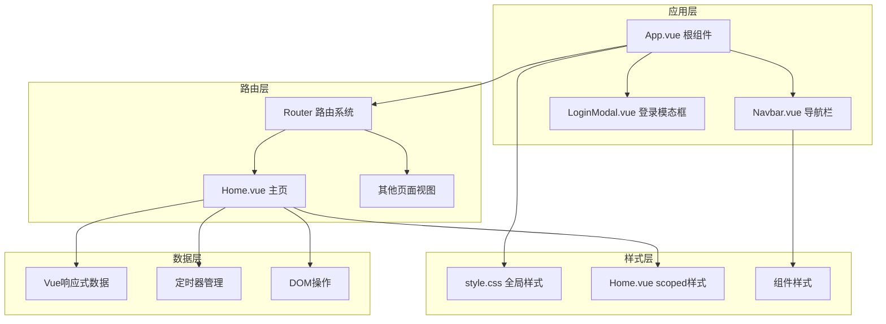
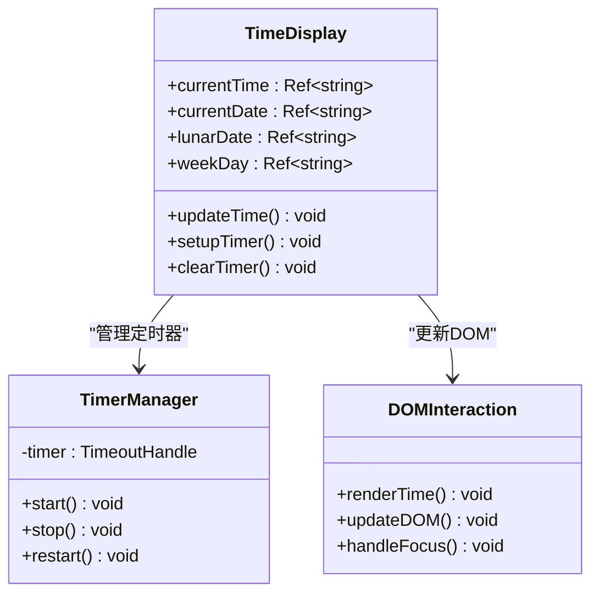
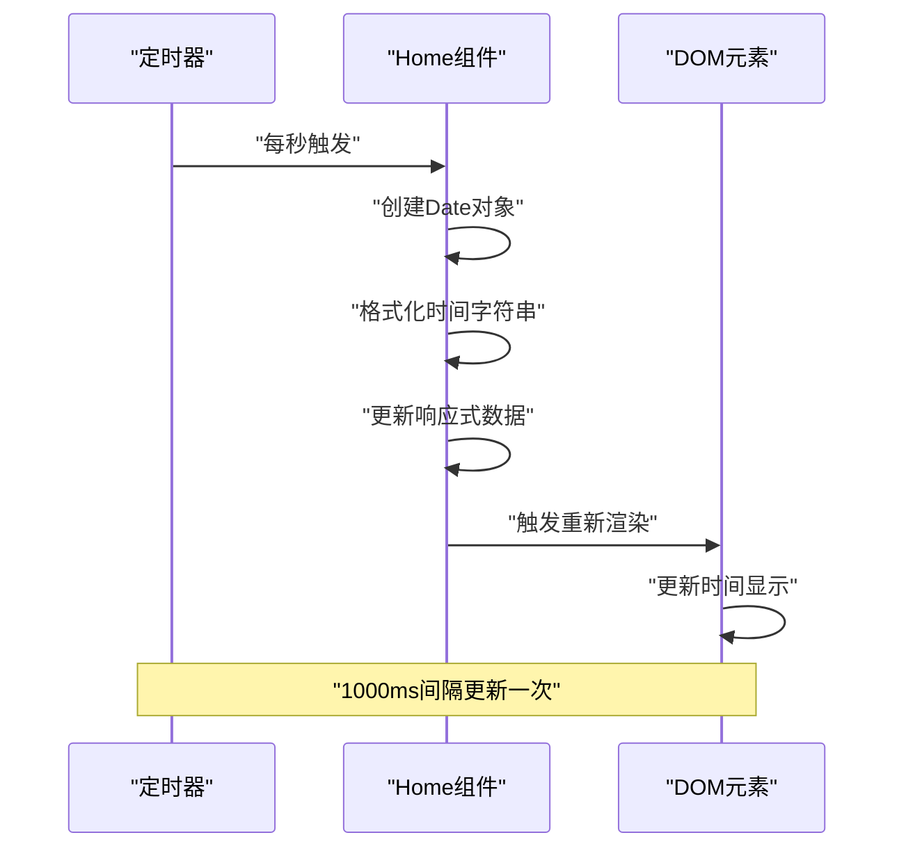
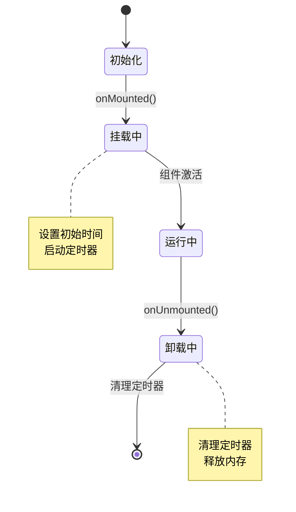
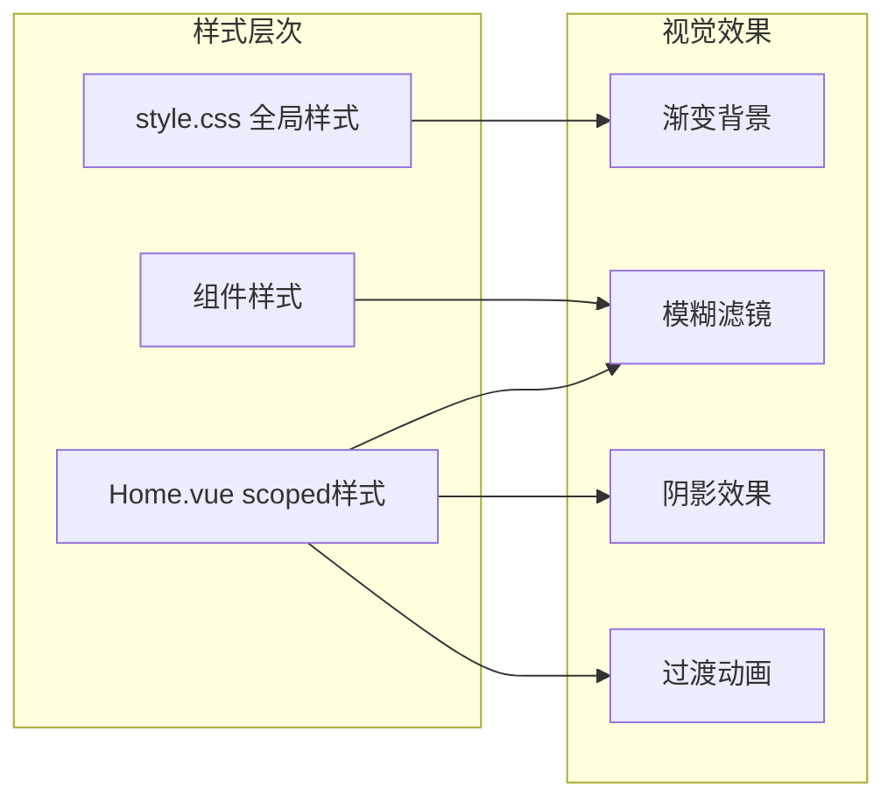
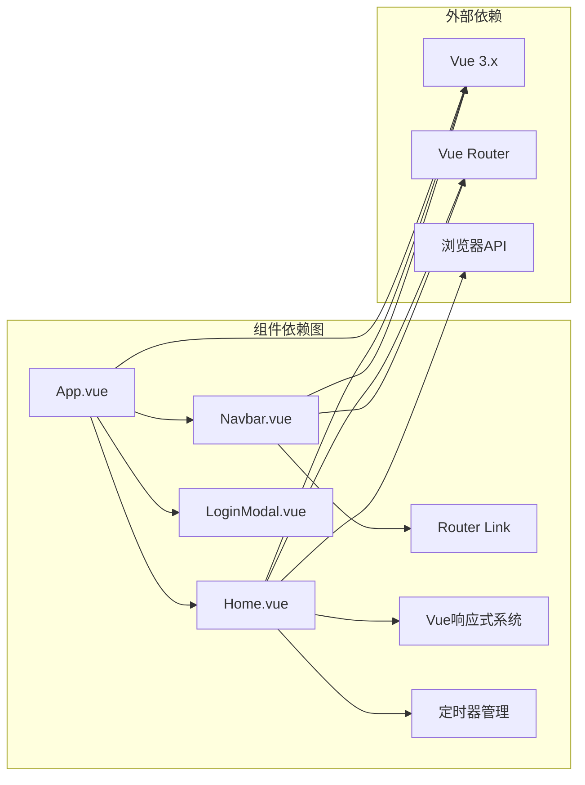

# 主页设计

<cite>
**本文档引用的文件**
- [Home.vue](file://src/views/Home.vue)
- [style.css](file://src/style.css)
- [Navbar.vue](file://src/components/Navbar.vue)
- [App.vue](file://src/App.vue)
- [index.js](file://src/router/index.js)
- [package.json](file://package.json)
</cite>

## 目录
1. [简介](#简介)
2. [项目结构](#项目结构)
3. [核心组件](#核心组件)
4. [架构概览](#架构概览)
5. [详细组件分析](#详细组件分析)
6. [依赖关系分析](#依赖关系分析)
7. [性能考虑](#性能考虑)
8. [故障排除指南](#故障排除指南)
9. [结论](#结论)
10. [附录](#附录)

## 简介

本文件为博客项目主页组件的详细技术文档，重点分析Home.vue的实现逻辑与设计架构。该主页采用Vue 3 Composition API编写，实现了动态时间显示、响应式布局和现代化视觉效果。文档将深入解析时间更新机制、定时器管理、组件生命周期钩子的使用方式，并详细说明CSS样式设计中的渐变背景、模糊效果、动画过渡等视觉元素。同时提供用户交互处理方案，包括搜索框功能和快捷链接的实现方法，以及主页定制和扩展的最佳实践。

## 项目结构

博客项目采用标准的Vue 3单页面应用架构，主要目录结构如下：

```mermaid
graph TB
subgraph "项目根目录"
A[public/] 公共资源
B[src/] 源代码
C[index.html] 入口HTML
D[package.json] 项目配置
end
subgraph "src源码结构"
E[components/] 组件目录
F[views/] 视图页面
G[router/] 路由配置
H[assets/] 静态资源
I[style.css] 全局样式
J[App.vue] 根组件
K[main.js] 应用入口
end
subgraph "视图页面"
L[Home.vue] 主页
M[Family.vue] 家庭页
N[Essays.vue] 随笔页
O[Records.vue] 记录页
P[Album.vue] 相册页
Q[Toolbox.vue] 百宝箱
R[Guestbook.vue] 留言板
S[Contact.vue] 联系我
end
subgraph "组件系统"
T[Navbar.vue] 导航栏
U[LoginModal.vue] 登录模态框
V[HelloWorld.vue] 示例组件
end
B --> E
B --> F
B --> G
B --> I
B --> J
B --> K
F --> L
F --> M
F --> N
F --> O
F --> P
F --> Q
F --> R
F --> S
E --> T
E --> U
E --> V
```

**图表来源**
- [Home.vue:1-211](file://src/views/Home.vue#L1-L211)
- [App.vue:1-30](file://src/App.vue#L1-L30)
- [Navbar.vue:1-140](file://src/components/Navbar.vue#L1-L140)

**章节来源**
- [Home.vue:1-211](file://src/views/Home.vue#L1-L211)
- [App.vue:1-30](file://src/App.vue#L1-L30)
- [style.css:1-56](file://src/style.css#L1-L56)

## 核心组件

### 时间显示系统

主页的核心功能是动态时间显示，通过Vue 3的响应式系统实现每秒自动更新的时间显示。该系统包含以下关键组件：

- **实时时间显示**：显示当前小时和分钟，格式为HH:mm
- **日期信息展示**：包含公历年月日和星期信息
- **农历日期占位符**：预留农历日期显示位置
- **定时器管理**：精确控制时间更新频率

### 响应式布局设计

采用Flexbox布局系统，确保在不同设备上的良好显示效果：

- **垂直居中布局**：使用flex-direction: column和align-items: center实现内容垂直居中
- **弹性间距控制**：通过gap属性统一控制元素间距
- **媒体查询适配**：针对不同屏幕尺寸优化显示效果

### 视觉效果实现

主页运用多种现代CSS技术创造沉浸式视觉体验：

- **渐变背景**：使用linear-gradient创建半透明遮罩层
- **模糊滤镜**：backdrop-filter: blur()实现毛玻璃效果
- **阴影效果**：text-shadow和box-shadow增强层次感
- **平滑过渡**：CSS transition实现流畅的交互动画

**章节来源**
- [Home.vue:9-36](file://src/views/Home.vue#L9-L36)
- [Home.vue:79-210](file://src/views/Home.vue#L79-L210)

## 架构概览

博客主页采用组件化架构，通过路由系统实现页面切换，整体架构如下：



**图表来源**
- [App.vue:1-30](file://src/App.vue#L1-L30)
- [index.js:1-28](file://src/router/index.js#L1-L28)
- [Home.vue:1-211](file://src/views/Home.vue#L1-L211)

## 详细组件分析

### Home.vue 组件详解

#### 数据结构设计

组件使用Vue 3的ref响应式系统管理时间相关的状态：



**图表来源**
- [Home.vue:4-36](file://src/views/Home.vue#L4-L36)

#### 时间更新机制

时间更新采用高精度定时器实现，确保时间显示的准确性：



**图表来源**
- [Home.vue:9-36](file://src/views/Home.vue#L9-L36)

#### 生命周期管理

组件正确使用Vue 3的生命周期钩子确保资源的正确分配和释放：



**图表来源**
- [Home.vue:29-36](file://src/views/Home.vue#L29-L36)

#### 样式系统架构

主页采用分层样式设计，结合全局样式和局部样式：



**图表来源**
- [style.css:1-56](file://src/style.css#L1-L56)
- [Home.vue:79-210](file://src/views/Home.vue#L79-L210)

**章节来源**
- [Home.vue:1-211](file://src/views/Home.vue#L1-L211)

### CSS样式设计详解

#### 渐变背景实现

主页使用复合背景实现深度视觉效果：

- **半透明遮罩层**：使用rgba(0,0,0,0.3)创建半透明黑色覆盖层
- **全屏背景图**：设置Unsplash高质量图片作为背景
- **居中缩放**：center/cover确保背景图完美填充屏幕

#### 模糊效果技术

通过backdrop-filter实现毛玻璃效果：

- **背景模糊**：backdrop-filter: blur(10px)创建模糊背景
- **半透明容器**：rgba(0,0,0,0.4)提供合适的透明度
- **边框保护**：1px solid rgba(255,255,255,0.1)增强边缘清晰度

#### 动画过渡系统

多处使用CSS transition实现流畅的交互体验：

- **悬停动画**：.link-item hover时的translateY(-5px)位移
- **按钮反馈**：导航项hover时的背景色变化
- **平滑滚动**：全局html scroll-behavior: smooth

**章节来源**
- [Home.vue:79-210](file://src/views/Home.vue#L79-L210)
- [style.css:28-55](file://src/style.css#L28-L55)

### 用户交互处理

#### 搜索框功能

搜索框采用简洁直观的设计：

- **图标集成**：左侧使用"b"字符作为搜索图标
- **输入提示**：placeholder显示"搜点什么吧"提示文本
- **按钮设计**：右侧显示🔍表情符号作为搜索按钮

#### 快捷链接系统

提供两个主要快捷链接区域：

- **博客链接**：使用渐变背景的圆形图标
- **更多链接**：使用网格布局的四点状图标
- **悬停效果**：统一的translateY(-5px)动画

**章节来源**
- [Home.vue:50-70](file://src/views/Home.vue#L50-L70)

## 依赖关系分析

### 技术栈依赖

项目采用现代化前端技术栈，各依赖项的作用如下：

```mermaid
graph TB
subgraph "运行时依赖"
A[Vue 3.5.32] 核心框架
B[Vue Router 4.6.4] 路由管理
end
subgraph "开发工具依赖"
C[@vitejs/plugin-vue] Vue插件
D[vite 8.0.4] 构建工具
end
subgraph "项目特性"
E[Composition API] 组合式API
F[单文件组件] .vue文件
G[TypeScript支持] 可选类型安全
end
A --> E
B --> F
C --> G
D --> F
```

**图表来源**
- [package.json:11-18](file://package.json#L11-L18)

### 组件间依赖关系



**图表来源**
- [App.vue:1-30](file://src/App.vue#L1-L30)
- [Navbar.vue:1-140](file://src/components/Navbar.vue#L1-L140)
- [Home.vue:1-211](file://src/views/Home.vue#L1-L211)

**章节来源**
- [package.json:1-20](file://package.json#L1-L20)
- [index.js:1-28](file://src/router/index.js#L1-L28)

## 性能考虑

### 时间更新性能优化

- **定时器精度**：1000ms间隔确保时间同步准确性
- **最小化重渲染**：使用响应式ref避免不必要的DOM更新
- **内存泄漏防护**：onUnmounted钩子确保定时器正确清理

### 样式性能优化

- **硬件加速**：合理使用transform属性启用GPU加速
- **选择器优化**：避免复杂的CSS选择器提高渲染效率
- **背景优化**：使用CSS渐变替代复杂背景图片

### 内存管理

- **生命周期管理**：严格遵循Vue 3生命周期钩子规范
- **事件监听器**：确保组件卸载时清理所有事件监听
- **定时器管理**：防止定时器泄漏造成内存占用

## 故障排除指南

### 常见问题及解决方案

#### 时间不更新问题

**症状**：时间显示固定不变
**可能原因**：
- 定时器未启动或被意外清理
- 浏览器标签页不可见导致定时器暂停
- 组件卸载后定时器未正确清理

**解决方法**：
1. 检查onMounted钩子是否正确执行
2. 验证setInterval返回的定时器ID
3. 确认onUnmounted钩子正确清理定时器

#### 样式显示异常

**症状**：模糊效果或渐变背景不显示
**可能原因**：
- 浏览器不支持backdrop-filter属性
- 背景图片加载失败
- CSS作用域冲突

**解决方法**：
1. 检查浏览器兼容性支持
2. 验证背景图片URL有效性
3. 使用开发者工具检查CSS优先级

#### 响应式布局问题

**症状**：移动端显示效果不佳
**可能原因**：
- 缺少媒体查询规则
- 移动端断点设置不合理
- Flexbox属性使用不当

**解决方法**：
1. 添加适当的@media查询
2. 调整断点值适应目标设备
3. 检查flex-direction和align-items属性

**章节来源**
- [Home.vue:29-36](file://src/views/Home.vue#L29-L36)
- [Home.vue:79-210](file://src/views/Home.vue#L79-L210)

## 结论

博客主页组件展现了现代Vue 3应用开发的最佳实践。通过精心设计的时间显示系统、响应式布局和丰富的视觉效果，为用户提供了优秀的首屏体验。组件采用模块化设计，具有良好的可维护性和扩展性。建议在后续开发中重点关注以下方面：

1. **功能扩展**：可以集成真实的农历计算库和天气API
2. **性能优化**：考虑使用requestAnimationFrame优化动画性能
3. **可访问性**：增加键盘导航和屏幕阅读器支持
4. **国际化**：支持多语言环境下的时间格式化

## 附录

### 主题定制指南

#### 修改时间显示格式

要调整时间显示格式，需要修改updateTime函数中的格式化逻辑：

1. 修改小时分钟显示格式
2. 调整日期显示格式
3. 自定义星期显示语言

#### 更换背景图片

通过修改CSS变量或直接替换背景图片URL来更换主题背景：

1. 在style.css中找到background-image属性
2. 替换为新的图片URL
3. 调整background-position和background-size属性

#### 自定义颜色方案

通过修改CSS变量或颜色值来定制整体色调：

1. 更新渐变色定义
2. 调整模糊背景的透明度
3. 修改链接图标颜色

#### 添加新功能

如需添加新功能，建议遵循以下步骤：

1. 在Home.vue中添加新的响应式数据
2. 实现相应的业务逻辑函数
3. 在模板中添加新的UI元素
4. 编写对应的CSS样式
5. 在App.vue中注册新组件