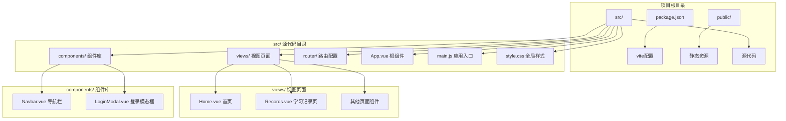
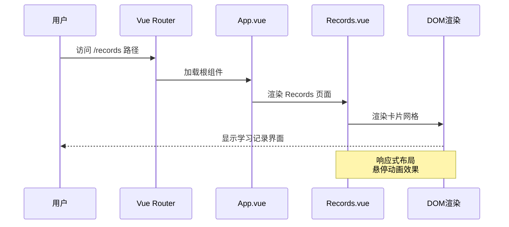
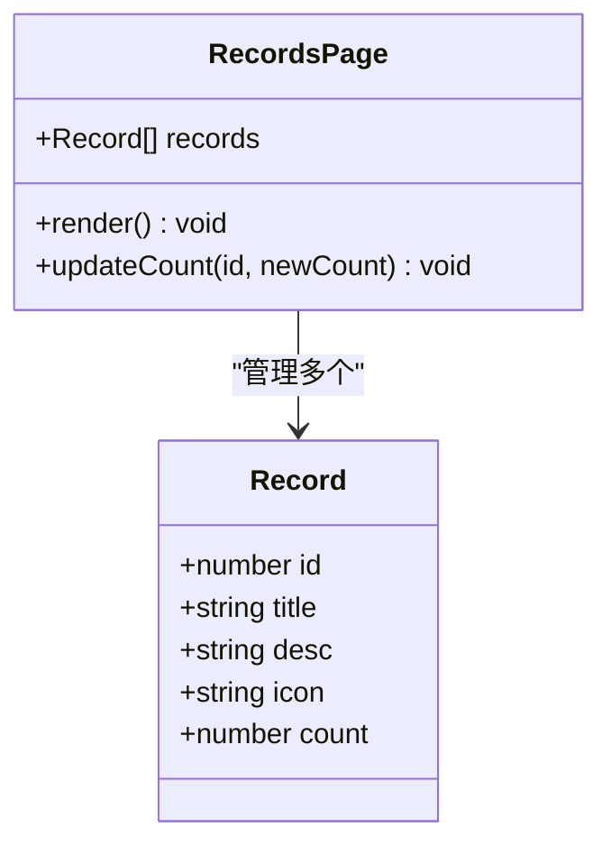
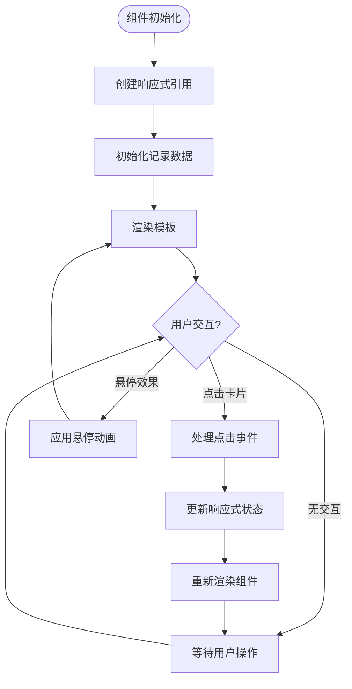
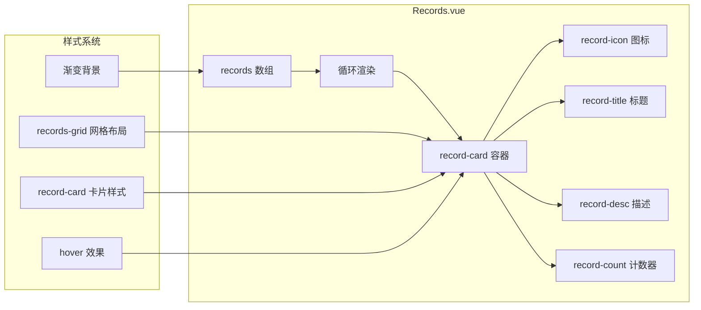
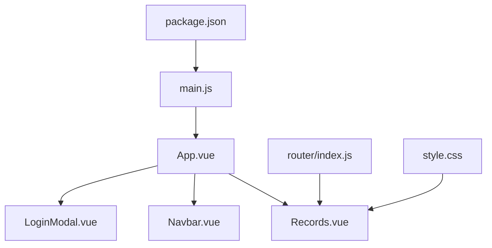

# 学习记录页面

<cite>
**本文档引用的文件**
- [Records.vue](file://src/views/Records.vue)
- [main.js](file://src/main.js)
- [index.js](file://src/router/index.js)
- [App.vue](file://src/App.vue)
- [style.css](file://src/style.css)
- [package.json](file://package.json)
</cite>

## 目录
1. [简介](#简介)
2. [项目结构](#项目结构)
3. [核心组件](#核心组件)
4. [架构概览](#架构概览)
5. [详细组件分析](#详细组件分析)
6. [依赖关系分析](#依赖关系分析)
7. [性能考虑](#性能考虑)
8. [故障排除指南](#故障排除指南)
9. [结论](#结论)

## 简介

学习记录页面是博客项目中的一个专门用于展示各类学习记录和内容分类的界面组件。该页面采用响应式设计，通过卡片网格布局展示不同类型的学习内容，包括学习笔记、生活点滴、技术分享和读书笔记等分类。页面使用渐变背景和悬停动画效果，为用户提供直观的视觉体验。

## 项目结构

该项目采用标准的Vue 3单页应用架构，主要文件组织如下：



**图表来源**
- [Records.vue:1-100](file://src/views/Records.vue#L1-L100)
- [main.js:1-9](file://src/main.js#L1-L9)
- [index.js:1-28](file://src/router/index.js#L1-L28)

**章节来源**
- [Records.vue:1-100](file://src/views/Records.vue#L1-L100)
- [main.js:1-9](file://src/main.js#L1-L9)
- [index.js:1-28](file://src/router/index.js#L1-L28)

## 核心组件

### Records.vue 组件结构

学习记录页面的核心组件是一个基于Vue 3 Composition API的单文件组件，采用 `<script setup>` 语法糖简化代码结构。组件包含以下关键部分：

#### 数据结构设计

组件内部维护了一个响应式的记录数组，每个记录项包含以下属性：
- `id`: 唯一标识符（数字类型）
- `title`: 分类标题（字符串）
- `desc`: 描述信息（字符串）
- `icon`: 图标符号（表情符号字符串）
- `count`: 内容数量（数字）

#### 状态管理

使用Vue 3的 `ref` 响应式系统管理组件状态，确保数据变化时UI自动更新。所有记录数据都存储在单一的响应式引用中，便于集中管理和操作。

#### 可视化展示

采用CSS Grid布局实现响应式卡片网格，支持不同屏幕尺寸下的自适应显示。每个记录卡片包含图标、标题、描述和计数器等元素。

**章节来源**
- [Records.vue:1-100](file://src/views/Records.vue#L1-L100)

## 架构概览

学习记录页面在整个应用架构中的位置和交互关系如下：



**图表来源**
- [index.js:11-20](file://src/router/index.js#L11-L20)
- [App.vue:17-22](file://src/App.vue#L17-L22)
- [Records.vue:12-28](file://src/views/Records.vue#L12-L28)

## 详细组件分析

### 数据模型设计

学习记录的数据模型采用简洁而实用的设计原则：



**图表来源**
- [Records.vue:4-9](file://src/views/Records.vue#L4-L9)

#### 数据结构特点

1. **轻量级设计**: 每个记录只包含必要的字段，避免过度复杂化
2. **类型明确**: 所有字段都有明确的数据类型定义
3. **可扩展性**: 结构设计允许未来添加新的字段而不影响现有功能
4. **响应式更新**: 使用Vue 3响应式系统确保数据变更时UI自动更新

### 状态管理机制

组件的状态管理采用Vue 3的Composition API模式：



**图表来源**
- [Records.vue:1-100](file://src/views/Records.vue#L1-L100)

### 可视化展示架构

页面采用现代化的视觉设计语言：



**图表来源**
- [Records.vue:19-26](file://src/views/Records.vue#L19-L26)
- [Records.vue:52-99](file://src/views/Records.vue#L52-L99)

#### 响应式设计特性

- **自适应网格**: 使用CSS Grid的 `repeat(auto-fill, minmax())` 实现智能换行
- **弹性布局**: 支持从移动端到桌面端的完整适配
- **动画效果**: 悬停时的平滑过渡动画提升用户体验

### 进度统计功能

当前版本的Records.vue组件提供了基础的计数统计功能：

#### 统计数据展示

每个记录卡片底部显示对应的内容数量，采用圆角矩形样式突出显示。这种设计让用户能够快速了解各个分类下的内容丰富程度。

#### 进度计算逻辑

虽然当前版本没有实现复杂的进度计算算法，但数据结构已经为未来的扩展做好了准备。每个记录项的 `count` 字段可以轻松扩展为更复杂的统计指标。

**章节来源**
- [Records.vue:4-9](file://src/views/Records.vue#L4-L9)
- [Records.vue:24-24](file://src/views/Records.vue#L24-L24)

## 依赖关系分析

### 外部依赖

项目使用现代化的前端技术栈构建：

```mermaid
graph TB
subgraph "运行时依赖"
A[Vue 3.5.32] --> B[核心框架]
C[vue-router 4.6.4] --> D[路由管理]
end
subgraph "开发依赖"
E[@vitejs/plugin-vue] --> F[Vite 构建工具]
G[vite 8.0.4] --> H[开发服务器]
end
subgraph "项目集成"
F --> I[应用打包]
H --> J[热重载开发]
B --> K[组件渲染]
D --> L[页面导航]
end
```

**图表来源**
- [package.json:11-18](file://package.json#L11-L18)

### 内部模块依赖



**图表来源**
- [main.js:1-9](file://src/main.js#L1-L9)
- [index.js:1-28](file://src/router/index.js#L1-L28)
- [App.vue:1-30](file://src/App.vue#L1-L30)

**章节来源**
- [package.json:1-20](file://package.json#L1-L20)
- [main.js:1-9](file://src/main.js#L1-L9)
- [index.js:1-28](file://src/router/index.js#L1-L28)

## 性能考虑

### 渲染优化

- **虚拟DOM**: 利用Vue 3的优化虚拟DOM实现高效的UI更新
- **响应式系统**: 仅在相关数据变化时触发重新渲染
- **CSS作用域**: 使用scoped样式避免全局样式污染

### 资源加载

- **按需加载**: 路由级别的代码分割减少初始包大小
- **渐进式增强**: 渐变背景和动画效果在现代浏览器中提供最佳体验

## 故障排除指南

### 常见问题及解决方案

#### 页面无法显示

1. **检查路由配置**: 确认 `/records` 路径已正确配置
2. **验证组件导入**: 确保Records.vue组件正确导入到路由配置中
3. **检查控制台错误**: 查看浏览器开发者工具中的JavaScript错误

#### 样式显示异常

1. **CSS优先级**: 确保scoped样式正确应用到目标元素
2. **响应式断点**: 检查CSS媒体查询是否正确配置
3. **字体渲染**: 验证系统字体回退机制

#### 数据不更新

1. **响应式引用**: 确认使用 `ref` 创建的响应式数据
2. **模板绑定**: 检查v-for指令和数据绑定语法
3. **键值设置**: 确保v-for指令使用唯一的key属性

**章节来源**
- [Records.vue:1-100](file://src/views/Records.vue#L1-L100)
- [index.js:11-20](file://src/router/index.js#L11-L20)

## 结论

学习记录页面组件展现了现代Vue 3应用开发的最佳实践。通过简洁的数据模型、清晰的组件结构和优雅的视觉设计，该组件成功实现了学习记录的展示功能。

### 主要优势

1. **简洁高效**: 最小化的代码实现最大化的功能
2. **响应式设计**: 完美的移动设备适配
3. **可扩展性强**: 为未来的功能扩展预留了充足空间
4. **性能优化**: 利用Vue 3的先进特性确保良好的运行性能

### 发展建议

1. **进度计算**: 可以添加更复杂的进度统计算法
2. **数据持久化**: 考虑添加本地存储或后端API集成
3. **交互增强**: 添加更多用户交互功能如筛选、排序等
4. **主题定制**: 提供更多的样式定制选项

这个组件为整个博客项目提供了一个优秀的起点，既满足了当前的需求，又为未来的发展奠定了坚实的基础。