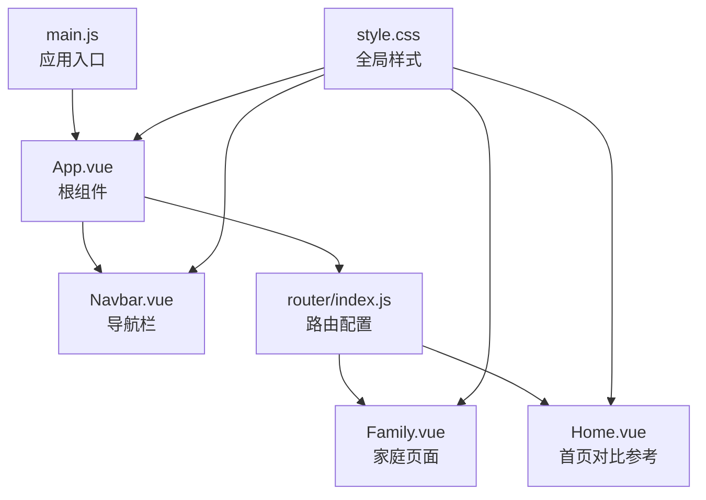
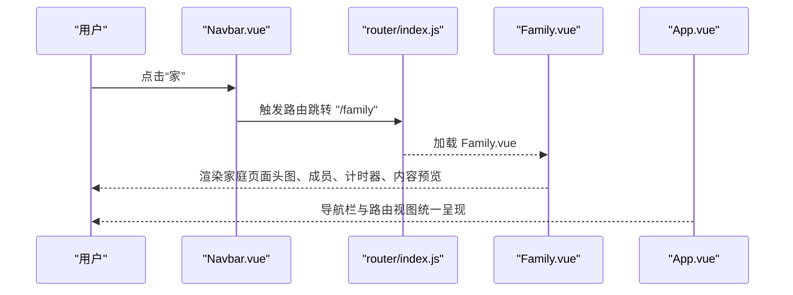
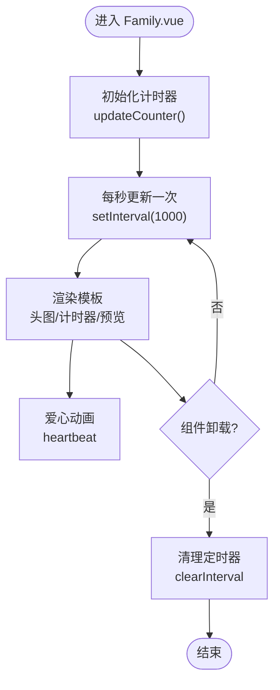
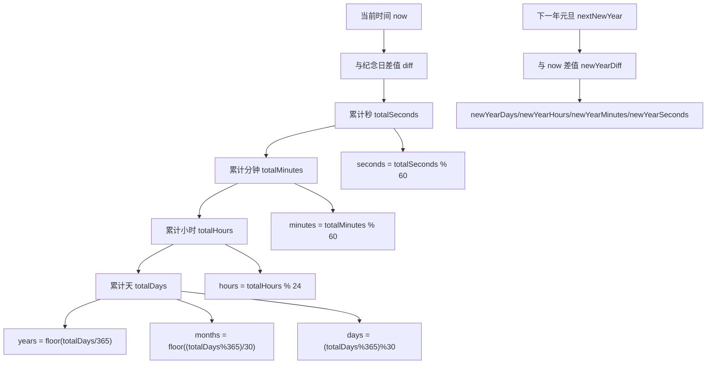
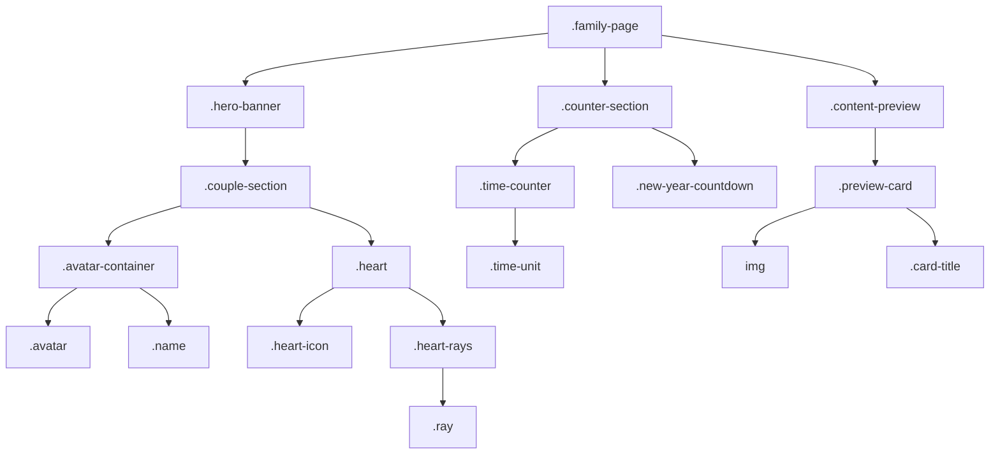
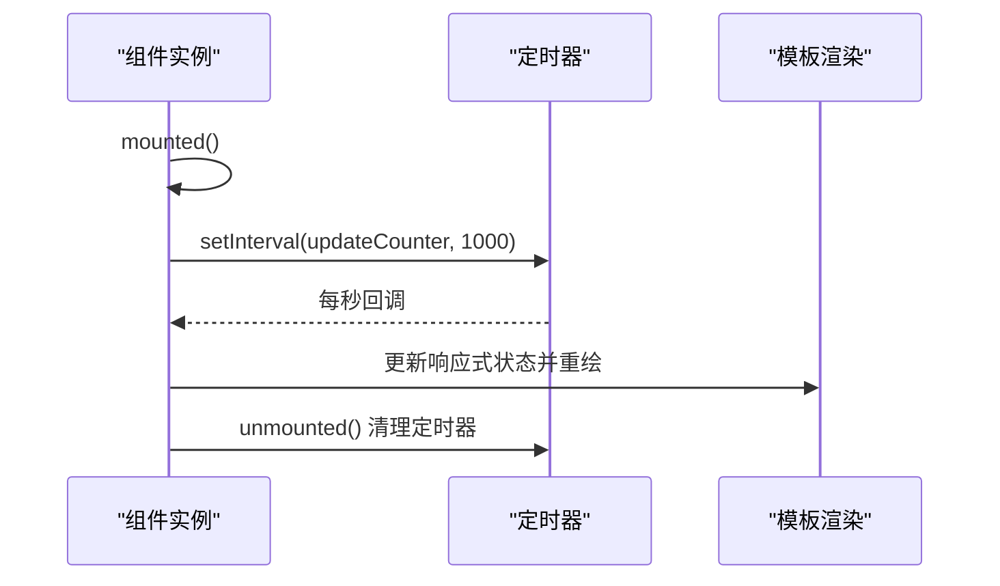
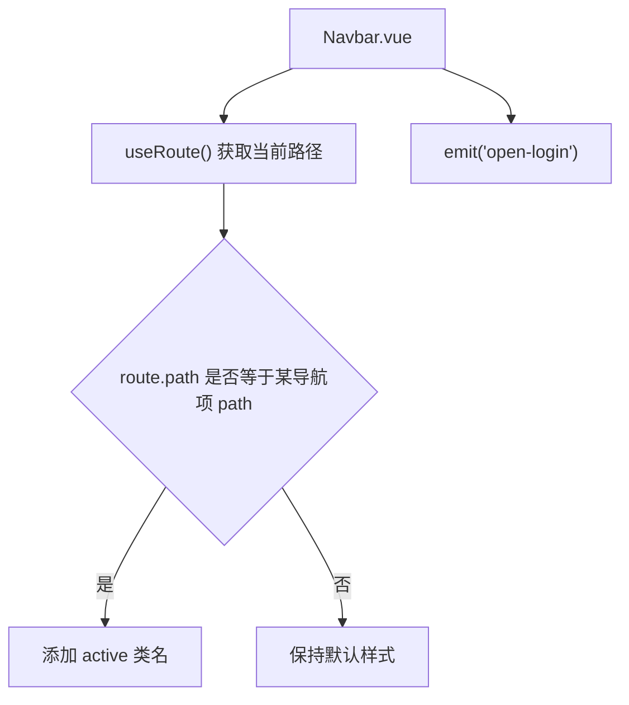
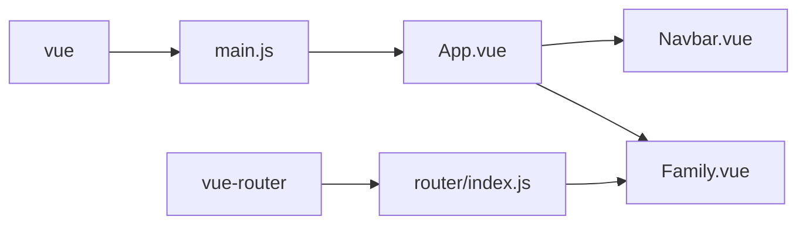

# 家庭页面

<cite>
**本文引用的文件**
- [Family.vue](file://src/views/Family.vue)
- [Navbar.vue](file://src/components/Navbar.vue)
- [App.vue](file://src/App.vue)
- [main.js](file://src/main.js)
- [router/index.js](file://src/router/index.js)
- [Home.vue](file://src/views/Home.vue)
- [style.css](file://src/style.css)
</cite>

## 目录
1. [简介](#简介)
2. [项目结构](#项目结构)
3. [核心组件](#核心组件)
4. [架构总览](#架构总览)
5. [详细组件分析](#详细组件分析)
6. [依赖分析](#依赖分析)
7. [性能考虑](#性能考虑)
8. [故障排查指南](#故障排查指南)
9. [结论](#结论)
10. [附录](#附录)

## 简介
本文件面向博客项目的“家庭展示页面”组件 Family.vue，系统性地阐述其家庭成员展示功能的实现方式，包括成员信息展示、关系图表与交互设计；同时覆盖数据结构设计、成员信息管理、界面布局、响应式与移动端适配、以及页面定制方法（如新增成员、修改展示样式等）。文档以代码级分析为基础，并辅以可视化图示帮助不同技术背景的读者理解。

## 项目结构
该项目采用 Vue 3 单页应用架构，使用组合式 API（<script setup>）与路由进行页面组织。家庭页面位于 views 层，作为独立路由页面存在；全局导航栏组件 Navbar.vue 通过路由高亮当前页面；App.vue 负责挂载导航与路由视图，并承载登录模态框。

**图表来源**
- [main.js:1-9](file://src/main.js#L1-L9)
- [App.vue:1-30](file://src/App.vue#L1-L30)
- [Navbar.vue:1-140](file://src/components/Navbar.vue#L1-L140)
- [router/index.js:1-28](file://src/router/index.js#L1-L28)
- [Family.vue:1-309](file://src/views/Family.vue#L1-L309)
- [Home.vue:1-211](file://src/views/Home.vue#L1-L211)
- [style.css:1-56](file://src/style.css#L1-L56)

**章节来源**
- [main.js:1-9](file://src/main.js#L1-L9)
- [App.vue:1-30](file://src/App.vue#L1-L30)
- [router/index.js:1-28](file://src/router/index.js#L1-L28)
- [style.css:1-56](file://src/style.css#L1-L56)

## 核心组件
- Family.vue：负责家庭成员展示、纪念日计时器、元旦倒计时、内容预览卡片等 UI 组成。
- Navbar.vue：提供全局导航菜单，包含“家”路由项，用于跳转至家庭页面。
- App.vue：承载导航栏与路由视图，控制登录模态框的显隐。
- router/index.js：定义路由表，将“/family”映射到 Family.vue。
- style.css：提供全局基础样式与滚动条、选择样式等通用规则。

**章节来源**
- [Family.vue:1-309](file://src/views/Family.vue#L1-L309)
- [Navbar.vue:1-140](file://src/components/Navbar.vue#L1-L140)
- [App.vue:1-30](file://src/App.vue#L1-L30)
- [router/index.js:1-28](file://src/router/index.js#L1-L28)
- [style.css:1-56](file://src/style.css#L1-L56)

## 架构总览
家庭页面在应用中的位置与交互流程如下：

**图表来源**
- [Navbar.vue:19-25](file://src/components/Navbar.vue#L19-L25)
- [router/index.js:11-20](file://src/router/index.js#L11-L20)
- [Family.vue:58-130](file://src/views/Family.vue#L58-L130)
- [App.vue:17-23](file://src/App.vue#L17-L23)

## 详细组件分析

### Family.vue：家庭页面实现
Family.vue 是一个单文件组件，采用组合式 API，包含以下关键部分：
- 响应式状态：纪念日计时器（年、月、日、时、分、秒）与元旦倒计时（天、时、分、秒）。
- 生命周期钩子：mounted 初始化并启动定时器，unmounted 清理定时器。
- 模板结构：头图区域展示一对头像与爱心装饰；计时器区域展示纪念日累计时间与元旦倒计时；内容预览区域展示一张卡片。
- 样式：使用 scoped 样式，定义头图背景、头像容器、爱心动画、计时器布局与卡片样式。

**图表来源**
- [Family.vue:19-55](file://src/views/Family.vue#L19-L55)
- [Family.vue:58-130](file://src/views/Family.vue#L58-L130)

**章节来源**
- [Family.vue:1-309](file://src/views/Family.vue#L1-L309)

#### 数据结构与状态管理
- 状态字段：years、months、days、hours、minutes、seconds、newYearDays、newYearHours、newYearMinutes、newYearSeconds。
- 纪念日设置：固定纪念日日期（示例：2023-05-29）。
- 计算逻辑：基于当前时间与纪念日计算累计时长与元旦倒计时，按秒刷新。

**图表来源**
- [Family.vue:16-44](file://src/views/Family.vue#L16-L44)

**章节来源**
- [Family.vue:16-44](file://src/views/Family.vue#L16-L44)

#### 界面布局与视觉元素
- 头图区域：居中布局，渐变遮罩与背景图，包含两个头像容器与爱心装饰。
- 计时器区域：标题、时间单位块（年/月/日/时/分/秒），元旦倒计时提示。
- 内容预览：卡片式布局，图片与标题。

**图表来源**
- [Family.vue:58-130](file://src/views/Family.vue#L58-L130)
- [Family.vue:132-308](file://src/views/Family.vue#L132-L308)

**章节来源**
- [Family.vue:58-130](file://src/views/Family.vue#L58-L130)
- [Family.vue:132-308](file://src/views/Family.vue#L132-L308)

#### 交互与生命周期
- mounted：初始化并启动每秒更新的计时器。
- unmounted：清理定时器，避免内存泄漏。
- 模板中使用 v-for 渲染爱心光束，配合 CSS 动画实现心跳效果。

**图表来源**
- [Family.vue:48-55](file://src/views/Family.vue#L48-L55)
- [Family.vue:19-44](file://src/views/Family.vue#L19-L44)

**章节来源**
- [Family.vue:48-55](file://src/views/Family.vue#L48-L55)

### Navbar.vue：导航与路由集成
- 导航项包含“家”路由项，指向“/family”，用于跳转到家庭页面。
- 使用 vue-router 的 useRoute 判断当前激活项，动态添加 active 类名。
- 通过事件发射 open-login，供父组件 App.vue 控制登录模态框。

**图表来源**
- [Navbar.vue:19-25](file://src/components/Navbar.vue#L19-L25)
- [router/index.js:11-20](file://src/router/index.js#L11-L20)

**章节来源**
- [Navbar.vue:1-140](file://src/components/Navbar.vue#L1-L140)
- [router/index.js:1-28](file://src/router/index.js#L1-L28)

### App.vue：根组件与登录模态框
- 引入 Navbar 与 LoginModal，通过 showLogin 控制登录模态框显隐。
- 将 open-login 事件传递给 Navbar，实现登录弹窗触发。

**章节来源**
- [App.vue:1-30](file://src/App.vue#L1-L30)

### router/index.js：路由配置
- 定义 routes 数组，将“/family”映射到 Family.vue。
- 使用 createRouter 与 createWebHistory 创建路由实例。

**章节来源**
- [router/index.js:1-28](file://src/router/index.js#L1-L28)

### Home.vue：对比参考
- 提供了另一个页面组件的实现模式，便于理解 Family.vue 的结构差异（如计时器、头图、卡片布局等）。

**章节来源**
- [Home.vue:1-211](file://src/views/Home.vue#L1-L211)

## 依赖分析
- 运行时依赖：vue、vue-router。
- 开发依赖：@vitejs/plugin-vue、vite。
- 组件间依赖：Family.vue 由路由加载；App.vue 承载 Navbar 与路由视图；Navbar.vue 通过路由高亮当前页面。

**图表来源**
- [package.json:11-18](file://package.json#L11-L18)
- [main.js:1-9](file://src/main.js#L1-L9)
- [router/index.js:1-28](file://src/router/index.js#L1-L28)
- [App.vue:1-30](file://src/App.vue#L1-L30)
- [Navbar.vue:1-140](file://src/components/Navbar.vue#L1-L140)
- [Family.vue:1-309](file://src/views/Family.vue#L1-L309)

**章节来源**
- [package.json:1-20](file://package.json#L1-L20)
- [main.js:1-9](file://src/main.js#L1-L9)
- [router/index.js:1-28](file://src/router/index.js#L1-L28)

## 性能考虑
- 计时器频率：每秒更新一次，开销较小；确保在组件卸载时清理，避免内存泄漏。
- 图片资源：使用 Unsplash 链接，建议在生产环境替换为本地或 CDN 资源以提升加载速度与稳定性。
- 样式作用域：scoped 样式避免全局污染，但需注意样式优先级与媒体查询的覆盖策略。
- 响应式布局：媒体查询在 Navbar.vue 中已体现，可在 Family.vue 扩展更多断点优化。

[本节为通用性能建议，不直接分析具体文件]

## 故障排查指南
- 页面空白或未渲染
  - 检查路由是否正确配置“/family”到 Family.vue。
  - 确认 main.js 中已注册路由并挂载应用。
- 计时器不更新
  - 确认 mounted 中已启动定时器，unmounted 中已清理。
  - 检查浏览器控制台是否有错误。
- 心脏动画异常
  - 确认 scoped 样式未被外部样式覆盖。
  - 检查 keyframes 名称与类名匹配。
- 导航高亮无效
  - 确认 useRoute 返回的路径与导航项 path 一致。
  - 检查 active 类名拼写与样式规则。

**章节来源**
- [router/index.js:11-20](file://src/router/index.js#L11-L20)
- [main.js:1-9](file://src/main.js#L1-L9)
- [Family.vue:48-55](file://src/views/Family.vue#L48-L55)
- [Navbar.vue:19-25](file://src/components/Navbar.vue#L19-L25)

## 结论
Family.vue 通过简洁的响应式状态与定时器机制，实现了家庭纪念日与元旦倒计时的实时展示，并结合头图、爱心动画与卡片预览构建了温馨的视觉体验。组件结构清晰、职责单一，易于扩展与维护。后续可在数据模型、关系图表与交互行为上进一步增强，以满足更丰富的家庭展示需求。

[本节为总结性内容，不直接分析具体文件]

## 附录

### 响应式设计与移动端适配
- 当前实现要点
  - Navbar.vue 在窄屏设备隐藏导航菜单，适合移动端场景。
  - style.css 提供基础的最小宽度与滚动行为设置。
- 建议扩展
  - 在 Family.vue 中增加媒体查询，针对头图高度、头像尺寸、计时器字体大小与间距进行自适应调整。
  - 对爱心动画与卡片布局进行断点优化，保证在小屏设备上的可读性与可用性。

**章节来源**
- [Navbar.vue:134-138](file://src/components/Navbar.vue#L134-L138)
- [style.css:17-26](file://src/style.css#L17-L26)

### 家庭页面定制方法
- 添加新成员
  - 在模板中复制现有的头像容器结构，新增头像与姓名节点。
  - 在样式中适当调整 .avatar-container 的间距与对齐方式。
  - 如需独立计时器，可为每位成员新增响应式状态并在 updateCounter 中扩展计算逻辑。
- 修改展示样式
  - 调整头图背景、渐变遮罩与阴影参数，改变整体氛围。
  - 自定义爱心动画的时长、幅度与光束数量，提升视觉层次。
  - 优化计时器区域的字体大小、颜色与布局，提高可读性。
- 关系图表实现思路
  - 可引入 SVG 或 Canvas 绘制关系连线，结合响应式布局在桌面端展示更复杂的家族树。
  - 为每个成员节点绑定点击事件，实现详情展开与层级切换。
  - 在移动端采用折叠面板或滑动卡片形式，降低信息密度。

[本节为概念性指导，不直接分析具体文件]