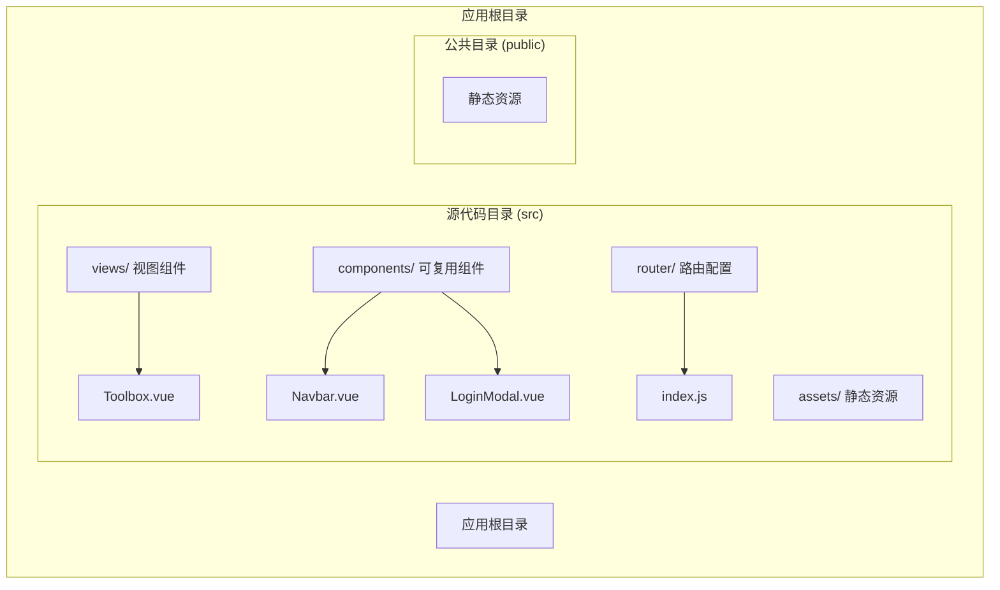
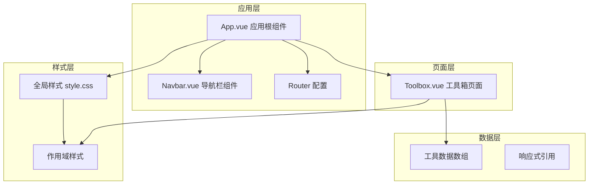
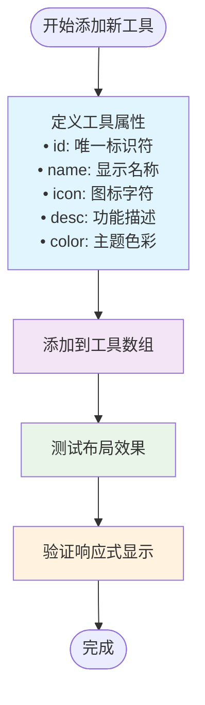
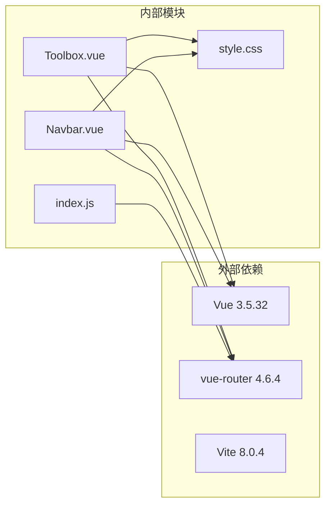

# 工具箱页面

<cite>
**本文档引用的文件**
- [Toolbox.vue](file://src/views/Toolbox.vue)
- [style.css](file://src/style.css)
- [Navbar.vue](file://src/components/Navbar.vue)
- [index.js](file://src/router/index.js)
- [App.vue](file://src/App.vue)
- [package.json](file://package.json)
</cite>

## 目录
1. [简介](#简介)
2. [项目结构](#项目结构)
3. [核心组件](#核心组件)
4. [架构概览](#架构概览)
5. [详细组件分析](#详细组件分析)
6. [依赖关系分析](#依赖关系分析)
7. [性能考虑](#性能考虑)
8. [故障排除指南](#故障排除指南)
9. [结论](#结论)
10. [附录](#附录)

## 简介

工具箱页面是博客项目中的一个专门页面，提供了各种实用的在线工具集合。该页面采用现代化的Vue 3 Composition API实现，使用CSS Grid布局系统构建响应式工具卡片网格。页面包含6个预定义的工具，每个工具都有独特的图标、描述和主题色彩，为用户提供直观的工具访问入口。

## 项目结构

工具箱页面作为Vue单文件组件（SFC）位于`src/views/`目录下，与应用的其他视图组件并列组织。整个项目采用标准的Vue 3项目结构，使用Vite作为构建工具。



**图表来源**
- [Toolbox.vue:1-102](file://src/views/Toolbox.vue#L1-L102)
- [index.js:1-28](file://src/router/index.js#L1-L28)

**章节来源**
- [Toolbox.vue:1-102](file://src/views/Toolbox.vue#L1-L102)
- [index.js:1-28](file://src/router/index.js#L1-L28)

## 核心组件

### 工具箱主组件

工具箱页面的核心是一个Vue 3 Composition API组件，使用`<script setup>`语法糖简化了组件的声明和生命周期管理。组件内部维护了一个响应式的工具数组，每个工具对象包含唯一标识符、名称、图标、描述和主题色彩等属性。

### 数据结构设计

工具数据采用简洁的对象数组形式存储，便于扩展和维护：

| 属性名 | 类型 | 描述 | 示例值 |
|--------|------|------|--------|
| id | Number | 工具唯一标识符 | 1, 2, 3... |
| name | String | 工具显示名称 | "JSON格式化" |
| icon | String | 工具图标字符 | "{ }", "64", "🎨" |
| desc | String | 工具功能描述 | "在线JSON格式化工具" |
| color | String | 工具主题色彩 | "#4CAF50", "#2196F3" |

**章节来源**
- [Toolbox.vue:4-11](file://src/views/Toolbox.vue#L4-L11)

## 架构概览

工具箱页面采用组件化的架构设计，通过Vue Router进行页面导航集成，配合全局样式系统实现统一的视觉风格。



**图表来源**
- [App.vue:1-30](file://src/App.vue#L1-L30)
- [Navbar.vue:1-140](file://src/components/Navbar.vue#L1-L140)
- [Toolbox.vue:1-102](file://src/views/Toolbox.vue#L1-L102)
- [style.css:1-56](file://src/style.css#L1-L56)

## 详细组件分析

### CSS Grid 布局系统

工具箱页面使用现代CSS Grid布局技术实现响应式工具网格。网格系统具有以下特点：

#### 网格配置参数

```css
.tools-grid {
  max-width: 1000px;
  margin: 0 auto;
  display: grid;
  grid-template-columns: repeat(auto-fill, minmax(280px, 1fr));
  gap: 20px;
}
```

- **auto-fill**: 自动填充可用空间
- **minmax(280px, 1fr)**: 最小宽度280px，剩余空间平均分配
- **gap**: 卡片间距20px

#### 响应式断点设计

页面在不同屏幕尺寸下提供优化的布局体验：

| 断点 | 屏幕宽度 | 列数 | 卡片宽度 |
|------|----------|------|----------|
| 默认 | ≥768px | 3列 | ~280px |
| 移动端 | <768px | 1列 | ~100% |
| 大屏 | ≥1200px | 4列 | ~280px |

**章节来源**
- [Toolbox.vue:53-59](file://src/views/Toolbox.vue#L53-L59)

### 卡片组件结构

每个工具卡片都是独立的UI组件，具有完整的视觉层次和交互状态：

#### 卡片样式层次

```css
.tool-card {
  background: white;
  border-radius: 16px;
  padding: 30px;
  text-align: center;
  cursor: pointer;
  transition: all 0.3s;
  border: 2px solid transparent;
}

.tool-card:hover {
  transform: translateY(-5px);
  box-shadow: 0 10px 30px rgba(0,0,0,0.1);
  border-color: var(--tool-color);
}
```

#### 图标区域设计

图标区域采用动态色彩绑定，每个工具都有独特的主题色彩：

```css
.tool-icon {
  width: 60px;
  height: 60px;
  background: var(--tool-color);
  color: white;
  border-radius: 12px;
  display: flex;
  align-items: center;
  justify-content: center;
  font-size: 24px;
  margin: 0 auto 16px;
  font-weight: bold;
}
```

**章节来源**
- [Toolbox.vue:61-100](file://src/views/Toolbox.vue#L61-L100)

### 工具分类展示

工具按照功能领域进行分类展示，每个工具都经过精心选择以满足开发者的日常需求：

| 工具类别 | 工具数量 | 主要功能 | 使用场景 |
|----------|----------|----------|----------|
| 编码转换 | 1 | Base64编解码 | 文件传输、数据存储 |
| 格式化工具 | 1 | JSON格式化 | API调试、数据验证 |
| 设计辅助 | 1 | 颜色选择器 | UI设计、主题定制 |
| 开发工具 | 2 | 正则测试、代码对比 | 文本处理、版本控制 |
| 内容创作 | 1 | Markdown编辑器 | 文档编写、内容创作 |

**章节来源**
- [Toolbox.vue:4-11](file://src/views/Toolbox.vue#L4-L11)

### 用户交互处理

工具箱页面实现了流畅的用户交互体验，包括悬停效果、点击反馈和过渡动画：

#### 交互状态管理

```mermaid
stateDiagram-v2
[*] --> Normal : 页面加载
Normal --> Hover : 鼠标悬停
Hover --> Click : 点击激活
Click --> Normal : 点击释放
Hover --> Normal : 鼠标离开
state Hover {
[*] --> Elevated : 抬升效果
Elevated --> Shadow : 阴影增强
Shadow --> ColoredBorder : 彩色边框
}
state Click {
[*] --> Pressed : 按压效果
Pressed --> Normal : 松开恢复
}
```

**图表来源**
- [Toolbox.vue:71-75](file://src/views/Toolbox.vue#L71-L75)

### 工具添加和管理机制

当前实现支持动态工具管理，通过修改工具数组即可扩展功能：

#### 新增工具流程



**图表来源**
- [Toolbox.vue:4-11](file://src/views/Toolbox.vue#L4-L11)

**章节来源**
- [Toolbox.vue:1-12](file://src/views/Toolbox.vue#L1-L12)

### 响应式设计实现

工具箱页面采用移动优先的设计理念，确保在各种设备上都能提供优秀的用户体验：

#### 媒体查询策略

```css
@media (max-width: 900px) {
  .nav-menu {
    display: none;
  }
}

@media (max-width: 768px) {
  .toolbox-page {
    padding: 80px 15px 30px;
  }
  
  .tools-grid {
    gap: 15px;
  }
  
  .tool-card {
    padding: 20px;
  }
}
```

#### 触摸友好的交互设计

- 最小点击目标：44px × 44px
- 适当的触摸间距：至少16px
- 触觉反馈：点击状态下的视觉变化

**章节来源**
- [Toolbox.vue:31-101](file://src/views/Toolbox.vue#L31-L101)

## 依赖关系分析

工具箱页面的依赖关系相对简单，主要依赖于Vue框架和路由系统：



**图表来源**
- [package.json:11-18](file://package.json#L11-L18)
- [Toolbox.vue:1-2](file://src/views/Toolbox.vue#L1-L2)
- [Navbar.vue:1-3](file://src/components/Navbar.vue#L1-L3)

**章节来源**
- [package.json:1-20](file://package.json#L1-L20)
- [index.js:1-28](file://src/router/index.js#L1-L28)

## 性能考虑

工具箱页面在设计时充分考虑了性能优化，采用了多种最佳实践：

### 渲染优化

- **虚拟DOM**: 使用Vue的响应式系统自动更新DOM
- **条件渲染**: 工具列表使用`v-for`指令高效渲染
- **事件委托**: 减少事件监听器的数量

### 样式优化

- **CSS变量**: 使用CSS自定义属性实现动态色彩
- **硬件加速**: 启用GPU加速的变换效果
- **最小化重绘**: 优化CSS属性避免不必要的重排

### 加载性能

- **懒加载**: 组件按需加载，减少初始包大小
- **缓存策略**: 浏览器缓存静态资源
- **压缩优化**: 生产环境自动压缩CSS和JavaScript

## 故障排除指南

### 常见问题及解决方案

#### 工具图标显示异常

**问题症状**: 工具图标显示为乱码或不显示
**可能原因**: 字体渲染问题或图标字符编码错误
**解决方法**: 
1. 检查图标字符是否正确
2. 确认字体支持Unicode表情符号
3. 验证CSS字体设置

#### 响应式布局问题

**问题症状**: 在移动设备上布局错乱
**可能原因**: 媒体查询断点设置不当
**解决方法**:
1. 检查`max-width`断点值
2. 验证`meta viewport`标签设置
3. 测试不同设备的显示效果

#### 颜色主题不生效

**问题症状**: 工具卡片边框颜色不显示
**可能原因**: CSS变量未正确解析
**解决方法**:
1. 检查`var(--tool-color)`引用
2. 验证CSS变量定义
3. 确认颜色值格式正确

**章节来源**
- [Toolbox.vue:22-26](file://src/views/Toolbox.vue#L22-L26)

## 结论

工具箱页面是一个设计精良的Vue 3组件，展现了现代前端开发的最佳实践。其采用的CSS Grid布局、响应式设计和组件化架构为后续的功能扩展奠定了良好的基础。页面不仅提供了实用的工具集合，更重要的是展示了如何构建可维护、可扩展的前端应用。

通过合理的数据结构设计、优雅的视觉呈现和完善的交互体验，工具箱页面成功地将复杂的功能需求转化为简洁易用的用户界面。这种设计理念值得在其他项目中借鉴和应用。

## 附录

### 工具箱定制指南

#### 样式修改方法

1. **主题色彩定制**
   - 修改工具对象的`color`属性
   - 更新CSS变量值
   - 调整悬停效果的透明度

2. **布局调整**
   - 修改`grid-template-columns`参数
   - 调整`gap`间距值
   - 设置`max-width`限制

3. **字体和排版**
   - 修改标题字体大小和权重
   - 调整段落行高和字间距
   - 定制按钮样式和动画

#### 功能扩展建议

1. **工具详情页**
   - 为每个工具创建独立的详情页面
   - 实现工具间的导航跳转
   - 添加工具使用教程

2. **用户个性化**
   - 允许用户自定义工具顺序
   - 支持工具收藏功能
   - 提供工具分组和标签

3. **高级交互**
   - 添加工具搜索和过滤
   - 实现工具快捷键支持
   - 增加工具使用统计

#### 开发最佳实践

1. **代码组织**
   - 将工具数据提取到独立的配置文件
   - 创建工具卡片的通用组件
   - 实现工具数据的本地存储

2. **性能优化**
   - 实现工具的懒加载
   - 优化图片和图标资源
   - 添加加载状态指示器

3. **可访问性**
   - 添加ARIA标签和语义化标记
   - 确保键盘导航支持
   - 提供屏幕阅读器兼容性