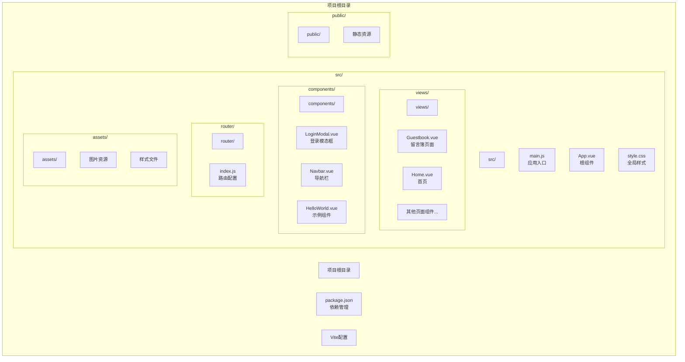
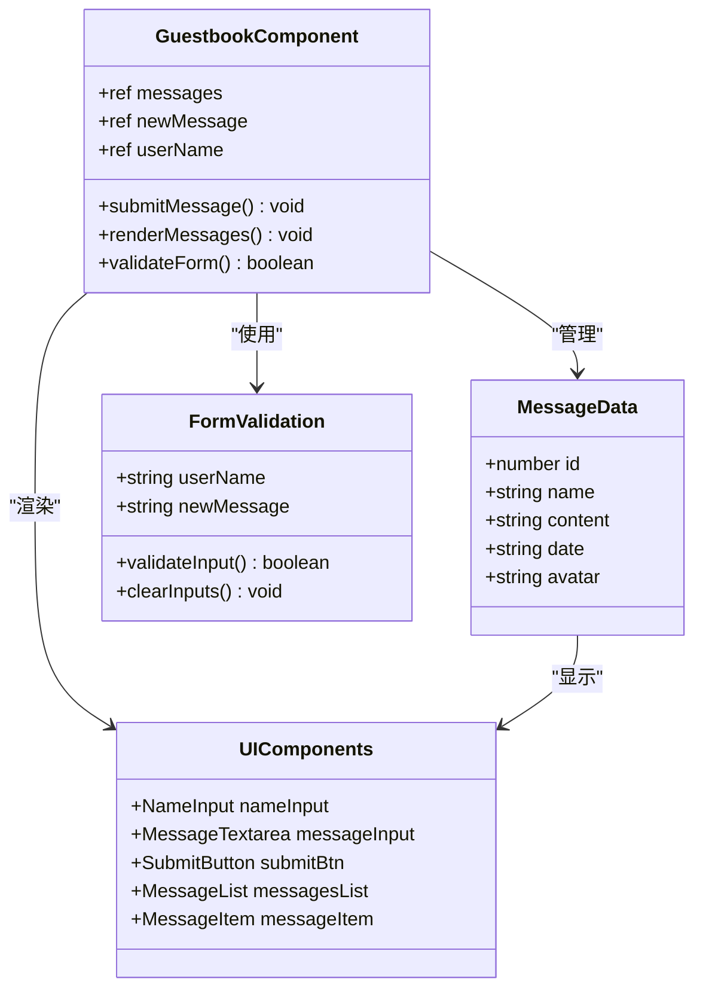
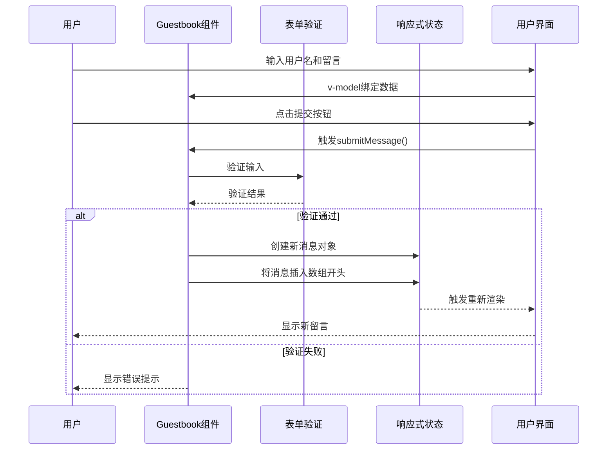
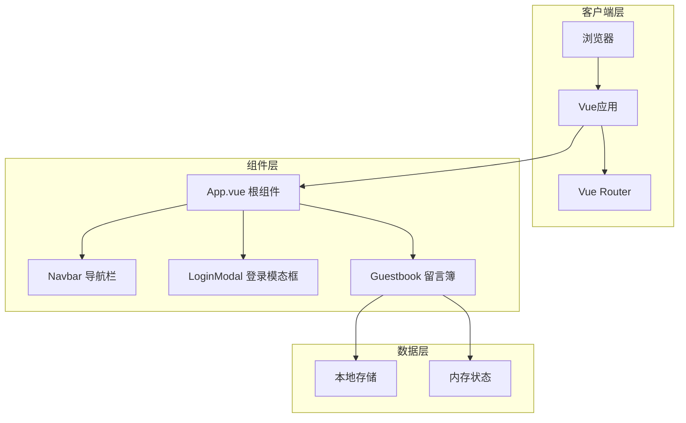
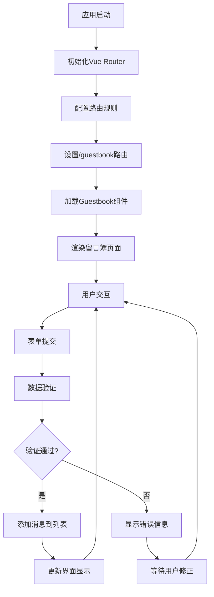
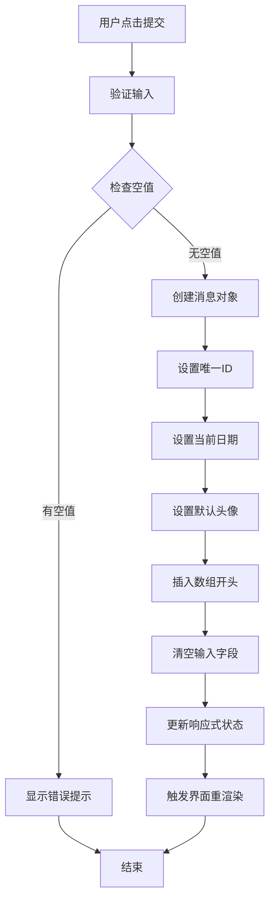
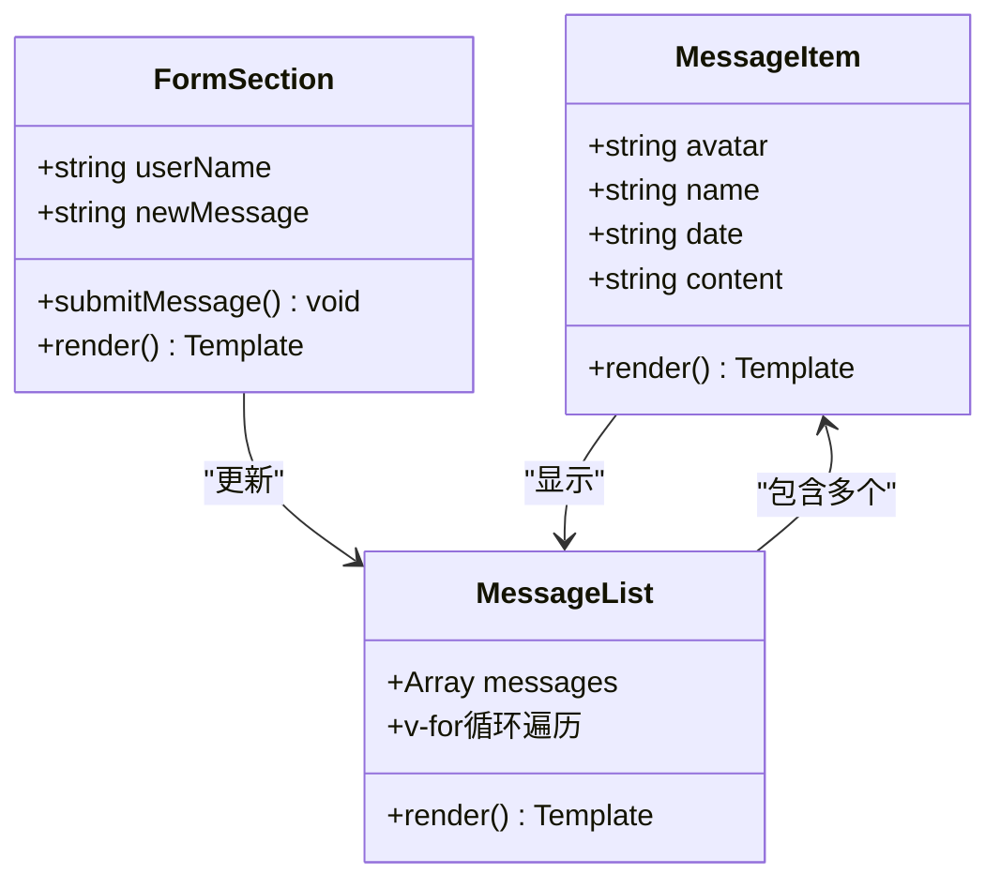
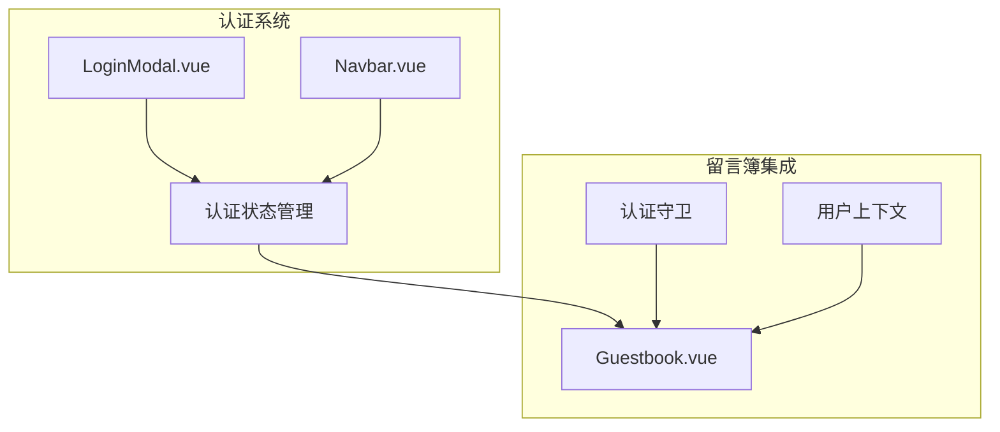
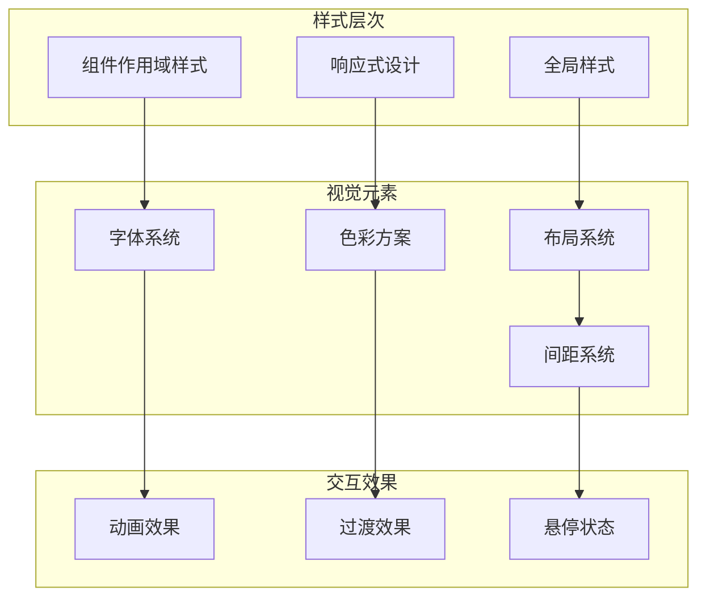
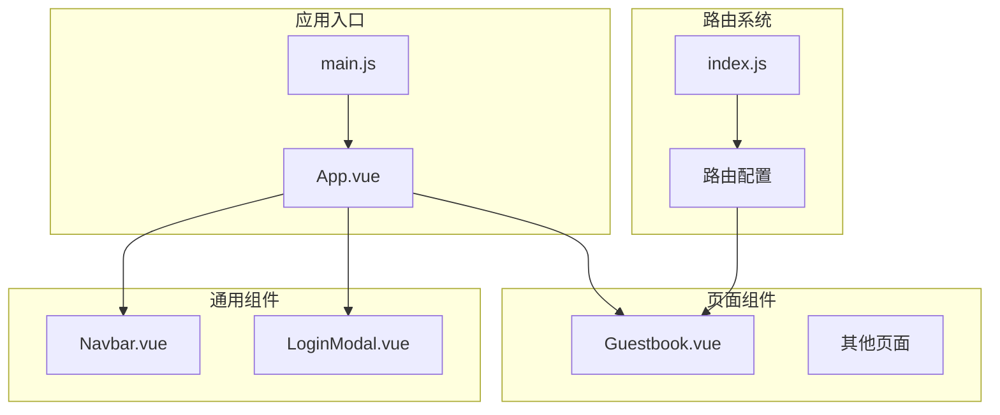

# 留言簿页面

<cite>
**本文档引用的文件**
- [Guestbook.vue](file://src/views/Guestbook.vue)
- [main.js](file://src/main.js)
- [index.js](file://src/router/index.js)
- [App.vue](file://src/App.vue)
- [LoginModal.vue](file://src/components/LoginModal.vue)
- [Navbar.vue](file://src/components/Navbar.vue)
- [package.json](file://package.json)
</cite>

## 目录
1. [简介](#简介)
2. [项目结构](#项目结构)
3. [核心组件](#核心组件)
4. [架构概览](#架构概览)
5. [详细组件分析](#详细组件分析)
6. [依赖关系分析](#依赖关系分析)
7. [性能考虑](#性能考虑)
8. [故障排除指南](#故障排除指南)
9. [结论](#结论)

## 简介

留言簿页面是博客项目中的一个交互式功能模块，允许访客在博客上留下他们的评论和反馈。该组件实现了完整的留言展示和提交功能，包括实时消息列表更新、表单验证、响应式设计和美观的用户界面。

本组件采用Vue 3 Composition API编写，使用了现代前端开发的最佳实践，包括：
- 响应式数据绑定
- 组件化架构
- 渐进式Web应用特性
- 移动端友好的设计

## 项目结构

博客项目采用标准的Vue 3单页应用程序结构，留言簿页面作为路由视图组件位于`src/views/`目录下。



**图表来源**
- [main.js:1-9](file://src/main.js#L1-L9)
- [index.js:1-28](file://src/router/index.js#L1-L28)
- [Guestbook.vue:1-202](file://src/views/Guestbook.vue#L1-L202)

**章节来源**
- [main.js:1-9](file://src/main.js#L1-L9)
- [index.js:1-28](file://src/router/index.js#L1-L28)
- [package.json:1-20](file://package.json#L1-L20)

## 核心组件

### 留言簿组件架构

留言簿页面组件采用Vue 3的组合式API（Composition API）实现，提供了完整的留言管理系统：



**图表来源**
- [Guestbook.vue:1-26](file://src/views/Guestbook.vue#L1-L26)
- [Guestbook.vue:28-66](file://src/views/Guestbook.vue#L28-L66)

### 数据流架构



**图表来源**
- [Guestbook.vue:13-25](file://src/views/Guestbook.vue#L13-L25)

**章节来源**
- [Guestbook.vue:1-202](file://src/views/Guestbook.vue#L1-L202)

## 架构概览

### 整体系统架构



**图表来源**
- [App.vue:1-30](file://src/App.vue#L1-L30)
- [main.js:1-9](file://src/main.js#L1-L9)
- [index.js:1-28](file://src/router/index.js#L1-L28)

### 路由集成架构



**图表来源**
- [index.js:11-20](file://src/router/index.js#L11-L20)
- [Guestbook.vue:13-25](file://src/views/Guestbook.vue#L13-L25)

**章节来源**
- [index.js:1-28](file://src/router/index.js#L1-L28)
- [App.vue:1-30](file://src/App.vue#L1-L30)

## 详细组件分析

### 留言簿组件核心实现

#### 数据结构定义

留言簿组件使用响应式数据结构来管理消息列表：

| 字段名 | 类型 | 描述 | 默认值 |
|--------|------|------|--------|
| `messages` | Array | 留言消息数组 | 初始包含3条演示消息 |
| `newMessage` | String | 新留言内容 | 空字符串 |
| `userName` | String | 发布者姓名 | 空字符串 |

每个消息对象包含以下属性：

| 属性名 | 类型 | 必需 | 描述 |
|--------|------|------|------|
| `id` | Number | 是 | 消息唯一标识符 |
| `name` | String | 是 | 发布者名称 |
| `content` | String | 是 | 留言内容文本 |
| `date` | String | 是 | 发布日期（YYYY-MM-DD格式） |
| `avatar` | String | 是 | 用户头像表情符号 |

#### 提交处理流程



**图表来源**
- [Guestbook.vue:13-25](file://src/views/Guestbook.vue#L13-L25)

#### 表单验证机制

组件实现了基础的前端验证逻辑：

1. **必填字段检查**：确保用户名和留言内容都不为空
2. **空白字符处理**：使用`trim()`方法去除首尾空格
3. **即时反馈**：验证失败时阻止提交操作

#### 界面渲染架构



**图表来源**
- [Guestbook.vue:52-63](file://src/views/Guestbook.vue#L52-L63)
- [Guestbook.vue:36-49](file://src/views/Guestbook.vue#L36-L49)

**章节来源**
- [Guestbook.vue:1-202](file://src/views/Guestbook.vue#L1-L202)

### 用户认证集成

虽然当前版本的留言簿组件没有实现完整的用户认证功能，但项目已经为未来的认证集成做好了准备：

#### 认证组件架构



**图表来源**
- [LoginModal.vue:1-316](file://src/components/LoginModal.vue#L1-L316)
- [Navbar.vue:1-139](file://src/components/Navbar.vue#L1-L139)
- [App.vue:1-30](file://src/App.vue#L1-L30)

#### 权限控制设计

当前的权限控制策略：
- **匿名访问**：所有访客都可以查看留言
- **匿名发布**：访客可以匿名发表留言
- **未来扩展**：预留了用户认证集成点

**章节来源**
- [LoginModal.vue:1-316](file://src/components/LoginModal.vue#L1-L316)
- [Navbar.vue:1-139](file://src/components/Navbar.vue#L1-L139)
- [App.vue:1-30](file://src/App.vue#L1-L30)

### 样式系统分析

#### 设计系统架构



**图表来源**
- [Guestbook.vue:68-201](file://src/views/Guestbook.vue#L68-L201)

#### 主题色彩方案

| 元素类型 | 色彩值 | 使用场景 |
|----------|--------|----------|
| 主色调 | `linear-gradient(135deg, #ffecd2, #fcb69f)` | 页面背景、按钮渐变 |
| 文字颜色 | `#333` | 主要文字 |
| 辅助文字 | `#666` | 次要文字 |
| 占位符 | `#999` | 输入框占位符 |
| 边框色 | `#e0e0e0` | 输入框边框 |

**章节来源**
- [Guestbook.vue:68-201](file://src/views/Guestbook.vue#L68-L201)

## 依赖关系分析

### 外部依赖

项目使用了现代化的前端技术栈：

```mermaid
graph LR
subgraph "运行时依赖"
Vue[Vue 3.5.32]
Router[vue-router 4.6.4]
end
subgraph "开发工具"
Vite[Vite 8.0.4]
Plugin[@vitejs/plugin-vue 6.0.5]
end
subgraph "构建产物"
Dev[开发环境]
Build[生产环境]
Preview[预览环境]
end
Vue --> Router
Vite --> Plugin
Dev --> Build
Build --> Preview
```

**图表来源**
- [package.json:11-19](file://package.json#L11-L19)

### 内部组件依赖



**图表来源**
- [main.js:1-9](file://src/main.js#L1-L9)
- [index.js:1-28](file://src/router/index.js#L1-L28)
- [App.vue:1-30](file://src/App.vue#L1-L30)

**章节来源**
- [package.json:1-20](file://package.json#L1-L20)
- [main.js:1-9](file://src/main.js#L1-L9)
- [index.js:1-28](file://src/router/index.js#L1-L28)

## 性能考虑

### 当前性能特征

基于现有实现，留言簿组件具有以下性能特点：

#### 内存管理
- **响应式数据**：使用Vue 3的响应式系统，自动追踪依赖变化
- **虚拟DOM**：通过模板编译优化渲染性能
- **内存泄漏防护**：组件卸载时自动清理事件监听器

#### 渲染优化
- **局部更新**：只更新受影响的消息项
- **批量更新**：Vue 3的调度器优化批量DOM操作
- **懒加载**：组件按需加载，不阻塞初始页面渲染

### 性能优化建议

针对留言簿功能，建议实施以下优化措施：

1. **无限滚动实现**
   ```javascript
   // 建议的实现思路
   const observer = new IntersectionObserver((entries) => {
     if (entries[0].isIntersecting && hasMore) {
       loadMoreMessages()
     }
   })
   ```

2. **消息缓存策略**
   - 实现本地存储缓存
   - 添加消息过期机制
   - 支持离线模式

3. **图片优化**
   - 实现懒加载
   - 添加占位符
   - 支持WebP格式

## 故障排除指南

### 常见问题诊断

#### 表单提交问题

**症状**：点击提交按钮无反应
**可能原因**：
1. 输入验证失败（空值或空白字符）
2. Vue实例未正确初始化
3. 事件绑定错误

**解决方案**：
1. 检查控制台是否有JavaScript错误
2. 验证v-model绑定是否正确
3. 确认submitMessage函数已正确定义

#### 样式显示异常

**症状**：留言列表样式错乱
**可能原因**：
1. CSS作用域冲突
2. 样式优先级问题
3. 响应式断点问题

**解决方案**：
1. 检查scoped样式是否正确
2. 验证CSS选择器优先级
3. 测试不同屏幕尺寸下的显示效果

#### 路由导航问题

**症状**：无法访问留言簿页面
**可能原因**：
1. 路由配置错误
2. 组件导入路径问题
3. 路由历史模式配置

**解决方案**：
1. 验证路由配置中的路径和组件映射
2. 检查组件文件路径是否正确
3. 确认createWebHistory配置

**章节来源**
- [Guestbook.vue:13-25](file://src/views/Guestbook.vue#L13-L25)
- [index.js:11-20](file://src/router/index.js#L11-L20)

### 调试技巧

1. **Vue DevTools使用**
   - 安装Chrome扩展
   - 检查组件树结构
   - 监控响应式数据变化

2. **网络请求监控**
   - 使用浏览器开发者工具
   - 监控XHR请求
   - 检查CORS配置

3. **性能分析**
   - 使用Performance面板
   - 分析渲染时间
   - 识别性能瓶颈

## 结论

留言簿页面组件是一个功能完整、设计精良的交互式功能模块。它成功实现了以下核心功能：

### 已实现的功能亮点

1. **完整的留言管理**：支持留言的创建、展示和实时更新
2. **响应式设计**：适配各种设备屏幕尺寸
3. **优雅的用户界面**：现代化的设计风格和交互体验
4. **模块化架构**：清晰的组件分离和职责划分

### 技术实现优势

1. **现代前端技术栈**：Vue 3 Composition API的最佳实践
2. **TypeScript友好**：清晰的数据结构定义
3. **可维护性**：模块化的代码组织和命名规范
4. **扩展性**：为未来功能增强预留了接口

### 建议的改进方向

1. **后端集成**：实现持久化存储和真实数据交互
2. **高级功能**：添加分页、搜索、排序等功能
3. **性能优化**：实现无限滚动和缓存机制
4. **用户体验**：增强加载状态和错误处理

该组件为博客项目提供了一个坚实的基础，可以作为更复杂功能模块的参考实现。其清晰的架构设计和良好的代码质量使其成为学习Vue 3开发的优秀案例。