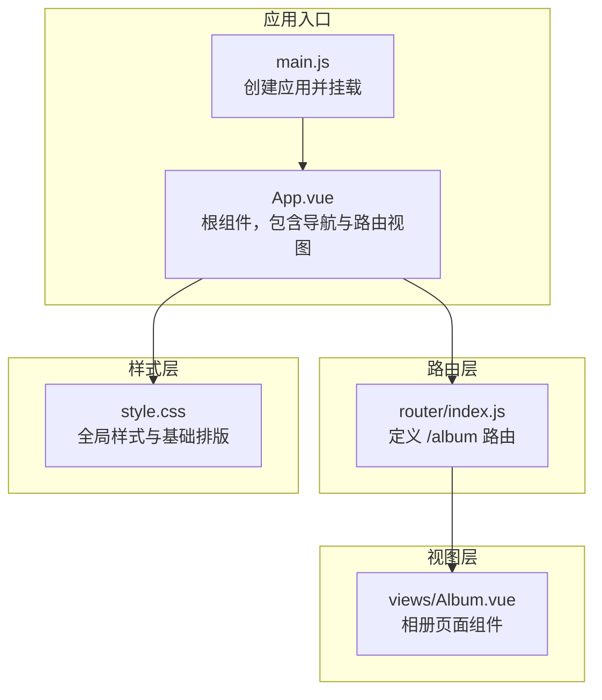
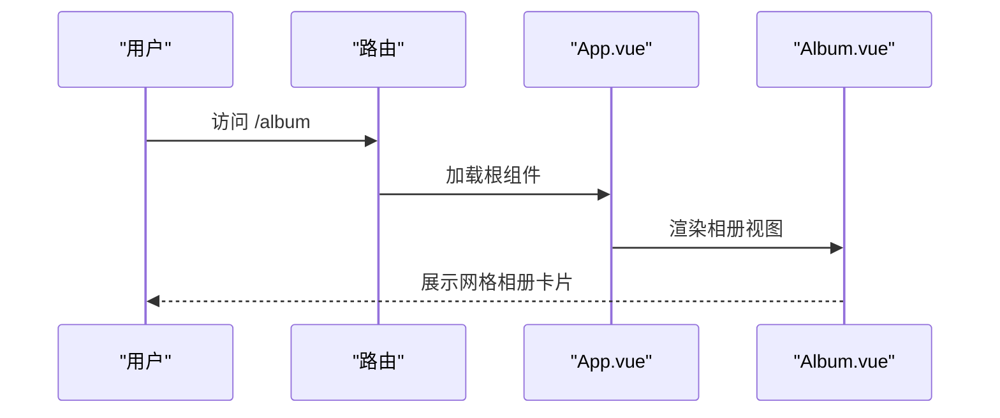
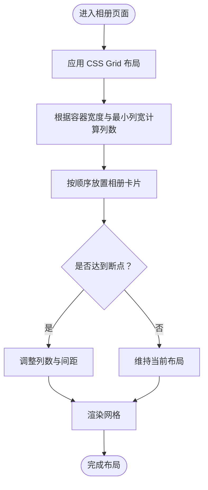
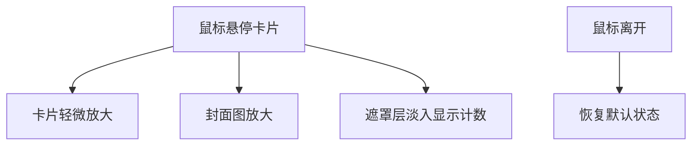
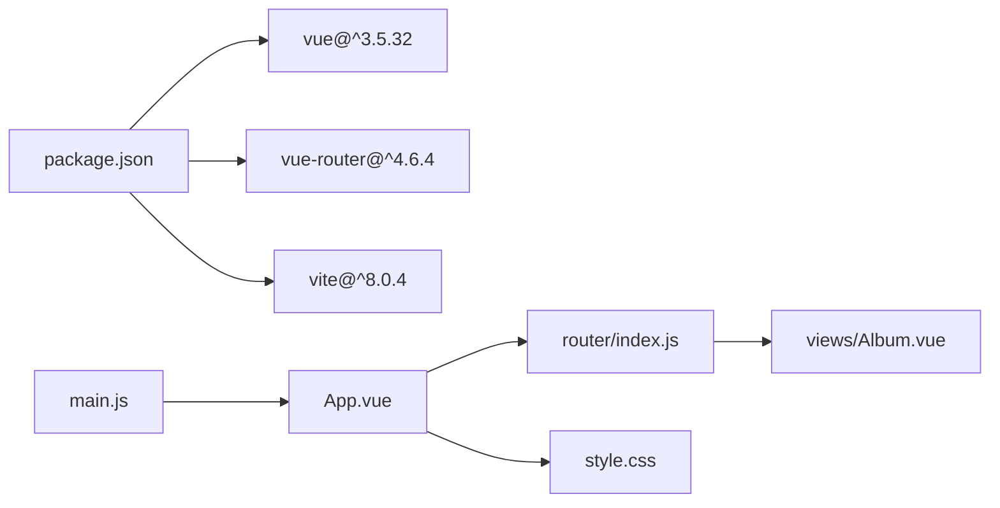

# 相册页面

<cite>
**本文引用的文件**
- [Album.vue](file://src/views/Album.vue)
- [index.js](file://src/router/index.js)
- [main.js](file://src/main.js)
- [App.vue](file://src/App.vue)
- [style.css](file://src/style.css)
- [package.json](file://package.json)
</cite>

## 目录
1. [简介](#简介)
2. [项目结构](#项目结构)
3. [核心组件](#核心组件)
4. [架构总览](#架构总览)
5. [详细组件分析](#详细组件分析)
6. [依赖关系分析](#依赖关系分析)
7. [性能考虑](#性能考虑)
8. [故障排查指南](#故障排查指南)
9. [结论](#结论)
10. [附录](#附录)

## 简介
本文件面向博客项目的相册页面组件，系统性解析 Album.vue 的图片展示功能与实现细节，覆盖以下主题：
- 图片网格布局与响应式设计
- 悬停效果与交互体验
- 图片加载机制与懒加载策略
- 相册布局算法与自适应调整
- 用户交互（点击放大、缩略图切换）的实现路径
- 相册定制方法（新增图片、修改样式）

## 项目结构
相册页面位于前端单页应用中，采用 Vue 3 + Vite 技术栈，通过 vue-router 进行页面路由管理。Album.vue 作为独立视图组件，使用 scoped 样式进行局部样式隔离，并在全局样式中统一基础排版与滚动行为。

图表来源
- [main.js:1-9](file://src/main.js#L1-L9)
- [App.vue:1-30](file://src/App.vue#L1-L30)
- [index.js:1-28](file://src/router/index.js#L1-L28)
- [Album.vue:1-127](file://src/views/Album.vue#L1-L127)
- [style.css:1-56](file://src/style.css#L1-L56)

章节来源
- [main.js:1-9](file://src/main.js#L1-L9)
- [App.vue:1-30](file://src/App.vue#L1-L30)
- [index.js:1-28](file://src/router/index.js#L1-L28)
- [Album.vue:1-127](file://src/views/Album.vue#L1-L127)
- [style.css:1-56](file://src/style.css#L1-L56)

## 核心组件
- Album.vue：负责渲染相册列表，包含标题、描述、相册卡片网格、封面图与计数遮罩层。使用 Vue 3 组合式 API 定义数据源与模板结构，并通过 scoped 样式实现视觉与交互效果。
- 全局样式：提供基础字体、滚动条、选择高亮与平滑滚动等通用设置，确保相册页面在不同设备上具有一致的观感与交互体验。

章节来源
- [Album.vue:1-127](file://src/views/Album.vue#L1-L127)
- [style.css:1-56](file://src/style.css#L1-L56)

## 架构总览
相册页面的前端架构遵循“入口应用 -> 根组件 -> 路由 -> 视图组件”的分层设计。Album.vue 作为视图层组件，通过模板语法绑定数据源，结合 CSS Grid 实现响应式网格布局；同时利用 hover 伪类与过渡动画提升交互体验。

图表来源
- [index.js:16](file://src/router/index.js#L16)
- [App.vue:20](file://src/App.vue#L20)
- [Album.vue:14-33](file://src/views/Album.vue#L14-L33)

## 详细组件分析

### 数据模型与模板结构
- 数据源：组件内部维护一个相册数组，每项包含唯一标识、标题、封面图地址与图片数量。
- 模板：使用 v-for 遍历相册数组，为每个相册渲染卡片容器、封面图、遮罩层与标题文本。

章节来源
- [Album.vue:4-11](file://src/views/Album.vue#L4-L11)
- [Album.vue:21-31](file://src/views/Album.vue#L21-L31)

### 布局算法与网格系统
- 使用 CSS Grid 的自动填充列模式，基于最小宽度与可用空间动态计算列数，实现从窄屏到宽屏的自适应布局。
- 卡片容器具备圆角与溢出隐藏，保证封面图在不同屏幕尺寸下保持一致的视觉比例。

图表来源
- [Album.vue:57-63](file://src/views/Album.vue#L57-L63)

章节来源
- [Album.vue:57-63](file://src/views/Album.vue#L57-L63)

### 悬停效果与交互体验
- 卡片整体悬停时轻微放大，提升点击感知。
- 封面图在悬停时放大，配合渐变遮罩层显示图片数量，增强信息密度与视觉层次。
- 文本标题居中显示，颜色与背景形成对比，确保可读性。

图表来源
- [Album.vue:65-72](file://src/views/Album.vue#L65-L72)
- [Album.vue:81-90](file://src/views/Album.vue#L81-L90)
- [Album.vue:92-109](file://src/views/Album.vue#L92-L109)

章节来源
- [Album.vue:65-72](file://src/views/Album.vue#L65-L72)
- [Album.vue:81-90](file://src/views/Album.vue#L81-L90)
- [Album.vue:92-109](file://src/views/Album.vue#L92-L109)

### 图片加载机制与懒加载策略
- 当前实现：直接使用 img 标签加载远程图片资源，未显式启用浏览器或框架层面的懒加载属性。
- 性能建议：
  - 在 img 标签上增加延迟加载属性，减少首屏资源占用。
  - 对于长列表场景，可引入 IntersectionObserver 或第三方懒加载库以提升性能。
  - 为图片设置合适的尺寸与格式（如 WebP），并在必要时提供占位符或骨架屏。

章节来源
- [Album.vue:24](file://src/views/Album.vue#L24)

### 用户交互功能
- 点击放大：当前模板未绑定点击事件处理函数，无法直接触发放大预览。可通过在卡片上添加点击事件并结合模态框组件实现。
- 缩略图切换：当前未实现多图缩略图切换逻辑。可在点击卡片后打开详情视图，并在详情页内实现缩略图导航与切换。

章节来源
- [Album.vue:22-30](file://src/views/Album.vue#L22-L30)

### 相册定制方法
- 新增相册：在数据源数组中追加新的相册对象，包含唯一 id、标题、封面图地址与图片数量。
- 修改布局样式：通过调整 scoped 样式中的网格参数、间距、圆角与过渡时长，实现不同的视觉风格。
- 响应式断点：通过媒体查询或调整最小列宽与最大容器宽度，适配不同屏幕尺寸。

章节来源
- [Album.vue:4-11](file://src/views/Album.vue#L4-L11)
- [Album.vue:57-63](file://src/views/Album.vue#L57-L63)
- [Album.vue:35-126](file://src/views/Album.vue#L35-L126)

## 依赖关系分析
- 应用依赖：Vue 3 与 vue-router 提供组件化与路由能力；Vite 提供开发与构建工具链。
- 组件依赖：Album.vue 依赖全局样式与路由配置；App.vue 作为根组件承载导航与路由视图。

图表来源
- [package.json:11-19](file://package.json#L11-L19)
- [main.js:1-9](file://src/main.js#L1-L9)
- [App.vue:1-30](file://src/App.vue#L1-L30)
- [index.js:1-28](file://src/router/index.js#L1-L28)
- [Album.vue:1-127](file://src/views/Album.vue#L1-L127)
- [style.css:1-56](file://src/style.css#L1-L56)

章节来源
- [package.json:11-19](file://package.json#L11-L19)
- [main.js:1-9](file://src/main.js#L1-L9)
- [App.vue:1-30](file://src/App.vue#L1-L30)
- [index.js:1-28](file://src/router/index.js#L1-L28)
- [Album.vue:1-127](file://src/views/Album.vue#L1-L127)
- [style.css:1-56](file://src/style.css#L1-L56)

## 性能考虑
- 图片加载：建议对封面图启用延迟加载，避免首屏阻塞；对于大量图片场景，可考虑使用 IntersectionObserver 或专用懒加载库。
- 动画性能：悬停放大的过渡动画已使用 transform，属于硬件加速友好属性；可适当缩短过渡时长以降低重绘成本。
- 布局性能：CSS Grid 自动填充在现代浏览器中性能良好；若出现布局抖动，可固定容器高度或使用 CSS 变量控制列数。
- 资源体积：通过压缩图片、选择合适格式与尺寸，减少带宽占用；必要时提供占位符与骨架屏提升感知性能。

## 故障排查指南
- 图片不显示：检查封面图链接是否有效，确认网络环境与跨域策略；在模板中为 img 添加错误回退处理。
- 布局异常：确认容器宽度与 CSS Grid 参数设置；检查是否有外部样式覆盖导致的冲突。
- 交互无响应：若计划添加点击放大功能，需在模板中绑定点击事件并确保事件处理器正确执行。
- 路由访问：确认路由配置中 /album 路径已注册，且组件引用正确。

章节来源
- [Album.vue:24](file://src/views/Album.vue#L24)
- [Album.vue:57-63](file://src/views/Album.vue#L57-L63)
- [index.js:16](file://src/router/index.js#L16)

## 结论
Album.vue 以简洁的数据驱动方式实现了相册网格展示，结合 CSS Grid 与 hover 交互营造了良好的用户体验。当前版本侧重静态展示与基础响应式布局，后续可在图片懒加载、点击放大与缩略图切换等方面进一步完善，以满足更丰富的相册浏览需求。

## 附录
- 快速开始：安装依赖后运行开发服务器，访问 /album 查看相册页面。
- 扩展建议：引入图片懒加载、点击事件与模态框组件，实现点击放大与缩略图切换；通过媒体查询细化移动端体验。