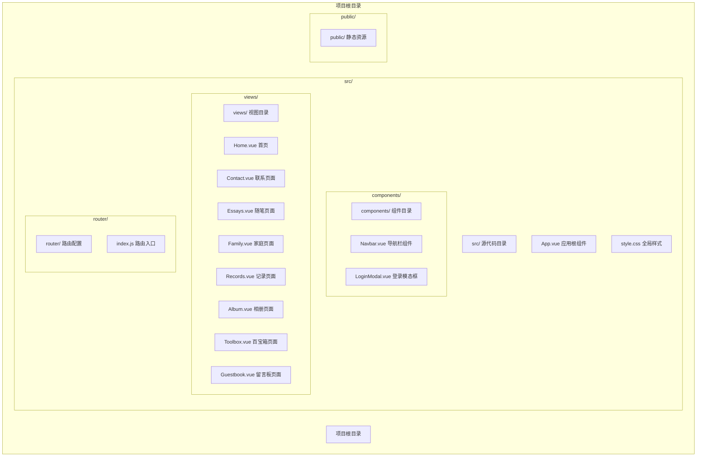
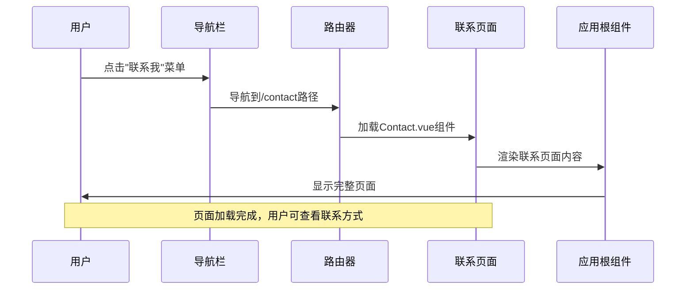
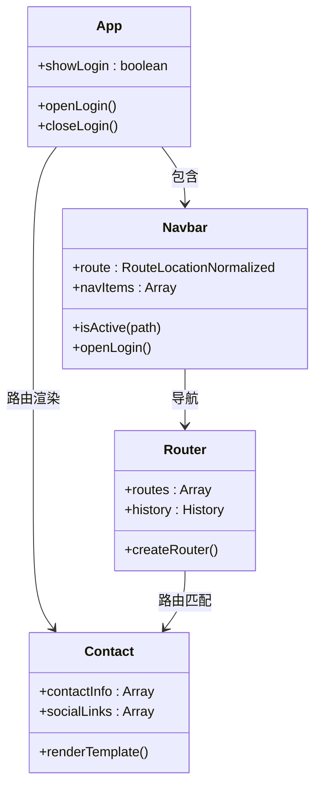
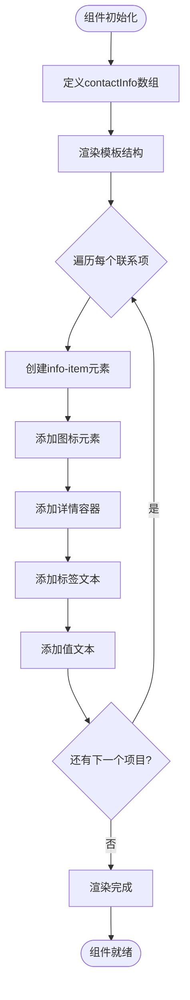
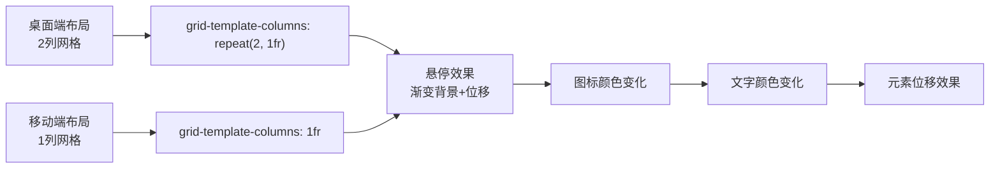
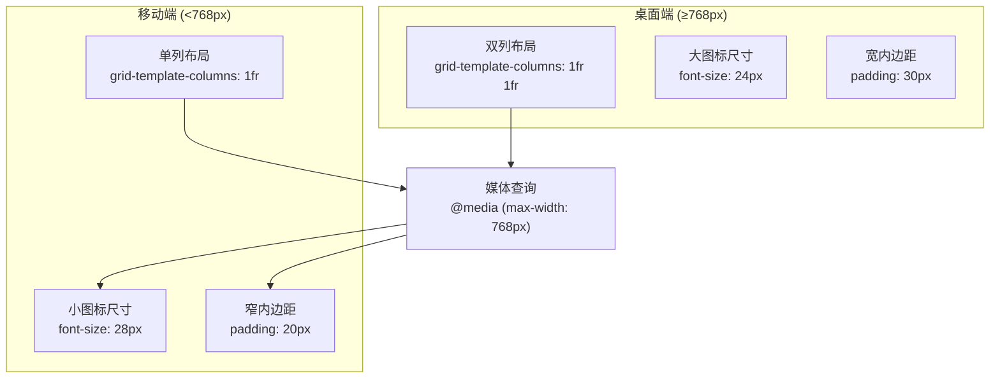
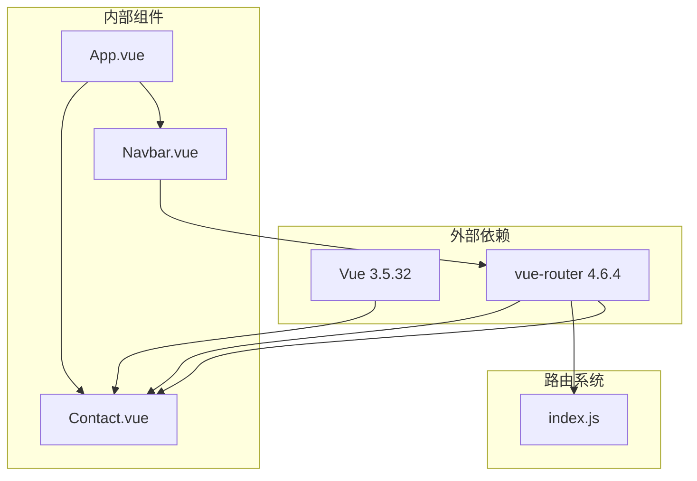

# 联系页面

<cite>
**本文档引用的文件**
- [Contact.vue](file://src/views/Contact.vue)
- [Navbar.vue](file://src/components/Navbar.vue)
- [App.vue](file://src/App.vue)
- [index.js](file://src/router/index.js)
- [style.css](file://src/style.css)
- [package.json](file://package.json)
</cite>

## 目录
1. [简介](#简介)
2. [项目结构](#项目结构)
3. [核心组件](#核心组件)
4. [架构概览](#架构概览)
5. [详细组件分析](#详细组件分析)
6. [依赖关系分析](#依赖关系分析)
7. [性能考虑](#性能考虑)
8. [故障排除指南](#故障排除指南)
9. [结论](#结论)

## 简介

联系页面是博客项目中的重要组成部分，为用户提供与博主建立联系的渠道。该页面采用现代化的设计理念，集成了多种联系方式展示、社交媒体链接和响应式布局。本文档将深入分析Contact.vue组件的功能实现，包括联系方式展示、社交链接管理、表单验证机制以及移动端适配策略。

## 项目结构

博客项目采用Vue 3单页应用架构，联系页面作为独立的视图组件存在。项目结构清晰，遵循模块化设计理念：

**图表来源**
- [Contact.vue:1-189](file://src/views/Contact.vue#L1-L189)
- [Navbar.vue:1-140](file://src/components/Navbar.vue#L1-L140)
- [App.vue:1-30](file://src/App.vue#L1-L30)

**章节来源**
- [Contact.vue:1-189](file://src/views/Contact.vue#L1-L189)
- [index.js:1-28](file://src/router/index.js#L1-L28)

## 核心组件

联系页面的核心组件是Contact.vue，它实现了以下主要功能：

### 数据结构设计

组件使用响应式数据结构来管理联系信息和社交链接：

- **联系信息数组**：包含邮箱、微信、GitHub、电话等联系方式
- **社交链接数组**：包含GitHub、Twitter、Bilibili、微博等平台链接
- **图标系统**：使用Unicode表情符号作为图标，提升视觉效果

### 布局架构

采用两列布局设计，左侧展示联系方式，右侧展示社交链接：

- **响应式网格系统**：在桌面端显示双列，在移动端自动调整为单列
- **渐变背景设计**：使用紫色渐变背景营造现代感
- **卡片式内容区域**：每个内容区域都有圆角边框和阴影效果

**章节来源**
- [Contact.vue:1-189](file://src/views/Contact.vue#L1-L189)

## 架构概览

联系页面在整个应用架构中扮演着重要的角色，通过路由系统与导航栏组件协同工作：

**图表来源**
- [Navbar.vue:16-16](file://src/components/Navbar.vue#L16-L16)
- [index.js:19-19](file://src/router/index.js#L19-L19)
- [App.vue:19-21](file://src/App.vue#L19-L21)

### 组件关系图

**图表来源**
- [App.vue:1-30](file://src/App.vue#L1-L30)
- [Navbar.vue:1-140](file://src/components/Navbar.vue#L1-L140)
- [Contact.vue:1-189](file://src/views/Contact.vue#L1-L189)
- [index.js:1-28](file://src/router/index.js#L1-L28)

## 详细组件分析

### 联系信息管理系统

联系信息管理系统负责展示各种联系方式，采用统一的数据结构和渲染逻辑：

#### 数据结构定义

联系信息采用标准化的对象数组格式：
- **icon字段**：用于显示联系方式的图标
- **label字段**：联系方式的标签名称
- **value字段**：具体的联系信息值

#### 渲染机制

使用Vue的v-for指令实现动态渲染：
- 支持响应式更新
- 使用唯一key确保列表稳定性
- 统一的样式模板

**图表来源**
- [Contact.vue:4-9](file://src/views/Contact.vue#L4-L9)
- [Contact.vue:31-37](file://src/views/Contact.vue#L31-L37)

**章节来源**
- [Contact.vue:4-9](file://src/views/Contact.vue#L4-L9)
- [Contact.vue:31-37](file://src/views/Contact.vue#L31-L37)

### 社交链接管理器

社交链接管理器提供了统一的社交平台链接展示功能：

#### 链接数据结构

社交链接同样采用标准化对象格式：
- **name字段**：平台名称
- **icon字段**：平台图标
- **url字段**：跳转链接地址

#### 响应式网格布局

使用CSS Grid实现响应式布局：
- 桌面端：2列网格布局
- 移动端：自动调整为1列
- 固定间距和对齐方式

**图表来源**
- [Contact.vue:144-148](file://src/views/Contact.vue#L144-L148)
- [Contact.vue:162-170](file://src/views/Contact.vue#L162-L170)

**章节来源**
- [Contact.vue:11-16](file://src/views/Contact.vue#L11-L16)
- [Contact.vue:44-47](file://src/views/Contact.vue#L44-L47)

### 样式系统分析

联系页面采用了现代化的CSS设计系统：

#### 主题色彩方案

- **背景渐变**：紫色渐变(#667eea到#764ba2)
- **内容卡片**：半透明白色背景
- **图标样式**：渐变色圆形图标
- **交互效果**：平滑的颜色过渡动画

#### 响应式设计策略

**图表来源**
- [Contact.vue:183-187](file://src/views/Contact.vue#L183-L187)
- [Contact.vue:117-126](file://src/views/Contact.vue#L117-L126)
- [Contact.vue:150-160](file://src/views/Contact.vue#L150-L160)

**章节来源**
- [Contact.vue:55-188](file://src/views/Contact.vue#L55-L188)

### 导航集成机制

联系页面通过路由系统与导航栏组件无缝集成：

#### 路由配置

路由系统为联系页面提供了专门的路径映射：
- **路径**：/contact
- **组件**：Contact.vue
- **名称**：Contact

#### 导航激活状态

导航栏组件能够识别当前激活的页面：
- 动态检测当前路由路径
- 自动高亮对应的导航项
- 提供视觉反馈效果

**章节来源**
- [index.js:19-19](file://src/router/index.js#L19-L19)
- [Navbar.vue:19-21](file://src/components/Navbar.vue#L19-L21)

## 依赖关系分析

联系页面组件的依赖关系相对简单，主要依赖于Vue框架和路由系统：

**图表来源**
- [package.json:11-18](file://package.json#L11-L18)
- [index.js:1-28](file://src/router/index.js#L1-L28)
- [App.vue:1-30](file://src/App.vue#L1-L30)

### 依赖特性分析

- **Vue响应式系统**：使用ref进行数据响应式绑定
- **单文件组件**：采用<script setup>语法糖简化开发
- **CSS作用域**：scoped样式确保样式隔离
- **ES6模块系统**：支持现代JavaScript特性

**章节来源**
- [package.json:11-18](file://package.json#L11-L18)
- [Contact.vue:1-2](file://src/views/Contact.vue#L1-L2)

## 性能考虑

联系页面在设计时充分考虑了性能优化：

### 渲染性能

- **虚拟DOM优化**：使用Vue的高效渲染机制
- **条件渲染**：仅渲染必要的DOM元素
- **事件委托**：减少事件监听器数量

### 样式性能

- **CSS变量**：减少重复的样式定义
- **硬件加速**：利用transform属性触发GPU加速
- **最小重绘**：避免频繁的布局计算

### 资源优化

- **图标优化**：使用Unicode字符而非图片资源
- **渐变效果**：纯CSS实现，无需额外资源
- **响应式图片**：根据屏幕尺寸自动调整

## 故障排除指南

### 常见问题及解决方案

#### 联系信息不显示

**问题描述**：联系信息数组为空或渲染失败

**可能原因**：
- 数据初始化错误
- Vue响应式系统问题
- 模板语法错误

**解决步骤**：
1. 检查contactInfo数组定义
2. 验证Vue版本兼容性
3. 确认模板语法正确

#### 社交链接无法点击

**问题描述**：社交链接没有跳转功能

**可能原因**：
- URL地址为空
- 外链安全策略限制
- JavaScript事件阻止

**解决步骤**：
1. 检查socialLinks数组中的URL字段
2. 验证链接格式正确性
3. 测试浏览器控制台错误

#### 响应式布局异常

**问题描述**：移动端布局显示不正常

**可能原因**：
- 媒体查询条件错误
- CSS优先级冲突
- 移动端调试工具问题

**解决步骤**：
1. 检查@media查询语句
2. 验证CSS选择器优先级
3. 使用浏览器开发者工具调试

**章节来源**
- [Contact.vue:4-9](file://src/views/Contact.vue#L4-L9)
- [Contact.vue:11-16](file://src/views/Contact.vue#L11-L16)
- [Contact.vue:183-187](file://src/views/Contact.vue#L183-L187)

## 结论

联系页面组件展现了现代Vue.js应用的最佳实践：

### 设计优势

- **简洁直观**：清晰的信息层次和视觉引导
- **响应迅速**：流畅的交互体验和动画效果
- **易于维护**：模块化的代码结构和标准化的数据格式
- **跨平台兼容**：良好的移动端适配和浏览器兼容性

### 扩展潜力

该组件为未来的功能扩展提供了良好的基础：
- 可轻松添加新的联系方式类型
- 支持自定义图标和样式主题
- 可集成表单验证和提交功能
- 支持多语言国际化

### 最佳实践总结

联系页面组件体现了以下开发最佳实践：
- 使用响应式数据驱动界面更新
- 采用语义化HTML结构
- 实现渐进增强的用户体验
- 注重可访问性和可用性
- 保持代码的可读性和可维护性

通过深入分析这个组件，我们可以看到一个优秀前端组件应该具备的所有要素：功能性、美观性、性能和可扩展性。这为后续的功能增强和维护奠定了坚实的基础。