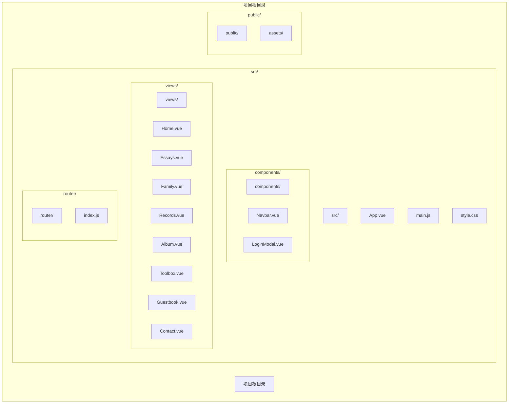
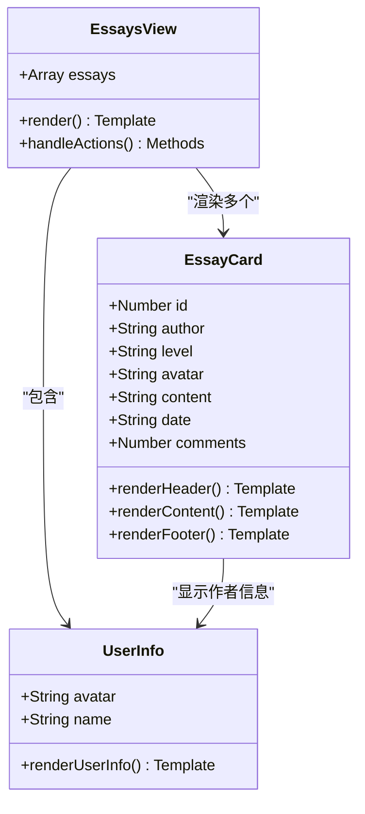
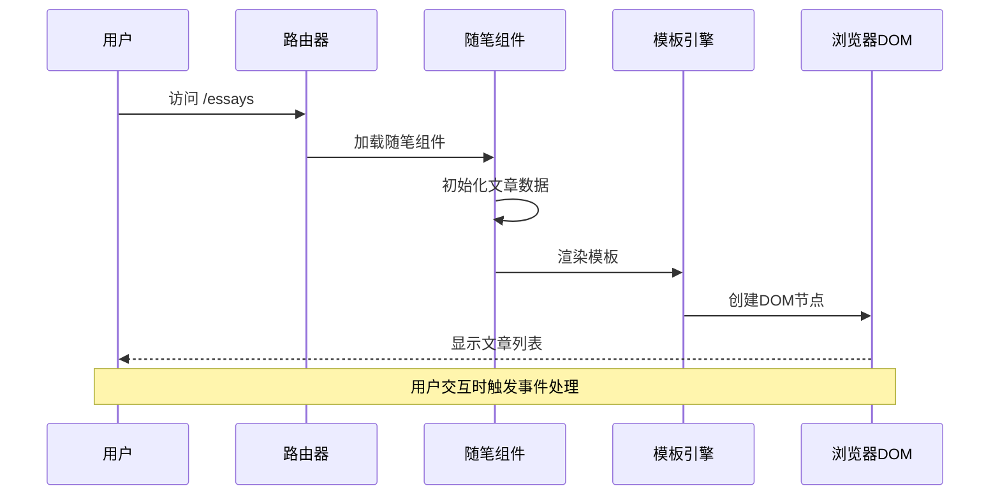
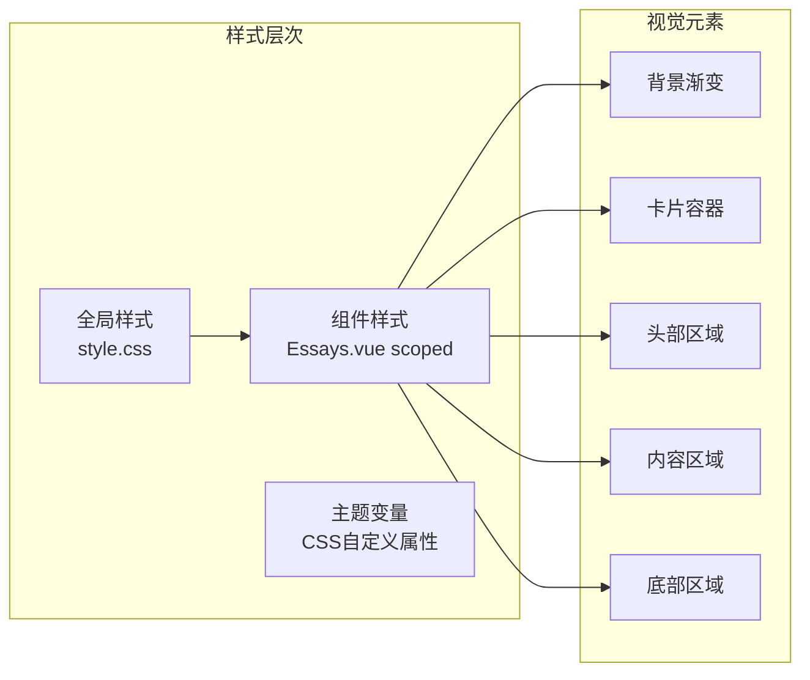
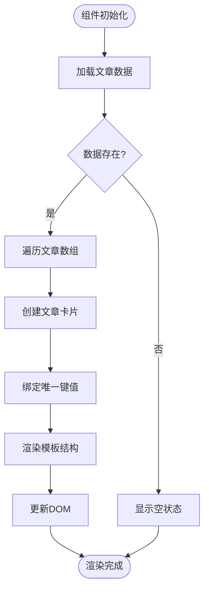
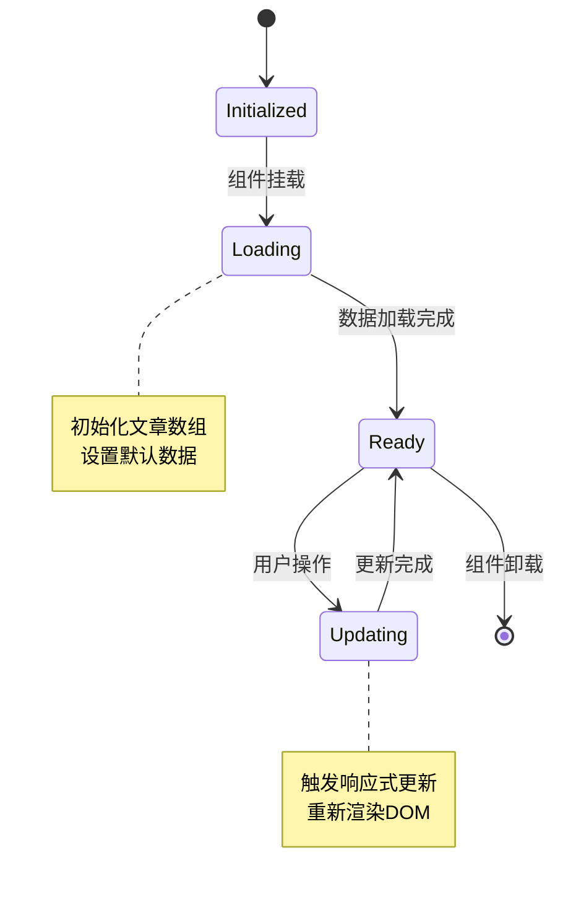
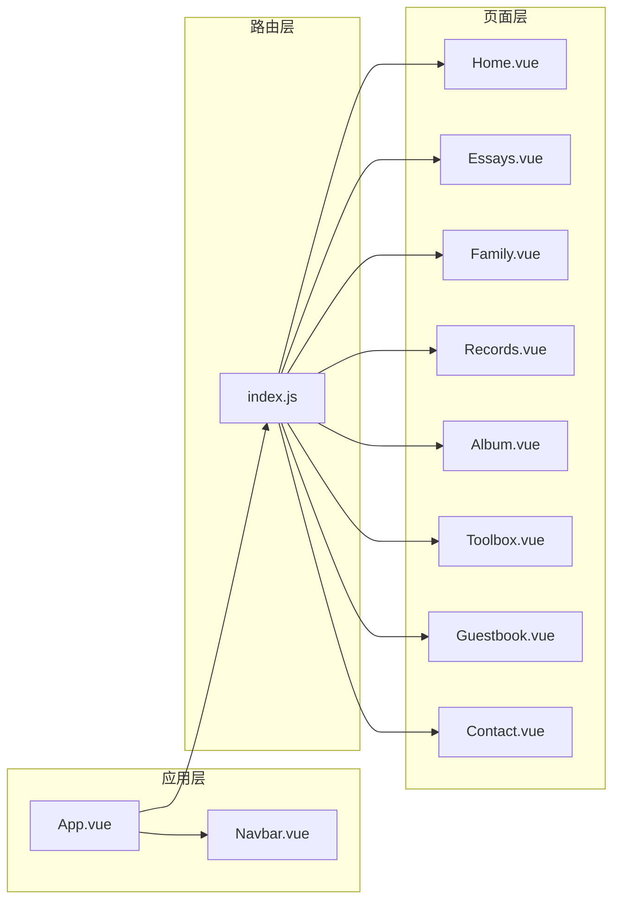

# 随笔页面

<cite>
**本文档引用的文件**
- [Essays.vue](file://src/views/Essays.vue)
- [index.js](file://src/router/index.js)
- [main.js](file://src/main.js)
- [App.vue](file://src/App.vue)
- [Navbar.vue](file://src/components/Navbar.vue)
- [Home.vue](file://src/views/Home.vue)
- [package.json](file://package.json)
- [README.md](file://README.md)
- [style.css](file://src/style.css)
</cite>

## 目录
1. [简介](#简介)
2. [项目结构](#项目结构)
3. [核心组件](#核心组件)
4. [架构概览](#架构概览)
5. [详细组件分析](#详细组件分析)
6. [依赖关系分析](#依赖关系分析)
7. [性能考虑](#性能考虑)
8. [故障排除指南](#故障排除指南)
9. [结论](#结论)
10. [附录](#附录)

## 简介

随笔页面是博客项目中的一个核心功能模块，负责展示用户的随笔记录。该页面采用Vue 3的组合式API（Composition API）和单文件组件（SFC）格式实现，提供了简洁美观的文章列表展示功能。当前版本的随笔页面包含基础的文章数据管理、列表渲染和简单的交互功能，但尚未实现高级功能如搜索过滤、分页、编辑管理等。

## 项目结构

博客项目采用标准的Vue 3 + Vite项目结构，随笔页面位于`src/views/`目录下，与其他页面组件并列组织。



**图表来源**
- [Essays.vue:1-195](file://src/views/Essays.vue#L1-L195)
- [index.js:1-28](file://src/router/index.js#L1-L28)
- [main.js:1-9](file://src/main.js#L1-L9)

**章节来源**
- [Essays.vue:1-195](file://src/views/Essays.vue#L1-L195)
- [index.js:1-28](file://src/router/index.js#L1-L28)
- [main.js:1-9](file://src/main.js#L1-L9)

## 核心组件

### 数据结构设计

随笔页面的核心数据结构是一个包含固定文章条目的数组，每个文章对象具有以下属性：

| 属性名 | 类型 | 描述 | 示例值 |
|--------|------|------|--------|
| id | Number | 文章唯一标识符 | 1, 2, 3, 4 |
| author | String | 作者名称 | "Corrain" |
| level | String | 用户等级标识 | "LV6" |
| avatar | String | 头像图片URL | "https://images.unsplash.com/..." |
| content | String | 文章内容 | "好久没有更新了..." |
| date | String | 发布日期 | "2026-01-24", "2024-09-23" |
| comments | Number | 评论数量 | 0, 1, 2 |

### 组件架构



**图表来源**
- [Essays.vue:4-41](file://src/views/Essays.vue#L4-L41)
- [Essays.vue:54-77](file://src/views/Essays.vue#L54-L77)

**章节来源**
- [Essays.vue:1-195](file://src/views/Essays.vue#L1-L195)

## 架构概览

### 页面渲染流程



**图表来源**
- [index.js:14-14](file://src/router/index.js#L14-L14)
- [Essays.vue:44-80](file://src/views/Essays.vue#L44-L80)

### 样式系统架构



**图表来源**
- [style.css:1-56](file://src/style.css#L1-L56)
- [Essays.vue:82-194](file://src/views/Essays.vue#L82-L194)

**章节来源**
- [index.js:1-28](file://src/router/index.js#L1-L28)
- [Essays.vue:1-195](file://src/views/Essays.vue#L1-L195)
- [style.css:1-56](file://src/style.css#L1-L56)

## 详细组件分析

### 文章列表渲染机制

#### 列表渲染实现

随笔页面使用Vue的`v-for`指令实现文章列表的动态渲染：



**图表来源**
- [Essays.vue:54-77](file://src/views/Essays.vue#L54-L77)

#### 文章卡片结构

每个文章卡片包含三个主要区域：

1. **头部区域**：显示作者头像、姓名和等级徽章
2. **内容区域**：展示文章正文内容
3. **底部区域**：包含发布日期和操作按钮

**章节来源**
- [Essays.vue:44-80](file://src/views/Essays.vue#L44-L80)

### 数据管理与状态

#### 响应式数据管理

当前实现采用`ref`进行响应式数据管理：



**图表来源**
- [Essays.vue:1-4](file://src/views/Essays.vue#L1-L4)
- [Essays.vue:54-77](file://src/views/Essays.vue#L54-L77)

**章节来源**
- [Essays.vue:1-4](file://src/views/Essays.vue#L1-L4)

### 样式系统分析

#### 视觉设计规范

随笔页面采用了统一的设计语言和样式规范：

| 设计元素 | 属性 | 值 | 用途 |
|----------|------|-----|------|
| 背景渐变 | background | linear-gradient(rgba(0,0,0,0.2), rgba(0,0,0,0.2)) | 页面背景遮罩 |
| 卡片圆角 | border-radius | 12px | 圆润边角设计 |
| 卡片阴影 | box-shadow | 0 2px 10px rgba(0,0,0,0.1) | 层次感效果 |
| 字体家族 | font-family | -apple-system, BlinkMacSystemFont, ... | 系统字体栈 |
| 行高 | line-height | 1.6 | 文本可读性 |
| 主色调 | color | #333 | 主要文本颜色 |

**章节来源**
- [Essays.vue:82-194](file://src/views/Essays.vue#L82-L194)
- [style.css:7-15](file://src/style.css#L7-L15)

## 依赖关系分析

### 技术栈依赖

```mermaid
graph TB
subgraph "运行时依赖"
Vue[Vue 3.5.32]
Router[vue-router 4.6.4]
end
subgraph "开发时依赖"
Vite[Vite 8.0.4]
Plugin[@vitejs/plugin-vue 6.0.5]
end
subgraph "项目组件"
App[App.vue]
Main[main.js]
RouterConfig[router/index.js]
Essays[views/Essays.vue]
end
Vue --> App
Router --> RouterConfig
Vite --> Plugin
App --> Main
RouterConfig --> Essays
```

**图表来源**
- [package.json:11-18](file://package.json#L11-L18)
- [main.js:1-9](file://src/main.js#L1-L9)
- [index.js:1-28](file://src/router/index.js#L1-L28)

### 组件间依赖关系



**图表来源**
- [App.vue:1-30](file://src/App.vue#L1-L30)
- [index.js:1-28](file://src/router/index.js#L1-L28)

**章节来源**
- [package.json:1-20](file://package.json#L1-L20)
- [App.vue:1-30](file://src/App.vue#L1-L30)
- [index.js:1-28](file://src/router/index.js#L1-L28)

## 性能考虑

### 当前性能特征

基于现有实现，随笔页面具有以下性能特点：

1. **内存使用**：文章数据存储在组件内部，内存占用较小
2. **渲染性能**：使用虚拟DOM进行高效更新
3. **网络开销**：静态资源通过CDN加载，减少本地带宽占用
4. **响应速度**：组件结构简单，首次渲染速度快

### 优化建议

针对当前实现，建议考虑以下优化方案：

1. **懒加载机制**：对于大量文章数据，可考虑分页或无限滚动
2. **缓存策略**：实现数据缓存避免重复请求
3. **图片优化**：使用现代图片格式和适当的尺寸
4. **代码分割**：按需加载非关键功能

## 故障排除指南

### 常见问题诊断

#### 页面无法显示

**症状**：访问随笔页面空白或报错

**可能原因**：
1. 路由配置错误
2. 组件导入失败
3. 样式冲突

**解决步骤**：
1. 检查路由配置中的路径映射
2. 验证组件文件路径正确性
3. 查看浏览器控制台错误信息

#### 文章数据不显示

**症状**：页面空白或只显示布局框架

**可能原因**：
1. 数据初始化失败
2. 模板语法错误
3. 响应式数据未正确绑定

**解决步骤**：
1. 检查文章数据数组格式
2. 验证v-for指令使用正确
3. 确认key属性设置

#### 样式显示异常

**症状**：页面样式错乱或显示不正确

**可能原因**：
1. CSS作用域冲突
2. 样式优先级问题
3. 浏览器兼容性

**解决步骤**：
1. 检查scoped样式使用
2. 验证CSS选择器优先级
3. 测试不同浏览器兼容性

**章节来源**
- [Essays.vue:1-195](file://src/views/Essays.vue#L1-L195)
- [index.js:1-28](file://src/router/index.js#L1-L28)

## 结论

随笔页面作为博客项目的核心功能模块，展现了Vue 3技术栈的最佳实践。当前实现具有以下优势：

1. **简洁明了**：代码结构清晰，易于理解和维护
2. **响应式设计**：充分利用Vue的响应式特性
3. **组件化架构**：遵循Vue的组件化开发模式
4. **样式规范**：采用现代化的CSS设计语言

然而，当前版本仍存在一些功能限制，如缺少搜索过滤、分页管理、编辑功能等。建议在后续版本中逐步完善这些功能，以提升用户体验和功能完整性。

## 附录

### 开发环境配置

项目使用Vite作为构建工具，配置相对简单：

- **开发服务器**：`npm run dev`
- **生产构建**：`npm run build`
- **预览构建**：`npm run preview`

### 扩展开发指南

#### 添加搜索功能

```javascript
// 建议的搜索功能实现思路
const searchQuery = ref('')
const filteredEssays = computed(() => {
  if (!searchQuery.value) return essays.value
  return essays.value.filter(essay => 
    essay.content.toLowerCase().includes(searchQuery.value.toLowerCase()) ||
    essay.author.toLowerCase().includes(searchQuery.value.toLowerCase())
  )
})
```

#### 实现分页功能

```javascript
// 建议的分页实现思路
const currentPage = ref(1)
const itemsPerPage = ref(10)
const paginatedEssays = computed(() => {
  const start = (currentPage.value - 1) * itemsPerPage.value
  return essays.value.slice(start, start + itemsPerPage.value)
})
```

#### 添加编辑功能

```javascript
// 建议的编辑功能实现思路
const editingEssay = ref(null)
const editForm = ref({
  content: '',
  date: ''
})

const openEdit = (essay) => {
  editingEssay.value = essay
  editForm.value = { ...essay }
}

const saveEdit = () => {
  // 实现保存逻辑
}
```