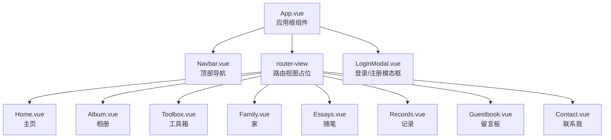
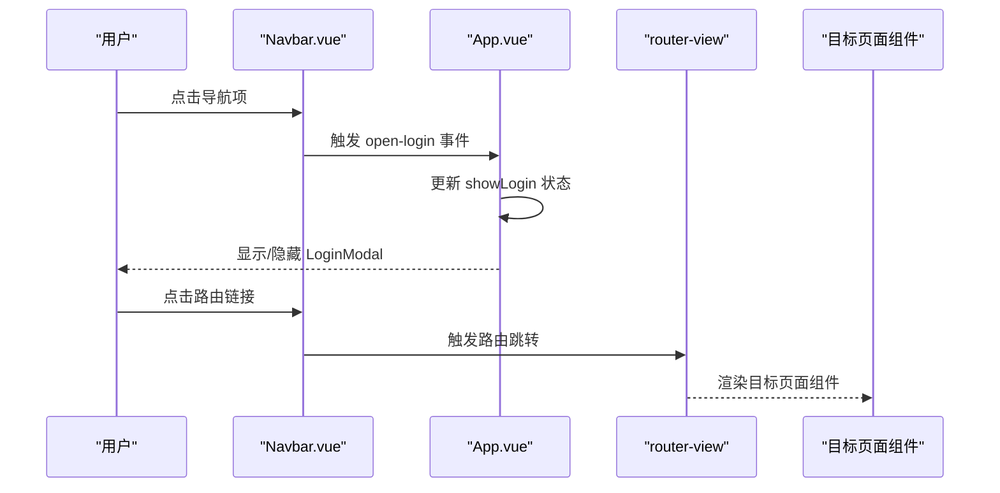
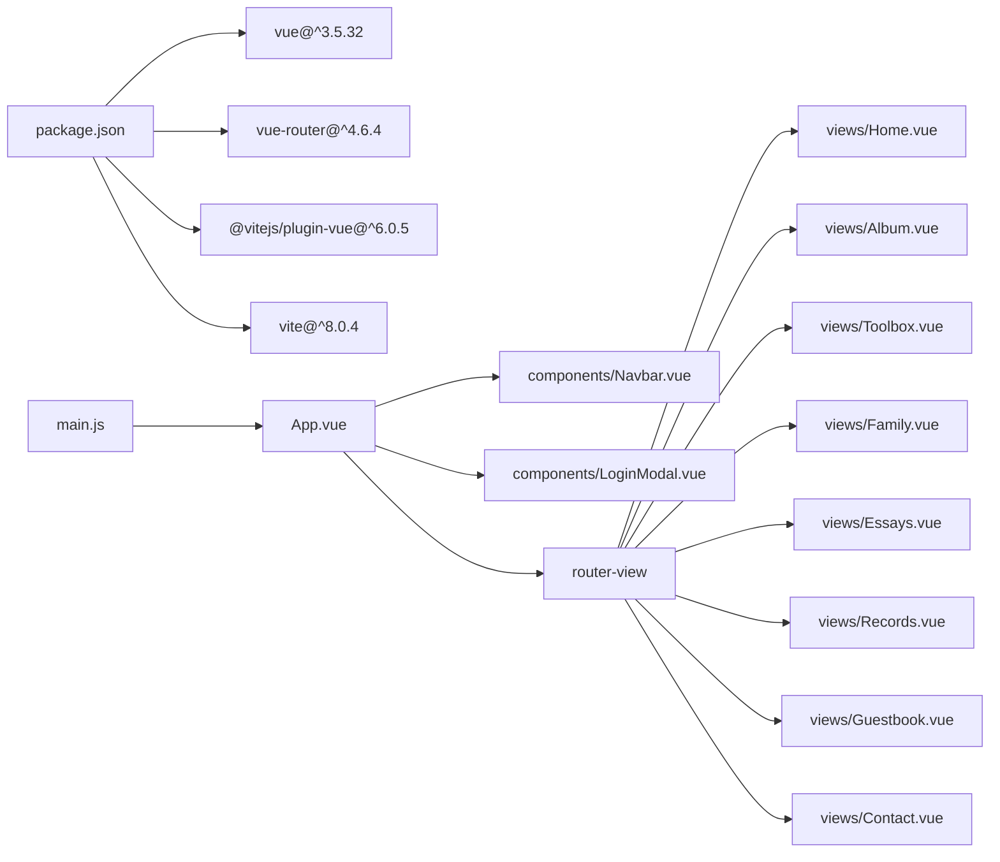

# 页面视图系统

<cite>
**本文档引用的文件**
- [Home.vue](file://src/views/Home.vue)
- [Album.vue](file://src/views/Album.vue)
- [Toolbox.vue](file://src/views/Toolbox.vue)
- [Family.vue](file://src/views/Family.vue)
- [Essays.vue](file://src/views/Essays.vue)
- [Records.vue](file://src/views/Records.vue)
- [Guestbook.vue](file://src/views/Guestbook.vue)
- [Contact.vue](file://src/views/Contact.vue)
- [App.vue](file://src/App.vue)
- [main.js](file://src/main.js)
- [router/index.js](file://src/router/index.js)
- [components/Navbar.vue](file://src/components/Navbar.vue)
- [components/LoginModal.vue](file://src/components/LoginModal.vue)
- [style.css](file://src/style.css)
- [package.json](file://package.json)
</cite>

## 目录
1. [简介](#简介)
2. [项目结构](#项目结构)
3. [核心组件](#核心组件)
4. [架构总览](#架构总览)
5. [详细组件分析](#详细组件分析)
6. [依赖关系分析](#依赖关系分析)
7. [性能考虑](#性能考虑)
8. [故障排除指南](#故障排除指南)
9. [结论](#结论)
10. [附录](#附录)

## 简介
本文件系统性梳理博客项目的页面视图体系，重点覆盖主页、相册、工具箱等核心页面的实现逻辑、设计特色与交互体验，并补充导航关系、数据流与状态同步机制。文档同时提供响应式布局、动画效果与用户交互的实现要点，以及页面定制与扩展的最佳实践。

## 项目结构
项目采用 Vue 3 + vue-router 的单页应用架构，页面按功能划分为多个独立的视图组件，通过路由进行组织与导航。全局样式统一管理，基础组件如导航栏与登录模态框在应用根部组合使用。

**图表来源**
- [App.vue:17-22](file://src/App.vue#L17-L22)
- [router/index.js:11-20](file://src/router/index.js#L11-L20)
- [components/Navbar.vue:28-50](file://src/components/Navbar.vue#L28-L50)

**章节来源**
- [main.js:1-9](file://src/main.js#L1-L9)
- [router/index.js:1-28](file://src/router/index.js#L1-L28)
- [style.css:1-56](file://src/style.css#L1-L56)

## 核心组件
- 应用入口与挂载：通过应用实例挂载路由，渲染根组件并输出到 DOM 容器。
- 路由配置：集中定义页面路径与组件映射，支持历史模式。
- 导航栏：固定顶部，包含品牌链接、导航菜单与登录按钮，高亮当前激活项。
- 登录模态框：基于 Teleport 实现，支持切换登录/注册模式与过渡动画。

**章节来源**
- [main.js:6-8](file://src/main.js#L6-L8)
- [router/index.js:22-25](file://src/router/index.js#L22-L25)
- [components/Navbar.vue:19-25](file://src/components/Navbar.vue#L19-L25)
- [components/LoginModal.vue:36-102](file://src/components/LoginModal.vue#L36-L102)

## 架构总览
页面视图系统围绕“路由驱动的单页应用”展开，页面组件通过路由懒加载与条件渲染实现切换；全局样式与组件复用保证一致的视觉与交互体验；登录流程通过事件冒泡与状态提升实现跨组件通信。

**图表来源**
- [components/Navbar.vue:47-49](file://src/components/Navbar.vue#L47-L49)
- [App.vue:8-14](file://src/App.vue#L8-L14)
- [router/index.js:11-20](file://src/router/index.js#L11-L20)

## 详细组件分析

### 主页 Home.vue
- 功能定位：展示动态时间与日期、搜索框与快捷入口，营造欢迎氛围。
- 实现逻辑：
  - 使用响应式数据维护时间、日期、农历与星期信息。
  - 挂载时初始化并每秒更新一次，卸载时清理定时器。
  - 模板包含时间显示区、搜索框与快捷链接区。
- 设计特色：
  - 全屏背景图与模糊遮罩，文字层叠居中对齐。
  - 搜索框圆角背景与输入提示色值，强调可交互性。
  - 快捷链接采用悬停位移与图标网格布局，增强动效。
- 响应式与动画：时间字号自适应，链接项 hover 抬升，整体采用线性渐变背景。
- 用户交互：搜索框与快捷链接具备点击反馈；底部版权信息保持稳定。

**章节来源**
- [Home.vue:9-36](file://src/views/Home.vue#L9-L36)
- [Home.vue:39-77](file://src/views/Home.vue#L39-L77)
- [Home.vue:79-211](file://src/views/Home.vue#L79-L211)

### 相册 Album.vue
- 功能定位：以网格卡片形式展示相册分类，支持悬停缩放与覆盖层展示照片数量。
- 实现逻辑：
  - 静态数据源定义相册列表，包含标题、封面与数量。
  - 使用 v-for 渲染网格，hover 时触发放大与覆盖层透明度变化。
- 设计特色：
  - 卡片圆角与溢出隐藏，保持统一视觉节奏。
  - 覆盖层采用从上至下的渐变背景，突出数量标签。
- 响应式与动画：网格自动填充列数，卡片 hover 放大与图片缩放，过渡平滑。

**章节来源**
- [Album.vue:4-11](file://src/views/Album.vue#L4-L11)
- [Album.vue:21-32](file://src/views/Album.vue#L21-L32)
- [Album.vue:35-127](file://src/views/Album.vue#L35-L127)

### 工具箱 Toolbox.vue
- 功能定位：提供一组实用工具卡片，支持悬停边框高亮与颜色主题联动。
- 实现逻辑：
  - 静态工具数组包含名称、图标、描述与主题色。
  - 通过 CSS 变量将主题色注入卡片边框，hover 时动态生效。
- 设计特色：
  - 白色卡片与阴影，hover 抬升与边框高亮，形成统一交互反馈。
  - 图标区域使用变量色块，增强识别度。
- 响应式与动画：网格自适应列宽，hover 效果在移动端同样适用。

**章节来源**
- [Toolbox.vue:4-11](file://src/views/Toolbox.vue#L4-L11)
- [Toolbox.vue:21-28](file://src/views/Toolbox.vue#L21-L28)
- [Toolbox.vue:31-102](file://src/views/Toolbox.vue#L31-L102)

### 家 Family.vue
- 功能定位：展示情侣头像、爱心装饰与纪念日倒计时，营造温馨氛围。
- 实现逻辑：
  - 使用定时器每秒更新纪念日与新年倒计时。
  - 心形图标与八道光束通过伪元素旋转排列，配合心跳动画。
- 设计特色：
  - 顶部横幅渐变背景与遮罩，底部渐变过渡。
  - 时间单位卡片化展示，数字与标签清晰分层。
- 响应式与动画：爱心光束与心跳动画在 hover 时更明显，移动端适配良好。

**章节来源**
- [Family.vue:19-55](file://src/views/Family.vue#L19-L55)
- [Family.vue:58-130](file://src/views/Family.vue#L58-L130)
- [Family.vue:132-309](file://src/views/Family.vue#L132-L309)

### 随笔 Essays.vue
- 功能定位：展示作者随笔列表，包含头像、等级徽章、内容与操作区。
- 实现逻辑：
  - 静态随笔数据包含作者、等级、头像、内容、日期与评论数。
  - 卡片内含作者信息、正文与底部操作按钮。
- 设计特色：
  - 页面背景图叠加半透明蒙层，卡片背景纯色，确保可读性。
  - 等级徽章采用渐变色块，突出用户身份。
- 响应式与动画：卡片间距与阴影统一，操作按钮 hover 变色。

**章节来源**
- [Essays.vue:4-41](file://src/views/Essays.vue#L4-L41)
- [Essays.vue:44-80](file://src/views/Essays.vue#L44-L80)
- [Essays.vue:82-195](file://src/views/Essays.vue#L82-L195)

### 记录 Records.vue
- 功能定位：以卡片形式展示不同记录类型，支持 hover 抬升与阴影变化。
- 实现逻辑：
  - 静态记录数据包含标题、描述、图标与条目数量。
  - 卡片内含图标、标题、描述与数量徽记。
- 设计特色：
  - 卡片背景半透明白，数量徽记采用渐变色块。
  - 网格布局自适应列宽，hover 效果统一。
- 响应式与动画：hover 抬升与阴影增强交互反馈。

**章节来源**
- [Records.vue:4-9](file://src/views/Records.vue#L4-L9)
- [Records.vue:19-27](file://src/views/Records.vue#L19-L27)
- [Records.vue:30-100](file://src/views/Records.vue#L30-L100)

### 留言板 Guestbook.vue
- 功能定位：提供留言表单与消息列表，支持新增留言与本地状态管理。
- 实现逻辑：
  - 表单双向绑定用户名与留言内容，提交时校验并插入列表首部。
  - 消息列表循环渲染，包含头像占位符、姓名、日期与正文。
- 设计特色：
  - 表单与消息卡片均采用圆角与阴影，视觉层次清晰。
  - 提交按钮 hover 抬升与阴影扩散，增强可用性。
- 响应式与动画：表单控件聚焦边框高亮，整体布局适配中小屏幕。

**章节来源**
- [Guestbook.vue:13-25](file://src/views/Guestbook.vue#L13-L25)
- [Guestbook.vue:35-65](file://src/views/Guestbook.vue#L35-L65)
- [Guestbook.vue:68-202](file://src/views/Guestbook.vue#L68-L202)

### 联系我 Contact.vue
- 功能定位：展示联系方式与社交媒体链接，支持网格布局与 hover 变换。
- 实现逻辑：
  - 联系方式与社交链接分别以列表与网格呈现。
  - 社交链接 hover 时整体背景渐变与图标/文字变色。
- 设计特色：
  - 页面采用全屏居中布局，左右两列内容区背景半透明白。
  - 联系信息图标采用圆角渐变色块，提升识别度。
- 响应式与动画：小屏设备自动切换为单列布局，hover 效果一致。

**章节来源**
- [Contact.vue:4-16](file://src/views/Contact.vue#L4-L16)
- [Contact.vue:19-52](file://src/views/Contact.vue#L19-L52)
- [Contact.vue:55-189](file://src/views/Contact.vue#L55-L189)

### 导航栏 Navbar.vue
- 功能定位：固定顶部导航，高亮当前页面，触发登录弹窗。
- 实现逻辑：
  - 使用路由钩子判断当前路径，动态设置激活类名。
  - 通过自定义事件向父组件传递打开登录的动作。
- 设计特色：
  - 毛玻璃背景与模糊滤镜，提升可读性。
  - 登录按钮采用渐变色与悬停阴影，引导交互。
- 响应式与动画：在窄屏下隐藏菜单项，保留品牌与登录按钮。

**章节来源**
- [components/Navbar.vue:19-25](file://src/components/Navbar.vue#L19-L25)
- [components/Navbar.vue:28-50](file://src/components/Navbar.vue#L28-L50)
- [components/Navbar.vue:53-140](file://src/components/Navbar.vue#L53-L140)

### 登录模态框 LoginModal.vue
- 功能定位：提供登录/注册切换、表单验证与遮罩层交互。
- 实现逻辑：
  - 通过属性接收显示状态，事件向上通知关闭。
  - 支持切换登录/注册模式，表单提交后关闭模态框。
  - 使用 Teleport 将模态框挂载到 body，配合淡入淡出与缩放过渡。
- 设计特色：
  - 左右分栏布局，右侧为表单主体，左侧为品牌背景。
  - 提交按钮与输入框焦点状态采用渐变色与阴影增强反馈。
- 响应式与动画：窄屏隐藏左侧背景，过渡动画细腻自然。

**章节来源**
- [components/LoginModal.vue:4-26](file://src/components/LoginModal.vue#L4-L26)
- [components/LoginModal.vue:36-102](file://src/components/LoginModal.vue#L36-L102)
- [components/LoginModal.vue:105-316](file://src/components/LoginModal.vue#L105-L316)

## 依赖关系分析
- 运行时依赖：Vue 3 与 vue-router 提供组件系统与路由能力。
- 构建依赖：Vite 与 Vue 插件提供开发与打包支持。
- 组件耦合：页面组件彼此独立，通过路由解耦；App.vue 作为容器协调导航与登录模态框。

**图表来源**
- [package.json:11-18](file://package.json#L11-L18)
- [main.js:1-9](file://src/main.js#L1-L9)
- [router/index.js:11-20](file://src/router/index.js#L11-L20)

**章节来源**
- [package.json:1-20](file://package.json#L1-L20)
- [main.js:6-8](file://src/main.js#L6-L8)

## 性能考虑
- 路由懒加载：当前路由配置直接导入组件，建议对大型页面启用动态导入以减少首屏体积。
- 图片优化：页面中多处使用远程图片，建议开启懒加载与合适的尺寸参数，降低带宽占用。
- 动画与过渡：部分页面使用了过渡与动画，建议在低端设备上适度简化以保证流畅度。
- 状态管理：当前页面间状态较少，若未来扩展复杂交互，可引入轻量状态库或 Pinia。

## 故障排除指南
- 路由不生效：检查路由配置中的路径与组件映射是否正确，确认应用已安装路由插件。
- 导航高亮异常：确认导航项的路径与当前路由一致，避免大小写或尾斜杠差异。
- 登录模态框无法关闭：检查父组件的状态传递与事件监听，确保关闭事件正确触发。
- 响应式布局错乱：核对媒体查询断点与容器宽度，确保网格列数与间距在不同分辨率下合理。

## 结论
页面视图系统以简洁的路由与组件结构实现了清晰的功能边界与良好的用户体验。主页、相册、工具箱等页面在视觉与交互上保持一致风格，导航与登录流程自然衔接。后续可在路由懒加载、图片优化与状态管理方面进一步完善，以提升性能与可维护性。

## 附录
- 页面定制与扩展方法：
  - 新增页面：在路由配置中添加新路由与组件映射，并在导航栏中增加对应菜单项。
  - 数据驱动：将静态数据迁移为外部接口或本地存储，便于动态更新。
  - 主题系统：统一使用 CSS 变量管理颜色与字体，便于快速切换主题。
  - 动画规范：为常用过渡与交互制定统一的时长与缓动曲线，提升一致性。