# 项目概述

<cite>
**本文档引用的文件**
- [README.md](file://README.md)
- [package.json](file://package.json)
- [vite.config.js](file://vite.config.js)
- [index.html](file://index.html)
- [src/main.js](file://src/main.js)
- [src/App.vue](file://src/App.vue)
- [src/style.css](file://src/style.css)
- [src/router/index.js](file://src/router/index.js)
- [src/components/Navbar.vue](file://src/components/Navbar.vue)
- [src/components/LoginModal.vue](file://src/components/LoginModal.vue)
- [src/views/Home.vue](file://src/views/Home.vue)
- [src/views/Album.vue](file://src/views/Album.vue)
- [src/views/Essays.vue](file://src/views/Essays.vue)
- [src/views/Records.vue](file://src/views/Records.vue)
- [src/views/Toolbox.vue](file://src/views/Toolbox.vue)
- [src/views/Guestbook.vue](file://src/views/Guestbook.vue)
- [src/views/Contact.vue](file://src/views/Contact.vue)
</cite>

## 目录
1. [简介](#简介)
2. [项目结构](#项目结构)
3. [核心组件](#核心组件)
4. [架构总览](#架构总览)
5. [详细组件分析](#详细组件分析)
6. [依赖关系分析](#依赖关系分析)
7. [性能考虑](#性能考虑)
8. [故障排除指南](#故障排除指南)
9. [结论](#结论)

## 简介
本项目是一个基于 Vue 3 和 Vite 的个人博客单页应用（SPA），旨在为用户提供一个集个人主页、相册展示、随笔记录、学习记录、工具箱、留言簿与联系信息于一体的综合展示平台。项目采用现代前端技术栈，结合 Vue 3 的组合式 API（<script setup>）与 Vue Router 实现页面路由管理，通过 Vite 提供快速开发体验与高效的构建流程。

项目目标：
- 构建简洁美观的个人主页，展示时间、日期与快捷入口
- 提供相册浏览功能，以卡片网格形式展示图片与数量
- 展示随笔列表，包含作者头像、等级徽章、内容与评论数
- 提供学习记录分类入口，便于归档与回顾
- 集成实用工具箱，提供常用在线工具的入口
- 建立留言簿，支持访客提交留言并查看历史消息
- 提供联系信息页面，集中展示联系方式与社交链接

技术选型说明：
- Vue 3：提供响应式数据与组合式 API，提升开发效率与代码可维护性
- Vue Router：实现 SPA 路由导航与视图渲染
- Vite：提供快速热重载与优化的打包能力
- 组合式 API（<script setup>）：简化组件逻辑与状态管理
- 原生 CSS 与 scoped 样式：保证样式隔离与跨浏览器兼容

## 项目结构
项目采用按功能模块划分的目录组织方式，核心文件分布如下：
- 应用入口与根组件：src/main.js、src/App.vue
- 路由配置：src/router/index.js
- 视图组件：src/views 下的各页面组件
- 公共组件：src/components 下的导航栏与登录模态框
- 样式：src/style.css
- 构建配置：vite.config.js、package.json、index.html

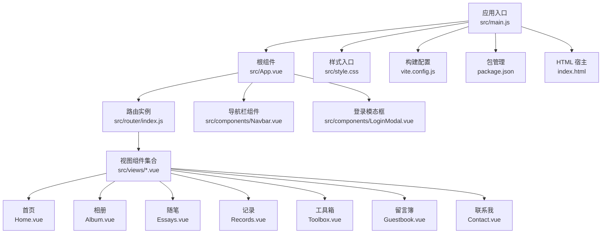

**图表来源**
- [src/main.js:1-9](file://src/main.js#L1-L9)
- [src/App.vue:1-30](file://src/App.vue#L1-L30)
- [src/router/index.js:1-28](file://src/router/index.js#L1-L28)
- [src/components/Navbar.vue:1-140](file://src/components/Navbar.vue#L1-L140)
- [src/components/LoginModal.vue:1-316](file://src/components/LoginModal.vue#L1-L316)
- [src/views/Home.vue:1-211](file://src/views/Home.vue#L1-L211)
- [src/views/Album.vue:1-127](file://src/views/Album.vue#L1-L127)
- [src/views/Essays.vue:1-195](file://src/views/Essays.vue#L1-L195)
- [src/views/Records.vue:1-100](file://src/views/Records.vue#L1-L100)
- [src/views/Toolbox.vue:1-102](file://src/views/Toolbox.vue#L1-L102)
- [src/views/Guestbook.vue:1-202](file://src/views/Guestbook.vue#L1-L202)
- [src/views/Contact.vue:1-189](file://src/views/Contact.vue#L1-L189)
- [src/style.css:1-56](file://src/style.css#L1-L56)
- [vite.config.js:1-8](file://vite.config.js#L1-L8)
- [package.json:1-20](file://package.json#L1-L20)
- [index.html:1-14](file://index.html#L1-L14)

**章节来源**
- [README.md:1-6](file://README.md#L1-L6)
- [package.json:1-20](file://package.json#L1-L20)
- [vite.config.js:1-8](file://vite.config.js#L1-L8)
- [index.html:1-14](file://index.html#L1-L14)
- [src/main.js:1-9](file://src/main.js#L1-L9)
- [src/App.vue:1-30](file://src/App.vue#L1-L30)
- [src/style.css:1-56](file://src/style.css#L1-L56)

## 核心组件
- 应用入口与挂载：在入口文件中创建 Vue 应用实例，安装路由插件并挂载到 DOM 宿主节点
- 根组件：负责全局布局、导航栏与登录模态框的协调，通过路由视图容器渲染当前页面
- 导航栏组件：提供固定顶部导航，支持路由高亮与登录按钮触发
- 登录模态框：支持登录/注册切换、表单输入与遮罩层点击关闭
- 视图组件：各页面独立封装，包含数据状态、模板与样式，通过路由进行切换

**章节来源**
- [src/main.js:1-9](file://src/main.js#L1-L9)
- [src/App.vue:1-30](file://src/App.vue#L1-L30)
- [src/components/Navbar.vue:1-140](file://src/components/Navbar.vue#L1-L140)
- [src/components/LoginModal.vue:1-316](file://src/components/LoginModal.vue#L1-L316)

## 架构总览
该 SPA 采用“入口应用 → 根组件 → 路由 → 视图”的分层架构。根组件统一承载导航与登录交互，路由根据路径动态渲染对应视图。组件间通过事件与属性传递实现松耦合通信。

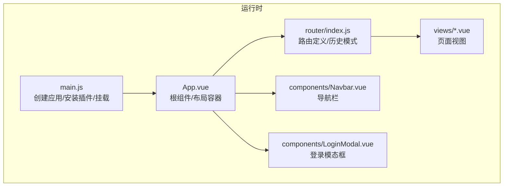

**图表来源**
- [src/main.js:1-9](file://src/main.js#L1-L9)
- [src/App.vue:1-30](file://src/App.vue#L1-L30)
- [src/router/index.js:1-28](file://src/router/index.js#L1-L28)
- [src/components/Navbar.vue:1-140](file://src/components/Navbar.vue#L1-L140)
- [src/components/LoginModal.vue:1-316](file://src/components/LoginModal.vue#L1-L316)

## 详细组件分析

### 根组件与应用入口
- 应用入口负责创建应用实例、引入样式与路由，并将应用挂载到宿主节点
- 根组件负责承载导航栏、路由视图与登录模态框，通过事件在导航栏与模态框之间传递登录状态控制

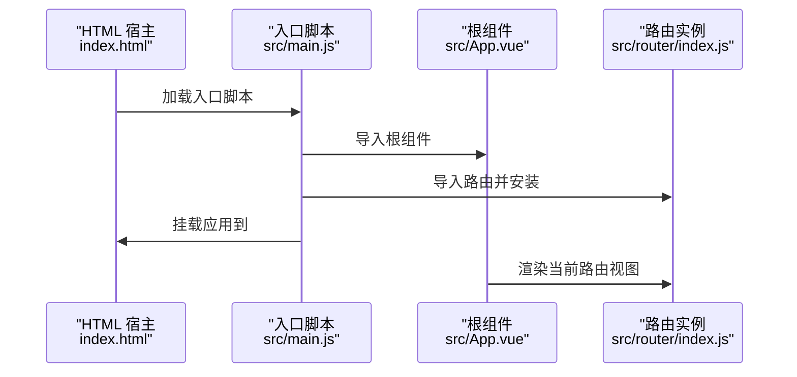

**图表来源**
- [index.html:1-14](file://index.html#L1-L14)
- [src/main.js:1-9](file://src/main.js#L1-L9)
- [src/App.vue:1-30](file://src/App.vue#L1-L30)
- [src/router/index.js:1-28](file://src/router/index.js#L1-L28)

**章节来源**
- [index.html:1-14](file://index.html#L1-L14)
- [src/main.js:1-9](file://src/main.js#L1-L9)
- [src/App.vue:1-30](file://src/App.vue#L1-L30)

### 导航栏组件
- 功能：固定顶部导航，包含品牌链接、导航项列表与登录按钮
- 交互：根据当前路由高亮对应导航项；向父组件发出打开登录事件
- 响应式：在窄屏设备隐藏导航菜单，保留品牌与登录按钮

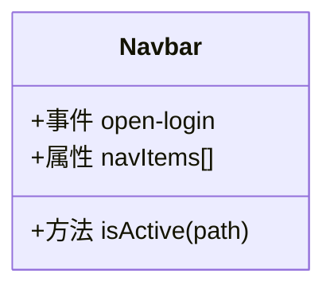

**图表来源**
- [src/components/Navbar.vue:1-140](file://src/components/Navbar.vue#L1-L140)

**章节来源**
- [src/components/Navbar.vue:1-140](file://src/components/Navbar.vue#L1-L140)

### 登录模态框组件
- 功能：提供登录/注册切换、用户名与密码输入、遮罩层点击关闭
- 交互：通过 Teleport 将模态框渲染到 body，支持淡入淡出与缩放过渡动画
- 表单：在提交时输出当前模式与输入值，并关闭模态框

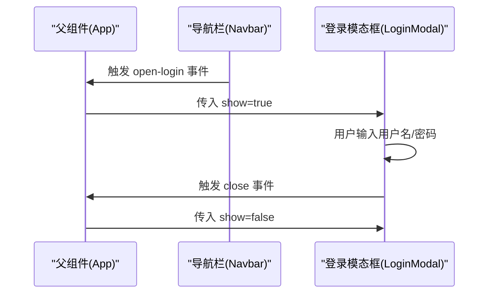

**图表来源**
- [src/App.vue:1-30](file://src/App.vue#L1-L30)
- [src/components/Navbar.vue:1-140](file://src/components/Navbar.vue#L1-L140)
- [src/components/LoginModal.vue:1-316](file://src/components/LoginModal.vue#L1-L316)

**章节来源**
- [src/App.vue:1-30](file://src/App.vue#L1-L30)
- [src/components/LoginModal.vue:1-316](file://src/components/LoginModal.vue#L1-L316)

### 首页视图
- 功能：展示实时时间、日期与农历信息，提供搜索框与快捷入口
- 交互：定时器每秒更新时间，组件卸载时清理定时器
- 样式：全屏背景图与模糊遮罩，适配居中布局与响应式字体大小

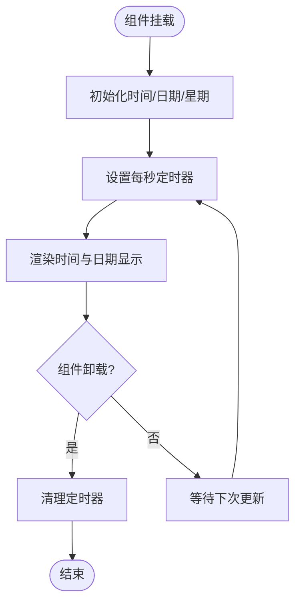

**图表来源**
- [src/views/Home.vue:1-211](file://src/views/Home.vue#L1-L211)

**章节来源**
- [src/views/Home.vue:1-211](file://src/views/Home.vue#L1-L211)

### 相册视图
- 功能：以网格卡片展示多个相册，包含封面图、覆盖层计数与标题
- 交互：鼠标悬停卡片放大、封面图缩放与覆盖层渐显
- 样式：深色背景、自适应网格布局与圆角边框

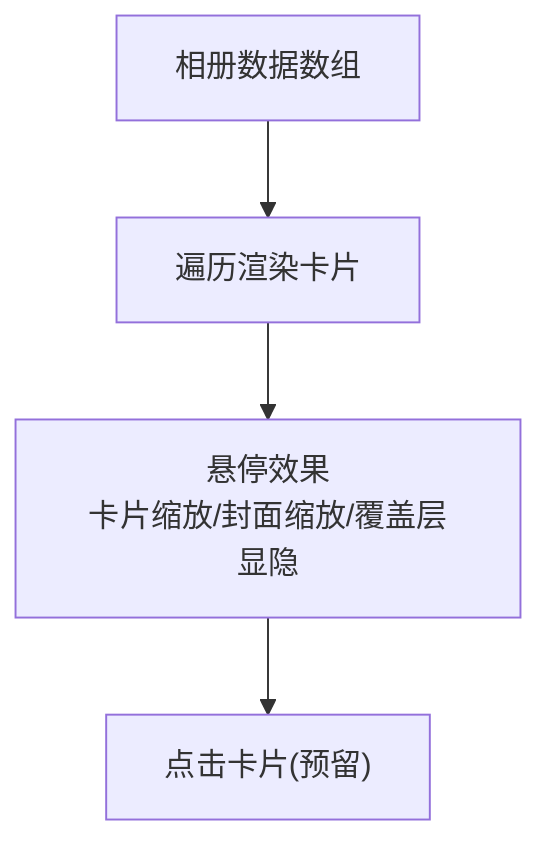

**图表来源**
- [src/views/Album.vue:1-127](file://src/views/Album.vue#L1-L127)

**章节来源**
- [src/views/Album.vue:1-127](file://src/views/Album.vue#L1-L127)

### 随笔视图
- 功能：展示多条随笔，包含作者头像、等级徽章、正文内容与评论数
- 交互：卡片悬停变色与阴影变化，底部操作区包含评论、编辑与转发按钮
- 样式：浅色卡片背景与半透明遮罩，适配移动端阅读体验

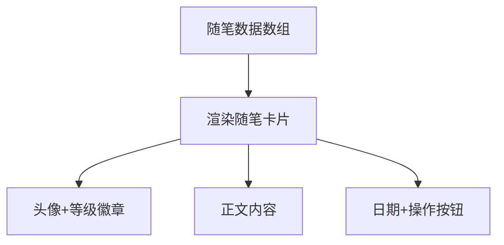

**图表来源**
- [src/views/Essays.vue:1-195](file://src/views/Essays.vue#L1-L195)

**章节来源**
- [src/views/Essays.vue:1-195](file://src/views/Essays.vue#L1-L195)

### 记录视图
- 功能：以卡片网格展示不同类型的记录分类，包含图标、标题、描述与数量
- 交互：卡片悬停上浮与阴影增强，突出视觉层次
- 样式：渐变背景与白色卡片，强调信息密度与可读性

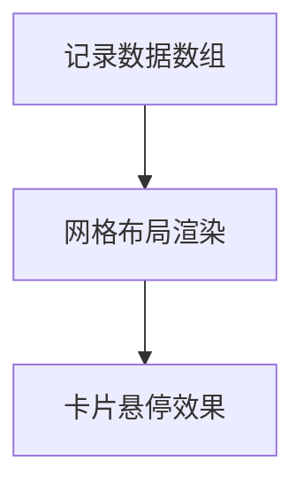

**图表来源**
- [src/views/Records.vue:1-100](file://src/views/Records.vue#L1-L100)

**章节来源**
- [src/views/Records.vue:1-100](file://src/views/Records.vue#L1-L100)

### 工具箱视图
- 功能：提供常用在线工具入口，包含图标、名称与描述
- 交互：卡片悬停时边框与阴影变化，突出工具主题色
- 样式：浅色背景与白色卡片，强调工具的易用性与直观性

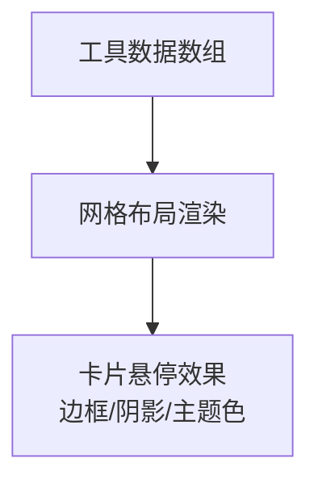

**图表来源**
- [src/views/Toolbox.vue:1-102](file://src/views/Toolbox.vue#L1-L102)

**章节来源**
- [src/views/Toolbox.vue:1-102](file://src/views/Toolbox.vue#L1-L102)

### 留言簿视图
- 功能：访客可填写姓名与留言，提交后插入到列表顶部；展示历史留言
- 交互：表单双向绑定、提交校验与列表渲染；支持头像占位符与日期显示
- 样式：渐变背景、白色卡片与阴影，营造友好互动氛围

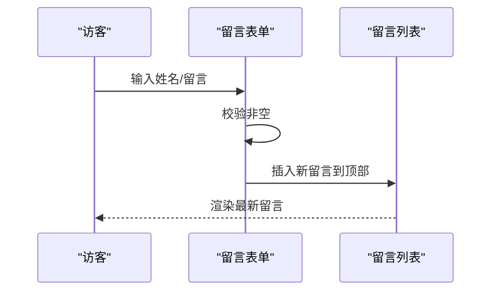

**图表来源**
- [src/views/Guestbook.vue:1-202](file://src/views/Guestbook.vue#L1-L202)

**章节来源**
- [src/views/Guestbook.vue:1-202](file://src/views/Guestbook.vue#L1-L202)

### 联系我视图
- 功能：展示联系方式与社交链接，支持响应式两列布局
- 交互：社交链接悬停渐变与图标/文字变色，增强点击反馈
- 样式：深色背景与浅色卡片，强调信息层级与可读性

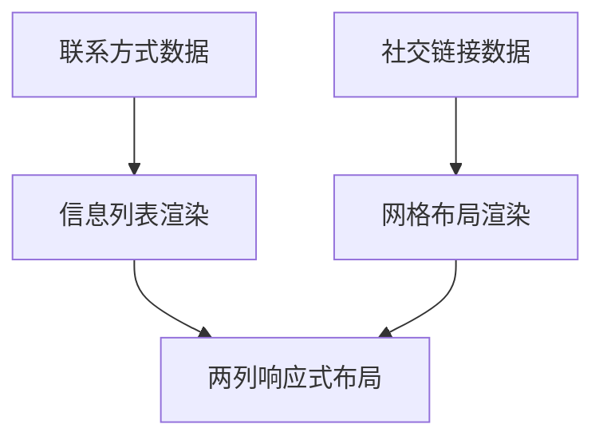

**图表来源**
- [src/views/Contact.vue:1-189](file://src/views/Contact.vue#L1-L189)

**章节来源**
- [src/views/Contact.vue:1-189](file://src/views/Contact.vue#L1-L189)

## 依赖关系分析
- 应用依赖：Vue 3 作为核心框架，Vue Router 提供路由能力
- 开发依赖：Vite 与 @vitejs/plugin-vue 提供开发服务器与 Vue 单文件组件编译
- 运行时依赖：通过入口脚本与路由配置连接到各视图组件

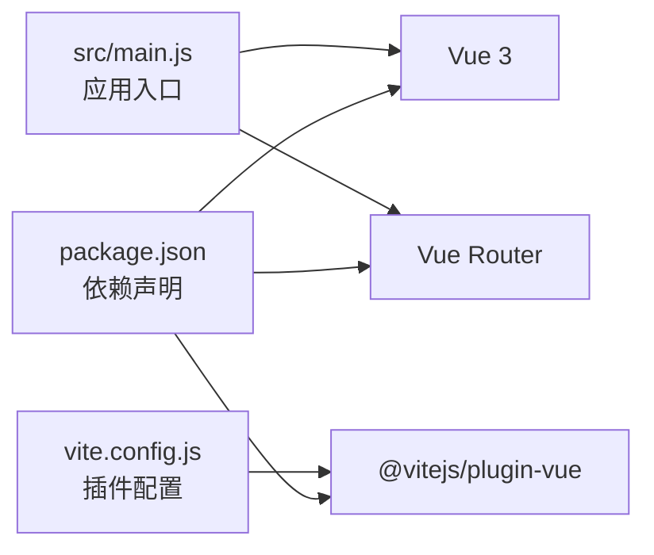

**图表来源**
- [package.json:1-20](file://package.json#L1-L20)
- [vite.config.js:1-8](file://vite.config.js#L1-L8)
- [src/main.js:1-9](file://src/main.js#L1-L9)

**章节来源**
- [package.json:1-20](file://package.json#L1-L20)
- [vite.config.js:1-8](file://vite.config.js#L1-L8)
- [src/main.js:1-9](file://src/main.js#L1-L9)

## 性能考虑
- 路由懒加载：可对大型视图组件启用路由级懒加载，减少首屏资源体积
- 图片优化：使用合适的尺寸与格式，必要时引入懒加载策略
- 样式作用域：合理使用 scoped 样式，避免全局污染与重复计算
- 组件拆分：保持组件职责单一，减少不必要的重渲染
- 构建优化：利用 Vite 的预构建与按需编译特性，提升开发与生产构建效率

## 故障排除指南
- 页面空白或路由不生效
  - 检查入口脚本是否正确挂载到 #app
  - 确认路由配置与视图组件路径一致
- 样式未生效
  - 确认样式文件被正确引入且无拼写错误
  - 检查 scoped 样式选择器是否正确匹配元素
- 登录模态框无法关闭
  - 确认父组件正确传递 show 属性并监听 close 事件
  - 检查遮罩层点击回调逻辑是否触发关闭
- 时间不更新
  - 确认组件生命周期钩子中已设置定时器并在卸载时清理

**章节来源**
- [index.html:1-14](file://index.html#L1-L14)
- [src/router/index.js:1-28](file://src/router/index.js#L1-L28)
- [src/App.vue:1-30](file://src/App.vue#L1-L30)
- [src/components/LoginModal.vue:1-316](file://src/components/LoginModal.vue#L1-L316)
- [src/views/Home.vue:1-211](file://src/views/Home.vue#L1-L211)

## 结论
本项目以 Vue 3 为核心，结合 Vite 与 Vue Router，构建了一个结构清晰、功能完备的个人博客 SPA。通过模块化的视图组件与公共组件，实现了从导航到页面内容的完整用户体验。项目具备良好的扩展性与可维护性，适合初学者快速上手与有经验开发者深入定制。